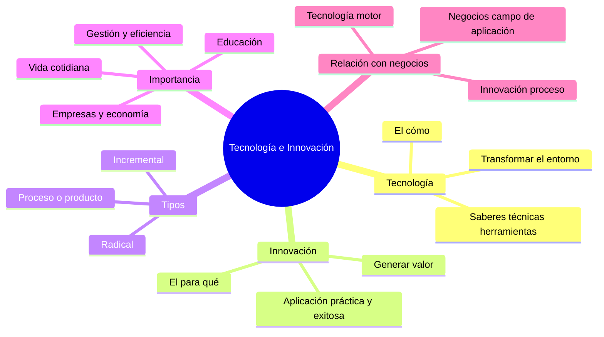
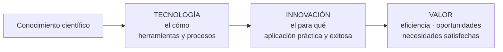
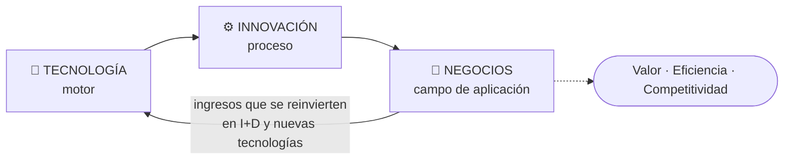

# 01 · Tecnología e Innovación: conceptos fundamentales

> **Fuente en el material:** *Tecnología e Innovación – CLASE 1* (Prof. Gustavo E. Escandell, MRI Pinamar, marzo 2026), diapositivas 4–14 y 32.
> **Prerrequisitos:** ninguno. Es la base de toda la materia.
> **Tiempo estimado:** 45–60 min.
> **Parcial 1:** ✅ entra (Clase 1). Orden de estudio y alcance en [22 · Guía del Parcial 1](22-foco-de-parcial.md).
> 🎯 **[Ruta al Parcial 1](README.md#-ruta-al-parcial-1-empezá-acá):** **Paso 1 · Creatividad vs. innovación:** leé solo [§II](#ii-definiciones-base) → seguí en [11 §I](11-creatividad-y-proceso-creativo.md#i-creatividad) y [11 §II.C](11-creatividad-y-proceso-creativo.md#iic-etapas-del-proceso-creativo) · **Paso 15** (mañana): solo esquema y 📝 de [§I](#i-punto-de-partida-por-qué-la-tecnología-mejoró-la-vida-de-las-personas) y [§V](#v-relación-tecnología--innovación--negocios).

---

## 🎯 Objetivos de aprendizaje

Al terminar este módulo deberías poder:

1. Definir **tecnología**, **innovación** e **innovación tecnológica** y explicar en qué se diferencian.
2. Explicar la idea de que la tecnología es **"el cómo"** y la innovación **"el para qué"**.
3. Distinguir los **tipos de innovación** vistos en la Clase 1 (incremental, radical, de proceso/producto).
4. Argumentar la **importancia** de la tecnología y la innovación en distintos ámbitos.
5. Explicar la **relación tripartita** tecnología–innovación–negocios y sus **aspectos fundamentales**.

---

## 🗺️ Esquema del tema

- **I. Punto de partida: ¿por qué la tecnología mejoró la vida de las personas?**
- **II. Definiciones base**
  - A. Tecnología → "el cómo"
  - B. Innovación → "el para qué"
  - C. Innovación tecnológica (la síntesis)
  - D. Ejemplos de tecnologías que cambiaron la vida cotidiana
- **III. Tipos de innovación (versión Clase 1)**
  - A. Incremental
  - B. Radical
  - C. De proceso / de producto
- **IV. Importancia de la tecnología y la innovación**
  - A. Importancia general (progreso social y económico)
  - B. Importancia por ámbito
    1. Empresas y economía
    2. Educación y conocimiento
    3. Vida cotidiana y sociedad
    4. Gestión y eficiencia
- **V. Relación Tecnología – Innovación – Negocios**
  - A. El ciclo: motor → proceso → campo de aplicación
  - B. La relación tripartita
    1. Tecnología como motor
    2. Innovación como motor de cambio
    3. Negocios y competitividad
  - C. Aspectos fundamentales
    1. Transformación de modelos
    2. Eficiencia operativa
    3. Conexión con el cliente
    4. Impacto de la I+D
- **VI. Conclusión de la clase**

---

## 🧠 Mapa visual

---

## 📖 Desarrollo

## I. Punto de partida: ¿por qué la tecnología mejoró la vida de las personas?

La materia arranca con una pregunta abierta: **"La tecnología mejoró la vida de las personas. ¿Por qué?"**. No es retórica: toda la materia gira alrededor de responderla. La respuesta corta que vas a ir construyendo es:

> 💡 **Para entenderlo:** la tecnología por sí sola es una herramienta. Mejora la vida **cuando alguien la aplica para resolver un problema real y genera valor**. Ese "aplicarla para generar valor" es, justamente, la **innovación**.

> 🔥 **Prioridad de parcial:** en las notas de clase esta pregunta quedó marcada como **#importante**. Preparala como pregunta a desarrollar: **tecnología** (definición) → **innovación** (aplicación práctica y exitosa) → **impactos** (módulo [02](02-impactos-y-desafios.md)) → **desafíos** como contrapeso → conclusión. Tenés una respuesta modelo en [21 · Preguntas integradoras](21-preguntas-integradoras.md) (pregunta 11).

---

## II. Definiciones base

> 📌 **Definición (cátedra):** *"La tecnología es la aplicación del conocimiento científico para crear herramientas y procesos que resuelvan problemas, mientras que la innovación tecnológica es el proceso de introducir cambios significativos —nuevos o mejorados— en productos, servicios o métodos utilizando dicha tecnología para generar valor y satisfacer necesidades."*

Esta definición tiene dos mitades. Conviene separarlas:

### II.A Tecnología → "el cómo"

> 📌 **Definición:** *"El conjunto de saberes, técnicas y herramientas que permiten transformar el entorno."*

- **Saberes**: el conocimiento (científico y práctico).
- **Técnicas**: los procedimientos, el "saber hacer".
- **Herramientas**: los artefactos concretos (desde una protoboard electrónica hasta un servidor en la nube).
- **Para qué existe**: para **transformar el entorno** y **resolver problemas**.

Se la llama **"el cómo"** porque responde a la pregunta *¿con qué medios y de qué manera hacemos algo?*

> 📝 **Citar y explayarse:** Cuando la cátedra dice que la tecnología es *"el conjunto de saberes, técnicas y herramientas que permiten transformar el entorno"*, remarca que no se reduce a aparatos: incluye el **conocimiento** que la fundamenta y el **saber hacer** para aplicarla. Un servidor sin alguien que sepa configurarlo no transforma nada. Esa transformación del entorno siempre apunta a **resolver un problema** concreto, y por eso se la llama "el cómo": describe los medios, no el propósito.

### II.B Innovación → "el para qué"

> 📌 **Definición:** *"Es la aplicación práctica y exitosa de nuevas ideas tecnológicas para mejorar la eficiencia o crear nuevas oportunidades."*

Tres palabras de esta definición son claves y suelen evaluarse:

1. **Aplicación práctica** → no alcanza con tener la idea; hay que llevarla a la realidad.
2. **Exitosa** → tiene que funcionar y ser adoptada. Una idea que nadie usa no es innovación.
3. **Mejorar la eficiencia o crear nuevas oportunidades** → el resultado tiene que generar **valor**.

> 🔥 **Frase de clase (notas, #importante):** *"Una tecnología desarrollada que **no se utiliza** no es innovación."* Resume la diferencia entre ambos conceptos: el desarrollo técnico solo no alcanza; tiene que **usarse** y **generar valor**.

> 📝 **Citar y explayarse:** Para la cátedra, innovar es *"la aplicación práctica y exitosa de nuevas ideas tecnológicas para mejorar la eficiencia o crear nuevas oportunidades"*. Cada parte de la definición pone una condición: tiene que ser **práctica** (llevada a la realidad, no una idea en un cajón), **exitosa** (adoptada por usuarios o por la organización) y tiene que **generar valor**, ya sea haciendo lo mismo con menos recursos o abriendo algo que antes no existía. Por eso se dice que *"una tecnología desarrollada que no se utiliza no es innovación"*: lo que convierte una novedad en innovación es su uso. El pago con QR es un buen ejemplo: el código QR existía hace décadas, pero se convirtió en innovación cuando comercios y usuarios lo adoptaron masivamente para pagar.

Se la llama **"el para qué"** porque responde a *¿con qué propósito usamos la tecnología?*

### II.C Innovación tecnológica (la síntesis)

Juntando ambas: la innovación tecnológica es el **proceso** de introducir **cambios significativos** (nuevos o mejorados) en **productos, servicios o métodos**, **usando tecnología**, para **generar valor y satisfacer necesidades**.

> 🧩 **Ejemplo:** el GPS es **tecnología** (satélites, receptores, algoritmos). Usar el GPS del celular para crear una app que conecta pasajeros con conductores cercanos y cobra automáticamente (Uber) es **innovación**: la misma tecnología aplicada con éxito para crear una nueva oportunidad de negocio.

> ➕ **Contexto adicional:** el *Manual de Oslo* (OCDE), referencia internacional para medir innovación, también exige que la novedad sea **implementada** (introducida en el mercado o usada en la organización) para considerarse innovación. Coincide con la idea de "aplicación práctica y exitosa" de la cátedra.

> 📝 **Citar y explayarse:** La cátedra define la tecnología como *"la aplicación del conocimiento científico para crear herramientas y procesos que resuelvan problemas"* y la innovación tecnológica como *"el proceso de introducir cambios significativos —nuevos o mejorados— en productos, servicios o métodos"* para *"generar valor y satisfacer necesidades"*. La diferencia entre ambas es de función: la tecnología aporta **el cómo** (los medios), mientras que la innovación aporta **el para qué** (el uso que genera valor). Por eso puede existir tecnología sin innovación —si nadie la adopta, no cambia nada—, pero no hay innovación tecnológica sin una tecnología que la sostenga. Por ejemplo, el GPS es tecnología; Uber es innovación porque lo aplicó para crear un servicio nuevo que la gente usa y paga. En síntesis, la innovación es la tecnología **puesta a trabajar** en el mercado o en la organización.

### II.D Ejemplos de tecnologías que cambiaron la vida cotidiana

La clase muestra cuatro ejemplos de tecnología:

| Tecnología | Qué cambió |
|---|---|
| **Internet** | Acceso a información y comunicación global instantánea. |
| **Smartphones** | La computadora y la conexión pasaron al bolsillo. |
| **Inteligencia Artificial** | Automatiza tareas complejas y apoya decisiones. |
| **Cloud Computing** | Almacenamiento y procesamiento remoto, sin infraestructura propia. |

---

## III. Tipos de innovación (versión Clase 1)

En la Clase 1 se presentan tres tipos. Más adelante (módulos [12](12-innovacion-tecnologica-e-ia.md) y [16](16-proyectos-y-estrategia-de-innovacion.md)) la clasificación se amplía.

### III.A Incremental

- **Qué es:** pequeñas **mejoras continuas** sobre algo que ya existe.
- 🧩 **Ejemplo de la cátedra:** una actualización de software.

### III.B Radical

- **Qué es:** **cambios drásticos** que **crean nuevos mercados**.
- 🧩 **Ejemplo de la cátedra:** internet.

### III.C De proceso / de producto

- **De proceso:** optimizar **cómo se hacen** las cosas (por ejemplo, automatizar una línea de producción).
- **De producto:** **crear cosas nuevas** (un bien o servicio que antes no existía).

> 💡 **Para entenderlo:** fijate que los tipos responden a **dos preguntas distintas**. Incremental vs. radical responde a *¿cuánto cambia?* (grado). Proceso vs. producto responde a *¿qué cambia?* (objeto). Por eso una misma innovación puede ser, a la vez, **incremental y de proceso**.

---

## IV. Importancia de la tecnología y la innovación

### IV.A Importancia general

> 📌 *"La tecnología y la innovación son motores fundamentales para el progreso social y económico, permitiendo aumentar la productividad, reducir costos operativos y mejorar la calidad de vida mediante soluciones eficientes. Impulsan la competitividad empresarial, facilitan el acceso a la información, la educación y aceleran la transformación digital."*

Desarmado en esquema, la importancia está en que:

1. **Aumentan la productividad.**
2. **Reducen costos operativos.**
3. **Mejoran la calidad de vida.**
4. **Impulsan la competitividad** empresarial.
5. **Facilitan el acceso** a la información y la educación.
6. **Aceleran la transformación digital.**

> 📝 **Citar y explayarse:** La cátedra sostiene que la tecnología y la innovación son *"motores fundamentales para el progreso social y económico"*. Son motores porque **multiplican lo que se puede hacer con los mismos recursos**: aumentan la productividad y reducen costos, lo que permite a las empresas competir y crecer; y al mismo tiempo **amplían el acceso** a la información, la educación y servicios como la salud, lo que mejora la calidad de vida. Es decir, su importancia no es solo empresarial sino también social. La educación en línea une ambas dimensiones: reduce el costo de formar a una persona y a la vez permite estudiar a quien vive lejos de una universidad.

### IV.B Importancia por ámbito

#### IV.B.1 Empresas y economía
- Permite **adaptarse a mercados cambiantes**.
- **Optimiza procesos** y **automatiza tareas**.
- Genera **nuevas oportunidades de negocio**.
- Asegura **competitividad y longevidad** de las compañías.
- Herramientas como **IA, Big Data e IoT** transforman los modelos de negocio tradicionales.

#### IV.B.2 Educación y conocimiento
- Facilitan el **acceso a la información**.
- Ofrecen **nuevas formas de aprendizaje**; son aliadas de la formación.

#### IV.B.3 Vida cotidiana y sociedad
- Mejoran la **comunicación** y **acortan distancias**.
- Crean herramientas que **satisfacen necesidades humanas** y elevan la calidad de vida.

#### IV.B.4 Gestión y eficiencia
- Mejoran la **gestión de proyectos**.
- Permiten **colaboración en tiempo real**.
- Habilitan la **toma de decisiones basada en datos** (esto conecta directamente con BI, Data Mining y Big Data → módulos 04–06).

---

## V. Relación Tecnología – Innovación – Negocios

> 🔥 **Prioridad de parcial:** "Tecnología e innovación" y la **relación tripartita** quedaron marcadas como **#importante** en las notas de la Clase 1.

### V.A El ciclo: motor → proceso → campo de aplicación

> 📌 *"La tecnología, la innovación y los negocios están intrínsecamente vinculados en un ciclo donde la **tecnología actúa como motor**, la **innovación como proceso** y los **negocios como el campo de aplicación** para generar valor, eficiencia y competitividad."*

La adopción tecnológica permite a las empresas **automatizar procesos, analizar datos y crear modelos de negocio**: por eso es crucial para el éxito en la era digital.

> ➕ **Contexto adicional:** la flecha de retorno (negocios → tecnología) no está dibujada en la diapositiva, pero es lo que hace que sea un **ciclo**: las empresas que ganan con la innovación reinvierten en I+D, lo que genera nueva tecnología (ver "Impacto de la I+D" más abajo).

### V.B La relación tripartita

| Elemento | Rol | Cómo se ve en la práctica |
|---|---|---|
| **1. Tecnología como motor** | Provee las herramientas | IA, Big Data y la nube **optimizan la administración, producción y ventas**. |
| **2. Innovación como motor de cambio** | Aplica la tecnología | Mejora **procesos, productos o servicios**; permite **adaptarse a cambios rápidos y superar crisis**. |
| **3. Negocios y competitividad** | Captura el valor | La integración tecnológica **transforma los negocios**, aumenta la **productividad** y da **ventajas competitivas sostenibles**. |

### V.C Aspectos fundamentales de la relación

1. **Transformación de modelos** – La tecnología permite crear **nuevos modelos de negocio**, muchas veces basados en la **desmaterialización** y la **experiencia digital**. 🧩 Uber (no tiene autos) o Airbnb (no tiene inmuebles).
2. **Eficiencia operativa** – **Automatizar tareas** y gestionar información **en tiempo real** reduce costos y agiliza las decisiones.
3. **Conexión con el cliente** – La tecnología facilita la relación con el consumidor mediante **CRM** y **redes sociales**, permitiendo **personalizar** el servicio.
4. **Impacto de la I+D** – Invertir en **investigación y desarrollo** es crucial para la **innovación continua** y la **competitividad a largo plazo**.

> 💡 **Para entenderlo – "desmaterialización":** el valor deja de estar en el objeto físico y pasa a estar en la plataforma, los datos y la experiencia. Netflix no te vende un DVD: te vende acceso.

> 📝 **Citar y explayarse:** Según la cátedra, tecnología, innovación y negocios están *"intrínsecamente vinculados en un ciclo donde la tecnología actúa como motor, la innovación como proceso y los negocios como el campo de aplicación"*. Esto quiere decir que ninguno de los tres genera valor por separado: la tecnología aporta capacidades, la innovación las convierte en mejoras concretas de productos, procesos o servicios, y los negocios son el lugar donde esas mejoras se transforman en **eficiencia, ingresos y competitividad**. Es un ciclo porque lo que se gana se reinvierte en I+D, que genera nueva tecnología. Netflix lo muestra: usó el streaming (tecnología) para cambiar cómo se consume entretenimiento (innovación) y lo monetizó con suscripciones (negocio); con esos ingresos invierte en algoritmos de recomendación y contenido propio, y el ciclo vuelve a empezar.

---

## VI. Conclusión de la clase

La cátedra cierra con cuatro ideas que funcionan como resumen del módulo:

1. **La tecnología impulsa el cambio** en las organizaciones (aporta herramientas y capacidades técnicas).
2. **La innovación permite transformar ideas en valor** (aplica esas herramientas de manera creativa).
3. **Las tecnologías disruptivas están redefiniendo industrias completas** (→ módulo [03](03-tecnologias-disruptivas.md)).
4. **Comprender esta relación es clave** para los profesionales del futuro: permite identificar oportunidades, enfrentar desafíos y participar en la transformación digital.

---

## ⚠️ Conceptos que se confunden

| Se confunde… | …con | Diferencia clave |
|---|---|---|
| Tecnología | Innovación | La tecnología es **el medio** (el cómo). La innovación es **la aplicación exitosa que genera valor** (el para qué). Puede haber tecnología sin innovación (un invento que nadie adopta). |
| Invento / idea | Innovación | Una idea o invento no es innovación hasta que se **aplica con éxito**. |
| Incremental vs. radical | Proceso vs. producto | Son **dos ejes distintos** (grado de cambio vs. objeto del cambio). Se combinan. |
| "La tecnología es la innovación" | — | Error típico de parcial: la innovación **puede ser** de modelo de negocio, de proceso, de marketing… no necesariamente un artefacto nuevo. |

---

## 🔗 Conexiones

- **→ [02 Impactos y desafíos](02-impactos-y-desafios.md):** qué efectos producen estas innovaciones en sociedad y empresas.
- **→ [03 Tecnologías disruptivas](03-tecnologias-disruptivas.md):** el caso extremo de la innovación radical.
- **→ [12 Innovación tecnológica e IA](12-innovacion-tecnologica-e-ia.md):** la clasificación ampliada de tipos de innovación.
- **→ [16 Proyectos y estrategia](16-proyectos-y-estrategia-de-innovacion.md):** cómo se gestiona la innovación como proyecto.

---

## ✍️ Autoevaluación

**1. Defina tecnología e innovación y explique por qué se dice que una es "el cómo" y la otra "el para qué".**

Ver respuesta

La **tecnología** es el conjunto de saberes, técnicas y herramientas que permiten transformar el entorno; es la aplicación del conocimiento científico para crear herramientas y procesos que resuelven problemas. Es "el cómo" porque define los **medios** con los que se hace algo.
La **innovación** es la aplicación práctica y exitosa de nuevas ideas tecnológicas para mejorar la eficiencia o crear nuevas oportunidades. Es "el para qué" porque define el **propósito**: generar valor y satisfacer necesidades usando esa tecnología.

**2. Un equipo desarrolla un algoritmo de compresión de video brillante, pero ninguna empresa lo adopta. ¿Es innovación? Justifique.**

Ver respuesta

No, según la definición de la cátedra. Es **tecnología** (o un invento), pero la innovación requiere **aplicación práctica y exitosa** que genere valor. Sin adopción no hay valor generado. Si mañana una plataforma de streaming lo usa para bajar costos de transmisión, ahí sí se convierte en innovación (de proceso).

**3. Clasifique: (a) iOS lanza una actualización que mejora la batería; (b) la aparición de internet; (c) una fábrica incorpora robots en el ensamblado.**

Ver respuesta

(a) **Incremental** (y de producto: mejora un producto existente).
(b) **Radical**: cambio drástico que creó nuevos mercados.
(c) **De proceso**: optimiza cómo se hacen las cosas (además, por su grado, probablemente incremental o radical según el caso).

**4. Explique la relación tripartita tecnología–innovación–negocios.**

Ver respuesta

Forman un ciclo donde la **tecnología es el motor** (IA, Big Data, nube optimizan administración, producción y ventas), la **innovación es el proceso / motor de cambio** (aplica la tecnología para mejorar procesos, productos y servicios y adaptarse a cambios y crisis) y los **negocios son el campo de aplicación** donde se genera valor, eficiencia y ventajas competitivas sostenibles.

**5. Nombre y explique los cuatro aspectos fundamentales de esa relación, con un ejemplo de al menos uno.**

Ver respuesta

1. **Transformación de modelos** (nuevos modelos basados en desmaterialización y experiencia digital; ej. Uber, Airbnb).
2. **Eficiencia operativa** (automatizar y gestionar información en tiempo real reduce costos y agiliza decisiones).
3. **Conexión con el cliente** (CRM y redes sociales permiten personalizar el servicio).
4. **Impacto de la I+D** (la inversión en investigación y desarrollo sostiene la innovación continua y la competitividad a largo plazo).

**6. ¿Por qué Airbnb es un ejemplo de "desmaterialización"?**

Ver respuesta

Porque crea valor en el negocio de alojamiento **sin poseer inmuebles**: su valor está en la plataforma digital, los datos y la experiencia que conecta anfitriones con viajeros. El activo físico deja de ser el centro del modelo.

---

🎯 [Volver a la Ruta al Parcial 1](README.md#-ruta-al-parcial-1-empezá-acá)

[← 00 Cómo estudiar con este material](00-como-estudiar-con-este-material.md) · [🏠 Índice](README.md) · [Siguiente por clase → 02 Impactos y desafíos de la tecnología y la innovación](02-impactos-y-desafios.md)
