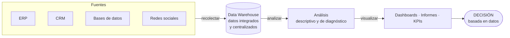
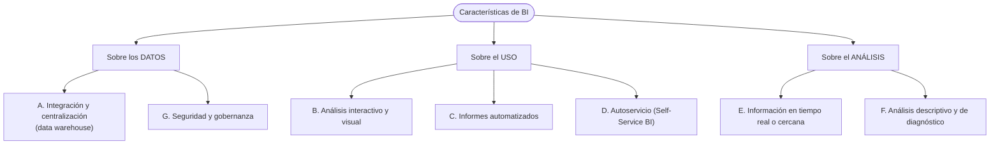

# 04 · Business Intelligence (BI)

> **Fuente en el material:** *Clase "Pinamar" 2026* (Prof. Gustavo E. Escandell), diapositivas 20–32.
> **Prerrequisitos:** [03 Tecnologías disruptivas](03-tecnologias-disruptivas.md).
> **Tiempo estimado:** 50 min.

---

## 🎯 Objetivos de aprendizaje

1. Definir **Business Intelligence** y explicar su **proceso** (recolectar → almacenar → analizar → visualizar).
2. Explicar **para qué sirve**, sus **funciones**, **importancia**, **características** y **ventajas**.
3. Reconocer los **principales programas** de BI y en qué se destaca cada uno.
4. Distinguir BI de Data Mining y Big Data (se completa en los módulos 05 y 06).
5. Discutir los **riesgos** de decidir con datos incompletos o mal analizados.

---

## 🗺️ Esquema del tema

- **I. Definición**
- **II. Aspectos clave**
  1. Proceso
  2. Objetivo
  3. Componentes
  4. Herramientas comunes
- **III. Para qué sirve** (5 usos)
- **IV. Principales funciones** (4)
- **V. Importancia** (6)
- **VI. Características**
  - A. Integración y centralización de datos
  - B. Análisis interactivo y visual
  - C. Informes automatizados
  - D. Autoservicio (Self-Service BI)
  - E. Información en tiempo real o cercana
  - F. Análisis descriptivo y de diagnóstico
  - G. Seguridad y gobernanza
- **VII. Ventajas** (6)
- **VIII. Principales programas** (7)
- **IX. Empresas que usan BI**
- **X. Para debatir: los límites de los datos**

---

## 🧠 Mapa visual: cómo fluye la información en BI

---

## 📖 Desarrollo

## I. Definición

> 📌 *"El Business Intelligence (BI) o inteligencia empresarial es el **conjunto de tecnologías, procesos y herramientas** que **transforman datos brutos en información significativa y accionable**. Permite a las empresas **analizar datos históricos y actuales** para **tomar decisiones estratégicas fundamentadas**, optimizar el rendimiento y detectar tendencias."*

Palabras clave para la respuesta de parcial:
- **Conjunto** de tecnologías, procesos y herramientas (no es un solo software).
- **Datos brutos → información accionable** (la transformación es el corazón).
- **Históricos y actuales** (mira hacia atrás y al presente).
- **Decisiones estratégicas fundamentadas**.

> 💡 **Para entenderlo – la escalera dato → decisión:**
> - **Dato**: "Sucursal 4 vendió $2.300.000 en marzo."
> - **Información**: "La Sucursal 4 vendió 18 % menos que en febrero, y es la única que bajó."
> - **Conocimiento accionable**: "La caída coincide con la obra en la calle de enfrente → conviene reforzar delivery en esa zona."
> BI es lo que te sube por esa escalera.

---

## II. Aspectos clave

| # | Aspecto | Contenido |
|---|---|---|
| 1 | **Proceso** | Implica **recolectar, almacenar, analizar y visualizar** datos. |
| 2 | **Objetivo** | **Convertir datos en conocimiento** para mejorar la toma de decisiones. |
| 3 | **Componentes** | **Tableros de control (dashboards)**, **informes**, **minería de datos** y **analítica descriptiva**. |
| 4 | **Herramientas comunes** | Microsoft **Power BI**, **Tableau**, **Qlik**, **Looker** (Google Cloud). |

> 🔗 Fijate que la **minería de datos** aparece como **componente** de BI. Por eso BI y Data Mining están emparentados (módulo [05](05-data-mining.md)).

---

## III. Para qué sirve

1. **Tomar decisiones más rápidas y acertadas** – analiza datos históricos y actuales de **ventas, marketing, finanzas y operaciones** para **prever tendencias** y entender la posición en el mercado.
2. **Visualizar datos complejos** – transforma grandes volúmenes en **dashboards interactivos**, gráficos y reportes fáciles de entender (ej. Power BI).
3. **Identificar ineficiencias** – detecta áreas de mejora en procesos internos, **reduciendo costos**.
4. **Conocer mejor al cliente** – analiza **comportamientos de compra** para personalizar ofertas y mejorar la experiencia.
5. **Obtener ventaja competitiva** – monitorea el rendimiento propio **frente a la competencia** y el mercado.

## IV. Principales funciones

| Función | Qué hace |
|---|---|
| **Visualización de datos** | Paneles fáciles de entender para **monitorear KPIs**. |
| **Identificación de oportunidades** | Descubre nuevas formas de **aumentar ganancias** y analizar comportamientos del cliente. |
| **Optimización operativa** | Identifica **ineficiencias** y mejora procesos internos. |
| **Análisis competitivo** | Compara resultados **con el mercado**. |

## V. Importancia

1. **Toma de decisiones basada en datos** – **elimina suposiciones** con una visión clara, actual e histórica: decisiones fundadas en **hechos concretos**.
2. **Eficiencia operativa** – identifica **cuellos de botella**, optimiza la cadena de suministro → menos costos, más productividad.
3. **Identificación de oportunidades** – revela tendencias, nichos de clientes y de productos **antes que la competencia**.
4. **Conocimiento del cliente** – comportamiento y preferencias → más **fidelización** y mejor **segmentación**.
5. **Monitoreo en tiempo real** – dashboards interactivos y KPIs para detectar problemas o éxitos **en el momento en que ocurren**.
6. **Ventaja competitiva** – **agilidad** para adaptarse a entornos cambiantes; facilita la supervivencia y el crecimiento.

---

## VI. Características

La cátedra presenta siete características en dos diapositivas. Agrupadas en esquema:

### VI.A Integración y centralización de datos
Recopila información de **diversas fuentes** (bases de datos, **ERP**, **CRM**, redes sociales) **en un único lugar**, generalmente un **data warehouse**.

> ➕ **Contexto adicional – data warehouse:** es un repositorio diseñado para **análisis** (no para operar el día a día). Los datos se extraen de los sistemas operativos, se limpian y se cargan (proceso **ETL**: *Extract, Transform, Load*). Así todos consultan "una sola versión de la verdad".

### VI.B Análisis interactivo y visual
Explorar datos mediante **gráficos y paneles interactivos** para comprender tendencias y patrones.

### VI.C Informes automatizados
Generar **reportes personalizados de forma automática** para monitorear **KPIs**.

### VI.D Autoservicio (Self-Service BI)
Capacita a **usuarios de negocio sin conocimientos técnicos profundos** para **consultar datos y crear informes por sí mismos**.

> 💡 **Por qué importa:** antes, cada informe había que pedírselo a sistemas y tardaba días. Con self-service, el gerente comercial arma su propio tablero en Power BI. Esto **democratiza** los datos.

### VI.E Información en tiempo real o cercana
Visibilidad **actualizada** para **reaccionar rápidamente** ante cambios.

### VI.F Análisis descriptivo y de diagnóstico
Se centra en explicar **qué sucedió** y **por qué sucedió**, analizando datos **históricos**.

> ⚠️ **Característica clave para diferenciar BI de Data Mining:** BI responde **qué pasó y por qué**. La **predicción** (qué va a pasar) es el terreno fuerte del **Data Mining** (modelado predictivo).

> ➕ **Contexto adicional – los 4 niveles de analítica:**
>
> | Nivel | Pregunta | Dónde encaja en la materia |
> |---|---|---|
> | Descriptiva | ¿Qué pasó? | **BI** |
> | Diagnóstica | ¿Por qué pasó? | **BI** |
> | Predictiva | ¿Qué va a pasar? | **Data Mining** |
> | Prescriptiva | ¿Qué debería hacer? | IA / analítica avanzada |

### VI.G Seguridad y gobernanza
Asegura la **privacidad** de los datos y garantiza que la información sea **confiable y controlada**.

---

## VII. Ventajas

| Ventaja | Explicación |
|---|---|
| **Toma de decisiones estratégica** | **Reduce el riesgo** al basar decisiones en datos precisos e históricos. |
| **Eficiencia operativa y reducción de costos** | Detecta cuellos de botella y procesos ineficientes. |
| **Visibilidad en tiempo real** | Dashboards actualizados para reaccionar rápido al mercado. |
| **Mejor conocimiento del cliente** | Comportamientos y preferencias → productos personalizados. |
| **Identificación de oportunidades** | Tendencias, nichos o productos con mayor potencial de ventas. |
| **Mayor productividad** | **Automatiza la creación de informes** y centraliza información → ahorra tiempo a los equipos. |

---

## VIII. Principales programas

| Programa | En qué se destaca (según la cátedra) |
|---|---|
| **Microsoft Power BI** | **Líder actual**; integración con el ecosistema Microsoft (Excel, Azure); gran **relación costo-funcionalidad**. |
| **Tableau** | Capacidades avanzadas de **visualización** y **storytelling** con datos. |
| **Qlik Sense (QlikView)** | **Motor asociativo**: explorar datos de forma flexible. |
| **SAP BusinessObjects** | Suite **robusta** orientada a **grandes empresas**. |
| **SAS Business Intelligence** | **Analítica avanzada** y gestión de datos. |
| **Looker Studio** (ex Google Data Studio) | Opción **gratuita**, excelente para dashboards interactivos y reportes web. |
| **Datapine** | Intuitivo, con funciones **predictivas y de IA**. |

> 🔗 En el módulo de KPI ([18](18-kpi.md)) vuelven a aparecer **Tableau / Power BI** y **Google Looker Studio** como herramientas para medir KPI.

## IX. Empresas que usan BI

La cátedra menciona: **BBVA, Grupo Bimbo, Coca-Cola, Sodimac, Inka Crops**, entre otras.

> 🧩 **Ejemplo ilustrativo:** una empresa de consumo masivo como Coca-Cola puede integrar en un data warehouse las ventas por distribuidor, el clima y las promociones, y en un dashboard ver qué zonas cayeron (descriptivo) y si la caída coincide con días de lluvia o con la falta de promoción (diagnóstico).

---

## X. Para debatir: los límites de los datos

La clase plantea dos preguntas de debate. Conviene tener una postura argumentada:

1. **¿Qué pasaría si los datos están incompletos o mal analizados?**
   - Las decisiones "basadas en datos" serían **decisiones equivocadas con apariencia de rigor**. Un dashboard prolijo no garantiza datos correctos (por eso existen la característica de **gobernanza** y la V de **Veracidad** en Big Data → módulo [06](06-big-data.md)).
2. **¿Puede una empresa depender demasiado de los datos?**
   - Sí: los datos describen **el pasado** (BI es descriptivo/diagnóstico). En contextos de cambio brusco, la experiencia, la intuición y el criterio siguen siendo necesarios. (Se conecta con el entorno **VANI**, donde la cátedra dice que *"acumular más datos ya no funciona"* → módulo [15](15-entornos-vica-y-vani.md)).

---

## ⚠️ Conceptos que se confunden

| Se confunde… | …con | Diferencia |
|---|---|---|
| BI | Un software (Power BI) | BI es un **conjunto** de tecnologías, procesos y herramientas. Power BI es **una** herramienta. |
| BI | Data Mining | BI: **qué pasó y por qué** (descriptivo/diagnóstico, dashboards). DM: **descubre patrones ocultos y predice** (algoritmos). DM es un **componente** que BI puede usar. |
| Data warehouse | Base de datos operativa | El DW está pensado para **analizar** datos integrados de muchas fuentes, no para registrar transacciones. |
| Dashboard | KPI | El dashboard **muestra** KPIs; el KPI es el **indicador** en sí. |

---

## 🔗 Conexiones

- **→ [05 Data Mining](05-data-mining.md) y [06 Big Data](06-big-data.md):** completan la tríada de datos.
- **→ [18 KPI](18-kpi.md):** BI es la infraestructura que **mide y muestra** los KPI.
- **← [02 Impactos](02-impactos-y-desafios.md):** "cultura data-driven".

---

## ✍️ Autoevaluación

**1. Defina Business Intelligence y describa su proceso.**

Ver respuesta

BI es el **conjunto de tecnologías, procesos y herramientas que transforman datos brutos en información significativa y accionable**, permitiendo analizar datos históricos y actuales para tomar **decisiones estratégicas fundamentadas**, optimizar el rendimiento y detectar tendencias. Su proceso implica **recolectar, almacenar, analizar y visualizar** datos, con el objetivo de convertirlos en conocimiento.

**2. ¿Qué es el Self-Service BI y por qué es una característica importante?**

Ver respuesta

Es la capacidad de que **usuarios de negocio sin conocimientos técnicos profundos** consulten datos y creen sus propios informes. Es importante porque **democratiza el acceso a los datos**, acelera las decisiones y libera al área técnica de pedidos repetitivos.

**3. ¿Qué tipo de análisis realiza principalmente BI? ¿Qué no hace (o no es su foco)?**

Ver respuesta

**Descriptivo y de diagnóstico**: explica **qué sucedió y por qué**, a partir de datos históricos. Su foco no es la **predicción** de comportamientos futuros mediante algoritmos, que es el terreno del **Data Mining**.

**4. Mencione 4 programas de BI y una fortaleza de cada uno.**

Ver respuesta

Power BI (líder, integración Microsoft, costo-funcionalidad); Tableau (visualización y storytelling); Qlik Sense (motor asociativo); Looker Studio (gratuito, dashboards web). También: SAP BusinessObjects (grandes empresas), SAS BI (analítica avanzada), Datapine (funciones predictivas e IA).

**5. Un gerente dice: "Con el dashboard nuevo ya no necesitamos discutir las decisiones, los datos deciden solos". Critique la afirmación.**

Ver respuesta

Los datos pueden estar **incompletos o mal analizados**, y un dashboard prolijo no garantiza su calidad (importa la **gobernanza** y la **veracidad**). Además BI describe el pasado: ante cambios bruscos del entorno, los datos históricos pueden no anticipar lo que viene. Una empresa puede **depender demasiado** de los datos; las decisiones requieren también criterio y contexto.

---

[← 03 Tecnologías disruptivas](03-tecnologias-disruptivas.md) · [🏠 Índice](README.md) · [Siguiente → 05 Data Mining](05-data-mining.md)
