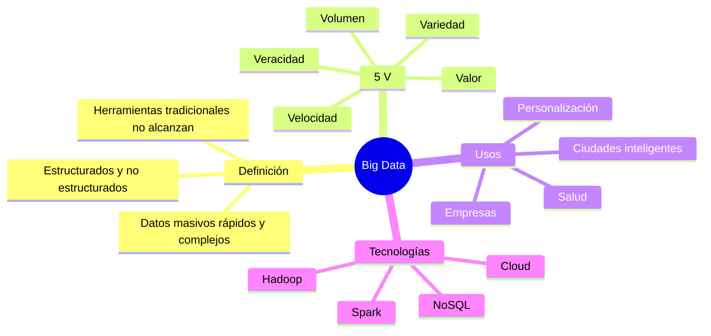
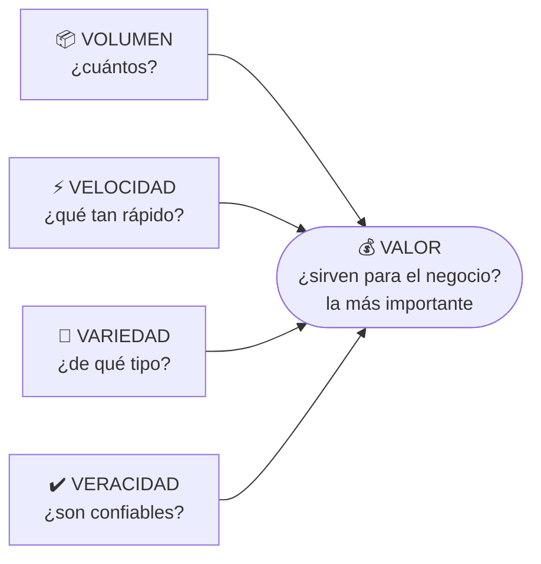
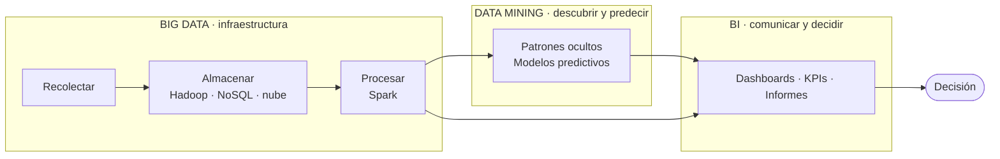

# 06 · Big Data

> **Fuente en el material:** *Clase "Pinamar" 2026* (Prof. Gustavo E. Escandell), diapositivas 48–64.
> **Prerrequisitos:** [04 BI](04-business-intelligence.md) y [05 Data Mining](05-data-mining.md).
> **Tiempo estimado:** 50 min.
> **Parcial 1:** ✅ entra (Clase 3). Orden de estudio y alcance en [22 · Guía del Parcial 1](22-foco-de-parcial.md).

---

## 🎯 Objetivos de aprendizaje

1. Definir **Big Data** y explicar por qué las herramientas tradicionales no alcanzan.
2. Explicar **para qué sirve**, sus **objetivos**, su **importancia** y sus **áreas de aplicación**.
3. Explicar en detalle **las 5 V** y por qué **Valor** es la más importante.
4. Comparar **Big Data vs. Data Mining** en 9 dimensiones.
5. Integrar **BI + Data Mining + Big Data** en un caso (actividad del gerente de streaming).

---

## 🗺️ Esquema del tema

- **I. Definición**
- **II. Para qué sirve** (4 ejemplos)
- **III. Objetivos** (6)
  - + Lectura crítica: objetivos que en rigor son de Data Mining
- **IV. Importancia** (5)
- **V. Áreas y ámbitos de aplicación**
- **VI. Las 5 V**
  1. Volumen
  2. Velocidad
  3. Variedad
  4. Veracidad
  5. Valor
- **VII. Big Data vs. Data Mining** (tabla de 9 aspectos)
- **VIII. Integración: BI + Data Mining + Big Data**
- **IX. Para reflexionar: límites en la recolección**
- **X. Actividad: gerente de una empresa de streaming**

---

## 🧠 Mapa visual

---

## 📖 Desarrollo

## I. Definición

> 📌 *"El Big Data (o macrodatos) se refiere a **conjuntos de datos tan masivos, rápidos y complejos que las herramientas tradicionales no pueden procesarlos**. Estas tecnologías permiten **recopilar, gestionar y analizar grandes volúmenes de información (estructurada y no estructurada)** para identificar patrones, comportamientos y tendencias útiles."*

Fijate en los tres adjetivos: **masivos** (→ Volumen), **rápidos** (→ Velocidad) y **complejos** (→ Variedad). La definición ya "contiene" las primeras tres V.

> 💡 **Para entenderlo:** Big Data no es "muchos datos en un Excel grande". Es cuando los datos son tantos, llegan tan rápido o son tan heterogéneos (videos, textos, sensores) que **una base de datos tradicional en un servidor no da abasto** y se necesitan otras tecnologías (procesamiento distribuido, nube, bases NoSQL).

> 🔥 **Prioridad de parcial:** Big Data y Data Mining quedaron marcados como **#importante** en las notas del repaso previo al parcial. **Síntesis de clase (Clase 3):** Big Data = **grandes volúmenes de información** que **se usan para hacer predicciones**; Data Mining = **encontrar patrones que se repiten** en esos volúmenes. → La comparación de la sección VII es pregunta probable.

> 📝 **Citar y explayarse:** La cátedra define el Big Data como *"conjuntos de datos tan masivos, rápidos y complejos que las herramientas tradicionales no pueden procesarlos"*. El criterio no es solo la cantidad: también importan la **velocidad** con que llegan y la **variedad** de formatos (texto, video, sensores), y lo decisivo es que superan la capacidad de una base de datos convencional, por lo que requieren tecnologías específicas como el procesamiento distribuido o la nube. Estas tecnologías permiten *"recopilar, gestionar y analizar"* esos volúmenes. Con un matiz: según la propia tabla comparativa de la cátedra (VII), lo propio de Big Data es la **gestión** (almacenar y procesar); el análisis que descubre patrones es Data Mining. Netflix lo ilustra: Big Data es la infraestructura que guarda cada reproducción, pausa y búsqueda de millones de usuarios.

---

## II. Para qué sirve

| Ámbito | Ejemplo |
|---|---|
| **Personalización** | Recomendaciones en **Netflix** o compras en **Amazon**. |
| **Salud** | **Predicción de enfermedades** con datos de **wearables**. |
| **Ciudades inteligentes** | **Gestión del tráfico en tiempo real**. |
| **Empresas** | **Reducción de costes** y optimización de la producción. |

## III. Objetivos

1. **Mejorar la toma de decisiones** – decisiones basadas en **hechos, no en suposiciones**, reduciendo riesgos.
2. **Optimización de procesos** – eficiencia, costos, **predecir fallos en maquinaria** o cuellos de botella.
3. **Personalización de la experiencia del cliente** – adaptar productos, servicios y recomendaciones.
4. **Predicción y anticipación** – prever tendencias y demanda (ej. **gestión de stock**).
5. **Innovación y desarrollo** – descubrir patrones y conexiones para **nuevos modelos de negocio**, productos o servicios.
6. **Detección de riesgos y fraude** – comportamientos inusuales **en tiempo real** (ciberseguridad, seguridad financiera).

### III.+ Lectura crítica: esta diapositiva mezcla Big Data con Data Mining

> ⚠️ **Ojo – lo señaló el profesor en clase:** la diapositiva de *Objetivos* de Big Data incluye funciones que, según la **propia tabla comparativa de la cátedra** (sección [VII](#vii-big-data-vs-data-mining)), corresponden a **Data Mining**. El objetivo de Big Data es *"almacenar, procesar y gestionar grandes cantidades de datos"* (nivel de análisis **bajo**); **analizar, predecir y descubrir patrones** es la función de Data Mining (nivel **alto**).

| Objetivo de la diapositiva | Qué lo delata | ¿De quién es en rigor? | Qué aporta Big Data |
|---|---|---|---|
| 1. Mejorar la toma de decisiones | "**analizar** datos para decidir" | Data Mining (objetivo 5: *apoyo a la toma de decisiones*) + BI | Datos suficientes y confiables (Volumen, Veracidad) para decidir sobre hechos. |
| 2. Optimización de procesos | "**predecir** fallos" | Mixto: procesar más rápido es Big Data; predecir fallos es Data Mining (característica *predicción… fallos en sistemas*) | Procesar datos de sensores en tiempo real (Velocidad). |
| 3. Personalización de la experiencia | "**comprender** hábitos de consumo" | Data Mining (segmentación, reglas de asociación) | Guardar el historial completo de cada usuario (Volumen, Variedad). |
| 4. Predicción y anticipación | "**prever** tendencias" | Data Mining (objetivo 2: *modelado predictivo*) | Historia larga de datos con la que se entrenan los modelos. |
| 5. Innovación y desarrollo | "**descubrir patrones ocultos**" | Data Mining: es casi literal su definición | Integrar fuentes diversas donde aparecen conexiones nuevas (Variedad). |
| 6. Detección de riesgos y fraude | "identificar comportamientos **inusuales**" | Data Mining (objetivo 4: *detección de anomalías/fraude*) | Procesar transacciones en tiempo real (Velocidad). |

> 💡 **Cómo leerlo con criterio:** la diapositiva describe lo que logra una empresa cuando **usa** Big Data, es decir, cuando sobre esa infraestructura aplica Data Mining (y comunica con BI). No está "mal": habla del **ecosistema de datos** completo. Pero si te piden **diferenciar** Big Data de Data Mining, estos objetivos **no** son el rasgo propio de Big Data: su rasgo propio es poder **manejar** datos con las 5 V.

> 📝 **Citar y explayarse:** si te preguntan por los objetivos de Big Data, citá los de la cátedra (decisiones basadas en hechos, optimización, personalización, predicción, innovación, detección de fraude) y **explayate aclarando el rol de cada herramienta**: Big Data los **habilita**, porque permite recolectar y procesar datos masivos, veloces y variados; el **análisis** que los concreta —predecir, segmentar, detectar anomalías— lo hace **Data Mining**; y la decisión se comunica con **BI**. Mostrar esa distinción es lo que separa una respuesta que repite la diapositiva de una que la entiende.

> 🔗 El **apunte de cursada** resalta en Data Mining justamente **predicción, segmentación y detección de fraude**: coinciden en buena parte con los objetivos de esta diapositiva. Ver módulo [05](05-data-mining.md), III.

## IV. Importancia

1. **Toma de decisiones inteligente** – basada en **evidencias**, no intuiciones; proyecciones más fiables.
2. **Ventaja competitiva y eficiencia** – optimiza procesos, detecta cuellos de botella, reduce costos y tiempos de inactividad.
3. **Conocimiento del cliente** – entender comportamiento, **sentimientos** y necesidades.
4. **Innovación y nuevos modelos de negocio** – identifica oportunidades de mercado.
5. **Detección de riesgos y fraudes** – crucial en **finanzas y salud**.

> ⚠️ **Mismo cruce que en III:** *conocimiento del cliente* (3) y *detección de riesgos y fraudes* (5) son resultados del **análisis** (Data Mining) hecho sobre la base de Big Data. Ver [III.+](#iii-lectura-crítica-esta-diapositiva-mezcla-big-data-con-data-mining).

## V. Áreas y ámbitos de aplicación

| Ámbito | Aplicaciones |
|---|---|
| **Salud y medicina** | Predicción de **brotes**, historiales clínicos, **secuenciación del genoma**, seguimiento con **dispositivos ponibles**. |
| **Empresas y marketing** | Personalización (Netflix), predicción de demanda, cadena de suministro, **análisis de sentimientos** en redes. Segmentación avanzada y publicidad dirigida por redes sociales y **geolocalización**. |
| **Finanzas y banca** | Fraude en tiempo real, gestión de riesgos, análisis de mercado, automatización de transacciones. |
| **Gobierno y Smart Cities** | **Semáforos inteligentes**, alumbrado eficiente, gestión de residuos, calidad del aire. |
| **Manufactura e industria** | **Mantenimiento predictivo**, optimización de la producción, control de calidad. |
| **Transporte y movilidad** | Optimización de **rutas**, menor consumo de combustible, **conducción autónoma**. |
| **Logística / empresa** | Inventarios y previsión de la demanda para optimizar stock. |
| **Deportes** | Rendimiento de atletas, nutrición, **prevención de lesiones** (Wimbledon, fútbol). |

---

## VI. Las 5 V

Es **el** tema clásico de Big Data. Aprendé cada V con: **definición + pregunta que responde + ejemplo**.

> 💡 **Cómo leer el diagrama:** las primeras cuatro V describen **cómo son** los datos. La quinta (**Valor**) es **el resultado** que justifica todo el esfuerzo. Por eso la cátedra dice que es *"la característica final más importante"*.

### VI.1 Volumen
> 📌 *"Se refiere a la **enorme cantidad de datos** generados cada segundo, provenientes de **redes sociales, sensores, transacciones** y más, alcanzando **escalas de exabytes**."*
- 🧩 Millones de reproducciones por minuto en una plataforma de streaming.
- ➕ *Contexto adicional:* 1 exabyte = 1.000 petabytes = 1.000.000 terabytes.

### VI.2 Velocidad
> 📌 *"Es el **ritmo acelerado** al que se reciben y deben procesar los datos, a menudo **en tiempo real**, para tomar **decisiones inmediatas**, por ejemplo, mediante **sistemas en memoria**."*
- 🧩 Detectar una transacción fraudulenta **mientras** está ocurriendo.
- Ojo: no es solo que *lleguen* rápido, es que **hay que procesarlos** rápido.

### VI.3 Variedad
> 📌 *"Los datos provienen en **múltiples formatos**: **estructurados** (bases de datos tradicionales), **semiestructurados** y **no estructurados** (videos, audios, correos electrónicos, textos)."*

| Tipo | Qué es | Ejemplo |
|---|---|---|
| **Estructurado** | Filas y columnas con esquema fijo | Tabla de ventas en SQL |
| **Semiestructurado** | Tiene etiquetas/estructura flexible | JSON, XML, logs |
| **No estructurado** | Sin formato predefinido | Videos, audios, emails, posteos |

> ➕ *Contexto adicional:* se estima que la gran mayoría de los datos que se generan hoy son **no estructurados**, por eso cobran importancia técnicas como el **text mining**.

### VI.4 Veracidad
> 📌 *"Se refiere a la **calidad, fiabilidad y precisión** de los datos. Gestionar la veracidad implica **limpiar y validar** datos provenientes de fuentes diversas para asegurar su **integridad**."*
- 🔗 Se conecta con la etapa de **Limpieza** del Data Mining y con la característica de **gobernanza** de BI.
- 🧩 Reseñas falsas, sensores descalibrados, datos duplicados → bajan la veracidad.

### VI.5 Valor
> 📌 *"Es la capacidad de **transformar datos brutos en conocimientos útiles y rentables para el negocio**, siendo esta **la característica final más importante**."*
- Sin valor, las otras cuatro V son solo **costo** (almacenar y procesar datos que no se usan).

> 📝 **Citar y explayarse:** Las 5 V describen qué hace que un conjunto de datos sea Big Data. **Volumen** es *"la enorme cantidad de datos generados cada segundo"*; **Velocidad**, *"el ritmo acelerado al que se reciben y deben procesar"*, muchas veces en tiempo real; **Variedad**, que provienen en *"múltiples formatos"* estructurados, semiestructurados y no estructurados; **Veracidad**, su *"calidad, fiabilidad y precisión"*; y **Valor**, *"la capacidad de transformar datos brutos en conocimientos útiles y rentables"*. Las primeras cuatro describen el **desafío técnico** de manejar los datos; la quinta, el **propósito**. Por eso la cátedra dice que Valor es *"la característica final más importante"*: sin ella, todo lo anterior es solo costo de almacenamiento. Una plataforma de streaming con millones de eventos por minuto (volumen y velocidad), en distintos formatos (variedad), que limpia los registros erróneos (veracidad), solo justifica esa inversión si con esos datos mejora sus recomendaciones y retiene suscriptores (valor).

---

## VII. Big Data vs. Data Mining

Tabla de la cátedra. Es muy probable que te pidan **comparar** ambos conceptos.

| Aspecto | **Big Data** | **Data Mining** |
|---|---|---|
| **Definición** | Conjunto de **tecnologías y procesos para manejar** grandes volúmenes de datos | **Proceso de analizar** datos para descubrir patrones ocultos |
| **Objetivo** | **Almacenar, procesar y gestionar** grandes cantidades de datos | **Extraer conocimiento útil** a partir de los datos |
| **Enfoque** | **Infraestructura** y volumen de datos | **Análisis e interpretación** |
| **Tipo de datos** | Datos masivos, estructurados y no estructurados | Datos **previamente almacenados** (muchas veces provenientes de Big Data) |
| **Función principal** | **Recolección, almacenamiento y procesamiento** | **Análisis, predicción y descubrimiento** de patrones |
| **Nivel de análisis** | **Bajo** (gestión de datos) | **Alto** (inteligencia y conocimiento) |
| **Tecnologías** | **Hadoop, Spark, bases NoSQL, cloud computing** | **Algoritmos de IA, machine learning, estadística** |
| **Ejemplo** | **Netflix almacena** millones de datos de usuarios | **Netflix analiza** esos datos para **recomendar** películas |
| **Relación** | Es **la base que provee** los datos | **Utiliza** los datos para **generar valor** |

> 💡 **La frase para recordar:** *Big Data es la mina; Data Mining es el minero.* Big Data provee y gestiona el material; Data Mining extrae el "oro" (conocimiento).

---

## VIII. Integración: BI + Data Mining + Big Data

> ➕ **Contexto adicional (síntesis propia de los módulos 04–06):** las tres se usan juntas en un mismo "pipeline" de datos.

| | Big Data | Data Mining | BI |
|---|---|---|---|
| Pregunta | ¿Cómo manejo tantos datos? | ¿Qué patrones ocultos hay? ¿Qué va a pasar? | ¿Qué pasó y por qué? |
| Rol | Base / infraestructura | Análisis avanzado | Visualización y decisión |
| Ejemplo Netflix | Guarda cada play, pausa y búsqueda | Descubre que quien vio X tiende a ver Y | Dashboard de horas vistas por país |

---

## IX. Para reflexionar: límites en la recolección

> *"¿Las empresas deberían tener límites en la cantidad de datos que recolectan de los usuarios, aunque esos datos les permitan mejorar sus servicios?"*

Esquema de respuesta:
- **A favor de límites**: privacidad, riesgo de filtraciones (→ caída de reputación, ver módulo [07](07-empresas-unicornio.md) sobre opinión pública), uso para manipular, datos sensibles.
- **En contra de límites estrictos**: mejores servicios, prevención de fraude, avances en salud.
- **Postura equilibrada**: recolectar **lo necesario** para un fin claro, con **consentimiento** y **seguridad** (gobernanza).

> ➕ **Contexto adicional:** en Argentina rige la **Ley 25.326 de Protección de Datos Personales**; en Europa, el **GDPR**. Ambas se basan en principios como consentimiento y finalidad.

---

## X. Actividad: gerente de una empresa de streaming

> *Sos gerente de una empresa de streaming. ¿Qué datos recolectarías? ¿Dónde usarías Big Data? ¿Dónde aplicarías Data Mining?*

**Resolución modelo (para comparar con la tuya):**

**A) Datos a recolectar**
- Estructurados: usuario, plan, país, dispositivo, fecha y hora de cada reproducción, duración vista, pagos.
- Semiestructurados: logs de navegación en la app, eventos (pausa, adelantar, abandonar).
- No estructurados: reseñas, comentarios en redes, búsquedas en texto libre, miniaturas/imágenes.

**B) Dónde uso Big Data** (infraestructura – las 5 V)
- Almacenar y procesar **millones de eventos por minuto** (Volumen + Velocidad).
- Integrar datos de distintos formatos (Variedad) y **limpiar** registros erróneos (Veracidad).
- Monitorear en **tiempo real** la calidad del streaming (caídas, buffering) por región.

**C) Dónde aplico Data Mining** (análisis)
- **Reglas de asociación / sistemas de recomendación**: "quienes vieron X también vieron Y".
- **Clasificación**: predecir qué usuarios **van a cancelar** la suscripción (churn) → campaña de retención.
- **Clustering**: descubrir segmentos de audiencia para decidir **qué contenido original producir**.
- **Text mining**: análisis de sentimiento sobre el estreno de una serie.
- **Regresión**: estimar cuántas suscripciones nuevas traerá un estreno.

**D) (Plus) Dónde uso BI**
- Dashboards de horas vistas, altas/bajas de suscriptores y **KPIs** como churn mensual.

---

## ⚠️ Conceptos que se confunden

| Se confunde… | …con | Diferencia |
|---|---|---|
| Big Data | Data Mining | Infraestructura para **manejar** datos vs. proceso para **analizarlos**. |
| Volumen | Velocidad | Cantidad total vs. **ritmo** al que llegan y deben procesarse. |
| Veracidad | Valor | Calidad y confiabilidad del dato vs. **utilidad y rentabilidad** para el negocio. |
| Variedad | "Muchos datos" | Variedad es **diversidad de formatos**, no cantidad. |
| Objetivos de Big Data (diapositiva) | Objetivos de Data Mining | La diapositiva de Big Data incluye predecir, descubrir patrones y detectar fraude, que en rigor son **Data Mining**; Big Data los **habilita** (ver III.+). |
| Big Data | Datos "grandes" en Excel | Big Data implica que las **herramientas tradicionales no pueden procesarlos**. |

---

## 🔗 Conexiones

- **← [05 Data Mining](05-data-mining.md)**: Big Data es su base.
- **← [03 Tecnologías disruptivas](03-tecnologias-disruptivas.md)**: Big Data aparece como tecnología disruptiva.
- **→ [12 IA](12-innovacion-tecnologica-e-ia.md)**: la IA se basa en el procesamiento de grandes volúmenes de datos.
- **→ [15 VANI](15-entornos-vica-y-vani.md)**: el límite de "acumular más datos" en un mundo incomprensible.

---

## ✍️ Autoevaluación

**1. Defina Big Data y explique sus 5 V con un ejemplo de cada una.**

Ver respuesta

Big Data son **conjuntos de datos tan masivos, rápidos y complejos que las herramientas tradicionales no pueden procesarlos**; sus tecnologías permiten recopilar, gestionar y analizar información estructurada y no estructurada para identificar patrones y tendencias.
- **Volumen**: enorme cantidad (exabytes) – millones de transacciones diarias de un banco.
- **Velocidad**: ritmo de llegada y procesamiento en tiempo real – detección de fraude al instante.
- **Variedad**: estructurados, semiestructurados, no estructurados – tablas, JSON, videos.
- **Veracidad**: calidad y fiabilidad, requiere limpiar y validar – eliminar reseñas falsas.
- **Valor**: transformar datos en conocimiento útil y rentable – recomendaciones que aumentan ventas. Es la más importante.

**2. ¿Por qué la cátedra considera al Valor la V más importante?**

Ver respuesta

Porque es **la característica final**: la capacidad de transformar datos brutos en conocimiento **útil y rentable para el negocio**. Sin valor, el volumen, la velocidad, la variedad y la veracidad son solo costos de almacenamiento y procesamiento.

**3. Compare Big Data y Data Mining en al menos cinco aspectos.**

Ver respuesta

Definición (tecnologías para manejar datos vs. proceso de análisis), objetivo (almacenar/procesar vs. extraer conocimiento), enfoque (infraestructura vs. análisis e interpretación), nivel de análisis (bajo vs. alto), tecnologías (Hadoop, Spark, NoSQL, nube vs. IA, ML, estadística), relación (la base que provee datos vs. quien los usa para generar valor). Ejemplo: Netflix **almacena** (Big Data) vs. Netflix **analiza para recomendar** (Data Mining).

**4. Clasifique según su estructura: (a) un archivo JSON de una API; (b) un audio de WhatsApp; (c) la tabla de clientes de un CRM; (d) un correo electrónico.**

Ver respuesta

(a) **Semiestructurado**. (b) **No estructurado**. (c) **Estructurado**. (d) **No estructurado** (el cuerpo es texto libre; los encabezados tienen algo de estructura).

**5. Una empresa acumula petabytes de datos pero no logra mejorar ninguna decisión. ¿Qué V falla y qué le recomendaría?**

Ver respuesta

Falla el **Valor** (y posiblemente la **Veracidad**). Recomendaría definir preguntas de negocio claras, limpiar y validar los datos, aplicar **Data Mining** para extraer patrones y **BI** para comunicarlos en dashboards con KPIs vinculados a objetivos.

---

[← 05 Data Mining](05-data-mining.md) · [🏠 Índice](README.md) · [Siguiente → 07 Empresas unicornio](07-empresas-unicornio.md)
