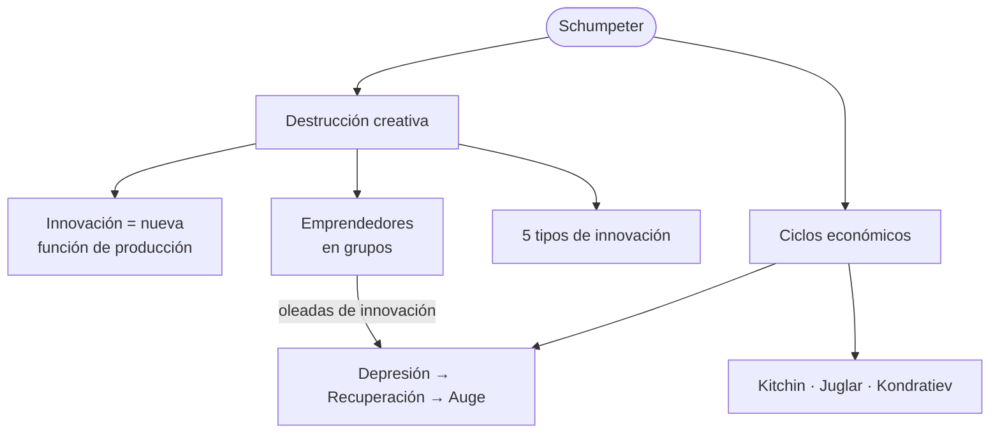
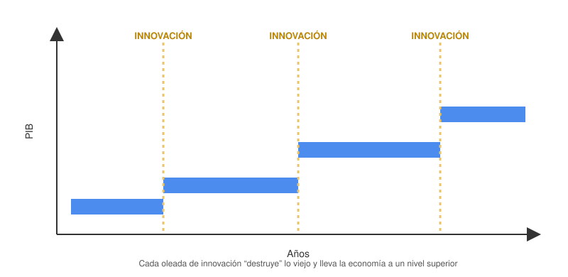
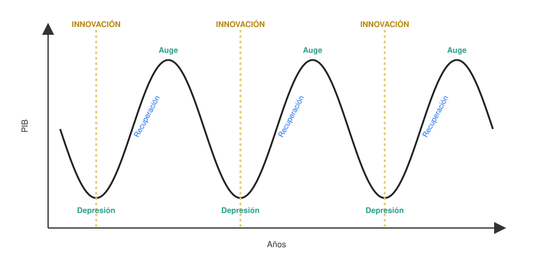
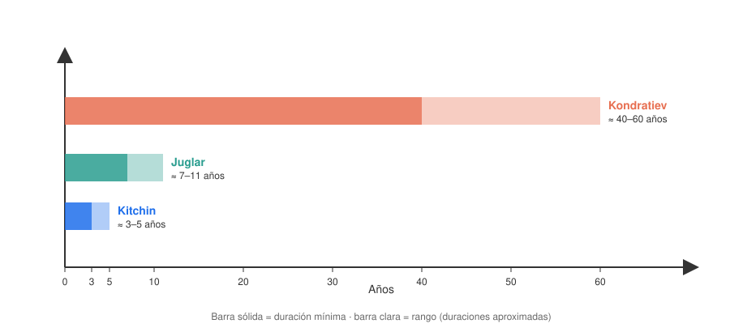

# 09 · Schumpeter: destrucción creativa y ciclos económicos

> **Fuente en el material:** *Clase 2 – Gestión de la innovación* (Ing. Mario Barrios), diapositivas 14–18.
> **Prerrequisitos:** [08 Curvas de la tecnología](08-curvas-de-la-tecnologia.md).
> **Tiempo estimado:** 50 min.

---

## 🎯 Objetivos de aprendizaje

1. Explicar el concepto de **destrucción creativa** de **Joseph A. Schumpeter**.
2. Interpretar sus dos citas: por qué los emprendedores aparecen **en grupos** y la innovación como **nueva función de producción**.
3. Enumerar los **cinco tipos de innovación** según Schumpeter.
4. Explicar la **teoría de los ciclos económicos** (depresión → recuperación → auge) y el rol de la innovación.
5. Distinguir los ciclos de **Kitchin, Juglar y Kondratiev** (concepción cíclica).

---

## 🗺️ Esquema del tema

- **I. Joseph Alois Schumpeter (1883–1950)**
- **II. Destrucción creativa**
  - A. Definición: transformación que acompaña a la innovación
  - B. Innovación = nueva función de producción
  - C. Los emprendedores aparecen en grupos (enjambres)
  - D. Efecto sobre la economía (saltos de nivel)
- **III. Tipos de innovación según la destrucción creativa**
  1. Nuevos bienes o calidades
  2. Nuevos métodos productivos
  3. Apertura de nuevos mercados
  4. Nuevas fuentes de materias primas
  5. Nueva organización en una industria
- **IV. Teoría de los ciclos económicos**
  - A. Fases: depresión → recuperación → auge
  - B. La innovación como motor de la recuperación
  - C. Concepción cíclica: Kitchin, Juglar, Kondratiev

---

## 🧠 Mapa visual

---

## 📖 Desarrollo

## I. Joseph Alois Schumpeter (1883–1950)

Economista austríaco, uno de los autores más influyentes sobre **innovación y emprendimiento**. Para él, el motor del capitalismo **no es la competencia de precios** sino la **innovación** que introduce el **emprendedor**.

> ➕ **Contexto adicional:** sus obras centrales son *Teoría del desenvolvimiento económico* (1911), *Business Cycles* (1939) y *Capitalismo, socialismo y democracia* (1942), donde populariza la expresión "destrucción creativa".

---

## II. Destrucción creativa

### II.A Definición

> 📌 *"La destrucción creativa es **el proceso de transformación que acompaña a la innovación**."* — J. A. Schumpeter

> 💡 **Para entenderlo:** cada innovación importante **crea** algo nuevo (productos, empresas, empleos) y al mismo tiempo **destruye** lo viejo (empresas, oficios y tecnologías que quedan obsoletas). Ambas cosas son **parte del mismo proceso**: no hay progreso sin que algo quede atrás.

> 🧩 **Ejemplo:** el streaming **creó** Netflix, Spotify, empleos en producción de contenido digital y en ingeniería de datos; y **destruyó** el modelo de videoclubes y gran parte de la venta de CDs y DVDs.

### II.B Innovación = nueva función de producción

> 📌 *"La innovación es la **introducción de una nueva función de producción**."*

- Una **función de producción** es la forma en que se **combinan los recursos** (trabajo, capital, materias primas, conocimiento) para producir algo.
- Innovar = **combinar los recursos de una manera nueva**. No hace falta inventar algo: basta con una **nueva combinación** que funcione en la economía.

> 📝 **Citar y explayarse:** Schumpeter define la destrucción creativa como *"el proceso de transformación que acompaña a la innovación"*, y la innovación como *"la introducción de una nueva función de producción"*, es decir, una nueva forma de combinar trabajo, capital, materias primas y conocimiento. El término une dos caras del mismo proceso: cada innovación **crea** productos, empresas y empleos nuevos y, al mismo tiempo, **destruye** los que quedan obsoletos. Para Schumpeter esto no es un efecto colateral sino el **motor del crecimiento económico**. El streaming lo ilustra: creó plataformas como Netflix y Spotify y nuevos empleos digitales, mientras hacía desaparecer los videoclubes y gran parte de la venta de discos.

### II.C Los emprendedores aparecen en grupos

> 📌 *"¿Por qué los emprendedores aparecen, no de forma continua, es decir, individualmente en cada intervalo apropiadamente elegido, sino **en grupos**? Exclusivamente porque **la aparición de uno o unos pocos emprendedores facilita la aparición de otros**, y éstos el surgimiento de más, **en números cada vez mayores**."*

Lógica de la cita:
1. Un pionero innova y **abre el camino** (demuestra que es posible, crea infraestructura, forma gente).
2. Eso **reduce el riesgo** para los siguientes → aparecen imitadores y nuevos emprendedores.
3. El efecto se **acelera**: cada vez son más.
4. Resultado: la innovación llega **en oleadas o enjambres**, no de forma pareja.

> 📝 **Citar y explayarse:** Schumpeter se pregunta por qué los emprendedores aparecen *"no de forma continua (…) sino en grupos"*, y responde que *"la aparición de uno o unos pocos emprendedores facilita la aparición de otros"*. El primer innovador asume el mayor riesgo, pero al demostrar que la idea funciona abre el camino: deja infraestructura, conocimiento y gente formada, y reduce la incertidumbre para los que vienen después, que imitan y mejoran. Por eso la innovación llega en **oleadas** y no de forma pareja, y esas oleadas explican los saltos de crecimiento y los ciclos económicos. Silicon Valley es un caso clásico: el éxito de las primeras empresas de semiconductores atrajo ingenieros, inversores y proveedores, y de ellas se desprendieron decenas de empresas nuevas.

> 🧩 **Ejemplo:** después de que las primeras fintech demostraron que se podía operar con una billetera virtual en Argentina, aparecieron muchísimas más en pocos años (y empresas de otros rubros que agregaron pagos digitales).

> 🔗 **Por qué importa:** esta idea de las **oleadas** es la que explica los **ciclos económicos** (sección IV). Y se relaciona con la curva S: cuando una tecnología entra en crecimiento acelerado, atrae a un enjambre de emprendedores.

### II.D Efecto sobre la economía: saltos de nivel

La cátedra muestra un gráfico con el **PIB** en el eje vertical y los **años** en el horizontal, donde cada **innovación** lleva la economía a un **escalón superior**:

> 💡 La economía no crece en línea recta: crece **a saltos**, cada vez que una oleada de innovación reemplaza la forma vieja de producir por una más productiva.

> ℹ️ **Nota sobre el material:** la misma diapositiva incluye un gráfico de barras que compara **País 1 a País 4** (valores de 10 a 40) sin rotular la variable. El **apunte de cursada** lo resuelve explícitamente: *"Cada innovación hace subir el PIB a un nuevo nivel a lo largo de los años (crecimiento 'en escalones'). Por eso **los países que más innovan son los que más crecen**."* → Es una lectura **coherente con Schumpeter** (la innovación es el motor del crecimiento), pero tené en cuenta que es la **interpretación del apunte**, no un rótulo de la diapositiva: si lo usás, citalo como interpretación y explicá por qué tiene sentido.

---

## III. Tipos de innovación según la destrucción creativa

Schumpeter identifica **cinco casos** de innovación (cinco formas de "nueva combinación"):

| # | Tipo | Qué significa | Ejemplo |
|---|---|---|---|
| 1 | **Nuevos bienes o calidades** | Un producto nuevo o una nueva calidad de un producto existente. | El smartphone; la leche deslactosada. |
| 2 | **Nuevos métodos productivos** *(no derivados de descubrimientos científicos)* | Una nueva forma de producir o de comercializar. | La línea de montaje de Ford; el autoservicio en supermercados. |
| 3 | **Apertura de nuevos mercados** | Llegar a un mercado donde antes no se vendía. | Una bodega mendocina que empieza a exportar a Asia; e-commerce que llega al interior. |
| 4 | **Nuevas fuentes de materias primas** | Conquistar una nueva fuente de insumos o productos semielaborados. | Litio para baterías; plásticos de origen vegetal. |
| 5 | **Nueva organización en una industria** | Crear o romper una posición de monopolio; reorganizar el sector. | Plataformas que reorganizan una industria entera (Uber en el transporte). |

> ⚠️ **Detalle que suele preguntarse:** en el tipo 2, la cátedra aclara *"no derivados de descubrimientos científicos"*. Es decir: para Schumpeter **innovar no requiere ciencia nueva**; puede ser reorganizar cómo se produce.

> 🔗 **Comparación con clasificaciones modernas:**
>
> | Schumpeter | Clasificación moderna (módulos 12 y 16) |
> |---|---|
> | Nuevos bienes o calidades | Innovación de **producto** |
> | Nuevos métodos productivos | Innovación de **proceso** |
> | Apertura de nuevos mercados | Innovación de **marketing** / modelo de negocio |
> | Nuevas fuentes de materias primas | Innovación de proceso / cadena de suministro |
> | Nueva organización en una industria | Innovación **organizacional** / de modelo de negocio |

---

## IV. Teoría de los ciclos económicos

### IV.A Fases: depresión → recuperación → auge

La economía (medida por el **PIB**) no avanza de manera estable: **oscila**. La cátedra marca tres momentos:

| Fase | Qué pasa |
|---|---|
| **Depresión** | Punto más bajo: la forma vieja de producir se agotó, cae la actividad. |
| **Recuperación** | La economía vuelve a crecer **impulsada por una nueva oleada de innovación**. |
| **Auge** | Punto más alto: la innovación se difunde, muchos la imitan… hasta que se agota y el ciclo vuelve a bajar. |

### IV.B La innovación como motor de la recuperación

En el gráfico de la cátedra, las líneas de **INNOVACIÓN** aparecen justo en los puntos de **depresión**, antes de cada recuperación.

> 💡 **Lectura schumpeteriana del ciclo:**
> 1. Aparecen innovaciones (en **grupos**, como dice la cita).
> 2. Se invierte, se crean empresas → **recuperación** y **auge**.
> 3. La innovación se difunde, los imitadores saturan el mercado, bajan los márgenes y las empresas viejas quiebran (destrucción) → **depresión**.
> 4. En la depresión, nuevos emprendedores buscan nuevas combinaciones → nueva oleada de innovación.

> 🔗 Fijate el paralelismo con la **curva S**: cada auge es una tecnología en crecimiento acelerado; cada depresión, su saturación; y la nueva oleada, la nueva curva S.

### IV.C Concepción cíclica: Kitchin, Juglar, Kondratiev

La cátedra presenta tres ciclos de **distinta duración**, que se superponen (uno dentro del otro) sobre una línea de tiempo de 0 a 60 años:

| Ciclo | Duración (marcada en la diapositiva) | ➕ Contexto adicional: qué lo explica |
|---|---|---|
| **Kitchin** | ≈ **3** años (ciclo corto) | Ajustes de **inventarios** de las empresas (≈ 3–5 años). |
| **Juglar** | ≈ **10** años (ciclo medio) | Ciclos de **inversión en maquinaria y equipos** (≈ 7–11 años). |
| **Kondratiev** | ≈ **40 a 60** años (ondas largas) | **Grandes oleadas tecnológicas** (máquina de vapor, ferrocarril, electricidad, petróleo y automóvil, tecnologías de la información). |

> 💡 **Por qué importa para la materia:** las **ondas largas de Kondratiev** son las que Schumpeter asocia con las **grandes revoluciones tecnológicas**. Son la escala "macro" de la destrucción creativa.

> ➕ **Contexto adicional:** Schumpeter, en *Business Cycles* (1939), propuso que los tres ciclos actúan **simultáneamente**: un Kondratiev contiene varios Juglar, y cada Juglar contiene varios Kitchin.

---

## ⚠️ Conceptos que se confunden

| Se confunde… | …con | Diferencia |
|---|---|---|
| Destrucción creativa | "Destrucción" negativa | Es un proceso **de transformación**: destruir lo viejo **es parte** de crear lo nuevo. |
| Innovación (Schumpeter) | Invención | Innovación = **nueva combinación** introducida en la economía; puede no requerir descubrimientos científicos. |
| Kitchin / Juglar / Kondratiev | — | Corto (≈3 años) / medio (≈10 años) / largo (40–60 años). |
| Ciclos económicos | Curva S | Ciclos = **economía** (PIB); curva S = **una tecnología** (desempeño). Se relacionan, pero son niveles distintos. |

---

## 🔗 Conexiones

- **← [08 Curvas de la tecnología](08-curvas-de-la-tecnologia.md):** la curva S a nivel tecnología; los ciclos a nivel economía.
- **← [03 Tecnologías disruptivas](03-tecnologias-disruptivas.md):** la disrupción es destrucción creativa en acción.
- **→ [10 Gestión de la innovación](10-gestion-de-la-innovacion.md):** Doblin amplía los "tipos" de innovación de Schumpeter.

---

## ✍️ Autoevaluación

**1. Explique el concepto de destrucción creativa y dé un ejemplo actual.**

Ver respuesta

Según Schumpeter, es **el proceso de transformación que acompaña a la innovación**: al introducir una **nueva función de producción**, se crean nuevos productos, empresas y empleos, y simultáneamente quedan obsoletos los anteriores. Ejemplo: el streaming creó plataformas y nuevos empleos digitales mientras hizo desaparecer los videoclubes.

**2. ¿Por qué, según Schumpeter, los emprendedores aparecen en grupos?**

Ver respuesta

Porque **la aparición de uno o unos pocos emprendedores facilita la aparición de otros**, y estos de más, en números crecientes: el pionero reduce el riesgo, abre el camino y genera condiciones para imitadores. Por eso la innovación llega en **oleadas**, lo que explica los ciclos económicos.

**3. Enumere los cinco tipos de innovación según Schumpeter y dé un ejemplo de cada uno.**

Ver respuesta

(1) **Nuevos bienes o calidades** (smartphone). (2) **Nuevos métodos productivos**, no derivados de descubrimientos científicos (línea de montaje). (3) **Apertura de nuevos mercados** (exportar a un país nuevo). (4) **Nuevas fuentes de materias primas** (litio). (5) **Nueva organización en una industria** (una plataforma que reorganiza el transporte).

**4. Describa las fases del ciclo económico y explique dónde aparece la innovación.**

Ver respuesta

**Depresión** (punto más bajo), **recuperación** (crecimiento) y **auge** (punto más alto). La innovación aparece en la **depresión** y es el **motor de la recuperación**: una nueva oleada de innovaciones relanza la inversión y el PIB, hasta que se difunde, se agota y la economía vuelve a caer.

**5. Ordene de menor a mayor duración y caracterice: Kondratiev, Kitchin, Juglar.**

Ver respuesta

**Kitchin** (≈3 años, ciclo corto) < **Juglar** (≈10 años, ciclo medio) < **Kondratiev** (40–60 años, ondas largas asociadas a grandes revoluciones tecnológicas).

---

[← 08 Curvas de la tecnología](08-curvas-de-la-tecnologia.md) · [🏠 Índice](README.md) · [Siguiente → 10 Gestión de la innovación](10-gestion-de-la-innovacion.md)
