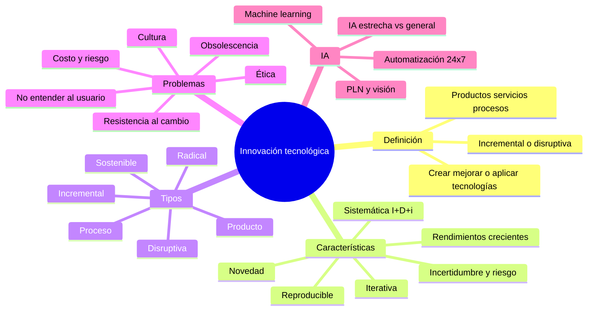
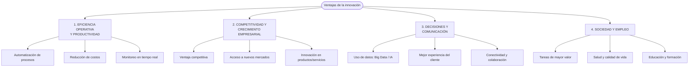
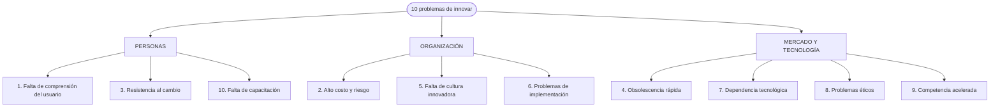
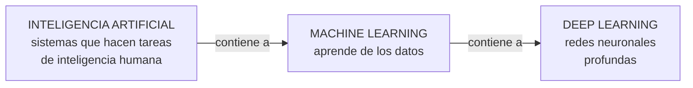

# 12 · Innovación tecnológica e Inteligencia Artificial

> **Fuente en el material:** *Día 3 – Innovación tecnológica, creatividad vs. innovación*, diapositivas 10–29.
> **Prerrequisitos:** [11 Creatividad](11-creatividad-y-proceso-creativo.md).
> **Tiempo estimado:** 70 min.
> **Parcial 1:** ✅ entra (Día 3). Orden de estudio y alcance en [22 · Guía del Parcial 1](22-foco-de-parcial.md).
> 🎯 **[Ruta al Parcial 1](README.md#-ruta-al-parcial-1-empezá-acá):** no está en la ruta (baja prioridad). Si te sobra tiempo, leé solo el esquema y los bloques 📝.

---

## 🎯 Objetivos de aprendizaje

1. Definir **innovación tecnológica** (versión ampliada del Día 3).
2. Explicar sus **características** (las 4 generales y las 9 detalladas).
3. Enumerar los **beneficios** y las **ventajas** de la innovación tecnológica.
4. Clasificar la innovación en sus **seis tipos** del Día 3.
5. Explicar los **diez problemas de innovar**.
6. Definir **Inteligencia Artificial**, sus **aspectos clave**, **características** y **ventajas**, y explicar por qué es *"el ejemplo más disruptivo de la última década"*.

---

## 🗺️ Esquema del tema

- **I. Innovación tecnológica**
  - A. Definición
  - B. Características generales (4)
  - C. Características detalladas (9)
  - D. Beneficios (3)
  - E. Ventajas (4 grupos)
- **II. Tipos de innovación (versión Día 3)**
  1. Incremental · 2. Radical · 3. Disruptiva · 4. De producto · 5. De proceso · 6. Tecnológica sostenible
- **III. Ejemplos actuales de innovación tecnológica**
- **IV. Problemas de innovar** (10)
- **V. Inteligencia Artificial**
  - A. Por qué es el ejemplo más disruptivo
  - B. Definición
  - C. Aspectos clave (4)
  - D. Características (7)
  - E. Ventajas (7)
- **VI. Para reflexionar**

---

## 🧠 Mapa visual

---

## 📖 Desarrollo

## I. Innovación tecnológica

### I.A Definición

> 📌 *"La innovación tecnológica es el **proceso de crear, mejorar o aplicar nuevas tecnologías** para desarrollar **productos, servicios o procesos más eficientes, funcionales o sostenibles**. Combina **conocimientos científicos y técnicos** para **resolver problemas, aumentar la competitividad empresarial y generar valor**, ya sea mediante **cambios pequeños (incrementales) o revolucionarios (disruptivos)**."*

Compará con la definición de la Clase 1 (módulo [01](01-tecnologia-e-innovacion-fundamentos.md)): ambas hablan de **proceso**, de **productos/servicios/métodos** y de **generar valor**. La del Día 3 agrega el **espectro** incremental ↔ disruptivo y el adjetivo **sostenible**.

> 📝 **Citar y explayarse:** En la versión del Día 3, la innovación tecnológica es *"el proceso de crear, mejorar o aplicar nuevas tecnologías para desarrollar productos, servicios o procesos más eficientes, funcionales o sostenibles"*. Respecto de la Clase 1 agrega dos ideas: que innovar puede ser **crear, mejorar o simplemente aplicar** una tecnología (no hace falta inventarla) y que el cambio puede ser **incremental o disruptivo**. En todos los casos combina conocimiento científico y técnico para *"resolver problemas, aumentar la competitividad empresarial y generar valor"*. Agregar pago con QR a una app existente es una innovación incremental; reemplazar las sucursales por un banco 100 % digital es disruptiva. Ambas son innovación tecnológica porque usan tecnología para generar valor.

### I.B Características generales

| Característica | Explicación |
|---|---|
| **Mejora y eficiencia** | Optimizar procesos existentes o crear nuevas formas de hacer las cosas → más productividad. |
| **Impacto económico** | **Motor de crecimiento**: crea nuevas industrias y empleos. |
| **Tipos** | Puede ser **incremental** (nuevos modelos de smartphone) o **disruptiva** (blockchain, IA). |
| **Aplicación práctica** | **No es solo una idea**: es la **implementación exitosa** de la tecnología en el mercado. |

### I.C Características detalladas (9)

| # | Característica | Qué significa |
|---|---|---|
| 1 | **Novedad y creatividad** | No copia: genera **ideas originales**, nuevos productos o **mejoras sustanciales**. |
| 2 | **Proceso sistemático y planificado** | Implica investigación, desarrollo, presupuestos y planificación (**I+D+i**). |
| 3 | **Orientada a la mejora** | Mejora procesos, **reduce costes**, aumenta productividad o calidad. |
| 4 | **Incertidumbre y riesgo** | Al tratar con tecnologías nuevas, **el resultado no está garantizado**. |
| 5 | **Iterativa** | **Mejora constante**, influida por la **retroalimentación** de usuarios y mercado. |
| 6 | **Rendimientos crecientes** | Las tecnologías **son más eficaces a medida que se adoptan y usan más**. |
| 7 | **Transformadora** | Puede ser **disruptiva** (transforma mercados) o **incremental** (mejora constante). |
| 8 | **Reproducible** | Sus resultados **deben poder aplicarse de forma repetible** en un entorno de producción. |
| 9 | **Impulsada por el mercado** | Responde a **necesidades del consumidor** y a la **competencia**. |

> 💡 **Para entenderlo – "rendimientos crecientes":** cuantas más personas usan una tecnología, más valiosa se vuelve (más datos para mejorarla, más desarrolladores, más compatibilidad). Ejemplo: un sistema de pagos con QR vale más cuantos más comercios y usuarios lo usan.
>
> ➕ **Contexto adicional:** esto se relaciona con los **efectos de red** y explica por qué, una vez superado el "abismo" de adopción (módulo [08](08-curvas-de-la-tecnologia.md)), la difusión se acelera.

> 💡 **Para entenderlo – "I+D+i":** **I**nvestigación + **D**esarrollo + **i**nnovación. La "i" minúscula final remarca que **no alcanza con investigar y desarrollar**: hay que **llevarlo al mercado**.

> 🔗 La característica 4 (**incertidumbre y riesgo**) es la razón de ser de **Lean Startup** (módulo [17](17-lean-startup.md)): reducir el riesgo experimentando antes de invertir fuerte.

### I.D Beneficios

1. **Ventaja competitiva** – diferenciación frente a la competencia.
2. **Mejor experiencia de cliente** – soluciones como **chatbots o IA**.
3. **Sostenibilidad** – soluciones **más respetuosas con el medio ambiente**.

### I.E Ventajas (4 grupos)

| Grupo | Ventaja | Detalle |
|---|---|---|
| **Eficiencia operativa y productividad** | Automatización | Tareas repetitivas más rápidas y precisas, **menos errores humanos**. |
| | Reducción de costos | Mejor gestión de recursos, más rentabilidad. |
| | Monitoreo en tiempo real | Seguimiento de inventarios, producción y finanzas. |
| **Competitividad y crecimiento** | Ventaja competitiva | Diferenciarse y adaptarse a cambios. |
| | Nuevos mercados | Oportunidades **globales**; facilita el **trabajo remoto**. |
| | Innovación en productos/servicios | Nuevas ofertas de valor. |
| **Decisiones y comunicación** | Uso de datos (Big Data/IA) | Información precisa y rápida para decisiones estratégicas. |
| | Experiencia del cliente | Personalización y comunicación eficiente (chatbots). |
| | Conectividad y colaboración | Comunicación interna y externa. |
| **Sociedad y empleo** | Tareas de mayor valor | Los empleados se enfocan en lo **creativo o estratégico**. |
| | Salud y calidad de vida | **Telemedicina**, diagnósticos asistidos. |
| | Educación y formación | Aprendizaje **personalizado y continuo**. |

---

## II. Tipos de innovación (versión Día 3)

Esta es la clasificación **más completa** de las que da la cátedra para la innovación tecnológica:

| # | Tipo | Definición | Ejemplo de la cátedra |
|---|---|---|---|
| 1 | **Incremental** | **Pequeñas mejoras continuas** sobre productos, servicios o procesos **existentes** para aumentar eficiencia, productividad o valor. | Actualizaciones de software; nuevos modelos de smartphones. |
| 2 | **Radical** | **Cambios revolucionarios** que **transforman la industria**, **crean mercados totalmente nuevos** y **dejan obsoletas** tecnologías anteriores. | Internet; los smartphones. |
| 3 | **Disruptiva** | **Comienza en nichos de mercado** y **termina desplazando a las tecnologías líderes**, cambiando por completo **cómo los consumidores acceden** a un producto o servicio. | (ver módulo 03) |
| 4 | **De producto** | Creación de **nuevos productos** o **mejoras significativas** en las características funcionales de los existentes. | — |
| 5 | **De proceso** | Métodos de **producción o distribución** nuevos o mejorados. | Automatización, robótica. |
| 6 | **Tecnológica sostenible** | Soluciones que **mejoran la eficiencia sin cambiar drásticamente el mercado**, orientadas a la **sostenibilidad**. | — |

> 💡 **Ordenalos en dos ejes** (igual que en el módulo 01):
> - **Por grado de cambio**: incremental → radical → disruptiva.
> - **Por objeto**: producto / proceso.
> - **Por propósito**: sostenible.

> ⚠️ **Radical vs. disruptiva (clásico):** la **radical** se define por la **magnitud** del cambio (revolucionario, crea mercados nuevos). La **disruptiva** se define por **la trayectoria**: **empieza en nichos** y **desplaza a los líderes**. Una innovación puede ser radical sin ser disruptiva (si la lanza el propio líder del mercado y no desplaza a nadie) y viceversa.

> ⚠️ **Ojo con "sostenible":** acá "tecnológica sostenible" se refiere al **medio ambiente**. ➕ *Contexto adicional:* en la literatura de Christensen existe también "innovación *sostenedora*" (*sustaining*), que es la que mejora productos existentes para los clientes actuales —lo opuesto a disruptiva—. La definición de la cátedra (*"mejora la eficiencia sin cambiar drásticamente el mercado"*) mezcla ambas ideas; en el parcial usá la definición de la cátedra.

---

## III. Ejemplos actuales de innovación tecnológica

| Tecnología | Aplicación |
|---|---|
| **IA y Machine Learning** | Diagnósticos médicos precisos, chatbots, análisis predictivo. |
| **IoT** | Automatización industrial, hogares inteligentes, monitoreo de salud (biosensores, rastreadores). |
| **5G** | Banda ancha de altísima velocidad, conexión simultánea de múltiples dispositivos, **ciudades inteligentes**. |
| **Impresión 3D** | Prototipos, piezas industriales, **prótesis personalizadas**. |
| **Realidad Virtual y Aumentada** | Educación, entrenamiento industrial, experiencias de consumo inmersivas. |
| **Drones autónomos** | Logística (entregas), **agricultura de precisión**, vigilancia. |
| **Reconocimiento facial** | Seguridad urbana, control de acceso, autenticación móvil. |
| **Blockchain** | Registros descentralizados, seguridad y transparencia en finanzas y logística. |
| **Energías renovables innovadoras** | Paneles solares de alta eficiencia, baterías de litio de gran capacidad, turbinas eólicas avanzadas. |

---

## IV. Problemas de innovar

Diez problemas. Es una lista larga: agrupalos para recordarlos mejor.

| # | Problema | Detalle de la cátedra | Cómo se combate (conexión con la materia) |
|---|---|---|---|
| 1 | **Falta de comprensión del usuario** | Se desarrolla tecnología **sin entender necesidades reales**. | **Design Thinking** (empatizar) – módulo 13. |
| 2 | **Alto costo y riesgo** | Invertir **no garantiza éxito**; puede haber **pérdidas importantes**. | **Lean Startup** (MVP), **innovación abierta** (riesgo compartido). |
| 3 | **Resistencia al cambio** | Personas y organizaciones **rechazan lo nuevo**; preferencia por lo conocido. | Capacitación, liderazgo (Gestión 2.0). |
| 4 | **Obsolescencia rápida** | *"Lo innovador hoy, mañana ya no sirve."* | Curva S: buscar la próxima curva. |
| 5 | **Falta de cultura innovadora** | Empresas **rígidas**, **miedo al error**, poca creatividad. | Gestión 2.0: "está bien fracasar", estructura en red. |
| 6 | **Problemas de implementación** | **Buena idea, mala ejecución**; falta de planificación. | Proyectos de innovación, KPI, OKR. |
| 7 | **Dependencia tecnológica** | Exceso de dependencia en sistemas o plataformas; **riesgos si fallan**. | Resiliencia (entorno VANI, frágil). |
| 8 | **Problemas éticos** | **Uso indebido de datos**, **privacidad**, **IA**. | Gobernanza de datos; ética en Data Mining. |
| 9 | **Competencia acelerada** | **Todos innovan al mismo tiempo**; difícil diferenciarse. | Combinar tipos de innovación (Doblin). |
| 10 | **Falta de capacitación** | Usuarios o empleados **no saben usar la tecnología**; **se desaprovecha**. | Paso "capacitar al personal" (módulo 03). |

> 💡 **Tip de parcial:** si te piden "analice un caso donde la innovación no generó valor", recorré esta lista y detectá cuál(es) problema(s) aparecen. Casi siempre es el 1 (no entender al usuario) o el 6 (mala ejecución).

---

## V. Inteligencia Artificial

### V.A Por qué es el ejemplo más disruptivo

> 📌 *"La inteligencia artificial (IA) es **el ejemplo más disruptivo de innovación tecnológica de la última década**, transformando por completo la forma en que vivimos, trabajamos y procesamos la información. Lo que hace que la IA sea una innovación tan profunda es su **capacidad de evolución** y **transversalidad**, impactando prácticamente a **todas las industrias**."*

- **Capacidad de evolución**: mejora con más datos y uso (rendimientos crecientes).
- **Transversalidad**: no es de un sector; atraviesa salud, finanzas, educación, logística, entretenimiento…

### V.B Definición

> 📌 *"La Inteligencia Artificial (IA) es un **campo de la informática** dedicado a crear **sistemas capaces de realizar tareas que, por lo general, requieren inteligencia humana**, como **aprender, razonar, percibir y tomar decisiones**. Se basa en el **procesamiento de grandes volúmenes de datos** mediante **algoritmos** para **identificar patrones** y **mejorar automáticamente con la experiencia**."*

> 🔗 Fijate que la definición usa vocabulario de los módulos de datos: **grandes volúmenes de datos** (Big Data), **identificar patrones** (Data Mining).

> 📝 **Citar y explayarse:** La cátedra define la inteligencia artificial como *"un campo de la informática dedicado a crear sistemas capaces de realizar tareas que, por lo general, requieren inteligencia humana, como aprender, razonar, percibir y tomar decisiones"*, y la presenta como *"el ejemplo más disruptivo de innovación tecnológica de la última década"*. Es tan disruptiva por dos rasgos: su **capacidad de evolución**, porque mejora automáticamente con más datos y uso, y su **transversalidad**, porque no pertenece a una industria sino que atraviesa salud, finanzas, educación o logística. Su funcionamiento se apoya en el bloque de datos: necesita *"grandes volúmenes de datos"* (Big Data) y algoritmos que *"identifican patrones"* (Data Mining). Un filtro que clasifica correos o un sistema que detecta fraudes con tarjetas son ejemplos cotidianos.

### V.C Aspectos clave

| Aspecto | Explicación |
|---|---|
| **Capacidad de aprendizaje** | A diferencia de la **programación tradicional**, la IA (especialmente el **machine learning**) **aprende de los datos** para mejorar su precisión con el tiempo. |
| **Subcampos principales** | **Aprendizaje automático** (*machine learning*) y **aprendizaje profundo** (*deep learning*), que imita las **redes neuronales** humanas para procesar información compleja. |
| **Tipos de IA** | La mayoría de la IA actual es **"IA estrecha" o débil** (una tarea específica: filtros de spam, recomendaciones). La **"IA general" o fuerte**, que emularía la mente humana, **sigue siendo un objetivo teórico**. |
| **Aplicaciones diarias** | Asistentes personales (Siri/Alexa), motores de búsqueda, traducción, reconocimiento facial, vehículos autónomos, redes sociales. |

> 💡 **Programación tradicional vs. machine learning:**
> - Tradicional: **reglas + datos → respuestas** (el programador escribe las reglas).
> - Machine learning: **datos + respuestas → reglas** (el sistema aprende las reglas a partir de ejemplos).

### V.D Características

1. **Aprendizaje automático** – mejora con más datos **sin ser programado explícitamente** para cada tarea.
2. **Análisis y predicción** – analiza **Big Data** para detectar patrones y **predecir**.
3. **Autonomía** – ejecuta tareas y **toma decisiones** basadas en reglas o patrones aprendidos.
4. **Procesamiento del Lenguaje Natural (PLN)** – entiende, interpreta y **genera lenguaje humano** (chatbots).
5. **Adaptabilidad** – ajusta respuestas ante nuevos datos o cambios del entorno.
6. **Visión por computadora** – identifica, procesa e interpreta **imágenes y videos**.
7. **Automatización de procesos** – tareas repetitivas o complejas, rápido y **sin interrupciones (24×7)**.

### V.E Ventajas

| Ventaja | Explicación |
|---|---|
| **Automatización y eficiencia** | Maneja tareas monótonas; **libera tiempo humano** para lo creativo o estratégico. |
| **Reducción de errores humanos** | Sin cansancio ni distracciones; clave en **medicina o industria**. |
| **Disponibilidad 24/7** | Atención al cliente o supervisión **continua**. |
| **Análisis rápido de datos** | Volúmenes masivos **en tiempo real**; patrones ocultos. |
| **Optimización de decisiones** | **Previsión de riesgos** y **detección de fraudes**. |
| **Educación y personalización** | Aprendizaje **adaptado** a cada estudiante; apoyo a docentes. |
| **Entornos peligrosos** | Robots y sistemas inteligentes operan donde es riesgoso para humanos. |

> ⚖️ **Visión crítica (de otros módulos):** la propia cátedra marca como desafíos de la IA la **desinformación, los sesgos éticos y el impacto laboral** (módulo [02](02-impactos-y-desafios.md)) y los **problemas éticos** de innovar (sección IV). En un desarrollo, mencioná ventajas **y** riesgos.

---

## VI. Para reflexionar

La clase deja dos preguntas abiertas:

1. **¿La innovación mejora la vida… o la complica?** → Ambas: depende de cómo se implemente (ver impactos sociales, módulo 02: tecnoestrés, adicción, brecha digital vs. conectividad, salud, educación).
2. **¿Se puede innovar sin entender a las personas?** → Según la cátedra, **no de forma exitosa**: el problema n.º 1 de innovar es la **falta de comprensión del usuario**, y la regla 5 del proceso creativo exige **enfoque en el usuario y el problema**. Esto es exactamente lo que resuelve **Design Thinking** (siguiente módulo).

---

## ⚠️ Conceptos que se confunden

| Se confunde… | …con | Diferencia |
|---|---|---|
| Radical | Disruptiva | **Magnitud** del cambio vs. **trayectoria** (nicho → desplaza al líder). |
| IA | Machine learning | ML es **un subcampo** de la IA (el que aprende de datos). Deep learning es un subcampo del ML. |
| IA estrecha (débil) | IA general (fuerte) | Una tarea específica (lo que existe hoy) vs. emular la mente humana (objetivo teórico). |
| Beneficios | Ventajas | Listas distintas en el material (3 beneficios; 4 grupos de ventajas). |
| Tecnológica sostenible (cátedra) | *Sustaining innovation* (Christensen) | Medio ambiente / eficiencia sin cambiar el mercado vs. mejora para clientes actuales. |

---

## 🔗 Conexiones

- **← [01](01-tecnologia-e-innovacion-fundamentos.md) y [03](03-tecnologias-disruptivas.md):** tipos de innovación y disrupción.
- **← [05](05-data-mining.md) y [06](06-big-data.md):** la IA se alimenta de datos.
- **→ [13 Design Thinking](13-design-thinking.md):** respuesta al problema "no entender al usuario".
- **→ [17 Lean Startup](17-lean-startup.md):** respuesta al problema "alto costo y riesgo".

---

## ✍️ Autoevaluación

**1. Defina innovación tecnológica y mencione cinco de sus características.**

Ver respuesta

Es el **proceso de crear, mejorar o aplicar nuevas tecnologías** para desarrollar productos, servicios o procesos más eficientes, funcionales o sostenibles; combina conocimientos científicos y técnicos para resolver problemas, aumentar la competitividad y generar valor, mediante cambios incrementales o disruptivos. Características: novedad y creatividad; proceso sistemático (I+D+i); orientada a la mejora; incertidumbre y riesgo; iterativa; rendimientos crecientes; transformadora; reproducible; impulsada por el mercado.

**2. ¿Qué significa que la innovación tecnológica tenga "rendimientos crecientes"?**

Ver respuesta

Que las tecnologías **se vuelven más eficaces a medida que son más adoptadas y utilizadas** (más usuarios → más datos, más compatibilidad, más valor). Por ejemplo, una red de pagos digitales es más útil cuantos más comercios la aceptan.

**3. Diferencie innovación radical de disruptiva con un ejemplo de cada una.**

Ver respuesta

**Radical**: cambio revolucionario que transforma la industria, crea mercados nuevos y deja obsoletas tecnologías anteriores (internet). **Disruptiva**: comienza en **nichos** y termina **desplazando a las tecnologías líderes**, cambiando cómo los consumidores acceden al producto (el streaming desplazando al alquiler de videos). La diferencia es magnitud vs. trayectoria.

**4. Una empresa lanza una app tecnológicamente impecable que nadie usa. ¿Qué problemas de innovar identifica y cómo los habría evitado?**

Ver respuesta

Principalmente **falta de comprensión del usuario** (problema 1) y posiblemente **problemas de implementación** (6) o **falta de capacitación** (10). Se habría evitado con **Design Thinking** (empatizar y testear con usuarios reales) y **Lean Startup** (MVP, medir y validar antes de invertir de lleno).

**5. Defina IA y explique la diferencia entre IA estrecha e IA general.**

Ver respuesta

La IA es un **campo de la informática** que crea **sistemas capaces de realizar tareas que normalmente requieren inteligencia humana** (aprender, razonar, percibir, decidir), basándose en el procesamiento de grandes volúmenes de datos mediante algoritmos que identifican patrones y mejoran con la experiencia. **IA estrecha/débil**: diseñada para una tarea específica (filtros de spam, recomendaciones) – es la mayoría de la IA actual. **IA general/fuerte**: emularía la mente humana – sigue siendo un objetivo teórico.

**6. ¿Por qué la cátedra considera a la IA el ejemplo más disruptivo de la última década?**

Ver respuesta

Por su **capacidad de evolución** (mejora con la experiencia y los datos) y su **transversalidad** (impacta prácticamente a todas las industrias), transformando cómo vivimos, trabajamos y procesamos la información.

---

🎯 [Volver a la Ruta al Parcial 1](README.md#-ruta-al-parcial-1-empezá-acá)

[← 11 Creatividad y proceso creativo](11-creatividad-y-proceso-creativo.md) · [🏠 Índice](README.md) · [Siguiente por clase → 13 Design Thinking](13-design-thinking.md)
