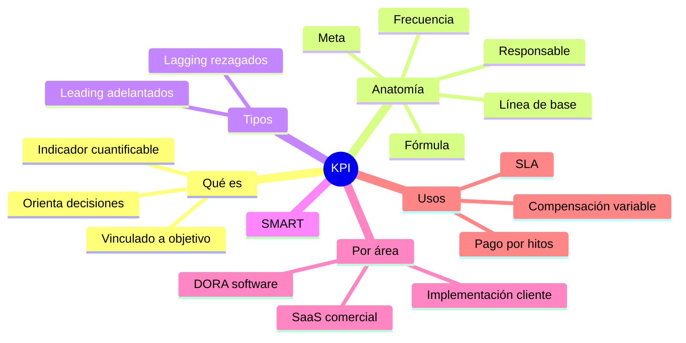
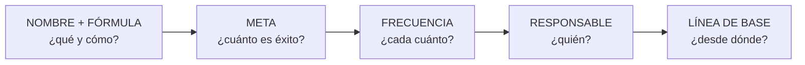
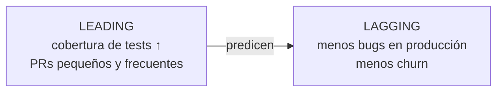
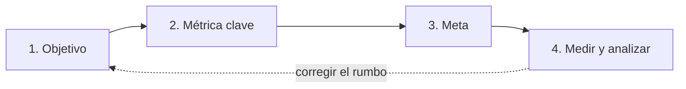
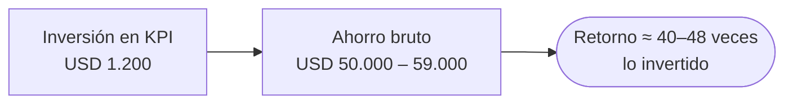

# 18 · KPI: indicadores clave de desempeño

> **Fuente en el material:** *Proyecto de Innovación Tecnológica – Lean Startup y KPI* (Ing. Barrios), diapositivas 17–20; *KPI & OKR* (Ing. Mario Barrios), módulos 01–03 y Ejercicio 01.
> **Prerrequisitos:** [16 Proyectos y estrategia](16-proyectos-y-estrategia-de-innovacion.md).
> **Tiempo estimado:** 90 min (tema largo y con cálculos).

---

## 🎯 Objetivos de aprendizaje

1. Definir **KPI** y diferenciarlo de una **métrica**.
2. Construir un KPI completo con su **anatomía** (nombre + fórmula, meta, frecuencia + responsable, línea de base).
3. Aplicar el **framework SMART**.
4. Distinguir KPI **leading** (adelantados) y **lagging** (rezagados).
5. Conocer los KPI típicos de **desarrollo de software (DORA)**, **implementación en cliente** y **comercialización (SaaS)**, con sus fórmulas y metas.
6. Conocer las **herramientas** para medir KPI.
7. Analizar los **casos Spotify y Mercado Libre**.
8. Calcular el **costo de no medir** (caso TechSolve) y detectar sus supuestos.
9. Explicar cómo los KPI **transforman el modelo de trabajo** (pago por hitos, SLA, compensación variable).

---

## 🗺️ Esquema del tema

- **I. Qué es un KPI**
  - A. Definición (dos versiones de la cátedra)
  - B. Métrica vs. KPI
  - C. Las 5 condiciones de un KPI
- **II. Anatomía de un KPI bien construido**
  1. Nombre + fórmula
  2. Meta (target)
  3. Frecuencia + responsable
  - + Línea de base
- **III. Framework SMART**
- **IV. Tipos de KPI: leading vs. lagging**
- **V. Pasos para implementar KPIs**
- **VI. KPI por área**
  - A. Áreas de negocio (ventas, marketing, servicio, finanzas)
  - B. Desarrollo de software (DORA)
  - C. Implementación en cliente
  - D. Comercialización de software (SaaS)
- **VII. Herramientas para medir KPI**
- **VIII. Casos reales**
  - A. Spotify y el modelo squad
  - B. Mercado Libre y las métricas DORA
- **IX. El costo de no medir: caso TechSolve**
- **X. KPI y la transformación del modelo de trabajo**
- **XI. Ejercicio: construí tu primer KPI**

---

## 🧠 Mapa visual

---

## 📖 Desarrollo

## I. Qué es un KPI

### I.A Definición

> 📌 **Versión "Proyectos de innovación":** *"Los KPIs (**Key Performance Indicators** o Indicadores Clave de Desempeño) son **métricas cuantificables** utilizadas para **evaluar el éxito, la eficiencia y el progreso** de una organización, equipo o campaña **hacia sus objetivos estratégicos**. Actúan como un **'GPS' empresarial**, facilitando la **toma de decisiones basada en datos** para **corregir el rumbo** si es necesario."*

> 📌 **Versión "KPI & OKR":** *"Un Key Performance Indicator es un **indicador cuantificable** que permite evaluar **qué tan bien** una organización, equipo o proceso **está alcanzando sus objetivos estratégicos** en un **período de tiempo definido**."*

> 💡 **La metáfora del GPS:** el GPS no maneja por vos; te dice **dónde estás respecto de adónde querés ir** y te avisa si te desviaste. Eso hace un KPI.

### I.B Métrica vs. KPI

> *"La palabra clave es **'Key'**. **No toda métrica es un KPI.**"*

| | Ejemplo | Qué hace |
|---|---|---|
| **Métrica** | *"Tuvimos 10.000 visitas al sitio."* | **Informa.** |
| **KPI** | *"La tasa de conversión es 3,2 % vs. meta del 5 %."* | **Orienta decisiones.** |

> 📌 *"La métrica **informa**. El KPI **orienta decisiones**."*

### I.C Las 5 condiciones de un KPI

Un KPI tiene que:
1. Estar **vinculado a un objetivo de negocio**.
2. Ser **medible con un valor numérico**.
3. Tener un **responsable claro**.
4. Tener un **período de evaluación definido**.
5. **Orientar decisiones y acciones concretas**.

---

## II. Anatomía de un KPI bien construido

| Componente | Qué define | Ejemplo |
|---|---|---|
| **01 · Nombre + fórmula** | **Exactamente qué se mide y cómo se calcula**. | *Defect Rate = Bugs en producción / Features entregadas* |
| **02 · Meta (target)** | **Valor numérico que define el éxito**; **retador pero alcanzable**. | *< 0,1 bugs por feature* |
| **03 · Frecuencia + responsable** | **Cada cuánto** se mide y **quién es dueño del número**. | *Semanal; Tech Lead* |
| **+ Línea de base** | Valor **actual** desde el que se parte. | *Hoy: 0,4 bugs por feature* |

> 📌 *"**Sin meta, no hay KPI**: es solo una métrica."* · *"Sin frecuencia y responsable, el KPI **no genera acción**."*

> 📌 **La frase para memorizar:** *"Un KPI sin meta es una **observación**. Un KPI sin responsable es un **deseo**. Un KPI sin frecuencia es **historia**."*

> 🧩 **Ejemplo completo de la cátedra:** *"Reducir el tiempo de resolución de bugs críticos **a menos de 4 horas** (meta), **medido semanalmente** (frecuencia), **responsable: Tech Lead**. **Línea de base actual: 11,5 horas**."*

---

## III. Framework SMART

> Origen citado por la cátedra: **Doran, G. T. (1981)**, *Management Review*.

| Letra | Significado | Pregunta de control | Aplicado a KPI (cátedra) |
|---|---|---|---|
| **S** | **Specific** – Específico | ¿Está **claramente definido**? | El indicador debe referir a **un proceso concreto**. |
| **M** | **Measurable** – Medible | ¿Se puede **cuantificar**? | **Cuantificable con datos reales**. |
| **A** | **Achievable** – Alcanzable | ¿Es **realista** con los recursos? | **Alcanzable con los recursos disponibles**. |
| **R** | **Relevant** – Relevante | ¿Importa para la **estrategia**? | **Vinculado a un objetivo estratégico**. |
| **T** | **Time-bound** – Temporal | ¿Tiene **plazo**? | **Acotado a una ventana temporal**. |

> 🧩 **De NO-SMART a SMART:**
> - ❌ "Mejorar la satisfacción del cliente." (no es específico, ni medible, ni temporal)
> - ✅ "Aumentar el **NPS** de **+20 a +40** en el **Q2**, medido por encuesta post-compra, responsable: líder de Customer Success."

---

## IV. Tipos de KPI: leading vs. lagging

| | **Leading (adelantados)** | **Lagging (rezagados)** |
|---|---|---|
| **Qué miden** | **Actividades que predicen resultados futuros**. | **Resultados ya ocurridos**. |
| **Ventaja** | **Son accionables** (podés intervenir antes). | **Fáciles de medir**. |
| **Desventaja** | **Difíciles de medir**. | **No se puede intervenir retroactivamente**. |
| **Ejemplos de la cátedra** | Cantidad de **pull requests por semana**, **cobertura de tests**. | **Churn rate del trimestre**, **ingresos mensuales**. |

> 💡 **Para entenderlo – la balanza:** el peso que marca la balanza es un indicador **lagging** (resultado). Las calorías que comés y los entrenamientos de la semana son **leading** (predicen el peso futuro y podés actuar sobre ellos hoy). Un buen tablero combina ambos.

---

## V. Pasos para implementar KPIs

1. **Definir el objetivo** – ¿qué queremos lograr?
2. **Identificar la métrica clave** – ¿qué dato demuestra el éxito?
3. **Establecer metas** – ¿cuál es la cifra objetivo (*target*)?
4. **Medir y analizar** – revisar la evolución **periódicamente** (semanal, mensual).

---

## VI. KPI por área

### VI.A Áreas de negocio

| Área | KPIs típicos |
|---|---|
| **Ventas** | Tasa de conversión, crecimiento de ingresos, margen de beneficio, **valor del tiempo de vida del cliente (CLV)**. |
| **Marketing digital** | **Coste de adquisición de cliente (CAC)**, **retorno de la inversión (ROI)**, tasa de apertura de emails, tráfico web. |
| **Servicio al cliente** | Tasa de retención, **Net Promoter Score (NPS)**, tiempo de respuesta. |
| **Finanzas** | Margen de utilidad neta, flujo de caja, **EBITDA**. |

> ➕ **Contexto adicional – fórmulas útiles:**
> - **ROI** = (Ganancia − Inversión) / Inversión × 100.
> - **EBITDA** = ganancias antes de intereses, impuestos, depreciaciones y amortizaciones.
> - **CLV/LTV** ≈ ingreso promedio por cliente × margen × tiempo de permanencia.

### VI.B Desarrollo de software (DORA)

> Fuente citada por la cátedra: **DORA Metrics — Forsgren, Humble & Kim (2018). *Accelerate*. IT Revolution Press.**

| KPI | Fórmula / definición | Meta típica | ¿Por qué importa? |
|---|---|---|---|
| **Lead Time** | Tiempo **desde commit hasta producción** | **< 1 día** | **Velocidad** de entrega de valor |
| **Defect Escape Rate** | **Bugs en prod / Total bugs × 100** | **< 5 %** | **Calidad** del proceso de QA |
| **Code Coverage** | **Líneas testeadas / Total líneas × 100** | **> 80 %** | **Confiabilidad** del código |
| **Deployment Frequency** | **Deploys exitosos por semana** | **> 2/semana** | **Madurez CI/CD** del equipo |
| **MTTR** | **Tiempo promedio de recuperación** ante falla | **< 2 horas** | **Resiliencia** operacional |
| **Tech Debt Ratio** | **Tiempo de remediación / Tiempo de desarrollo** | **< 5 %** | **Salud** del codebase |

> 🧩 **Calculá:** en un sprint se encontraron 40 bugs en total, 3 de ellos en producción. *Defect Escape Rate* = 3 / 40 × 100 = **7,5 %** → **no cumple** la meta (< 5 %).

> ➕ **Contexto adicional:** las cuatro **métricas DORA** "oficiales" son **Deployment Frequency, Lead Time for Changes, Change Failure Rate y MTTR** (las que aparecen en el caso Mercado Libre). Code coverage y tech debt ratio son KPI de ingeniería complementarios.

### VI.C Implementación en cliente

| KPI | Fórmula | Meta | Impacto directo |
|---|---|---|---|
| **Time to Value (TTV)** | **Días desde contrato hasta primer uso productivo** | **< 30 días** | Riesgo de **churn temprano** |
| **Adoption Rate** | **Usuarios activos / Licencias contratadas** | **> 75 %** | **Renovación y expansión** |
| **First Response Time** | **Tiempo promedio de 1ª respuesta** a ticket | **< 4 horas** | Satisfacción y **SLA** |
| **NPS** | **% Promotores − % Detractores** | **> +40** | **Referidos y retención** |
| **Tasa de reentrenamiento** | **Tickets por uso incorrecto / Total tickets** | **< 10 %** | **Costo de soporte** |

> 📊 *"Un cliente que adopta rápido tiene una probabilidad de renovación del **87 %** vs. **43 %** de quienes tardan más de 60 días."* — Gainsight Customer Success Benchmark 2023 (citado por la cátedra).

> 🧩 **Calculá el NPS:** de 200 encuestados, 110 son promotores, 50 pasivos y 40 detractores. %P = 55 %, %D = 20 % → **NPS = 55 − 20 = +35** → no llega a la meta (> +40).
>
> ➕ *Contexto adicional:* en la encuesta NPS ("¿qué tan probable es que nos recomiendes?", 0 a 10), **promotores** = 9–10, **pasivos** = 7–8, **detractores** = 0–6. El NPS va de −100 a +100.

### VI.D Comercialización de software (SaaS)

**Adquisición**

| KPI | Fórmula |
|---|---|
| **CAC** (Costo de Adquisición de Cliente) | **(Marketing + Ventas) / Nuevos clientes** |
| **Conversion Rate (trial a pago)** | **Clientes pago / Trialists × 100** |
| **SQL to Close Rate** | **Deals cerrados / SQLs calificados** |

**Retención y expansión**

| KPI | Fórmula / criterio |
|---|---|
| **MRR / ARR** | Ingresos **recurrentes** mensuales / anuales |
| **Churn Rate** | **Clientes perdidos / Total al inicio × 100** |
| **LTV / CAC** | **Saludable si LTV ≥ 3 × CAC** |

**Benchmarks SaaS 2024** (OpenView / Paddle, citados por la cátedra):

| Indicador | Benchmark |
|---|---|
| Churn mensual saludable (SMB) | **< 3 %** |
| Trial-to-paid conversion promedio | **15–25 %** |
| LTV/CAC mínimo viable | **3 : 1** |
| NPS promedio industria tech | **+35** |
| CAC Payback Period recomendado | **< 12 meses** |

> 🧩 **Calculá (caso integrador):** una SaaS gastó USD 30.000 en marketing y USD 20.000 en ventas en el trimestre y consiguió 100 clientes nuevos. Cada cliente paga USD 50/mes y se queda en promedio 24 meses.
> - **CAC** = (30.000 + 20.000) / 100 = **USD 500**.
> - **LTV** (simplificado, sin margen) = 50 × 24 = **USD 1.200**.
> - **LTV/CAC** = 1.200 / 500 = **2,4** → **por debajo de 3:1** → el negocio todavía no es saludable: hay que bajar CAC o aumentar retención/precio.
> - ➕ **CAC Payback** = CAC / ingreso mensual por cliente = 500 / 50 = **10 meses** → dentro de lo recomendado (< 12).

> 💡 **SQL** = *Sales Qualified Lead*: un potencial cliente que ventas ya calificó como oportunidad real.

---

## VII. Herramientas para medir KPI

| Ámbito | Herramienta | Qué mide |
|---|---|---|
| **DEV** | **Jira + Confluence** | Velocidad de sprint, defect rate, lead time; dashboards por equipo. |
| **DEV** | **SonarQube** | Code coverage, tech debt ratio, code smells; integra con CI/CD. |
| **OPS** | **Datadog / New Relic** | MTTR, uptime, error rate, latencia; **monitoreo en tiempo real**. |
| **OPS** | **PagerDuty** | MTTD, MTTR, incidentes; integra con Slack y GitHub. |
| **BIZ** | **Mixpanel / Amplitude** | DAU/MAU, retention, funnels de conversión, adopción de features. |
| **BIZ** | **HubSpot / Salesforce** | CAC, pipeline velocity, churn, MRR; CRM con dashboards comerciales. |
| **BI** | **Tableau / Power BI** | **Dashboards ejecutivos** cruzando múltiples fuentes. |
| **BI** | **Google Looker Studio** | Visualización **gratuita**; conecta GA4, BigQuery, Sheets. |
| **OKR** | **Lattice / Perdoo / Weekdone** | Gestión de OKR y **check-ins semanales**; integra con Slack. |

> 🔗 Las herramientas de BI son las mismas del módulo [04](04-business-intelligence.md): BI es la **infraestructura de visualización** de los KPI.

---

## VIII. Casos reales

### VIII.A Spotify y el modelo squad

> Fuente citada: **Kniberg & Ivarsson (2012). *Scaling Agile @ Spotify*.**

- Organizó sus equipos en **squads autónomos**, **cada uno con sus propios KPI** alineados a misiones específicas.
- Escaló de **30 a más de 500 desarrolladores sin perder velocidad** de entrega.
- **Cada squad tenía *ownership* de un KPI primario.** Si el número caía, **el squad actuaba sin esperar aprobación externa**.

| Squad / área | KPI clave |
|---|---|
| **Discovery** | *Stream-from-recommendation rate* = streams iniciados desde recomendación / total streams |
| **Infrastructure** | P99 latency / deployment frequency |
| **Growth** | Monthly Active Users (MAU) |
| **Monetization** | Free-to-Premium conversion rate |

> 📊 **Resultado:** de **20 deploys/año** a **más de 10 deploys/día**, manteniendo una tasa de incidentes **< 0,1 %**.

> 🔗 Es un ejemplo de **estructura en red** (Gestión 2.0, módulo [10](10-gestion-de-la-innovacion.md)) y de innovación de **estructura** (Doblin).

### VIII.B Mercado Libre y las métricas DORA

> Fuente citada: **MeLi Engineering Blog / DORA Report LATAM 2023.**

- Adoptó las **métricas DORA** como estándar para sus **más de 18.000 empleados de tecnología**.
- Cada equipo tiene un **scorecard de KPI de ingeniería revisado cada sprint**.

| Métrica DORA | Valor / target en MeLi |
|---|---|
| Deployment Frequency | **Múltiples por día (elite)** |
| Lead Time for Changes | **< 1 hora (top)** |
| Change Failure Rate | **< 5 % target** |
| MTTR | **< 1 hora** |

- Al medir el **Change Failure Rate por equipo**, descubrieron que **3 squads generaban el 68 % de los incidentes** de producción.
- La intervención **redujo el tiempo de indisponibilidad un 41 % en 2 trimestres**.

> 📌 **Conclusión de la cátedra:** *"La medición sistemática de KPI de ingeniería genera impacto directo tanto en la calidad del producto como en la satisfacción del equipo. **Los equipos con mejores DORA metrics tienen también la mayor retención de ingenieros**."*

> 💡 **La lección del caso:** sin medir **por equipo**, el problema estaba "diluido" en el promedio de la empresa. El KPI permitió **focalizar** la intervención (regla de Pareto: pocos generan la mayoría de los problemas).

---

## IX. El costo de no medir: caso TechSolve

> **Escenario:** TechSolve SRL — **6 desarrolladores** — módulo de pagos — **3 meses** — costo diario por dev: **USD 250**.

| Concepto | **SIN KPI definidos** | **CON KPI activos** |
|---|---|---|
| Calidad | **47 bugs** encontrados en producción | **87 %** de bugs detectados **antes** de producción |
| Retrabajo | **18 días extra** → 6 devs × 18 días × USD 250 = **USD 27.000** | Retrabajo evitado: **12 de 18 días** → 6 × 12 × 250 = **−USD 18.000** |
| Inversión en KPI | — | **USD 1.200** (setup + herramienta) |
| Incidentes | **3 incidentes mayores** | **1 menor**, gestionado con MTTR |
| Penalidad SLA | **USD 8.000** | **USD 0** |
| Churn | **1 cliente perdido** (12 meses) = **USD 24.000** | **+15 % de renovación**, cliente retenido |
| **Total** | **Costo adicional: USD 59.000+** | **Ahorro neto estimado: USD 57.800** |

### Verificación de los números (paso a paso)

1. **Costo sin KPI** = 27.000 (retrabajo) + 8.000 (SLA) + 24.000 (churn) = **USD 59.000** ✔️
2. **Ahorro neto según la diapositiva** = 59.000 − 1.200 (inversión) = **USD 57.800**.

> ⚠️ **Trampa del ejercicio (detectala en el parcial):** el ahorro de USD 57.800 **supone que se evita el 100 % del costo**, incluidos los 18 días de retrabajo. Pero la misma diapositiva dice que con KPI se evitan **solo 12 de 18 días** (USD 18.000), es decir, **quedan 6 días de retrabajo** (6 × 6 × 250 = USD 9.000).
>
> Con ese dato, el cálculo consistente sería:
> - Ahorro bruto = 18.000 (retrabajo evitado) + 8.000 (SLA) + 24.000 (churn) = **USD 50.000**
> - Ahorro neto = 50.000 − 1.200 = **USD 48.800**
>
> Ambos resultados muestran lo mismo: **medir cuesta muy poco (USD 1.200) frente a lo que cuesta no medir (≈ USD 50.000–59.000)**. Si te lo preguntan, mostrá el cálculo y **explicitá el supuesto** que usás.

> ➕ *Contexto adicional:* la cátedra también cita a **Gartner (2020), *Measuring and Managing the Cost of Poor-Quality Software***, como fuente sobre el costo de la mala calidad de software.

---

## X. KPI y la transformación del modelo de trabajo

> 📌 *"Los KPI **no solo miden: cambian cómo se organiza el trabajo**. Cuando el equipo ve los mismos indicadores en tiempo real, el modelo se desplaza de **'control por actividad'** a **'autonomía por resultado'**."*

**Efectos en el equipo:**
- **Trabajo por objetivos**: el equipo **decide cómo alcanzar el KPI**, no solo ejecuta tareas.
- **Reducción de micromanagement**: *"el número habla"* sin reportes manuales.
- **Cultura de mejora continua**: cada sprint review es oportunidad de ajustar.
- **Responsabilidad distribuida**: cada squad es **dueño de su métrica**.

**Modelos habilitados por KPI claros:**

| Modelo | Cómo funciona |
|---|---|
| **Pago contra hitos (freelance)** | El KPI define el hito: *"Módulo con cobertura > 80 % y 0 bugs críticos = release 2 = pago 30 %"*. **Claridad total para ambas partes.** |
| **Performance-based compensation** | Parte del **salario variable atado a KPI del equipo**. Alinea incentivos con resultados en startups. |
| **SLA contractual** | El KPI se convierte en **compromiso legal**: *uptime > 99,9 %, MTTR < 4 h*. **Incumplir tiene costo directo.** |

> 💡 **Para vos como freelancer:** definir con el cliente KPI verificables (cobertura, bugs críticos, tiempo de respuesta) **protege a ambos**: vos cobrás por resultados demostrables y el cliente sabe exactamente qué paga. Se profundiza con OKR en el módulo [19](19-okr.md).

---

## XI. Ejercicio: construí tu primer KPI

Consigna de la cátedra (8 min individual + 10 min en común). Elegí un contexto:
- **Opción A – Equipo de desarrollo:** construyen una **API de pagos** para un e-commerce; tienen **problemas de calidad**.
- **Opción B – Implementación en cliente:** implementaron un **CRM** en una empresa de logística; **el cliente no adopta** el sistema.
- **Opción C – Producto propio:** lanzaron una **app de gestión de turnos**; quieren saber **si crece**.

Para el contexto elegido definí: (1) el problema a medir, (2) el KPI con **fórmula exacta**, (3) la **meta**, (4) **frecuencia** y **responsable**.

**Resoluciones modelo:**

| | Opción A (API de pagos) | Opción B (CRM no adoptado) | Opción C (app de turnos) |
|---|---|---|---|
| **Problema** | Muchos bugs llegan a producción | Los usuarios no usan el CRM | No sabemos si la app crece |
| **KPI y fórmula** | **Defect Escape Rate** = bugs en prod / total bugs × 100 | **Adoption Rate** = usuarios activos semanales / licencias contratadas × 100 | **Crecimiento de MAU** = (MAU mes actual − MAU mes anterior) / MAU mes anterior × 100 |
| **Línea de base** | 18 % | 30 % | — (primer mes) |
| **Meta** | < 5 % en 2 meses | > 75 % en 60 días | ≥ 15 % mensual durante el Q |
| **Frecuencia** | Semanal (por sprint) | Semanal | Mensual |
| **Responsable** | Tech Lead / QA Lead | Implementation Manager / Customer Success | Product Manager |
| **Leading complementario** | Code coverage > 80 % | Usuarios que completaron la capacitación | Tasa de activación (usuarios que reservan su 1er turno) |

---

## ⚠️ Conceptos que se confunden

| Se confunde… | …con | Diferencia |
|---|---|---|
| Métrica | KPI | La métrica **informa**; el KPI tiene **meta, responsable, frecuencia** y **orienta decisiones**. |
| Leading | Lagging | Predicen y son accionables (difíciles de medir) vs. resultados pasados (fáciles de medir, no se puede intervenir). |
| Lead Time | MTTR | Commit → producción (velocidad) vs. tiempo de **recuperación** ante una falla (resiliencia). |
| Defect Escape Rate | Defect Rate | Bugs en prod / **total de bugs** vs. bugs en prod / **features entregadas**. |
| CAC | LTV | Lo que **cuesta** conseguir un cliente vs. lo que **deja** un cliente en toda su vida. |
| Churn | Retención | Churn = % que **se va**; retención = % que **se queda** (son complementarios). |
| MRR | ARR | Ingreso recurrente **mensual** vs. **anual** (ARR ≈ MRR × 12). |

---

## 🔗 Conexiones

- **→ [19 OKR](19-okr.md):** los Key Results son "KPI con contexto estratégico".
- **← [04 BI](04-business-intelligence.md):** herramientas de visualización.
- **← [03 Disruptivas](03-tecnologias-disruptivas.md):** paso 6 "medir y evaluar con KPIs".
- **← [17 Lean Startup](17-lean-startup.md):** fase "medición de resultados".

---

## ✍️ Autoevaluación

**1. ¿Qué diferencia una métrica de un KPI? Dé un ejemplo de cada una.**

Ver respuesta

La métrica **informa** ("10.000 visitas"); el KPI **orienta decisiones** porque está vinculado a un objetivo, es numérico, tiene responsable, período definido y meta ("conversión 3,2 % vs. meta del 5 %"). No toda métrica es un KPI: la clave es la "K" (*Key*).

**2. Explique la anatomía de un KPI y complete: "Un KPI sin meta es ___; sin responsable es ___; sin frecuencia es ___".**

Ver respuesta

Nombre + fórmula (qué y cómo se mide), meta/target (valor que define el éxito, retador pero alcanzable), frecuencia + responsable (cada cuánto y quién es dueño), y línea de base. Un KPI sin meta es una **observación**; sin responsable, un **deseo**; sin frecuencia, **historia**.

**3. Clasifique como leading o lagging: (a) ingresos del mes; (b) cobertura de tests; (c) churn trimestral; (d) cantidad de demos agendadas por semana.**

Ver respuesta

(a) **Lagging**. (b) **Leading**. (c) **Lagging**. (d) **Leading** (predice ventas futuras).

**4. Una SaaS tiene 400 clientes al inicio del mes y pierde 18. ¿Cuál es su churn mensual? ¿Es saludable para una SMB?**

Ver respuesta

Churn = 18 / 400 × 100 = **4,5 %**. El benchmark saludable para SMB es **< 3 %**, así que **no es saludable**.

**5. Calcule el NPS: 300 respuestas, 150 promotores, 90 pasivos, 60 detractores. ¿Cumple la meta de implementación (> +40)?**

Ver respuesta

%P = 150/300 = 50 %; %D = 60/300 = 20 %. **NPS = 50 − 20 = +30**. **No cumple** la meta de > +40 (y está debajo del promedio tech de +35).

**6. En el caso TechSolve, ¿cómo se obtiene el ahorro neto de USD 57.800 y qué supuesto implica?**

Ver respuesta

Costo sin KPI = 27.000 (retrabajo: 6 devs × 18 días × USD 250) + 8.000 (SLA) + 24.000 (churn) = 59.000. Ahorro neto = 59.000 − 1.200 (inversión) = **57.800**. Supone que se evita **todo** el costo, pero la diapositiva indica que solo se evitan **12 de 18 días** de retrabajo (USD 18.000). Con ese dato, el ahorro neto sería 18.000 + 8.000 + 24.000 − 1.200 = **USD 48.800**. En ambos casos, medir es muchísimo más barato que no medir.

**7. ¿Qué aprendió Mercado Libre al medir el Change Failure Rate por equipo?**

Ver respuesta

Que **3 squads generaban el 68 % de los incidentes** de producción. Intervenir sobre ellos **redujo la indisponibilidad un 41 % en 2 trimestres**. Además, los equipos con mejores métricas DORA tenían la mayor retención de ingenieros.

**8. ¿Cómo cambian los KPI el modelo de trabajo?**

Ver respuesta

Desplazan el modelo de **control por actividad** a **autonomía por resultado**: el equipo decide cómo alcanzar el KPI, baja el micromanagement, se instala la mejora continua y la responsabilidad se distribuye. Habilitan **pago contra hitos**, **compensación variable por desempeño** y **SLA contractuales**.

---

[← 17 Lean Startup](17-lean-startup.md) · [🏠 Índice](README.md) · [Siguiente → 19 OKR](19-okr.md)
