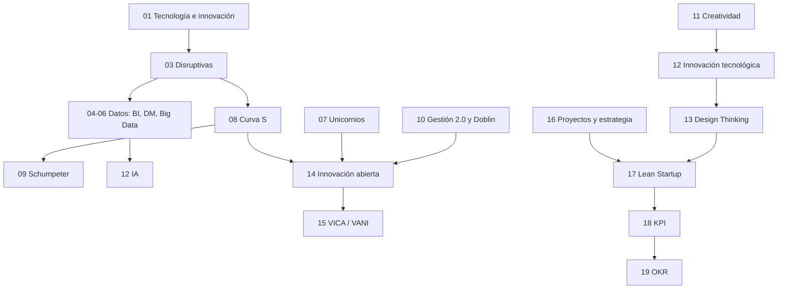

# 21 · Preguntas integradoras (tipo parcial / final)

> **Para qué sirve:** cada módulo tiene su autoevaluación. Acá las preguntas **cruzan varios temas**, que es como suelen venir los parciales a desarrollar. Hacelas **después** de estudiar todos los módulos.
>
> **Cómo usarlo:** respondé por escrito con la estructura del outlining (definición → desarrollo → ejemplo → relación). Recién después desplegá la respuesta modelo y compará **qué conceptos te faltaron**.

---

## 🗺️ Mapa de relaciones entre temas

---

### 1. Netflix como caso integrador
**Analice Netflix utilizando: (a) tipo de innovación, (b) características de las tecnologías disruptivas, (c) uso de Big Data y Data Mining, (d) Design Thinking, (e) un tipo de Doblin.**

Ver respuesta modelo

**(a)** Innovación **disruptiva** y de **modelo de negocio**: pasó del alquiler físico (DVD) a la suscripción digital (streaming), desplazando a los videoclubes.
**(b)** Accesibilidad y menor costo (suscripción barata vs. alquiler por título); innovación radical (sustituyó el modelo de alquiler); evolución rápida (el streaming empezó con poca calidad y catálogo y mejoró veloz); creación de nuevos mercados (producción de contenido original, *binge-watching*); adopción generalizada (cambió el hábito de consumo).
**(c)** **Big Data**: almacena millones de datos de uso (volumen, velocidad, variedad). **Data Mining**: analiza esos datos para recomendar contenido (reglas de asociación / sistemas de recomendación) y decidir qué contenido original producir.
**(d)** Según la cátedra, usó Design Thinking para priorizar las necesidades de contenido personalizado y experiencias de usuario atractivas, anticipando los deseos de sus usuarios.
**(e)** Doblin: **modelo de ingresos** (suscripción), y además **canal** (online) y **relación con el cliente** (personalización).

---

### 2. De la idea al mercado
**Explique el recorrido completo desde que surge una idea hasta que se mide su éxito en el mercado, integrando creatividad, innovación tecnológica, Design Thinking, Lean Startup y KPI.**

Ver respuesta modelo

1. **Creatividad**: se generan ideas originales mediante el proceso creativo (preparación, incubación, iluminación, verificación, difusión) y técnicas (SCAMPER, brainstorming…). La creatividad es el punto de partida, pero no se mide ni se vende.
2. **Design Thinking**: se empatiza con el usuario, se define el problema real, se idea, se prototipa y se testea, evitando el problema n.º 1 de innovar (no entender al usuario).
3. **Lean Startup**: se construye un **MVP** según hipótesis, se miden resultados, se aprende, se valida; se itera o se pivota. Reduce el riesgo y el desperdicio.
4. **Innovación tecnológica**: la idea se implementa con éxito en el mercado y genera valor (deja de ser creatividad).
5. **KPI**: se mide el éxito con indicadores SMART (fórmula, meta, frecuencia, responsable), combinando leading y lagging; y se encuadra en **OKR** para alinear con la estrategia.

---

### 3. Curva S, Schumpeter y disrupción
**Relacione la curva S de la tecnología con la destrucción creativa de Schumpeter y con las características de las tecnologías disruptivas.**

Ver respuesta modelo

La **curva S** muestra que una tecnología pasa por despegue lento, crecimiento acelerado y saturación, y que una **nueva curva** emerge antes de que la anterior sea obsoleta. Las tecnologías **disruptivas** son, justamente, esa nueva curva: empiezan con **rendimiento inferior** y en **nichos**, pero **evolucionan rápido** y terminan desplazando a la establecida. A nivel de la economía, ese reemplazo es la **destrucción creativa**: la innovación crea lo nuevo y destruye lo viejo; como los emprendedores aparecen **en grupos**, las innovaciones llegan en oleadas que generan **ciclos económicos** (depresión → recuperación → auge), y las grandes revoluciones tecnológicas corresponden a las **ondas largas de Kondratiev**.

---

### 4. BI, Data Mining y Big Data
**Una cadena de farmacias quiere usar sus datos. Proponga cómo usaría Big Data, Data Mining y BI, indicando qué pregunta responde cada uno.**

Ver respuesta modelo

- **Big Data** (¿cómo manejo los datos?): integrar ventas de todas las sucursales en tiempo real, recetas digitales, app de fidelización, stock; gestionar volumen, velocidad y variedad; asegurar **veracidad** (limpieza) y apuntar al **valor**.
- **Data Mining** (¿qué patrones ocultos hay / qué va a pasar?): **regresión** para predecir demanda de antigripales según la estación; **reglas de asociación** para combos; **clustering** para segmentar clientes; **detección de anomalías** para fraudes con obras sociales.
- **BI** (¿qué pasó y por qué?): dashboards con KPIs por sucursal (ventas, rotación de stock, faltantes) para que gerentes tomen decisiones (self-service BI).
- **Ética**: datos de salud son sensibles → gobernanza, consentimiento, límites en la recolección.

---

### 5. Innovación abierta en un entorno VANI
**¿Por qué la cátedra afirma que "en un entorno VANI la innovación abierta ya no es para competir"? Desarrolle con las cuatro dimensiones.**

Ver respuesta modelo

En VICA la innovación abierta servía para **acelerar** (agilidad, comprar startups). En VANI el objetivo es **sobrevivir al caos**, construyendo **resiliencia colectiva**:
- **Frágil**: depender de un único proveedor o laboratorio expone al colapso → redes y alianzas dan **redundancia**.
- **Ansioso**: la parálisis por miedo se reduce **compartiendo riesgos** con el ecosistema (empatía, transparencia).
- **No lineal**: no se puede planificar a 5 años → **cartera de CVC** con múltiples apuestas para reaccionar cuando una tendencia pequeña se vuelva estándar.
- **Incomprensible**: más datos no alcanza → **inteligencia colectiva** de expertos externos.
Por eso pasa de "herramienta para competir" a "**única herramienta para construir resiliencia colectiva**".

---

### 6. Gestión de la innovación y fracaso
**Una empresa con estructura piramidal, liderazgo rígido y metas trimestrales quiere "volverse innovadora" lanzando un laboratorio interno cerrado. Analice con Gestión 2.0, problemas de innovar e innovación abierta.**

Ver respuesta modelo

- **Gestión 2.0**: la **estructura piramidal** es un freno (conviene evolucionar a red); el **liderazgo rígido** debe dar paso a estilos afiliativos, colaborativos y visionarios; el **cortoplacismo** (metas trimestrales, lo operativo sobre lo estratégico) va en detrimento de la innovación; falta aceptar el **fracaso** como aprendizaje.
- **Problemas de innovar**: falta de cultura innovadora (rigidez, miedo al error), resistencia al cambio, alto costo y riesgo concentrado.
- **Innovación abierta**: un laboratorio **cerrado** repite el paradigma de "hacerlo todo nosotros"; sería mejor combinarlo con **inbound** (startups, universidades, hackathons) y considerar **CVC** o **aceleradoras corporativas** para distribuir el riesgo.

---

### 7. Doblin y la ventaja competitiva
**¿Por qué innovar solo en "performance del producto" da una ventaja competitiva débil? Proponga una combinación de tipos de Doblin para una fintech.**

Ver respuesta modelo

Porque es un tipo **muy visible** y fácil de copiar por la competencia; las innovaciones que combinan varios tipos, especialmente de **configuración** (internos), son más difíciles de imitar. Fintech: **modelo de ingresos** (sin comisiones de mantenimiento, gana por intercambio), **red** (alianzas con comercios), **procesos** (onboarding 100 % digital en 5 minutos), **sistema de producto** (cuenta + tarjeta + inversiones + préstamos), **relación con el cliente** (app personalizada con IA).

---

### 8. Medir la innovación
**Diseñe un OKR con 3 KR (incluyendo al menos un KPI DORA y uno SaaS) para una startup de software que quiere escalar, y explique la diferencia entre los KR y los KPI que monitorea a diario.**

Ver respuesta modelo

**O:** "Demostrar que nuestra plataforma puede crecer sin perder calidad."
**KR1:** MRR de USD 20.000 a USD 35.000 al cierre del Q (SaaS).
**KR2:** Change Failure Rate < 5 % (base 12 %) (DORA).
**KR3:** Churn mensual < 3 % (base 5 %) (SaaS).
**Iniciativas:** plan anual con descuento; staging + coverage > 80 %; onboarding guiado para bajar el TTV.
**Diferencia:** los KR son **temporales** (90 días), parten de un objetivo **aspiracional** y orientan la **estrategia**; los KPI diarios (uptime, error rate, MTTR) son **monitoreo continuo** de la operación y pueden existir sin objetivo aspiracional. Un KR es un KPI con contexto estratégico.

---

### 9. Unicornios, expectativas y opinión pública
**Relacione la valuación de las empresas unicornio con el Hype Cycle de Gartner y con los factores de opinión pública.**

Ver respuesta modelo

La valuación de un unicornio depende de **expectativas futuras** (es privado y se financia con inversores). El **Hype Cycle** muestra que las expectativas sobre una tecnología se inflan (pico) y luego caen (abismo de desilusión) antes de estabilizarse. Si la empresa depende de una tecnología en su pico, su valuación puede estar inflada; un **escándalo**, un cambio de **regulación/privacidad** (ej. Facebook) o el paso al abismo pueden derrumbarla, mientras que **innovaciones y éxito de producto** la impulsan.

---

### 10. Pregunta de opinión fundamentada
**"La IA va a reemplazar la creatividad humana en la innovación." Discuta la afirmación con conceptos de la materia.**

Ver respuesta modelo

La cátedra sostiene lo contrario en "importancia del proceso creativo": *"aunque la IA avanza, la mente humana sigue siendo necesaria para la creatividad original, utilizando la tecnología como herramienta para materializar visiones"*. La IA actual es **IA estrecha** (tareas específicas); la IA general es un objetivo teórico. La IA es una **herramienta emergente** que estimula nuevas formas de crear (herramientas del proceso creativo) y aporta análisis y predicción (Big Data, Data Mining), pero la innovación requiere **empatía con el usuario** (Design Thinking), juicio ético (problemas éticos, sesgos) y trabajo interdisciplinario (Gestión 2.0). Conclusión: la IA **potencia** la creatividad humana más que reemplazarla, con riesgos (desinformación, sesgos, impacto laboral) que hay que gestionar.

---

### 11. 🔥 La pregunta de apertura de la materia
**"La tecnología mejoró la vida de las personas. ¿Por qué?" Desarrolle con conceptos de la materia.**

Ver respuesta modelo

La tecnología —**aplicación del conocimiento científico para crear herramientas y procesos que resuelven problemas**— mejora la vida **cuando se convierte en innovación**: su **aplicación práctica y exitosa** para generar valor (*"una tecnología desarrollada que no se utiliza no es innovación"*). A través de la relación tripartita (tecnología = **motor**, innovación = **proceso**, negocios = **campo de aplicación**) produce impactos concretos: **eficiencia operativa** y automatización, **nuevos modelos de negocio**, mejoras en **salud y calidad de vida** (telemedicina, biotecnología), **conectividad** e hiperpersonalización (5G, IoT) y decisiones basadas en datos (BI, Big Data). Las **tecnologías disruptivas** además vuelven las soluciones **más accesibles y baratas**, extendiendo el beneficio a más personas. Pero la mejora no es automática ni pareja: aparecen **desafíos** —ciberseguridad, ética de la IA, resistencia al cambio, sostenibilidad, **brecha digital** y costos de integración— y la **destrucción creativa** desplaza empresas y empleos. Conclusión: sí mejoró la vida, **en la medida en que se innova con ella y se gestionan sus desafíos**.

---

🎯 [Volver a la Ruta al Parcial 1](README.md#-ruta-al-parcial-1-empezá-acá)

[← 20 Glosario](20-glosario.md) · [🏠 Índice](README.md) · [Siguiente por clase → 22 Guía del Parcial 1](22-foco-de-parcial.md)
