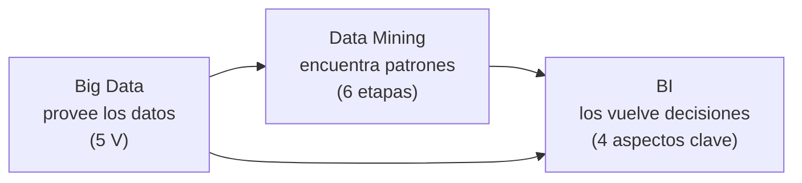

# 22 · Guía del Parcial 1: alcance, foco y práctica

> **Alcance:** entra **todo hasta el Día 3** (módulos 01–15). La lista puede ampliarse: si cambia, se actualiza la sección I y se registra en el [CHANGELOG](CHANGELOG.md).
> **Fuentes de las prioridades:** apunte de cursada (marca "PONER EN PARCIAL" y resaltados), notas de clase (`#importante` y "Posibles preguntas"), el TP del caso NEXA y el **parcial anterior** (caso Nokia).
>
> 🚨 **Parcial anterior:** hay alta probabilidad (7–8/10) de que el Parcial 1 sea igual o muy parecido al de la cursada anterior. Está **resuelto pregunta por pregunta** en [23 · Parcial anterior resuelto](23-parcial-anterior-nokia.md), con un plan de 4 h + repaso. **Si tenés poco tiempo, empezá por ahí.**
> **Tiempo estimado:** ~14 h para los 15 módulos + 2 h de práctica (secciones VI–VIII).

---

## 🗺️ Esquema del tema

- **I. Alcance del Parcial 1**
- **II. Orden y plan de estudio**
- **III. Señales de prioridad** (de dónde sale cada marca 🔥)
- **IV. Mapa de prioridades por módulo**
- **V. Lo que tenés que poder citar y desarrollar**
- **VI. Posibles preguntas, resueltas**
  1. ¿Qué es un MVP?
  2. Etapas del proceso creativo (citar y explicar)
- **VII. Práctica tipo caso (TP NEXA)**
- **VIII. Checklist de repaso final**
- **IX. Parcial anterior (caso Nokia)**

---

## I. Alcance del Parcial 1

| Estado | Clase | Módulos |
|---|---|---|
| ✅ Entra | **Clase 1** · Escandell | [01](01-tecnologia-e-innovacion-fundamentos.md) · [02](02-impactos-y-desafios.md) · [03](03-tecnologias-disruptivas.md) |
| ✅ Entra | **Clase 2** · Barrios | [07](07-empresas-unicornio.md) · [08](08-curvas-de-la-tecnologia.md) · [09](09-schumpeter-destruccion-creativa-y-ciclos.md) · [10](10-gestion-de-la-innovacion.md) |
| ✅ Entra | **Clase 3** · Escandell (datos) | [04](04-business-intelligence.md) · [05](05-data-mining.md) · [06](06-big-data.md) |
| ✅ Entra | **Día 3** | [11](11-creatividad-y-proceso-creativo.md) · [12](12-innovacion-tecnologica-e-ia.md) · [13](13-design-thinking.md) · [14](14-innovacion-abierta.md) · [15](15-entornos-vica-y-vani.md) |
| ✅ Entra (concepto) | — | **MVP** (se desarrolla en [17](17-lean-startup.md)): lo menciona el Día 3, está en las posibles preguntas y es la **pregunta 10 del parcial anterior**. Ver VI.1 y [23](23-parcial-anterior-nokia.md) V.10. De Lean Startup alcanza con MVP, construir-medir-aprender, iterar y pivotar. |
| ⏳ Por ahora no entra | Proyecto de innovación · KPI & OKR | [16](16-proyectos-y-estrategia-de-innovacion.md) · [17](17-lean-startup.md) · [18](18-kpi.md) · [19](19-okr.md) |

> 💡 Si el alcance se amplía, alcanza con mover la fila de ⏳ a ✅, sumar el bloque a la sección II y registrar el cambio en el CHANGELOG.

---

## II. Orden y plan de estudio

> 🎯 **Para el Parcial 1 de mañana, seguí la [Ruta al Parcial 1](README.md#-ruta-al-parcial-1-empezá-acá) del README** (≈ 5 h en 16 pasos, armada sobre el parcial anterior). El plan de abajo, de 6 sesiones y ~16 h, es para estudiar **todo** el temario con tiempo (por ejemplo, para el recuperatorio o el final).

Estudiá **en el orden de las clases**, no en el orden numérico de los archivos. Cada sesión cierra con la autoevaluación de sus módulos.

| Sesión | Bloque | Módulos (en orden) | Tiempo aprox. | Foco |
|---|---|---|---|---|
| 1 | Clase 1 · base conceptual | 01 → 02 → 03 | 2 h 40 | Definiciones de tecnología, innovación y disrupción; la pregunta de apertura. |
| 2 | Clase 2 · dinámica y gestión | 07 → 08 → 09 → 10 | 3 h 30 | Es lo que más pregunta el TP: curvas, Schumpeter, Doblin, Gestión 2.0. |
| 3 | Clase 3 · datos | 04 → 05 → 06 | 2 h 40 | Marcado `#importante`; ojo con la diapositiva que mezcla Big Data y Data Mining. |
| 4 | Día 3 (I) · crear e innovar | 11 → 12 → 13 | 3 h | Etapas del proceso creativo y MVP (posibles preguntas). |
| 5 | Día 3 (II) · ecosistema | 14 → 15 | 2 h | Innovación abierta, CVC, VICA vs. VANI. |
| 6 | Práctica | VI → VII → VIII | 2 h | Responder escribiendo, con el formato citar y explayarse. |

> ⚠️ **Si tenés poco tiempo:** leé el **esquema** y los bloques **📝** de cada módulo, priorizá lo marcado con 🔥 en la sección IV y hacé la práctica VI–VII. Es mejor cubrir todo el alcance con profundidad media que dejar un bloque entero sin ver.

---

## III. Señales de prioridad

| Señal | Dónde aparece | Qué marca |
|---|---|---|
| **"PONER EN PARCIAL"** | Apunte de cursada | **Aspectos clave de BI** (proceso, objetivo, componentes, herramientas). |
| **Resaltado** | Apunte de cursada | **Data Mining**: objetivos (predicción, segmentación, detección de fraude), *para qué sirve* (los mismos tres) y sus 3 características. |
| `#importante` | Notas · Clase 1 | **Tecnología e innovación** (relación tripartita) y la pregunta **"¿La tecnología mejoró la vida de las personas?"**. |
| `#importante` | Notas · Clase 2 | **Gestión de la innovación** (Doblin + Gestión 2.0). |
| `#importante` | Notas · repaso previo al parcial | **Data Mining** y **Big Data**. |
| **"Posibles preguntas"** | Notas de clase | **¿Qué es un MVP?** · **Etapas del proceso creativo, citar y explicar.** |
| **Parcial anterior** | Examen de la cursada anterior | 5 preguntas teóricas (creatividad vs. innovación, Big Data + 5V, BI vs. Data Mining, Design Thinking, Doblin) + 5 sobre el **caso Nokia** (curva S, disrupción y Schumpeter, Gestión 2.0, opinión pública, MVP). Resuelto en [23](23-parcial-anterior-nokia.md). |
| **TP caso NEXA** | Trabajo práctico | 15 preguntas sobre curva S, Gartner, adopción, Schumpeter, Doblin, Gestión 2.0 y opinión pública: muestra el **formato probable** (aplicar conceptos a un caso). |

> ⚠️ **Ojo con la lectura:** que un tema del Día 3 tenga pocas marcas **no significa que no se evalúe**: entra igual. Las marcas solo indican dónde poner **más** horas.

---

## IV. Mapa de prioridades por módulo

| Módulo | Señal | Qué priorizar |
|---|---|---|
| [01 Tecnología e innovación](01-tecnologia-e-innovacion-fundamentos.md) | 🔥 | Definiciones de tecnología / innovación / innovación tecnológica · *"una tecnología que no se utiliza no es innovación"* · relación tripartita (motor → proceso → campo de aplicación) · la pregunta de apertura. |
| [02 Impactos y desafíos](02-impactos-y-desafios.md) | — | Impactos en sociedad y empresas · los 6 desafíos · ROI **a largo plazo**. |
| [03 Tecnologías disruptivas](03-tecnologias-disruptivas.md) | síntesis de clase | Definición (**cambio de paradigma**, deja obsoleta a la anterior, **cambio brusco**) · 5 características · 7 pasos de implementación · **I+D+i**. |
| [07 Unicornios](07-empresas-unicornio.md) | TP (preg. 14) | Definición con sus 3 condiciones · factores que mueven la valuación · caso Facebook. |
| [08 Curvas de la tecnología](08-curvas-de-la-tecnologia.md) | 🔥 TP (preg. 1–5) | 3 fases de la curva S y el **salto entre curvas** · 5 fases de Gartner · % y perfiles de la curva de adopción. |
| [09 Schumpeter](09-schumpeter-destruccion-creativa-y-ciclos.md) | TP (preg. 6) | Destrucción creativa · emprendedores en grupos · 5 tipos de innovación · ciclos. |
| [10 Gestión de la innovación](10-gestion-de-la-innovacion.md) | 🔥🔥 `#importante` + TP (preg. 8–13) | 10 tipos de Doblin en 3 categorías · 6 pilares de la Gestión 2.0 · **piramidal vs. red** · fracaso · trabajo interdisciplinario. |
| [04 Business Intelligence](04-business-intelligence.md) | 🔥🔥 | **Los 4 aspectos clave** ("PONER EN PARCIAL") · definición · para qué sirve. |
| [05 Data Mining](05-data-mining.md) | 🔥🔥 | Objetivos resaltados · **proceso de 6 etapas en orden** · técnicas predictivas vs. descriptivas. |
| [06 Big Data](06-big-data.md) | 🔥 | **Las 5 V** · **tabla Big Data vs. Data Mining** · ⚠️ objetivos de la diapositiva que en rigor son de Data Mining (III.+). |
| [11 Creatividad](11-creatividad-y-proceso-creativo.md) | 🔥 posibles preguntas | **Etapas del proceso creativo** · creatividad vs. innovación · importancia (incluye el **MVP**) · técnicas. |
| [12 Innovación tecnológica e IA](12-innovacion-tecnologica-e-ia.md) | — | Definición (Día 3) · características · 10 problemas de innovar · IA (evolución y transversalidad). |
| [13 Design Thinking](13-design-thinking.md) | — | Definición · **5 etapas** y que es iterativo · deseable / factible / viable. |
| [14 Innovación abierta](14-innovacion-abierta.md) | — | Chesbrough · embudo cerrado vs. perforado · las 3 verdades · propiedad intelectual flexible · **CVC**. |
| [15 VICA y VANI](15-entornos-vica-y-vani.md) | — | Las 4 letras de cada uno · por qué VICA quedó corto · innovación abierta como resiliencia colectiva. |

---

## V. Lo que tenés que poder citar y desarrollar

> 📝 El profesor pidió **no citar a secas, sino citar y explayarse**. Para cada definición: **(1)** citá la idea central de la cátedra, **(2)** explicá con tus palabras qué significa, **(3)** dá un ejemplo, **(4)** relacionala con otro concepto. Cada módulo tiene bloques 📝 con el párrafo modelo.

1. **Tecnología** – aplicación del conocimiento científico para crear herramientas y procesos que resuelven problemas. → [01](01-tecnologia-e-innovacion-fundamentos.md)
2. **Innovación** – aplicación práctica y exitosa de nuevas ideas tecnológicas para mejorar la eficiencia o crear nuevas oportunidades. → [01](01-tecnologia-e-innovacion-fundamentos.md)
3. **Tecnologías disruptivas** – innovaciones que transforman radicalmente industrias, mercados y comportamientos sociales, desplazando sistemas o productos establecidos (**cambio de paradigma**). → [03](03-tecnologias-disruptivas.md)
4. **Curva S** – cómo evolucionan las tecnologías y cómo las nuevas desplazan a las existentes: despegue lento, crecimiento acelerado, saturación. → [08](08-curvas-de-la-tecnologia.md)
5. **Destrucción creativa** – el proceso de transformación que acompaña a la innovación. → [09](09-schumpeter-destruccion-creativa-y-ciclos.md)
6. **BI** – conjunto de tecnologías, procesos y herramientas que transforman datos brutos en información significativa y accionable. **+ los 4 aspectos clave.** → [04](04-business-intelligence.md)
7. **Data Mining** – proceso técnico y automatizado que analiza grandes volúmenes de información para descubrir patrones, tendencias, anomalías y correlaciones ocultas. **+ las 6 etapas.** → [05](05-data-mining.md)
8. **Big Data** – conjuntos de datos tan masivos, rápidos y complejos que las herramientas tradicionales no pueden procesarlos. **+ las 5 V.** → [06](06-big-data.md)
9. **Proceso creativo** – conjunto estructurado de fases (preparación, incubación, iluminación, verificación y difusión) para generar soluciones originales. → [11](11-creatividad-y-proceso-creativo.md)
10. **Design Thinking** – metodología centrada en el ser humano para resolver problemas complejos y fomentar la innovación. → [13](13-design-thinking.md)
11. **Innovación abierta / CVC** – el conocimiento útil está distribuido; la empresa coopera hacia adentro y hacia afuera, y el CVC es su cartera de inversiones en startups. → [14](14-innovacion-abierta.md)

---

## VI. Posibles preguntas, resueltas

> Salen de la nota "Posibles preguntas". Cuando aparezcan nuevas, se agregan acá con el mismo formato: **qué dice la cátedra → respuesta modelo → trampas**.

### VI.1 ¿Qué es un MVP?

**Qué dice la cátedra:**
- 📌 Día 3, *importancia del proceso creativo*: *"**Experimentación y Mejora:** Fomenta un entorno de 'prueba y error' (**MVP**), permitiendo que la innovación tecnológica ocurra a través de **prototipos** y la **mejora continua**."*
- 📌 Presentación de Proyecto de innovación (Lean Startup), donde se desarrolla: *"Construcción del **producto mínimo viable según hipótesis**"* y *"tras el lanzamiento al mercado del producto mínimo para testarlo, se **recopila y analiza el feedback** aportado por los usuarios. Después, se **adapta el producto**."*

> 📝 **Citar y explayarse:** El MVP (*Minimum Viable Product*, producto mínimo viable) es la **versión más simple de un producto que permite probar una hipótesis con usuarios reales**. La cátedra lo presenta al explicar la importancia del proceso creativo: fomenta *"un entorno de 'prueba y error'"* que permite que la innovación ocurra *"a través de prototipos y la mejora continua"*. "Mínimo" no significa mal hecho, sino **lo justo para aprender**: en lugar de invertir meses en un producto completo que quizás nadie quiere, se lanza algo básico, se mide cómo reaccionan los usuarios y se ajusta. En Lean Startup se construye *"según hipótesis"* y, una vez lanzado, *"se recopila y analiza el feedback"* para adaptar el producto. Por ejemplo, antes de programar un sistema de turnos para gimnasios, se puede publicar una página con un botón de "reservá tu demo" y medir cuántos dueños se interesan. El MVP conecta con la etapa de **verificación** del proceso creativo, con **prototipar y testear** de Design Thinking y con la reducción del **riesgo** propio de innovar.

> ⚠️ **Trampas:** el MVP **no es** un prototipo que nunca sale del laboratorio (tiene que probarse **con usuarios reales**) ni la versión final "barata" del producto. "Viable" significa que se puede usar y aporta algo de valor, aunque sea mínimo.

### VI.2 Etapas del proceso creativo (citar y explicar)

> 📌 *"El proceso creativo en tecnología e innovación es un **conjunto estructurado de fases** (preparación, incubación, iluminación, verificación y difusión) destinado a **generar soluciones originales a problemas**, utilizando la tecnología para **transformar ideas en productos o servicios de alto valor**."*

| # | Etapa | Qué dice la cátedra | Qué significa | 🧩 Ejemplo: app de turnos para un club |
|---|---|---|---|---|
| 1 | **Preparación** | *"Investigación del problema, estudio del contexto y definición del reto."* | No se crea en el vacío: primero hay que entender bien qué se quiere resolver. | Entrevistás a socios y al encargado: los turnos se piden por WhatsApp y se superponen. |
| 2 | **Incubación** | *"Procesamiento mental de la información, maduración de ideas (muchas veces de forma inconsciente)."* | Tomar distancia deja que la mente conecte la información de formas nuevas. | Dejás el problema "reposar" unos días. |
| 3 | **Iluminación** | *"'Momento Eureka' donde surge la idea o solución innovadora."* | Aparece la idea, pero todavía no está probada. | "¿Y si los turnos se liberan solos si no se confirman 2 h antes?" |
| 4 | **Verificación / validación** | *"Comprobación técnica de si la idea es funcional y eficaz."* | Se prueba que la idea funcione en la realidad. | Prototipo en Figma probado con 5 socios. |
| 5 | **Adaptación y difusión** | *"Ajuste del prototipo y comercialización o implementación."* | La idea se corrige y se pone en uso: recién acá pasa a ser innovación. | Corregís lo que no se entendió y lanzás la app en el club. |

> 📝 **Citar y explayarse:** La cátedra define el proceso creativo como *"un conjunto estructurado de fases"* destinado a *"generar soluciones originales a problemas"*. Empieza con la **preparación**, que es la *"investigación del problema, estudio del contexto y definición del reto"*: sin entender bien el problema, cualquier idea es un tiro al aire. Sigue la **incubación**, el *"procesamiento mental de la información"* que muchas veces ocurre de forma inconsciente, cuando uno se aleja del problema y la mente hace nuevas conexiones. De ahí surge la **iluminación**, el *"momento Eureka"* en que aparece la idea. Pero una idea no alcanza: la **verificación** comprueba *"si la idea es funcional y eficaz"*, por ejemplo con un prototipo, y la **adaptación y difusión** ajusta ese prototipo y lo lleva a la *"comercialización o implementación"*. Esta última etapa es la que conecta la creatividad con la innovación: una idea que no se implementa no genera valor. Por eso el proceso muestra que la creatividad **se puede gestionar** y no depende solo de la inspiración.

> ⚠️ **Trampas:** (1) la iluminación **no es el final**: sin verificación ni difusión no hay innovación. (2) No confundir las **etapas** (5) con las **reglas** del proceso creativo (divergencia, investigación, incubación, iteración, enfoque al usuario, colaboración…). (3) Si te piden "citar y explicar", cada etapa necesita **su cita + qué significa**, no solo el nombre.

---

## VII. Práctica tipo caso (TP NEXA)

El TP del caso NEXA es el mejor simulacro: es un caso donde hay que **aplicar** conceptos. Qué módulo practica cada pregunta del TP:

| Preguntas del TP | Concepto | Módulo |
|---|---|---|
| 1, 2 | Curva S de Christensen | [08](08-curvas-de-la-tecnologia.md) |
| 3 | Desplazamiento de tecnologías (disrupción desde abajo) | [03](03-tecnologias-disruptivas.md) · [08](08-curvas-de-la-tecnologia.md) |
| 4 | Ciclo de expectativas de Gartner | [08](08-curvas-de-la-tecnologia.md) |
| 5 | Curva de adopción tecnológica | [08](08-curvas-de-la-tecnologia.md) |
| 6 | Schumpeter y destrucción creativa | [09](09-schumpeter-destruccion-creativa-y-ciclos.md) |
| 8, 12 | Corto plazo vs. innovación de largo plazo | [10](10-gestion-de-la-innovacion.md) · [02](02-impactos-y-desafios.md) |
| 9 | 10 tipos de Doblin | [10](10-gestion-de-la-innovacion.md) |
| 10, 11, 13 | Trabajo interdisciplinario · estructura en red · fracaso | [10](10-gestion-de-la-innovacion.md) |
| 14 | Opinión pública, reputación y valuación | [07](07-empresas-unicornio.md) |
| 7, 15 | Integradoras | Todo lo anterior |

El TP **no cubre** la Clase 3 ni el Día 3. Para practicarlos con el mismo caso:

**1. NEXA Vision usa IA y análisis predictivo para anticipar la demanda. ¿Qué parte del proyecto es Big Data, qué parte es Data Mining y dónde entra BI?**

Guía de respuesta

**Big Data** es la infraestructura que recolecta y procesa los datos de ventas, stock y consumo de miles de comercios (volumen, velocidad, variedad; la **veracidad** importa porque "en otras situaciones los resultados eran poco confiables"). **Data Mining** es el análisis que descubre patrones y **predice** la demanda (modelado predictivo, objetivo de DM). **BI** es lo que le muestra al comercio esa información como decisiones accionables (qué comprar, cuánto stock, cuándo cambiar precios) en dashboards. Cerrá con la tabla Big Data vs. Data Mining ([06](06-big-data.md), VII) y con la **ética** del uso de datos, que conecta con la crisis de reputación del caso ([05](05-data-mining.md) XI, [07](07-empresas-unicornio.md)).

**2. Aplicá las 5 etapas de Design Thinking para rediseñar NEXA Vision pensando en los pequeños comercios que eligieron ORBIT.**

Guía de respuesta

**Empatizar**: entrevistar y observar a pequeños comercios (¿por qué ORBIT les resulta más fácil?). **Definir**: el reto real (por ejemplo, "anticipar la demanda sin tener que aprender un sistema completo"). **Idear**: muchas soluciones sin juzgar (versión liviana, integración con WhatsApp…). **Prototipar**: versiones rápidas y baratas. **Testear** con usuarios reales y volver a etapas anteriores si hace falta. Remarcá que es **centrado en el ser humano** y que la solución tiene que ser deseable, factible y viable ([13](13-design-thinking.md)).

**3. ¿Cómo podría NEXA usar la innovación abierta para responder a ORBIT?**

Guía de respuesta

Partí de la premisa de Chesbrough (*el conocimiento útil está distribuido*; ninguna empresa puede *monopolizar todo el talento*). **Inbound**: incorporar tecnología externa (asociarse con o invertir en startups de IA, licenciar modelos). **Outbound**: licenciar o separar tecnologías que NEXA no explota. **CVC**: una cartera de inversiones en varias startups para ver antes qué tecnologías despegan, en lugar de apostar todo a un solo laboratorio interno. Vinculalo con que NEXA dejó de ser un equipo interdisciplinario y se volvió una **isla tecnológica** ([14](14-innovacion-abierta.md)).

**4. ¿El entorno de NEXA se describe mejor como VICA o como VANI? Justificá con rasgos del caso.**

Guía de respuesta

Hay rasgos de ambos, pero el caso tiene elementos VANI: **frágil** (una empresa que crece en ingresos pierde valuación de golpe por una controversia), **no lineal** (un producto "demasiado básico" como ORBIT se vuelve amenaza; una investigación periodística, sin ninguna infracción comprobada, hace caer la valuación) y **ansioso** (presión trimestral, debates sin decisión). La respuesta VANI es la resiliencia mediante redes e innovación abierta, no solo la agilidad que propone VICA ([15](15-entornos-vica-y-vani.md)).

**5. El comité de NEXA necesita ideas para responder a ORBIT. Proponé cómo usar el proceso creativo y una técnica concreta.**

Guía de respuesta

Recorré las **5 etapas** (preparación con datos del mercado e informe sobre ORBIT, incubación, iluminación, verificación con prototipo, difusión) y aplicá **SCAMPER** a la plataforma actual: *eliminar* módulos para una versión liviana, *adaptar* la predicción de NEXA Vision a comercios chicos, *combinar* con canales simples. Mencioná el **brainwriting** como forma de evitar la censura en una organización que se volvió jerárquica ([11](11-creatividad-y-proceso-creativo.md)).

---

## VIII. Checklist de repaso final

**Clase 1**
- [ ] Puedo explicar por qué *"una tecnología que no se utiliza no es innovación"*.
- [ ] Respondo la pregunta de apertura con estructura: definición → impactos → desafíos → conclusión.
- [ ] Recito la definición de tecnología disruptiva y sus 5 características en orden.
- [ ] Sé qué hace una empresa para no quedar desplazada (I+D+i) y lo relaciono con la curva S.

**Clase 2**
- [ ] Ubico una tecnología en la curva S con evidencia y explico el salto entre curvas.
- [ ] Recorro las 5 fases de Gartner y los 5 grupos de la curva de adopción con sus %.
- [ ] Explico la destrucción creativa con un ejemplo de qué se crea y qué se destruye.
- [ ] Ubico los 10 tipos de Doblin en Configuración / Oferta / Experiencia.
- [ ] Explico por qué la estructura piramidal frena la innovación y qué propone el modelo en red.

**Clase 3**
- [ ] Escribo los 4 aspectos clave del BI sin mirar.
- [ ] Ordeno las 6 etapas de Data Mining y explico por qué van en ese orden.
- [ ] Nombro las 5 V y digo cuál es la más importante (**Valor**).
- [ ] Explico por qué varios "objetivos de Big Data" de la diapositiva son, en rigor, Data Mining (y qué aporta Big Data en cada uno).
- [ ] Completo la tabla Big Data vs. Data Mining (definición, objetivo, enfoque, ejemplo Netflix).

**Día 3**
- [ ] Cito y explico las 5 etapas del proceso creativo.
- [ ] Defino MVP y lo relaciono con prototipar, verificar y reducir el riesgo.
- [ ] Diferencio creatividad de innovación tecnológica.
- [ ] Recorro las 5 etapas de Design Thinking y explico por qué es iterativo.
- [ ] Explico el embudo cerrado vs. el perforado y qué es una cartera de CVC.
- [ ] Diferencio VICA de VANI letra por letra.

---

## IX. Parcial anterior (caso Nokia)

El examen de la cursada anterior está transcripto en [casos/parcial-anterior-nokia.md](casos/parcial-anterior-nokia.md) y **resuelto** en [23 · Parcial anterior resuelto](23-parcial-anterior-nokia.md).

| Pregunta | Tema | Módulos | Resolución |
|---|---|---|---|
| 1 | Innovación tecnológica vs. creatividad | [11](11-creatividad-y-proceso-creativo.md) · [01](01-tecnologia-e-innovacion-fundamentos.md) | [23](23-parcial-anterior-nokia.md) III.1 |
| 2 | Big Data y las 5 V | [06](06-big-data.md) | III.2 |
| 3 | BI vs. Data Mining | [04](04-business-intelligence.md) · [05](05-data-mining.md) | III.3 |
| 4 | Design Thinking + etapas | [13](13-design-thinking.md) | III.4 |
| 5 | 10 tipos de Doblin (3 categorías) | [10](10-gestion-de-la-innovacion.md) | III.5 |
| 6 | Curva S aplicada a Nokia | [08](08-curvas-de-la-tecnologia.md) · [03](03-tecnologias-disruptivas.md) | V.6 |
| 7 | Disrupción y destrucción creativa | [03](03-tecnologias-disruptivas.md) · [09](09-schumpeter-destruccion-creativa-y-ciclos.md) | V.7 |
| 8 | Gestión 2.0 e interdisciplina | [10](10-gestion-de-la-innovacion.md) | V.8 |
| 9 | Opinión pública, desarrolladores y valuación | [07](07-empresas-unicornio.md) | V.9 |
| 10 | MVP | [17](17-lean-startup.md) · VI.1 de esta guía | V.10 |

> 💡 **Qué cambia en la estrategia:** las preguntas del parcial anterior pasan a ser **lo primero que se estudia**; el resto del temario (checklist VIII) queda como cobertura para el 20–30 % que puede variar.

---

[← 21 Preguntas integradoras](21-preguntas-integradoras.md) · [🏠 Índice](README.md) · [Siguiente → 23 Parcial anterior resuelto](23-parcial-anterior-nokia.md)
