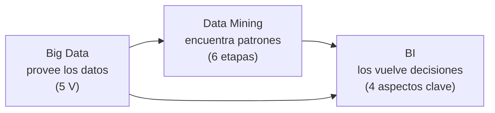

# 22 · Foco de parcial: qué se marcó como importante

> **Fuente:** señales de prioridad tomadas del **apunte de cursada** (PDF *Tecnología e Innovación*, Clases 1 y 2: marca "PONER EN PARCIAL" y textos resaltados) y de las **notas de clase** (etiquetas `#importante`).
> **Para qué sirve:** ordenar el repaso final. No reemplaza a los módulos: te dice **dónde poner más horas**.
> **Tiempo estimado:** 15 min (+ el repaso de cada módulo marcado).

---

## 🗺️ Esquema del tema

- **I. Señales de prioridad** (de dónde sale cada marca 🔥)
- **II. Mapa de prioridades por módulo**
- **III. Lo que tenés que poder escribir casi textual**
- **IV. Preguntas probables**
- **V. Checklist de repaso final**

---

## I. Señales de prioridad

| Señal | Dónde aparece | Qué marca |
|---|---|---|
| **"PONER EN PARCIAL"** | Apunte de cursada | **Aspectos clave de BI** (proceso, objetivo, componentes, herramientas). |
| **Resaltado** | Apunte de cursada | **Data Mining**: objetivos (predicción, segmentación, detección de fraude), *para qué sirve* (los mismos tres) y sus 3 características. |
| `#importante` | Notas · Clase 1 | **Tecnología e innovación** (relación tripartita) y la pregunta **"¿La tecnología mejoró la vida de las personas?"**. |
| `#importante` | Notas · Clase 2 | **Gestión de la innovación** (Doblin + Gestión 2.0). |
| `#importante` | Notas · repaso previo al parcial | **Data Mining** y **Big Data**. |

> ⚠️ **Ojo con la lectura:** las notas y el apunte cubren las **primeras clases** (módulos 01–11). Que un tema posterior (Design Thinking, Lean Startup, KPI, OKR…) no tenga 🔥 **no significa que no se evalúe**: solo que no hay marcas registradas sobre él.

---

## II. Mapa de prioridades por módulo

| Módulo | Señal | Qué priorizar |
|---|---|---|
| [01 Tecnología e innovación](01-tecnologia-e-innovacion-fundamentos.md) | 🔥 | Definiciones de tecnología / innovación / innovación tecnológica · *"una tecnología que no se utiliza no es innovación"* · relación tripartita (motor → proceso → campo de aplicación) · la pregunta de apertura. |
| [03 Tecnologías disruptivas](03-tecnologias-disruptivas.md) | síntesis de clase | Definición (**cambio de paradigma**, deja obsoleta a la anterior, **cambio brusco**) · 5 características · 7 pasos de implementación · cómo no quedar desplazado (**I+D+i**). |
| [04 Business Intelligence](04-business-intelligence.md) | 🔥🔥 | **Los 4 aspectos clave** ("PONER EN PARCIAL") · definición · para qué sirve. |
| [05 Data Mining](05-data-mining.md) | 🔥🔥 | Objetivos resaltados · **proceso de 6 etapas en orden** · técnicas predictivas vs. descriptivas. |
| [06 Big Data](06-big-data.md) | 🔥 | **Las 5 V** · **tabla Big Data vs. Data Mining** · integración BI + DM + BD. |
| [08 Curvas de la tecnología](08-curvas-de-la-tecnologia.md) | visto en Clase 2 | 3 fases de la curva S · 5 fases de Gartner · % de la curva de adopción. |
| [10 Gestión de la innovación](10-gestion-de-la-innovacion.md) | 🔥 | 10 tipos de Doblin en 3 categorías · 6 pilares de la Gestión 2.0 · **piramidal vs. red**. |
| 02, 07, 09, 11–19 | sin marca | Estudiarlos normalmente con su módulo. |

---

## III. Lo que tenés que poder escribir casi textual

1. **Tecnología** – aplicación del conocimiento científico para crear herramientas y procesos que resuelven problemas. → [01](01-tecnologia-e-innovacion-fundamentos.md)
2. **Innovación** – aplicación práctica y exitosa de nuevas ideas tecnológicas para mejorar la eficiencia o crear nuevas oportunidades (introducir cambios significativos, nuevos o mejorados, para generar valor y satisfacer necesidades). → [01](01-tecnologia-e-innovacion-fundamentos.md)
3. **Tecnologías disruptivas** – innovaciones que transforman radicalmente industrias, mercados y comportamientos sociales, desplazando sistemas o productos establecidos (**cambio de paradigma**). → [03](03-tecnologias-disruptivas.md)
4. **BI** – conjunto de tecnologías, procesos y herramientas que transforman datos brutos en información significativa y accionable. **+ los 4 aspectos clave.** → [04](04-business-intelligence.md)
5. **Data Mining** – proceso técnico y automatizado que analiza grandes volúmenes de información para descubrir patrones, tendencias, anomalías y correlaciones ocultas. **+ las 6 etapas.** → [05](05-data-mining.md)
6. **Big Data** – conjuntos de datos tan masivos, rápidos y complejos que las herramientas tradicionales no pueden procesarlos. **+ las 5 V.** → [06](06-big-data.md)

---

## IV. Preguntas probables

- *"La tecnología mejoró la vida de las personas. ¿Por qué?"* → [21](21-preguntas-integradoras.md), pregunta 11.
- *"Compare Big Data y Data Mining"* → tabla del módulo [06](06-big-data.md), sección VII.
- *"Enumere y explique los aspectos clave del BI"* → módulo [04](04-business-intelligence.md), sección II.
- *"Describa el proceso de minería de datos"* → módulo [05](05-data-mining.md), sección VI (el orden importa).
- *"¿Qué propone la Gestión de la Innovación 2.0?"* → módulo [10](10-gestion-de-la-innovacion.md), sección III.A.
- Integradora de datos → [21](21-preguntas-integradoras.md), pregunta 4.

---

## V. Checklist de repaso final

- [ ] Puedo explicar por qué *"una tecnología que no se utiliza no es innovación"*.
- [ ] Respondo la pregunta de apertura con estructura: definición → impactos → desafíos → conclusión.
- [ ] Recito la definición de tecnología disruptiva y sus 5 características en orden.
- [ ] Sé qué hace una empresa para no quedar desplazada (I+D+i) y lo relaciono con la curva S.
- [ ] Escribo los 4 aspectos clave del BI sin mirar.
- [ ] Ordeno las 6 etapas de Data Mining y explico por qué van en ese orden.
- [ ] Nombro las 5 V y digo cuál es la más importante (**Valor**).
- [ ] Completo la tabla Big Data vs. Data Mining (definición, objetivo, enfoque, ejemplo Netflix).
- [ ] Ubico los 10 tipos de Doblin en Configuración / Oferta / Experiencia.
- [ ] Explico por qué la estructura piramidal frena la innovación y qué propone el modelo en red.

---

[← 21 Preguntas integradoras](21-preguntas-integradoras.md) · [🏠 Índice](README.md)
