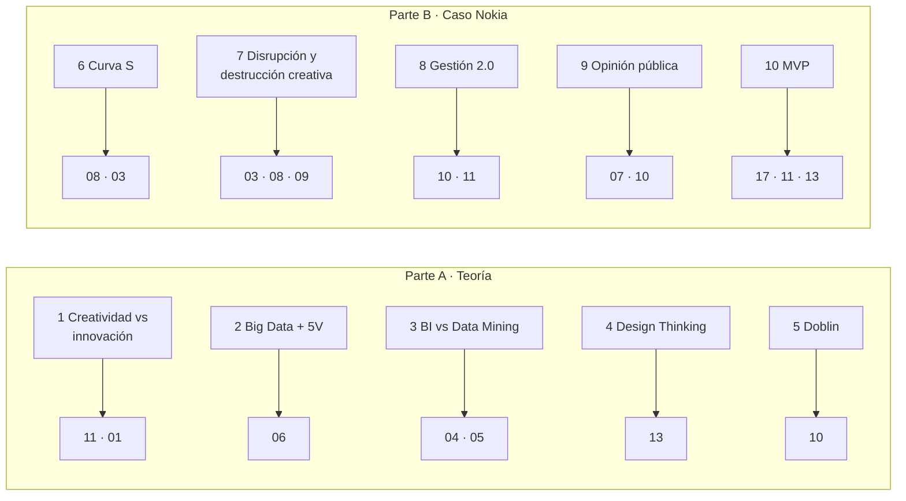
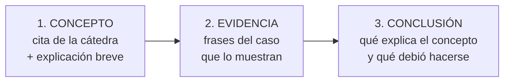
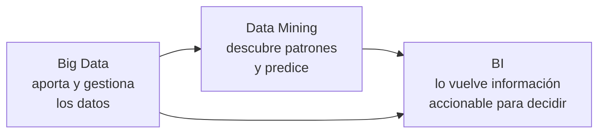
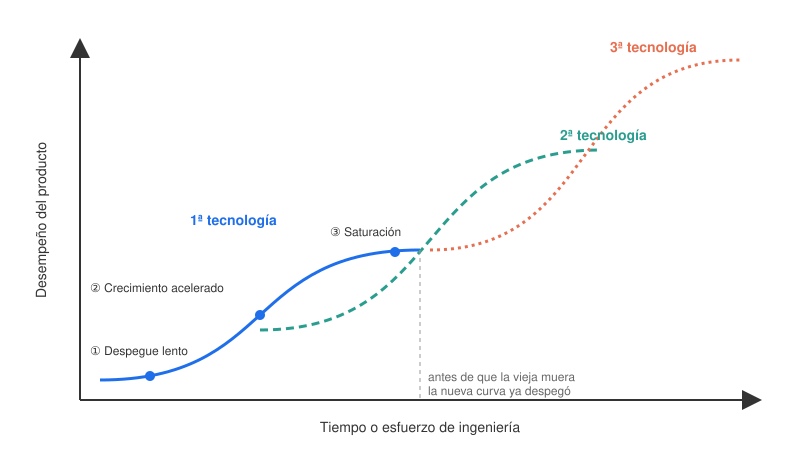
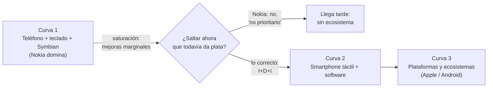
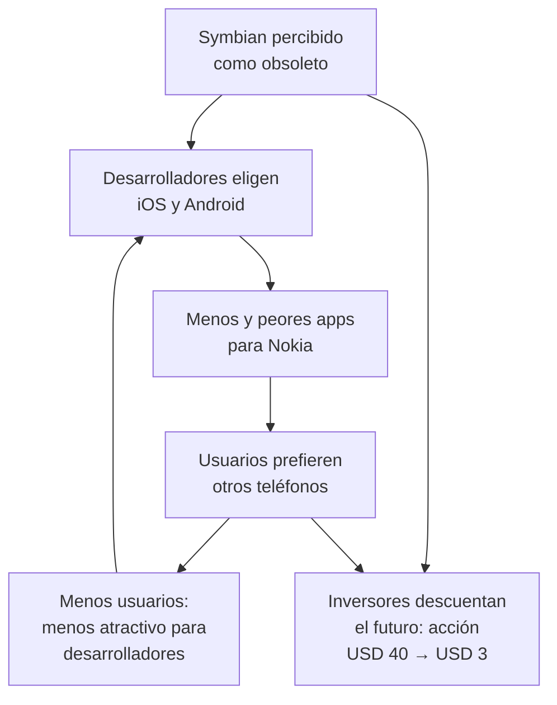
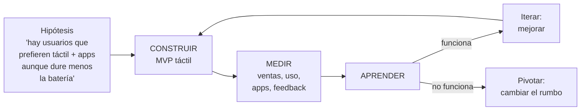

# 23 · Parcial anterior resuelto: caso Nokia vs. Apple

> **Qué es:** el parcial que tomó la cátedra en la cursada anterior. Hay **alta probabilidad (7–8 sobre 10)** de que el Parcial 1 sea igual o muy parecido, así que este módulo tiene **las 10 preguntas resueltas** con el formato que pidió el profesor: **citar y explayarse**.
> **Fuentes:** enunciado del parcial anterior ([casos/parcial-anterior-nokia.md](casos/parcial-anterior-nokia.md)) · caso Nokia de la cátedra ([casos/nokia-caso-catedra.md](casos/nokia-caso-catedra.md)) · módulos 01–17.
> **Tiempo estimado:** 4 h (ver el plan en la sección VIII).
> **Prerrequisitos:** ninguno obligatorio: cada respuesta te dice de qué módulo sale, por si te falta base.

---

## 🗺️ Esquema del tema

- **I. Cómo está armado el examen**
- **II. Método para responder**
  - A. Preguntas teóricas (Parte A)
  - B. Preguntas de caso (Parte B)
- **III. Parte A · Teoría**
  1. Innovación tecnológica vs. creatividad
  2. Big Data y las 5 V
  3. Business Intelligence vs. Data Mining
  4. Design Thinking y sus etapas
  5. Los 10 tipos de innovación de Doblin
- **IV. El caso Nokia en 5 minutos**
  - A. Línea de tiempo
  - B. Los tres bandos internos
  - C. Lo que agrega la versión larga de la cátedra
  - D. La tesis del caso
- **V. Parte B · Aplicación al caso**
  6. Curva S: por qué "cuidar lo que deja plata hoy" sentenció a Nokia
  7. Por qué lo "inferior" termina siendo destrucción creativa
  8. Gestión de la innovación 2.0: juntar jefes ≠ interdisciplina
  9. Opinión pública, desarrolladores y valuación
  10. MVP: cómo pudo validar Nokia un teléfono táctil
- **VI. Si cambian las preguntas: variantes con el mismo caso**
- **VII. Si cambian el caso: Kodak, BlackBerry o NEXA**
- **VIII. Plan de estudio: 4 h hoy + repaso mañana**
- **IX. Simulacro y checklist**

---

## 🧠 Mapa visual: qué módulo responde cada pregunta

---

## 📖 Desarrollo

## I. Cómo está armado el examen

| Parte | Preguntas | Qué evalúa | Cómo se responde |
|---|---|---|---|
| **A · Teoría** | 1–5 | Definiciones y distinciones de la cátedra. | **Cita + explicación con tus palabras + ejemplo + relación**. |
| **B · Aplicación** | 6–10 | Usar un concepto para **explicar** lo que pasó en el caso. | **Concepto citado + evidencia del caso + conclusión**. |

> 💡 **Lo que más pesa:** 5 de las 10 preguntas son **del caso**. No alcanza con saber la teoría: hay que **usar frases del enunciado como evidencia**. El caso del examen es una versión corta del caso Nokia que la cátedra subió como material ([casos/nokia-caso-catedra.md](casos/nokia-caso-catedra.md)); leerlo antes te da argumentos extra.

> ⚠️ **Parte A también es "distinguir":** tres de las cinco preguntas teóricas piden **diferencias** (creatividad vs. innovación, BI vs. Data Mining) o **agrupaciones** (Doblin). Si solo definís cada concepto por separado sin marcar la diferencia, la respuesta queda incompleta.

---

## II. Método para responder

### II.A Preguntas teóricas (Parte A): las 4 C

1. **Citá** la definición de la cátedra (no hace falta que sea textual palabra por palabra, pero sí con sus términos clave).
2. **Comentá** qué significa con tus palabras: desarmá la definición y explicá cada término clave.
3. **Concretá** con un ejemplo.
4. **Conectá** con otro concepto de la materia (o con la diferencia que te piden).

### II.B Preguntas de caso (Parte B): C-E-C

> 📝 **Plantilla para el caso:** *"Según la cátedra, [concepto] es [cita]. Esto significa que [explicación]. En el caso Nokia se ve cuando [evidencia textual del caso]. Por lo tanto, [conclusión: por qué pasó / qué debió haber hecho Nokia]."*

> ⚠️ **El error más común en preguntas de caso:** contar el caso de nuevo sin usar el concepto, o explicar el concepto sin tocar el caso. La nota está en **el puente** entre los dos.

---

## III. Parte A · Teoría

### III.1 Diferencia entre innovación tecnológica y creatividad

**Qué pide:** dos definiciones **y** la diferencia entre ellas. → Módulos [11](11-creatividad-y-proceso-creativo.md) y [01](01-tecnologia-e-innovacion-fundamentos.md).

**Qué dice la cátedra:**
- 📌 Creatividad: *"capacidad de generar nuevas ideas, conceptos por medio de la creación, cambios y mejoras"* (Clase 2) · *"el acto de generar ideas originales"* (Día 3).
- 📌 Innovación tecnológica: *"el proceso de crear, mejorar o aplicar nuevas tecnologías para desarrollar productos, servicios o procesos más eficientes, funcionales o sostenibles"* (Día 3).
- 📌 La comparación de la cátedra: *"La creatividad es el acto de generar ideas originales, mientras que la innovación tecnológica es poner esas ideas en práctica usando la ciencia y las herramientas digitales para resolver problemas reales."*
- 📌 Clase 1: *"Una tecnología desarrollada que no se utiliza no es innovación."*

| | Creatividad | Innovación tecnológica |
|---|---|---|
| **Plano** | Las ideas. | La realidad: la idea implementada. |
| **Resultado** | Una idea original. | Un producto, servicio o proceso **que se usa** y genera valor. |
| **¿Necesita funcionar y venderse?** | No. | Sí: tiene que *"resolver problemas reales"*. |
| **Momento** | Punto de partida. | Paso a la práctica. |
| **En el proceso creativo** | Preparación, incubación, iluminación. | Verificación, adaptación y difusión. |

> 📝 **Respuesta modelo:** La cátedra define la creatividad como *"el acto de generar ideas originales"* o, en otra versión, como la *"capacidad de generar nuevas ideas, conceptos por medio de la creación, cambios y mejoras"*. La innovación tecnológica, en cambio, es *"el proceso de crear, mejorar o aplicar nuevas tecnologías para desarrollar productos, servicios o procesos más eficientes, funcionales o sostenibles"*; en palabras de la propia comparación de la cátedra, es *"poner esas ideas en práctica usando la ciencia y las herramientas digitales para resolver problemas reales"*. La diferencia está en el plano en que ocurre cada una. La creatividad vive en el plano de las **ideas**: es el punto de partida y todavía no necesita funcionar, venderse ni medirse. La innovación ocurre en el plano de la **realidad**: la idea se implementa, la gente la usa y genera valor. Por eso en la Clase 1 se insistió en que *"una tecnología desarrollada que no se utiliza no es innovación"*. La relación entre ambas es de secuencia: puede haber creatividad sin innovación (una buena idea que queda en un cajón), pero no innovación sin una idea creativa detrás. El proceso creativo muestra el puente: la preparación, la incubación y la iluminación generan la idea, y la verificación y la difusión la convierten en innovación. Imaginar un sistema de turnos que avise por WhatsApp es creatividad; desarrollarlo, implementarlo en una clínica y que los pacientes lo usen es innovación. El propio caso del examen lo ilustra: Nokia llegó a tener un prototipo táctil (hubo creatividad), pero al rechazarlo no lo convirtió en innovación.

**🧠 Esqueleto para memorizar:** creatividad = idea original (plano de las ideas) · innovación = idea puesta en práctica que resuelve problemas reales y genera valor · "tecnología que no se usa no es innovación" · creatividad sin innovación sí, al revés no · puente = proceso creativo (verificación y difusión) · ejemplo.

> ⚠️ **Trampas:** (1) No digas que son sinónimos ni que la innovación "es más creativa". (2) La innovación **no** exige un invento nuevo: también es *"mejorar o aplicar"* tecnologías existentes (Uber no inventó el GPS). (3) Que una idea sea muy original no la vuelve innovación si nadie la usa.

---

### III.2 Qué es Big Data y las 5 V

**Qué pide:** definición + las 5 V, cada una definida. → Módulo [06](06-big-data.md).

> 📌 *"El Big Data (o macrodatos) se refiere a conjuntos de datos tan masivos, rápidos y complejos que las herramientas tradicionales no pueden procesarlos. Estas tecnologías permiten recopilar, gestionar y analizar grandes volúmenes de información (estructurada y no estructurada) para identificar patrones, comportamientos y tendencias útiles."*

| V | Cita de la cátedra | Qué significa | 🧩 Ejemplo (streaming) |
|---|---|---|---|
| **Volumen** | *"la enorme cantidad de datos generados cada segundo, provenientes de redes sociales, sensores, transacciones y más, alcanzando escalas de exabytes"* | Tantos datos que no entran en una base tradicional. | Cada reproducción, pausa y búsqueda de millones de usuarios. |
| **Velocidad** | *"el ritmo acelerado al que se reciben y deben procesar los datos, a menudo en tiempo real, para tomar decisiones inmediatas"* | No alcanza con guardarlos: hay que procesarlos mientras llegan. | Recomendaciones que cambian mientras mirás. |
| **Variedad** | *"múltiples formatos: estructurados, semiestructurados y no estructurados (videos, audios, correos electrónicos, textos)"* | No todo cabe en tablas. | Historial (tabla) + reseñas (texto) + miniaturas (imagen). |
| **Veracidad** | *"la calidad, fiabilidad y precisión de los datos"*; implica *"limpiar y validar"* | Datos malos → conclusiones malas. | Descartar reproducciones de bots o cuentas duplicadas. |
| **Valor** | *"la capacidad de transformar datos brutos en conocimientos útiles y rentables para el negocio, siendo esta la característica final más importante"* | Es el **para qué**: sin valor, todo lo anterior es costo. | Retener suscriptores con mejores recomendaciones. |

> 📝 **Respuesta modelo:** La cátedra define el Big Data como *"conjuntos de datos tan masivos, rápidos y complejos que las herramientas tradicionales no pueden procesarlos"*, y como las tecnologías que permiten *"recopilar, gestionar y analizar grandes volúmenes de información (estructurada y no estructurada)"*. El criterio no es solo el tamaño: lo que define al Big Data es que **supera la capacidad de las herramientas convencionales**, por la cantidad, la velocidad y la diversidad de los datos, y por eso requiere tecnologías específicas como el procesamiento distribuido o la nube. Esas características se resumen en las 5 V. El **Volumen** es *"la enorme cantidad de datos generados cada segundo"*, que llega a escalas de exabytes. La **Velocidad** es *"el ritmo acelerado al que se reciben y deben procesar"*, muchas veces en tiempo real para decidir en el momento. La **Variedad** indica que provienen en *"múltiples formatos"*: estructurados, semiestructurados y no estructurados como videos, audios o textos. La **Veracidad** se refiere a *"la calidad, fiabilidad y precisión"* de los datos, que obliga a limpiarlos y validarlos. Y el **Valor** es *"la capacidad de transformar datos brutos en conocimientos útiles y rentables"*, que la cátedra considera *"la característica final más importante"*. Las cuatro primeras describen el **desafío técnico** de manejar los datos; la quinta, el **propósito**: sin valor, el Big Data es solo costo de almacenamiento. Una plataforma de streaming lo muestra: registra millones de eventos por minuto en distintos formatos, limpia los registros erróneos y solo justifica esa inversión si con esos datos mejora sus recomendaciones y retiene suscriptores.

**🧠 Esqueleto:** definición (*masivos, rápidos y complejos* + *herramientas tradicionales no pueden*) · Volumen–Velocidad–Variedad–Veracidad–**Valor** (la más importante) · 4 = desafío técnico, 1 = propósito · ejemplo.

> ⚠️ **Trampas:** (1) Big Data **no es "muchos datos"** a secas: sin velocidad, variedad o la imposibilidad de procesarlo con herramientas tradicionales, es una base de datos grande. (2) La V más importante es **Valor**, no Volumen. (3) Si te piden *objetivos* de Big Data, recordá la lectura crítica: el análisis que predice y segmenta es Data Mining; Big Data lo **habilita** ([06](06-big-data.md), III.+).

---

### III.3 Business Intelligence vs. Data Mining

**Qué pide:** las dos definiciones **y** la diferencia. Es la pregunta donde más fácil se pierde puntaje si solo definís. → Módulos [04](04-business-intelligence.md) y [05](05-data-mining.md).

**Qué dice la cátedra:**
- 📌 BI: *"el conjunto de tecnologías, procesos y herramientas que transforman datos brutos en información significativa y accionable. Permite a las empresas analizar datos históricos y actuales para tomar decisiones estratégicas fundamentadas, optimizar el rendimiento y detectar tendencias."*
- 📌 Data Mining: *"un proceso técnico y automatizado que analiza grandes volúmenes de información (Big Data) para descubrir patrones, tendencias, anomalías y correlaciones ocultas. Utiliza técnicas estadísticas y de inteligencia artificial para convertir datos brutos en conocimiento estratégico, permitiendo a las empresas predecir comportamientos, reducir costos y tomar mejores decisiones."*
- 📌 Aspectos clave del BI (**"PONER EN PARCIAL"**): proceso (*recolectar, almacenar, analizar y visualizar*), objetivo (*convertir datos en conocimiento*), componentes (*dashboards, informes, **minería de datos** y analítica descriptiva*), herramientas (*Power BI, Tableau, Qlik, Looker*).

| | Business Intelligence | Data Mining |
|---|---|---|
| **Qué es** | Un **conjunto** de tecnologías, procesos y herramientas. | Un **proceso técnico y automatizado**. |
| **Pregunta que responde** | ¿Qué pasó y por qué pasó? (**descriptivo y diagnóstico**) | ¿Qué patrones ocultos hay y qué va a pasar? (**descubrir y predecir**) |
| **Punto de partida** | Sabés qué querés mirar (ventas por sucursal, por mes). | Buscás relaciones que nadie formuló como hipótesis. |
| **Cómo trabaja** | Dashboards, informes, visualización. | Técnicas estadísticas e inteligencia artificial (clasificación, clustering, asociación). |
| **Producto** | Información **accionable** para decidir. | **Conocimiento** nuevo: patrones, segmentos, predicciones, anomalías. |
| **Objetivos típicos** | Decidir más rápido, visualizar, detectar ineficiencias. | 🔥 Predecir comportamientos, segmentar clientes, detectar fraude. |
| **Relación** | **Incluye** a la minería de datos como uno de sus componentes. | Es una **pieza** del BI. |

> 📝 **Respuesta modelo:** La cátedra define el Business Intelligence como *"el conjunto de tecnologías, procesos y herramientas que transforman datos brutos en información significativa y accionable"*, a partir de *"datos históricos y actuales"*, para *"tomar decisiones estratégicas fundamentadas"*. Su proceso consiste en *"recolectar, almacenar, analizar y visualizar"* datos, y sus componentes son los tableros de control, los informes, la analítica descriptiva y la minería de datos. El Data Mining, en cambio, es *"un proceso técnico y automatizado que analiza grandes volúmenes de información para descubrir patrones, tendencias, anomalías y correlaciones ocultas"*, usando *"técnicas estadísticas y de inteligencia artificial"*. La diferencia principal está en la **pregunta que responde cada uno**. El BI es sobre todo **descriptivo y de diagnóstico**: muestra qué pasó y ayuda a entender por qué, y el usuario ya sabe qué quiere mirar (por ejemplo, las ventas por sucursal en un dashboard). El Data Mining **descubre** lo que no estaba a la vista y nadie había planteado como hipótesis, y lo usa para **predecir**: sus objetivos centrales son predecir comportamientos, segmentar clientes y detectar fraudes. Además, no son excluyentes: la cátedra ubica la minería de datos como **un componente del BI**. El BI es el marco que lleva los datos hasta la decisión; el Data Mining es la herramienta que, dentro de ese marco, encuentra los patrones ocultos. En un supermercado, el BI muestra en un tablero que una sucursal cae en ventas mientras las demás suben; el Data Mining descubre que los clientes que compran pañales también compran cerveza los viernes, o predice qué clientes están por dejar de comprar. Los dos se apoyan en el Big Data, que aporta y gestiona los datos.

**🧠 Esqueleto:** BI = conjunto que transforma datos en información **accionable** (describe/diagnostica, dashboards) · DM = proceso automatizado que **descubre patrones ocultos** y **predice** (estadística + IA) · DM es **componente** del BI · ejemplo supermercado · Big Data provee los datos.

> ⚠️ **Trampas:** (1) No digas que el BI "no analiza": analiza, pero de forma **descriptiva y de diagnóstico**. (2) No los presentes como rivales: el DM es **parte** del BI. (3) La palabra que tiene que aparecer para DM es **"ocultos"**; para BI, **"accionable"**.

---

### III.4 Design Thinking: qué es + al menos 3 etapas

**Qué pide:** definición + mínimo 3 etapas. **Nombrá las 5**: es más seguro y cuesta poco. → Módulo [13](13-design-thinking.md).

> 📌 *"El Design Thinking es una metodología centrada en el ser humano para resolver problemas complejos y fomentar la innovación, integrando necesidades de los usuarios, tecnología y requisitos de negocio."*

| # | Etapa | Qué se hace (cátedra) | 🧩 Ejemplo: app de turnos médicos |
|---|---|---|---|
| 1 | **Empatizar** | Comprender las necesidades, pensamientos, emociones y motivaciones del usuario: **observar, escuchar, ponerse en su piel** (entrevistas, inmersión, mapas de empatía). | Observás a pacientes mayores pidiendo turno por teléfono. |
| 2 | **Definir** | Analizar la información y **enfocar el problema real** en un enunciado o reto. | "Los pacientes mayores no logran sacar turno sin ayuda." |
| 3 | **Idear** | Generar la **mayor cantidad de soluciones** sin restricciones ni juicios. | Turnos por WhatsApp, por voz, con un familiar como gestor… |
| 4 | **Prototipar** | Versiones **rápidas, económicas y tangibles** (maquetas, dibujos, storyboards). | Pantallas en papel del flujo por WhatsApp. |
| 5 | **Testear** | Probar con **usuarios reales**, recibir feedback y validar; **puede llevar a volver a cualquier etapa anterior**. | Lo prueban 5 pacientes; dos no entienden un paso → se vuelve a idear. |

> 📝 **Respuesta modelo:** La cátedra define el Design Thinking como *"una metodología centrada en el ser humano para resolver problemas complejos y fomentar la innovación"*, que integra *"necesidades de los usuarios, tecnología y requisitos de negocio"*. Que esté **centrada en el ser humano** significa que el punto de partida no es la tecnología disponible sino la persona y su problema. Y al integrar las tres dimensiones busca soluciones que sean a la vez **deseables** para el usuario, **factibles** técnicamente y **viables** para el negocio. Se organiza en cinco etapas. Primero se **empatiza**: se investigan las necesidades, emociones y motivaciones del usuario observándolo, escuchándolo y poniéndose en su lugar, por ejemplo con entrevistas o mapas de empatía. Luego se **define** el problema real a partir de lo observado, en un enunciado concreto. Con el problema claro se **idea**, generando la mayor cantidad de soluciones posibles sin juzgarlas. Después se **prototipa**, con versiones rápidas, baratas y tangibles de las mejores ideas. Por último se **testea** con usuarios reales para recibir feedback. El proceso es **iterativo**: el testeo puede devolver al equipo a cualquier etapa anterior. Una app de turnos médicos diseñada así empezaría observando a pacientes mayores intentar pedir un turno, y no eligiendo primero la tecnología.

**🧠 Esqueleto:** metodología **centrada en el ser humano** · resuelve problemas complejos · integra usuario + tecnología + negocio (deseable · factible · viable) · Empatizar → Definir → Idear → Prototipar → Testear · **iterativo** · ejemplo.

> ⚠️ **Trampas:** (1) **No es lineal**: decilo explícitamente. (2) Empatizar (recolectar comprensión) ≠ Definir (sintetizar el problema). (3) No arranca por la tecnología: arranca por la persona. (4) Si solo nombrás las etapas sin decir qué se hace en cada una, la respuesta queda pobre.

---

### III.5 Los 10 tipos de innovación de Doblin: las 3 categorías + explicar una

**Qué pide:** las **tres categorías** y **explicar una** (no hace falta explicar las tres, pero sí nombrar sus tipos ayuda). → Módulo [10](10-gestion-de-la-innovacion.md).

> 📌 *"Los tipos ubicados a la izquierda están enfocados en aspectos internos y más alejados del cliente. Este tipo de innovación [el del medio] está enfocada en el producto o servicio principal del negocio. Finalmente, a la derecha se encuentran los tipos más visibles y evidentes para los usuarios finales."*

| Categoría | Foco | Tipos |
|---|---|---|
| **Configuración** (izquierda) | Aspectos internos, lejos del cliente. | 1 Modelo de ingresos · 2 Red · 3 Estructura · 4 Procesos |
| **Oferta** (centro) | El producto o servicio principal. | 5 Performance del producto · 6 Sistema de producto |
| **Experiencia** (derecha) | Lo más visible para el usuario final. | 7 Servicio · 8 Canal · 9 Marca · 10 Relación con el cliente |

> 💡 **Regla C-O-E:** **C**onfiguración (cómo me organizo) → **O**ferta (qué vendo) → **E**xperiencia (cómo lo vive el cliente). De adentro hacia afuera.

> 📝 **Respuesta modelo (explicando Configuración):** El modelo de Doblin desmiente la creencia de que innovar es solo lanzar un producto nuevo o mejorar su tecnología: identifica **diez tipos** de innovación, y el producto ocupa apenas dos. Los diez se agrupan en **tres categorías**, ordenadas de izquierda a derecha según su visibilidad para el cliente: la **Configuración**, la **Oferta** y la **Experiencia**. Explico la Configuración. La cátedra dice que sus tipos están *"enfocados en aspectos internos y más alejados del cliente"*: son innovaciones que el usuario casi no ve, porque cambian **cómo funciona la empresa por dentro**. Incluye cuatro tipos: el **modelo de ingresos**, que innova en *cómo hacés dinero* (por ejemplo, Netflix y Spotify pasaron de vender por unidad a cobrar una suscripción); la **red**, que consiste en *unirte a otros para generar valor* mediante alianzas (como el programa Connect + Develop de P&G); la **estructura**, que innova en *cómo alineás tus talentos y recursos* (los equipos autónomos de Spotify); y los **procesos**, que mejoran *cómo desarrollás y creás tu oferta* (la producción *just in time* de Zara). Aunque el cliente no las perciba directamente, estas innovaciones suelen ser las **más difíciles de copiar**, porque no se pueden imitar mirando el producto. Por eso la lección del modelo es que las empresas que **combinan varios tipos**, por ejemplo un modelo de ingresos nuevo con un canal nuevo, logran ventajas más duraderas que las que solo cambian el producto.

> 📝 **Alternativa (si preferís explicar Experiencia):** La categoría Experiencia agrupa los tipos *"más visibles y evidentes para los usuarios finales"*: el **servicio** (cómo asegurás y aumentás el valor de lo que vendés, como la atención de Singapore Airlines), el **canal** (cómo conectás tu oferta con los clientes, por ejemplo la venta online), la **marca** (cómo representás tu oferta y tu negocio, como Beyond Meat asociada a salud y sostenibilidad) y la **relación con el cliente** (cómo fomentás experiencias únicas, como las comunidades de usuarios). Son las innovaciones que el cliente percibe de inmediato, aunque el producto sea el mismo.

> 🔗 **Plus para sumar puntos con el caso Nokia:** Apple no innovó solo en el producto: el iPhone combinó **performance del producto** (pantalla multitáctil), **sistema de producto** (iPhone + iTunes + App Store), **red** (miles de desarrolladores externos) y ➕ **modelo de ingresos** (la tienda cobra una comisión por cada app vendida). Nokia competía casi solo en la **Oferta** (hardware). Esa es exactamente la *"falsa creencia"* que señala el enunciado.

**🧠 Esqueleto:** innovar ≠ solo producto (producto = 2 de 10) · 3 categorías por visibilidad: Configuración (4: ingresos, red, estructura, procesos) · Oferta (2: performance, sistema de producto) · Experiencia (4: servicio, canal, marca, relación) · explicar una con sus tipos + ejemplos · combinar tipos = ventaja difícil de copiar.

> ⚠️ **Trampas:** (1) **Red** (alianzas con otros, externo) ≠ **Estructura** (organización interna). (2) **Sistema de producto** es la Oferta, no la Experiencia. (3) El enunciado pide "explique **una**": elegí la que mejor sepas, pero nombrá las tres.

---

## IV. El caso Nokia en 5 minutos

### IV.A Línea de tiempo (versión del examen)

| Momento | Hecho del caso | Concepto que se activa |
|---|---|---|
| **Década de 1990** | Nokia se consolida como gigante global *"gracias a la durabilidad y excelencia física de sus dispositivos"*. | Fase de crecimiento de la curva S del teléfono tradicional. |
| **2006** | Controla el **40 %** del mercado mundial; líder indiscutido, *"teclados físicos y manufactura masiva"*. | Cima de la curva / meseta. |
| **Comienzos de 2007** | La acción toca su pico histórico: **USD 40**. | Valuación basada en el éxito pasado. |
| **2007** | Apple lanza el **iPhone**: *"cambio de paradigma centrado en el software y la pantalla multitáctil"*. La dirección de Nokia rechaza el prototipo por *"frágil"* y costoso. | Tecnología disruptiva · nueva curva S · Schumpeter. |
| **Después** | Aparece **Google Android**; los competidores lo adoptan y arman tiendas globales de aplicaciones; Nokia queda *"aislada con un sistema operativo obsoleto y sin una red atractiva de desarrolladores"*. | Destrucción creativa · emprendedores en grupos · ecosistemas. |
| **Primeros meses** | Nokia *"no perdió un volumen bruto significativo de ventas en mercados emergentes"*. | Las ventas van **detrás** del desempeño (curva S). |
| **2012** | La acción cae de **USD 40 a USD 3** (−90 %); luego vende su división móvil. | Opinión pública, intangibles y valuación. |

> ➕ **Datos de la versión larga (cátedra):** Android llega en **2008**; la capitalización de Nokia era de unos **USD 156.000 millones (oct. 2007)**; en **2009** usaba **57 versiones incompatibles** de Symbian; su tienda **Ovi** no pudo competir con la de Apple; se asoció con **Microsoft (Windows Phone)** y le vendió la división móvil (operación de **2013**, cerrada en 2014). Después **se reinventó** en redes e infraestructura. ⚠️ La versión larga ubica el 40 % en **2008** y el examen en **2006**: en el parcial usá **los datos del enunciado**.

### IV.B Los tres bandos internos (clave para la pregunta 8)

| Área | Qué priorizaba | Frase del caso |
|---|---|---|
| **Producción e Ingeniería de Hardware** | Costos físicos y volumen. | *"priorizaban la reducción de costos físicos y el cumplimiento de metas de volumen de distribución masiva"* |
| **Desarrollo de Software** | Advertía el problema. | Symbian era *"lento, ineficiente e incapaz de soportar pantallas táctiles"* |
| **Alta Dirección** | Resultados trimestrales. | *"presionada por inversores que exigían resultados trimestrales a corto plazo, priorizó la rentabilidad inmediata y relegó la modernización del software por considerarla 'no prioritaria'"* |

> 💡 **Lo que muestra la tabla:** la información **existía** (Software avisó), pero la estructura en silos y la presión de corto plazo impidieron que se convirtiera en decisión. El problema no fue de conocimiento sino de **gestión de la innovación**.

### IV.C Lo que agrega la versión larga de la cátedra

Usalo como **argumento extra** en cualquier pregunta de la Parte B:

1. **Nokia sí innovaba.** La conclusión que el profesor **no** quiere leer es *"Nokia fracasó porque no innovó"*; la que busca es *"Nokia innovó, pero tuvo dificultades para transformar su sistema de innovación cuando cambió la naturaleza de la competencia"*.
2. **Del producto a la plataforma.** Nokia tenía ventaja en el **producto**; el mercado empezó a competir por la **plataforma**: de *fabricante vs. fabricante* a ***ecosistema vs. ecosistema***.
3. **Miopía temporal** (*temporal myopia*): concentración excesiva en la innovación de corto plazo en detrimento de la de mayor beneficio futuro.
4. **Cultura del miedo:** los altos directivos temían a la competencia, los mandos medios temían a sus superiores y no comunicaban malas noticias → *"información distorsionada → decisiones equivocadas → respuestas lentas → mayor deterioro"*.
5. **La paradoja de Nokia:** *"el éxito puede generar las condiciones organizacionales que posteriormente dificultan el cambio"* (éxito → escala → estructura → eficiencia → especialización → rigidez).
6. **Explotar, explorar o ambidestreza:** las tres alternativas que el profesor plantea como dilema (ver VI.1).
7. **Resiliencia organizacional:** después de perder los celulares, Nokia se reinventó en redes. *"Una organización puede perder un negocio central y, aun así, utilizar sus capacidades restantes para construir una nueva posición competitiva."*

### IV.D La tesis del caso (para cerrar cualquier respuesta)

> 📝 *"Nokia no perdió por falta de tecnología ni de talento, sino porque su éxito la llevó a proteger la tecnología que le daba ingresos (la curva madura del hardware y Symbian) mientras el valor migraba hacia el software y el ecosistema. Su estructura en silos, la presión por resultados de corto plazo y una cultura que no dejaba subir las malas noticias le impidieron saltar a tiempo a la nueva curva."*

---

## V. Parte B · Aplicación al caso

### V.6 La curva S: por qué "cuidar solo la tecnología que deja plata hoy" sentenció a Nokia

**Qué pide:** usar la curva S para explicar por qué exprimir Symbian fue fatal. → Módulos [08](08-curvas-de-la-tecnologia.md) y [03](03-tecnologias-disruptivas.md).

**Concepto:**
- 📌 *"Las Curvas de la Tecnología de Clayton Christensen explican cómo las tecnologías evolucionan y cómo nuevas innovaciones pueden desplazar a las tecnologías existentes."*
- Tres fases: **despegue lento** → **crecimiento acelerado** → **saturación** (mejoras marginales).
- 📌 *"Una nueva tecnología emerge antes de que la anterior se vuelva completamente obsoleta, iniciando así una nueva curva en 'S'."*
- Clase 2: para no quedar desplazada, la empresa debe invertir en **I+D+i** y **saltar a la curva siguiente**.

**Evidencia del caso:**

| Señal | Frase del caso | Qué indica en la curva |
|---|---|---|
| Techo técnico | Symbian era *"lento, ineficiente e incapaz de soportar pantallas táctiles"*. | La tecnología llegó a su **límite de desempeño**: saturación. |
| Esfuerzo en optimizar, no en ampliar | Hardware priorizaba *"la reducción de costos físicos"* y el volumen. | Típico de la saturación: se pule lo que ya existe. |
| La curva nueva arranca abajo | El iPhone se veía *"frágil"*, costoso, con poca batería y sin teclado. | La nueva curva **empieza por debajo** y por eso se la subestima. |
| Las ventas engañan | *"En los primeros meses Nokia no perdió un volumen bruto significativo de ventas"*. | Las ventas van **detrás** del desempeño: la saturación no se ve en los números. |
| Llegó tarde | Para cuando lanzó su sistema, iOS y Android ya dominaban. | Saltó cuando ya no tenía tiempo ni posición. |

> 📝 **Respuesta modelo:** Según la cátedra, las curvas de Christensen *"explican cómo las tecnologías evolucionan y cómo nuevas innovaciones pueden desplazar a las tecnologías existentes"*. Toda tecnología pasa por un despegue lento, un crecimiento acelerado y una **saturación**, en la que cada esfuerzo adicional rinde mejoras cada vez más chicas porque la tecnología se acerca a su límite. El punto clave es que *"una nueva tecnología emerge antes de que la anterior se vuelva completamente obsoleta"*: la nueva curva arranca **por debajo** de la vieja, por eso la empresa líder la subestima, pero tiene más pendiente y termina superándola. En Nokia, el teléfono con teclado físico y el sistema Symbian estaban en la fase de **saturación**: el propio equipo de Software advertía que Symbian era *"lento, ineficiente e incapaz de soportar pantallas táctiles"*, es decir, que había llegado a su techo, y todo el esfuerzo de Hardware se concentraba en *"la reducción de costos físicos"* y en el volumen, o sea, en optimizar lo existente y no en ampliarlo. Mientras tanto nacía una nueva curva, la del software táctil, que en 2007 parecía inferior: el iPhone era *"frágil"*, caro y tenía poca batería. La trampa de "cuidar solo la tecnología que deja plata hoy" es que **las ventas van detrás del desempeño**: una tecnología saturada sigue generando millones durante un tiempo (Nokia *"no perdió un volumen bruto significativo de ventas"* en los primeros meses), y eso da una falsa sensación de seguridad. Pero mientras la vieja curva no puede subir más, la nueva sube rápido, y cuando la alcanza los atributos en los que Nokia era la mejor (durabilidad, teclado, costo de fabricación) dejan de ser los que el mercado valora. Lo que indica el modelo es que el salto a la curva siguiente hay que hacerlo **mientras la curva vieja todavía financia la nueva**, invirtiendo en I+D+i. La cátedra lo advierte en la Gestión 2.0: *"el corto plazo, los resultados inmediatos y la preponderancia de lo operativo sobre lo estratégico van en detrimento de la innovación"*. Nokia relegó el software por *"no prioritario"*, exprimió una curva que ya no tenía techo y, cuando quiso saltar, iOS y Android ya habían ocupado la curva nueva. Esa demora la sentenció.

**🧠 Esqueleto:** cita Christensen + 3 fases · *nueva emerge antes de que la anterior sea obsoleta* y arranca abajo · Symbian en **saturación** (evidencia: lento / costos) · iPhone = curva nueva que parece inferior · **ventas van detrás del desempeño** (no perdió ventas al principio) · saltar mientras la vieja financia (I+D+i) · cita "el corto plazo…" · llegó tarde.

> ⚠️ **Trampas:** (1) No digas que Symbian "era mala tecnología": fue una **ventaja** que con el tiempo se volvió rigidez. (2) Saturación **no** significa que la tecnología ya no venda: significa que ya no **mejora**. (3) No alcanza con "Nokia no vio el iPhone": el caso dice que Software **sí** lo vio; lo que falló fue la decisión.

> ➕ **Para sumar (versión larga):** la cátedra plantea **tres curvas**: teléfono tradicional (Nokia domina) → smartphone (Apple y Android aceleran) → plataformas y ecosistemas (el valor se desplaza del dispositivo al ecosistema). Y deja la pregunta: *"¿En qué momento debería una empresa comenzar a invertir seriamente en la próxima curva?"* → **antes de que la saturación aparezca en los ingresos**.

---

### V.7 El competidor disruptivo: por qué lo "inferior" se vuelve destrucción creativa

**Qué pide:** explicar por qué algo que parece de "baja calidad" para el líder termina siendo **destrucción creativa** (Schumpeter). → Módulos [03](03-tecnologias-disruptivas.md), [08](08-curvas-de-la-tecnologia.md) y [09](09-schumpeter-destruccion-creativa-y-ciclos.md).

**Conceptos:**
- 📌 Tecnologías disruptivas: *"innovaciones que transforman radicalmente industrias, mercados y comportamientos sociales, desplazando sistemas o productos establecidos"*; ofrecen *"soluciones más accesibles, eficientes o sencillas que, con el tiempo, redefinen los estándares del mercado"*.
- 📌 Característica de **evolución rápida**: *"comienzan con un rendimiento inferior, pero mejoran velozmente hasta superar a las tecnologías tradicionales"*.
- 📌 Schumpeter: *"La destrucción creativa es el proceso de transformación que acompaña a la innovación"* · *"La innovación es la introducción de una nueva función de producción"*.
- 📌 Schumpeter: los emprendedores aparecen *"en grupos"* porque *"la aparición de uno o unos pocos emprendedores facilita la aparición de otros"*.

**Qué se destruye y qué se crea:**

| 💥 Destrucción | 🌱 Creación |
|---|---|
| El liderazgo de Nokia (40 % del mercado) y el 90 % de su valor bursátil. | Un nuevo estándar: el teléfono como **plataforma** de software. |
| El teléfono con teclado físico y los sistemas cerrados como Symbian. | Tiendas globales de aplicaciones (App Store, luego Android). |
| El valor de la escala de fabricación como ventaja principal. | Una nueva industria: desarrolladores, apps, servicios digitales. |
| La competencia *fabricante vs. fabricante*. | La competencia *ecosistema vs. ecosistema*. |

> 📝 **Respuesta modelo:** Una tecnología disruptiva casi nunca parece superior al principio. La cátedra la define como una innovación que *"transforma radicalmente industrias, mercados y comportamientos sociales, desplazando sistemas o productos establecidos"*, y una de sus características es la **evolución rápida**: *"comienzan con un rendimiento inferior, pero mejoran velozmente hasta superar a las tecnologías tradicionales"*. Nokia juzgó el iPhone con **su propia vara**: durabilidad, batería y teclado físico, que eran justamente los atributos en los que ella era la mejor. Medido así, el iPhone era de "baja calidad". Pero el iPhone no competía en esos atributos sino en otros nuevos: el software, la pantalla multitáctil y la experiencia de uso, que el caso describe como un *"cambio de paradigma"*. Además, como muestra la curva S, la tecnología nueva arranca por debajo pero tiene más pendiente: mejora rápido, y cuando alcanza lo que el usuario necesita, las ventajas del líder dejan de importar. Para Schumpeter esto es **destrucción creativa**, *"el proceso de transformación que acompaña a la innovación"*. Apple no hizo un teléfono mejor dentro de las mismas reglas: introdujo *"una nueva función de producción"*, una nueva combinación de hardware, software, interfaz y tienda de aplicaciones. Esa combinación **creó** una industria nueva, la de las aplicaciones y los desarrolladores, y **destruyó** la anterior: el teléfono con teclado, los sistemas cerrados como Symbian y el liderazgo de Nokia, que perdió el 90 % de su valor. Y, como predice Schumpeter, los emprendedores aparecieron **en grupos**: el éxito de Apple abrió el camino a Google con Android y a los fabricantes que lo adoptaron *"rápidamente para crear tiendas globales de aplicaciones"*. Por eso la amenaza no era un producto, sino un cambio en la **estructura completa de la industria**, que pasó de competir por el dispositivo a competir por el ecosistema. Para Schumpeter este proceso no es una anomalía sino el **motor del crecimiento económico**.

**🧠 Esqueleto:** definición de disruptiva + **evolución rápida** (empieza peor, mejora rápido) · Nokia la midió con **su vara** (batería, teclado) · el iPhone competía en **otros atributos** (software, multitáctil, experiencia) · curva S: arranca abajo, más pendiente · Schumpeter: destrucción creativa + *nueva función de producción* · tabla destrucción/creación · emprendedores **en grupos** (Android) · cambia la estructura de la industria.

> ⚠️ **Trampas:** (1) **No digas que el iPhone era más barato**: el caso dice que era **costoso**. Acá lo disruptivo es el **cambio de paradigma** (otros atributos, otra forma de competir), no el precio. (2) Destrucción creativa **no** es "una empresa le gana a otra": es la transformación de **toda la industria**. (3) Nombrá las **dos caras**: qué se destruye **y** qué se crea.

> ➕ **Contexto adicional:** en la teoría estricta de Christensen se discute si el iPhone fue una disrupción "desde abajo" (entró caro y por arriba). Para el parcial, seguí el marco de la cátedra: es una tecnología que **cambió el paradigma** y se juzgó inferior con los atributos del líder.

---

### V.8 Gestión de la innovación 2.0: por qué juntar a los jefes no es trabajar interdisciplinariamente

**Qué pide:** dos cosas: (a) por qué una reunión de jefes **no** es interdisciplina, y (b) cómo la Gestión 2.0 **rompe los silos**. → Módulos [10](10-gestion-de-la-innovacion.md) y [11](11-creatividad-y-proceso-creativo.md).

**Qué dice la cátedra:**
- 📌 *"Los equipos poseen características interdisciplinarias. **No es realizar algo con varios sectores**, es la **capacidad de un diseño y trabajo colaborativo entre ellos**."*
- 📌 *"Los modelos jerárquico-piramidales son un detractor/freno de la innovación. La evolución a modelos en 'Red' operan y se adaptan a las dinámicas necesarias para innovar."*
- 📌 Liderazgo: *"si no brindan el ambiente favorable para la innovación, nunca podrá emerger dentro de la organización."*
- 📌 *"Los estilos rígidos son reemplazados por los líderes que poseen comportamientos de afiliación, colaborativos y visionarios."*
- 📌 *"El corto plazo, los resultados inmediatos y la preponderancia de lo operativo sobre lo estratégico van en detrimento de la innovación."*
- 📌 *"Está bien fracasar. No hay posibilidad de lograr innovar si no se posee capacidad de aceptar los fracasos y mejorar sobre ellos. Iterar y resiliencia."*

| | Juntar a los jefes en una mesa | Trabajo interdisciplinario |
|---|---|---|
| **Objetivo** | Cada uno trae **el suyo** (costos, volumen, trimestre). | **Uno compartido**, definido desde el problema del usuario. |
| **Dinámica** | Negociar presupuesto y defender territorio. | Diseñar juntos desde el comienzo. |
| **Resultado** | Un **compromiso** entre áreas (o parálisis). | Una solución que **integra** los saberes. |
| **Información** | Cada área filtra lo que le conviene. | Se comparte, incluidas las malas noticias. |
| **Medición** | Métricas por área. | Métricas comunes del proyecto. |

> 📝 **Respuesta modelo:** La cátedra es explícita: el trabajo interdisciplinario *"no es realizar algo con varios sectores, es la capacidad de un diseño y trabajo colaborativo entre ellos"*. Sentar a los jefes de Hardware, Software y Dirección en una mesa reúne disciplinas, pero no las integra: cada uno llega a **representar a su área**, con sus propias metas y su propio presupuesto que defender. En Nokia, Hardware perseguía *"la reducción de costos físicos"* y el volumen, Software advertía que Symbian era incapaz de soportar pantallas táctiles, y la Dirección priorizaba la *"rentabilidad inmediata"* que pedían los inversores. En una reunión así el resultado es una **negociación**: gana el área con más poder o se llega a un compromiso que no resuelve nada, y la advertencia de Software queda como *"no prioritaria"*. Eso es lo que el caso describe como áreas *"peleando por presupuestos"* que *"paralizó la reacción de la empresa"*. Trabajar interdisciplinariamente, en cambio, significa compartir **un mismo objetivo** y **diseñar juntos desde el principio**, de modo que el saber de cada disciplina modifique el de las otras. La Gestión de la Innovación 2.0 propone romper los silos actuando sobre la organización y no solo sobre la tecnología. Primero, la **estructura**: los modelos *"jerárquico-piramidales son un detractor/freno de la innovación"* y deben evolucionar hacia **modelos en red**, con equipos que se arman alrededor de proyectos y no de departamentos. Segundo, el **liderazgo**: la dirección tiene que crear *"el ambiente favorable para la innovación"*, con líderes *"de afiliación, colaborativos y visionarios"* en lugar de estilos rígidos. Tercero, los **sistemas e inversión**: separar las metas de corto plazo de las iniciativas estratégicas, porque *"el corto plazo, los resultados inmediatos y la preponderancia de lo operativo sobre lo estratégico van en detrimento de la innovación"*. Y cuarto, la **cultura del fracaso**: *"está bien fracasar"*; si equivocarse se castiga, nadie se anima a experimentar ni a llevar malas noticias hacia arriba. Aplicado a Nokia, habría significado crear un **equipo de producto táctil** con ingenieros de hardware, de software, diseñadores y gente de servicios, con un único objetivo (una experiencia táctil competitiva), presupuesto propio, métricas compartidas y autonomía para prototipar sin esperar la aprobación de cada silo.

**🧠 Esqueleto:** cita *"no es realizar algo con varios sectores…"* · jefes en una mesa = **representan** su área → negociación/parálisis (evidencia: costos vs. Symbian vs. trimestre) · interdisciplina = **objetivo común + diseño conjunto desde el inicio** · Gestión 2.0: estructura en **red** (vs. piramidal), liderazgo colaborativo/visionario, sistemas que protejan el largo plazo, aceptar el fracaso · propuesta concreta para Nokia.

> ⚠️ **Trampas:** (1) Respondé las **dos partes**: el "por qué no" y el "cómo". (2) "Multidisciplinario" (varias disciplinas juntas) no es lo mismo que "interdisciplinario" (disciplinas integradas en un diseño común). (3) No te quedes en "hay que comunicarse mejor": nombrá los **pilares** de la Gestión 2.0.

> ➕ **Para sumar (versión larga):** la **cultura del miedo** de Nokia (los mandos medios no comunicaban malas noticias) muestra por qué la interdisciplina necesita **seguridad para hablar**. Una técnica de la cátedra que ayuda: el **brainwriting**, útil para *"evitar la censura en equipos jerárquicos"* ([11](11-creatividad-y-proceso-creativo.md)).

---

### V.9 Crisis de datos y reputación pública: el valor de los intangibles

**Qué pide:** cómo afectaron a Nokia la **opinión pública** y la **percepción de los desarrolladores** cuando su software se volvió obsoleto. → Módulos [07](07-empresas-unicornio.md) y [10](10-gestion-de-la-innovacion.md).

**Qué dice la cátedra:**
- 📌 *"La percepción pública puede hacer que el valor de una empresa unicornio suba o caiga rápidamente."*
- 📌 Caso Facebook: *"De ser el 'Rey de la Tecnología' en portadas positivas, a ser señalado por temas de privacidad y monopolio, afectando la percepción y el valor de la empresa."*
- 📌 Del caso del examen: *"la valoración tecnológica es altamente sensible a la velocidad de adaptación"*.

> 📝 **Respuesta modelo:** En una empresa tecnológica, el valor no depende solo de lo que vende hoy sino de lo que el mercado **espera** que venda mañana. La cátedra lo plantea al estudiar los unicornios: *"la percepción pública puede hacer que el valor de una empresa suba o caiga rápidamente"*, como le pasó a Facebook cuando pasó de ser el *"Rey de la Tecnología"* a ser cuestionado por privacidad. En Nokia el efecto fue doble. Primero, en los **inversores**: aunque en los primeros meses Nokia *"no perdió un volumen bruto significativo de ventas en mercados emergentes"*, la *"sospecha de obsolescencia tecnológica destruyó la confianza"*, y la acción cayó de USD 40 a USD 3, perdiendo el 90 % de su valor. Los inversores no castigaban las ventas del presente, sino la percepción de que Nokia estaba en una curva que se agotaba. Segundo, y más profundo, en los **desarrolladores**. Cuando el teléfono se convirtió en plataforma, el valor *"migró del dispositivo al ecosistema digital"*: un teléfono vale por las aplicaciones que tiene, y las aplicaciones dependen de que los desarrolladores elijan esa plataforma. Los desarrolladores van adonde hay usuarios y herramientas modernas; al percibir a Symbian como lento y obsoleto (la cátedra agrega que en 2009 tenía 57 versiones incompatibles y que la tienda Ovi no podía competir), eligieron iOS y Android. Eso generó un **círculo vicioso**: menos desarrolladores, menos aplicaciones, menos usuarios atraídos y, por lo tanto, todavía menos interés de los desarrolladores. Nokia quedó *"aislada con un sistema operativo obsoleto y sin una red atractiva de desarrolladores"*. Así perdió sus **activos intangibles**: la **confianza** de los inversores, la **marca**, que pasó a asociarse con lo viejo, y la **red** de socios, que en términos de Doblin es en sí misma un tipo de innovación. La conclusión es que, en tecnología, la reputación y el ecosistema son activos tan importantes como el producto, y que pueden perderse mucho antes de que las ventas lo muestren.

**🧠 Esqueleto:** valor = **expectativas** sobre el futuro · cita percepción pública + Facebook · inversores: ventas estables pero *sospecha de obsolescencia* → USD 40 → 3 (−90 %) · desarrolladores: valor migra al **ecosistema** · círculo vicioso (menos devs → menos apps → menos usuarios) · intangibles perdidos: confianza, marca, red · *"la valoración es sensible a la velocidad de adaptación"*.

> ⚠️ **Trampas:** (1) No confundas el caso con un escándalo de privacidad (eso es Facebook o NEXA): en Nokia la crisis de percepción viene de la **obsolescencia**. (2) Hablá de **los dos públicos** que pide la pregunta: opinión pública/inversores **y** desarrolladores. (3) Usá el dato: las ventas no cayeron al principio, el valor sí.

> ➕ **Contexto adicional:** el círculo de desarrolladores y usuarios se conoce como **efecto de red**: una plataforma vale más cuantos más participantes tiene de cada lado. Si lo usás, aclaralo como concepto adicional.

---

### V.10 El MVP contra la competencia

**Qué pide:** (a) qué es un MVP y (b) cómo lo pudo usar Nokia para validar un teléfono táctil **sin esperar a tener el software perfecto**. → Módulos [17](17-lean-startup.md), [11](11-creatividad-y-proceso-creativo.md) y [22](22-foco-de-parcial.md) (VI.1).

**Qué dice la cátedra:**
- 📌 Día 3, importancia del proceso creativo: *"Experimentación y Mejora: Fomenta un entorno de 'prueba y error' (MVP), permitiendo que la innovación tecnológica ocurra a través de prototipos y la mejora continua."*
- 📌 Lean Startup: *"Construcción del producto mínimo viable según hipótesis"* y, tras lanzarlo, *"se recopila y analiza el feedback aportado por los usuarios. Después, se adapta el producto."*
- 📌 Lean Startup busca *"reducir el riesgo y evitar el desperdicio de tiempo y dinero mediante el lanzamiento rápido de prototipos, la experimentación con usuarios reales y el aprendizaje continuo"*.

> 📝 **Respuesta modelo:** El MVP (*Minimum Viable Product*, producto mínimo viable) es la **versión más simple de un producto que permite probar una hipótesis con usuarios reales**. La cátedra lo presenta como parte de un entorno de *"prueba y error"* que permite que la innovación ocurra *"a través de prototipos y la mejora continua"*, y en Lean Startup se construye *"según hipótesis"* para, una vez lanzado, recopilar *"el feedback aportado por los usuarios"* y adaptar el producto. "Mínimo" no significa mal hecho, sino **lo justo para aprender**; "viable", que el usuario lo puede usar y le aporta algo de valor. El objetivo es *"reducir el riesgo y evitar el desperdicio de tiempo y dinero"*. Nokia hizo lo contrario: tardó años en buscar un sistema operativo perfecto y, cuando lo lanzó, el mercado ya era de Apple y Android. Además, el caso dice que la dirección **ya tenía un prototipo** táctil y lo rechazó por considerarlo *"frágil"* y costoso, es decir, lo juzgó por opinión y no por evidencia. Con un MVP podría haber hecho esto: primero, formular una **hipótesis** clara, por ejemplo *"existe un grupo de usuarios dispuesto a pagar por un teléfono táctil centrado en internet y aplicaciones, aunque la batería dure menos y no tenga teclado"*. Segundo, **construir** una versión mínima: una serie corta de ese prototipo con un software básico, unas pocas aplicaciones propias y un kit abierto para que desarrolladores externos crearan las suyas. Tercero, lanzarlo en un mercado acotado y dirigido a los **innovadores y adoptadores tempranos**, que según la curva de adopción valoran la novedad y toleran fallas. Cuarto, **medir**: ventas, uso real, retención, reseñas y cantidad de aplicaciones creadas por terceros. Y quinto, **aprender**: si la hipótesis se validaba, **iterar** en ciclos de meses mejorando el software con el feedback; si no, **pivotar**, por ejemplo adoptando antes una plataforma externa. Así Nokia habría reemplazado el debate interno por datos, habría empezado a construir su red de desarrolladores mucho antes y habría llegado al mercado cuando la curva táctil recién despegaba, y no cuando ya estaba ocupada. La lección del MVP frente a la competencia es que, en un mercado que cambia rápido, **la velocidad de aprendizaje vale más que la perfección del producto**.

**🧠 Esqueleto:** definición (versión más simple para probar una hipótesis con usuarios reales) + citas (prueba y error, según hipótesis, feedback) · mínimo ≠ malo · Nokia: años buscando lo perfecto + rechazó el prototipo por opinión · plan: hipótesis → MVP (serie corta + kit para devs) → innovadores/early adopters → medir → iterar o pivotar · ventajas: menos riesgo, evidencia, llegar antes, empezar el ecosistema · *velocidad de aprendizaje > perfección*.

> ⚠️ **Trampas:** (1) Un MVP **no** es un prototipo de laboratorio: tiene que probarse con **usuarios reales**. (2) Tampoco es la versión final "barata". (3) Respondé **las dos partes**: definición **y** aplicación concreta a Nokia, paso a paso. (4) Mencioná **iterar** y **pivotar**: muestran que entendés que el MVP es un ciclo, no un lanzamiento único.

---

## VI. Si cambian las preguntas: variantes con el mismo caso

> 💡 Si el caso se repite pero cambia alguna pregunta, lo más probable es que salga de esta lista: son los conceptos que la cátedra conecta con Nokia en su versión larga y las preguntas del TP NEXA aplicadas a Nokia.

**VI.1 "Si usted hubiera sido director de Nokia en 2007, ¿qué habría hecho?" (explotar, explorar o ambidestreza)** — es la pregunta central de la versión larga.

Guía de respuesta

Planteá las tres alternativas de la cátedra con ventaja y problema: **Explotar** (seguir mejorando Symbian: menor riesgo inmediato, pero aumenta la dependencia de una tecnología que pierde relevancia), **Explorar** (apostar por una nueva plataforma: posicionarse antes, pero con alto riesgo e incertidumbre) y **Ambidestreza** (mantener el negocio actual mientras se desarrolla agresivamente el futuro: combina ambas, pero exige recursos, liderazgo, estructura y manejo de conflictos). Recomendá **ambidestreza** y fundamentala con tres conceptos: **curva S** (la curva vieja financia el salto mientras todavía rinde), **Gestión 2.0** (una unidad interdisciplinaria y en red para lo nuevo, separada de las metas trimestrales) y **MVP/Lean Startup** (invertir por etapas con evidencia). Remarcá que se decide **con la información de 2007**, sin conocer el final: Nokia era líder, Symbian tenía una gran base instalada y el smartphone era todavía una fracción del mercado. Por eso la respuesta no es "abandonar Symbian ya", sino no dejar de explorar.

**VI.2 Ciclo de Gartner aplicado al smartphone.**

Guía de respuesta

Citá la definición ([08](08-curvas-de-la-tecnologia.md)) y aclará que el eje vertical son las **expectativas**, no el rendimiento. El iPhone generó un **pico de expectativas** enorme; el riesgo para Nokia era leer las críticas iniciales (batería, fragilidad) como un **abismo de desilusión** definitivo. La pregunta estratégica que propone la cátedra no es "¿el smartphone funcionará?" sino *"¿qué velocidad de adopción tendrá y qué tan rápido cambiará las reglas de competencia?"*. Conclusión: ni el entusiasmo ni la decepción reflejan el valor real; hay que evaluar con evidencia de uso (→ MVP).

**VI.3 Curva de adopción del smartphone.**

Guía de respuesta

Los cinco grupos con sus % ([08](08-curvas-de-la-tecnologia.md)). Los **innovadores y adoptadores tempranos** aceptaron pantalla táctil, navegación web y apps aunque fallaran; el momento crítico es cuando la tecnología *"deja de ser una innovación de nicho y comienza a convertirse en el nuevo estándar del mercado"*, es decir, el paso a la **mayoría temprana**, que valora la comodidad y la experiencia de uso. Nokia tenía que detectar ese momento; al seguir mirando a sus clientes masivos (mayoría tardía y rezagados, fieles al teclado) llegó tarde.

**VI.4 Doblin aplicado a Nokia: ¿qué tipos de innovación necesitaba?**

Guía de respuesta

La versión larga dice que la transformación era **multidimensional**: producto (nuevo dispositivo), proceso (nuevas formas de desarrollar software), servicio (servicios digitales), modelo de negocio (nuevas formas de monetizar), ecosistema (desarrolladores y socios) y experiencia (nueva interacción). Llevalo a la grilla: **Configuración** → modelo de ingresos (comisión por apps), red (desarrolladores), estructura (equipos en red), procesos (desarrollo de software ágil); **Oferta** → performance (pantalla táctil) y sistema de producto (teléfono + tienda + servicios); **Experiencia** → relación con el cliente y marca. Nokia innovaba casi solo en la Oferta.

**VI.5 Fracaso como aprendizaje vs. mala gestión.**

Guía de respuesta

Cita: *"Está bien fracasar… capacidad de aceptar los fracasos y mejorar sobre ellos. Iterar y resiliencia."* Aceptar el fracaso es fallar **rápido, barato y aprendiendo** (experimentos acotados, con hipótesis y métricas); la mala gestión es fallar **por no decidir**, ignorar información o repetir el error. En Nokia, la cultura del miedo hizo lo contrario: castigaba las malas noticias, y entonces la información crítica no llegaba a la dirección. Cerrá con la **resiliencia**: después de vender los celulares, Nokia se reinventó en redes.

**VI.6 Big Data, Data Mining o BI aplicados al caso.**

Guía de respuesta

Nokia tenía una base enorme de usuarios y datos de uso: con **Big Data** podía gestionar esos datos (volumen y variedad: ventas, uso, reseñas); con **Data Mining** podía descubrir patrones ocultos, como qué segmentos navegaban más o usaban más funciones multimedia (señal temprana de demanda de smartphones), y **predecir** la migración; con **BI** podía llevar esa información a la dirección en tableros, en lugar de depender de informes filtrados por la cultura del miedo. Cerrá con el **Valor**: los datos solo sirven si cambian la decisión.

**VI.7 Design Thinking aplicado a Nokia.**

Guía de respuesta

Nokia diseñaba desde la **ingeniería** (durabilidad, costo, volumen); el Design Thinking propone empezar por la **persona**. **Empatizar**: observar cómo la gente usaba el teléfono para navegar y para fotos y música. **Definir**: "los usuarios quieren internet y aplicaciones en el bolsillo, no solo llamar". **Idear**: pantallas táctiles, tiendas de apps, integración con servicios. **Prototipar** (el prototipo ya existía). **Testear** con usuarios reales en lugar de rechazarlo en el comité. Mencioná deseable / factible / viable: el iPhone era deseable aunque caro.

**VI.8 Creatividad y proceso creativo en Nokia.**

Guía de respuesta

Usá la diferencia creatividad / innovación (III.1): Nokia tuvo la idea y el prototipo (preparación, incubación, iluminación), pero no pasó por la **verificación con usuarios** ni por la **adaptación y difusión**, que son las etapas que convierten la creatividad en innovación. Citá las 5 etapas ([22](22-foco-de-parcial.md), VI.2).

---

## VII. Si cambian el caso: Kodak, BlackBerry o NEXA

Los conceptos son los mismos; solo cambia la evidencia. La cátedra misma menciona **Kodak** como el caso *"incluso más directo para trabajar la curva S y la disrupción tecnológica"*.

| Pregunta del examen | Nokia | Kodak | NEXA (TP) |
|---|---|---|---|
| Tecnología madura (curva vieja) | Teléfono con teclado + Symbian | Fotografía con película | Plataforma integrada |
| Tecnología nueva (curva nueva) | Software táctil + ecosistema | Fotografía digital | NEXA Vision / ORBIT |
| Lo "inferior" que disrumpe | iPhone (*"frágil"*, poca batería) | Primeras cámaras digitales (peor calidad de imagen) | ORBIT (*"demasiado básico"*) |
| Qué se destruye / qué se crea | Teléfono con teclado / economía de apps | Rollos y revelado / fotos digitales y redes | Plataforma compleja / predicción simple para pymes |
| Problema organizacional | Silos, miopía temporal, cultura del miedo | Proteger el negocio del rollo | Departamentos con objetivos en conflicto |
| Dato clave | Software **sí** advertía | Kodak **inventó y patentó** componentes de la foto digital | El laboratorio **sí** creó NEXA Vision |
| Pregunta de fondo | *"¿Por qué una empresa puede saber que una tecnología nueva existe y aun así no lograr transformarse?"* | | |

> 💡 **El patrón común:** en los tres casos la empresa **conocía** la tecnología nueva. Lo que falló fue la **gestión de la innovación** (estructura, liderazgo, corto plazo), no el conocimiento. Si te dan un caso que no estudiaste, buscá: ¿cuál es la curva vieja?, ¿cuál la nueva?, ¿quién la vio y por qué no se decidió?

> ➕ **BlackBerry** (por si aparece): líder con teclado físico y foco en correo corporativo; subestimó la pantalla táctil y las apps de consumo. Mismo análisis que Nokia.

---

## VIII. Plan de estudio: 4 h hoy + repaso mañana

### Hoy (4 h)

| Bloque | Tiempo | Qué hacer | Cómo |
|---|---|---|---|
| 1 | 0:00–0:15 | **Leé el caso** (IV) y el enunciado del examen. | Subrayá las frases que vas a usar como evidencia (tabla IV.B). |
| 2 | 0:15–1:25 | **Parte A (1–5).** | Por pregunta: leé el 📝, tapalo, escribí el 🧠 esqueleto de memoria, compará. ~14 min cada una. |
| — | 1:25–1:35 | Descanso. | |
| 3 | 1:35–2:55 | **Parte B (6–10).** | Igual que la A, pero practicando el **C-E-C**: concepto → evidencia → conclusión. ~16 min cada una. |
| 4 | 2:55–3:30 | **Variantes (VI).** | Priorizá VI.1 (explotar/explorar/ambidestreza), VI.2 (Gartner) y VI.3 (adopción). Solo el esqueleto. |
| 5 | 3:30–4:00 | **Simulacro (IX).** | Escribí sin mirar una pregunta de la A (la 3) y una de la B (la 8), con tiempo. Corregí con el 📝. |

### Mañana a la mañana (repaso, 1 h 30)

| Tiempo | Qué hacer |
|---|---|
| 30 min | Recitá o escribí los **10 esqueletos 🧠** de memoria. Releé solo los que fallaste. |
| 30 min | **El 20–30 % que puede cambiar:** checklist de la [Guía del Parcial](22-foco-de-parcial.md) (VIII): aspectos clave del BI, etapas del Data Mining, etapas del proceso creativo, Gartner y adopción con %, Schumpeter, VICA/VANI, innovación abierta. |
| 20 min | Repasá la tabla de VII (Nokia · Kodak · NEXA) y la **tesis del caso** (IV.D). |
| 10 min | Nada nuevo. Revisá las ⚠️ trampas de las 10 preguntas. |

> ⚠️ **No te quedes solo con las 10 preguntas.** Aunque la probabilidad de que se repita sea alta, el 20–30 % restante puede cambiar una o dos preguntas. La sección VI y el checklist de la Guía cubren ese margen.

---

## IX. Simulacro y checklist

**Simulacro:** respondé por escrito, sin mirar, en el orden del examen. Calculá unos **10–12 min por pregunta**.

- [ ] **1.** Diferencio creatividad e innovación tecnológica con cita, tabla mental y la frase *"una tecnología que no se utiliza no es innovación"*.
- [ ] **2.** Defino Big Data con *"herramientas tradicionales no pueden procesarlos"* y explico las 5 V, diciendo que **Valor** es la más importante.
- [ ] **3.** Distingo BI (accionable, descriptivo/diagnóstico) de Data Mining (patrones **ocultos**, predicción) y digo que el DM es **componente** del BI.
- [ ] **4.** Defino Design Thinking (*centrado en el ser humano*) y explico las 5 etapas, aclarando que es **iterativo**.
- [ ] **5.** Nombro Configuración, Oferta y Experiencia con sus 10 tipos y explico una con ejemplos.
- [ ] **6.** Ubico Symbian en la **saturación** con evidencia y explico por qué las ventas engañan y había que saltar mientras la curva vieja financiaba la nueva.
- [ ] **7.** Explico por qué lo "inferior" disrumpe (otra vara, evolución rápida, curva S) y uso Schumpeter con las **dos caras** y los emprendedores en grupos.
- [ ] **8.** Explico por qué juntar jefes ≠ interdisciplina (cita) y propongo cambios con los pilares de la Gestión 2.0.
- [ ] **9.** Explico el efecto sobre **inversores** (40 → 3) y sobre **desarrolladores** (círculo vicioso del ecosistema).
- [ ] **10.** Defino MVP y armo el plan de Nokia: hipótesis → MVP → early adopters → medir → iterar o pivotar.
- [ ] Puedo responder *"¿Qué habría hecho usted en 2007?"* con explotar / explorar / **ambidestreza**.
- [ ] Puedo trasladar el análisis a **Kodak** o **NEXA** sin preparación previa.

---

## ⚠️ Conceptos que se confunden en este examen

| Concepto | Se confunde con | Diferencia |
|---|---|---|
| Creatividad | Innovación | Idea original vs. idea puesta en práctica que genera valor. |
| BI | Data Mining | Información accionable (describe/diagnostica) vs. patrones ocultos (descubre/predice). El DM es parte del BI. |
| Big Data | Data Mining | Gestionar datos con las 5 V vs. analizarlos para encontrar patrones. |
| Saturación (curva S) | Abismo de desilusión (Gartner) | Desempeño que deja de mejorar vs. expectativas que caen. |
| Disruptiva | Más barata | Lo central es el **cambio de paradigma** y la evolución rápida; el iPhone era caro. |
| Destrucción creativa | Competencia entre dos empresas | Transformación de toda la industria, con algo que se destruye y algo que se crea. |
| Multidisciplinario | Interdisciplinario | Varias áreas juntas vs. diseño colaborativo con objetivo común. |
| MVP | Prototipo / producto barato | Versión mínima **probada con usuarios reales** para validar una hipótesis. |
| Red (Doblin) | Estructura (Doblin) | Alianzas externas vs. organización interna. |

---

## 🔗 Conexiones

- **← [22 Guía del Parcial 1](22-foco-de-parcial.md):** alcance, prioridades y checklist de todo el temario.
- **← [21 Preguntas integradoras](21-preguntas-integradoras.md):** más práctica cruzando temas.
- **↔ [casos/](casos/README.md):** enunciado del parcial anterior, caso Nokia de la cátedra y caso NEXA.

---

[← 22 Guía del Parcial 1](22-foco-de-parcial.md) · [🏠 Índice](README.md)
