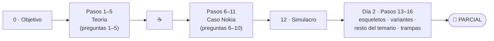
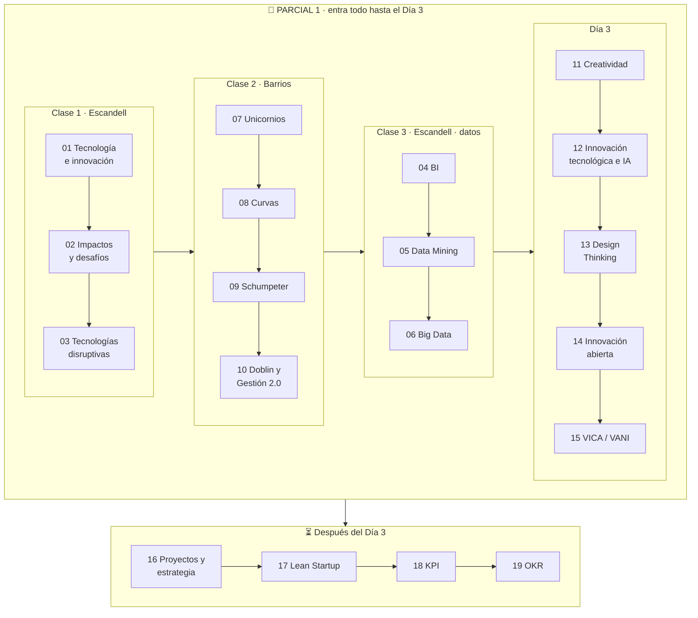

# 📚 Tecnología e Innovación — Material de estudio

Material de **estudio** (no de repaso) de la materia **Tecnología e Innovación** (UADE, 2027 · 1er cuatrimestre), armado tema por tema a partir de las presentaciones de clase de los profesores **Gustavo E. Escandell** y **Mario Barrios**, complementado con el **apunte de cursada** (Clases 1–2) y las **notas de clase**.

Cada módulo sigue el **Outlining Method**: primero el **esquema jerárquico** del tema (vista de pájaro) y después el **desarrollo completo** con la misma numeración, diagramas, ejemplos, trampas de parcial, bloques 📝 para responder **citando y explayándose** (como pide el profesor) y autoevaluación con respuestas plegables.

> 👉 **Parcial 1 (mañana):** seguí la [**🎯 Ruta al Parcial 1**](#-ruta-al-parcial-1-empezá-acá), paso a paso. Está armada a partir del [parcial anterior resuelto](23-parcial-anterior-nokia.md).
>
> 📖 Para entender cómo está hecho cada módulo: [00 · Cómo estudiar con este material](00-como-estudiar-con-este-material.md).

---

## 🎯 Ruta al Parcial 1 (empezá acá)

> **Cómo funciona:** es **un solo camino**, en orden. Cada paso tiene tres partes: **leé** las secciones indicadas del módulo (solo esas, no el módulo entero) → **resolvé** la pregunta del parcial anterior en el [23](23-parcial-anterior-nokia.md) → **checkpoint**: escribí el 🧠 esqueleto de memoria. Si te sale, marcá el paso y pasá al siguiente; si no, releé el 📝 y probá de nuevo.
>
> **Por qué este orden:** el parcial anterior tiene **alta probabilidad (7–8/10) de repetirse**, así que el Día 1 se dedica entero a sus 10 preguntas, en el orden del examen (primero teoría, después el caso). El Día 2 consolida y cubre el 20–30 % que puede cambiar. Dentro de cada bloque, va primero lo que el paso siguiente necesita (por ejemplo, Data Mining antes que Big Data, porque la diferencia entre ambos se apoya en Data Mining).



### 📅 Día 1 · Hoy (≈ 3 h 35 + margen): las 10 preguntas del parcial anterior

| ✓ | Paso | Tiempo | 1. Leé | 2. Resolvé | Checkpoint: podés… |
|---|---|---|---|---|---|
| ☐ | **0 · El objetivo** | 5' | [Enunciado del parcial anterior](casos/parcial-anterior-nokia.md) | [23](23-parcial-anterior-nokia.md) §I–II (método de respuesta) | …decir qué evalúa cada parte y cómo se responde (4 C y C-E-C). |
| | **Bloque A · Teoría** | | | | |
| ☐ | **1 · Creatividad vs. innovación** | 20' | [01](01-tecnologia-e-innovacion-fundamentos.md) §II · [11](11-creatividad-y-proceso-creativo.md) §I y §II.C | [23](23-parcial-anterior-nokia.md) III.1 | …diferenciarlas con cita, y nombrar las 5 etapas del proceso creativo. |
| ☐ | **2 · BI y Data Mining** | 25' | [04](04-business-intelligence.md) §I–II · [05](05-data-mining.md) §II–III | [23](23-parcial-anterior-nokia.md) III.3 | …escribir los 4 aspectos clave del BI y la tabla BI vs. DM. |
| ☐ | **3 · Big Data** | 15' | [06](06-big-data.md) §I, §VI y §VII | [23](23-parcial-anterior-nokia.md) III.2 | …definir Big Data y las 5 V (Valor = la más importante). |
| ☐ | **4 · Design Thinking** | 15' | [13](13-design-thinking.md) §I–II | [23](23-parcial-anterior-nokia.md) III.4 | …definirlo y explicar las 5 etapas (iterativo). |
| ☐ | **5 · Doblin** | 15' | [10](10-gestion-de-la-innovacion.md) §II | [23](23-parcial-anterior-nokia.md) III.5 | …ubicar los 10 tipos en Configuración / Oferta / Experiencia. |
| | ☕ **Pausa** | 10' | | | |
| | **Bloque B · Caso Nokia** | | | | |
| ☐ | **6 · El caso** | 10' | [23](23-parcial-anterior-nokia.md) §IV (resumen, bandos internos, tesis) | — | …contar el caso en 1 minuto con 3 frases textuales. |
| ☐ | **7 · Curva S** | 20' | [08](08-curvas-de-la-tecnologia.md) §I.A–I.C · [03](03-tecnologias-disruptivas.md) §I–II | [23](23-parcial-anterior-nokia.md) V.6 | …ubicar Symbian en la saturación con evidencia y explicar el salto. |
| ☐ | **8 · Destrucción creativa** | 20' | [09](09-schumpeter-destruccion-creativa-y-ciclos.md) §II | [23](23-parcial-anterior-nokia.md) V.7 | …explicar por qué lo "inferior" disrumpe y qué se destruye / crea. |
| ☐ | **9 · Gestión 2.0** | 15' | [10](10-gestion-de-la-innovacion.md) §III.A | [23](23-parcial-anterior-nokia.md) V.8 | …explicar por qué juntar jefes ≠ interdisciplina y los pilares 2.0. |
| ☐ | **10 · Opinión pública** | 10' | [07](07-empresas-unicornio.md) §II.A y §III | [23](23-parcial-anterior-nokia.md) V.9 | …explicar el efecto en inversores (40 → 3) y desarrolladores. |
| ☐ | **11 · MVP** | 15' | [22](22-foco-de-parcial.md) §VI.1 · [17](17-lean-startup.md) §I y §IV | [23](23-parcial-anterior-nokia.md) V.10 | …definir MVP y armar el plan de Nokia (hipótesis → medir → iterar/pivotar). |
| ☐ | **12 · Simulacro** | 20' | — | [23](23-parcial-anterior-nokia.md) §IX: preguntas **3** y **8** sin mirar | …responderlas en ~10' cada una y corregirlas con el 📝. |

### 🌅 Día 2 · Mañana a la mañana (1 h 30): consolidar y cubrir lo que puede cambiar

| ✓ | Paso | Tiempo | Qué hacer | Checkpoint: podés… |
|---|---|---|---|---|
| ☐ | **13 · Esqueletos** | 20' | Escribí de memoria los 10 🧠 esqueletos del [23](23-parcial-anterior-nokia.md); releé solo los que fallaste. | …recitar las 10 respuestas en estructura. |
| ☐ | **14 · Variantes del caso** | 20' | [23](23-parcial-anterior-nokia.md) §VI (priorizá VI.1 explotar / explorar / ambidestreza, VI.2 Gartner y VI.3 adopción) y §VII (Kodak / NEXA). | …responder *"¿qué habrías hecho en 2007?"* y trasladar el análisis a otro caso. |
| ☐ | **15 · Resto del temario** | 35' | Solo **esquema + bloques 📝** de: [08](08-curvas-de-la-tecnologia.md) §II–III (Gartner y adopción con %) · [05](05-data-mining.md) §VI (6 etapas) · [14](14-innovacion-abierta.md) §II–IV (innovación abierta) · [15](15-entornos-vica-y-vani.md) §II–III (VICA / VANI) · [01](01-tecnologia-e-innovacion-fundamentos.md) §I y §V (pregunta de apertura y relación tripartita). | …cubrir las preguntas que podrían reemplazar a alguna del parcial anterior. |
| ☐ | **16 · Trampas y cierre** | 15' | ⚠️ de las 10 preguntas y *Conceptos que se confunden* del [23](23-parcial-anterior-nokia.md) · checklist de la [Guía](22-foco-de-parcial.md) §VIII. | …no caer en ninguna trampa. Fin: no estudiar nada nuevo. |

### 🚫 Qué NO estudiar antes del parcial

- Módulos [16](16-proyectos-y-estrategia-de-innovacion.md), [18](18-kpi.md) y [19](19-okr.md): no entran en el Parcial 1.
- De [17](17-lean-startup.md), solo el MVP (paso 11).
- Detalles de baja probabilidad: listas de programas y software (BI, Data Mining), empresas que los usan, ciclos de Kitchin / Juglar / Kondratiev, técnicas creativas una por una, GV en detalle. Si sobra tiempo, el orden de consulta está abajo.

---

## 📚 Índice completo por clase (para consultar)

> Todos los módulos, en el orden en que se dieron las clases. **No es el orden de estudio para el parcial** (ese es la ruta de arriba); sirve para buscar un tema o para estudiar la materia completa más adelante.

### Introducción
| # | Módulo | Qué vas a aprender |
|---|---|---|
| 00 | [Cómo estudiar con este material](00-como-estudiar-con-este-material.md) | El Outlining Method, la estructura de cada módulo y el orden de estudio. |

### ✅ Parcial 1 · Clase 1 — Escandell
| Orden | # | Módulo | Qué vas a aprender |
|---|---|---|---|
| 1 | 01 | [Tecnología e innovación: conceptos fundamentales](01-tecnologia-e-innovacion-fundamentos.md) | Tecnología ("el cómo") vs. innovación ("el para qué"), tipos, importancia, relación tripartita con los negocios. |
| 2 | 02 | [Impactos y desafíos](02-impactos-y-desafios.md) | Impactos en sociedad y empresas, IA agéntica, gemelos digitales, hiperpersonalización, los 6 desafíos. |
| 3 | 03 | [Tecnologías disruptivas](03-tecnologias-disruptivas.md) | Definición, 5 características, principales tecnologías, 7 pasos de implementación, I+D+i, beneficios y ventajas. |

### ✅ Parcial 1 · Clase 2 — Barrios (remota)
| Orden | # | Módulo | Qué vas a aprender |
|---|---|---|---|
| 4 | 07 | [Empresas unicornio y opinión pública](07-empresas-unicornio.md) | Definición, características, factores que mueven la valuación (caso Facebook). |
| 5 | 08 | [Curvas de la tecnología](08-curvas-de-la-tecnologia.md) | Curva S (Christensen), Hype Cycle (Gartner), curva de adopción, desarrollo de tecnologías. |
| 6 | 09 | [Schumpeter: destrucción creativa y ciclos](09-schumpeter-destruccion-creativa-y-ciclos.md) | Destrucción creativa, 5 tipos de innovación, ciclos económicos, Kitchin–Juglar–Kondratiev. |
| 7 | 10 | [Gestión de la innovación: Doblin y Gestión 2.0](10-gestion-de-la-innovacion.md) | Los 10 tipos de Doblin, los 6 pilares de la Gestión 2.0, habilidades blandas. |

### ✅ Parcial 1 · Clase 3 — Escandell (datos)
| Orden | # | Módulo | Qué vas a aprender |
|---|---|---|---|
| 8 | 04 | [Business Intelligence](04-business-intelligence.md) | Definición, aspectos clave, funciones, características (self-service, data warehouse), programas. |
| 9 | 05 | [Data Mining](05-data-mining.md) | Proceso de 6 etapas, 8 técnicas (clasificación, clustering, asociación…), casos y ética. |
| 10 | 06 | [Big Data](06-big-data.md) | Las 5 V, Big Data vs. Data Mining (y la diapositiva que los mezcla), integración BI + DM + BD. |

### ✅ Parcial 1 · Día 3 — Creatividad, innovación tecnológica e innovación abierta
| Orden | # | Módulo | Qué vas a aprender |
|---|---|---|---|
| 11 | 11 | [Creatividad y proceso creativo](11-creatividad-y-proceso-creativo.md) | Creatividad vs. innovación, etapas, 7 reglas, 7 técnicas (SCAMPER, morfológico, brainwriting…). *(Empieza en la Clase 2.)* |
| 12 | 12 | [Innovación tecnológica e IA](12-innovacion-tecnologica-e-ia.md) | Características, tipos, 10 problemas de innovar, Inteligencia Artificial. |
| 13 | 13 | [Design Thinking](13-design-thinking.md) | Las 5 etapas, características, beneficios, casos (Apple, Netflix, Airbnb, BBVA, IKEA). |
| 14 | 14 | [Innovación abierta](14-innovacion-abierta.md) | Chesbrough, embudo cerrado vs. perforado, inbound/outbound, CVC, caso Google Ventures. |
| 15 | 15 | [De VICA a VANI](15-entornos-vica-y-vani.md) | Entornos VUCA y BANI, matriz de transición, innovación abierta como resiliencia. |

### ⏳ Después del Día 3 (todavía no entra en el Parcial 1)
| # | Módulo | Qué vas a aprender | Fuente |
|---|---|---|---|
| 16 | [Proyectos y estrategia de innovación](16-proyectos-y-estrategia-de-innovacion.md) | Proyecto de innovación, tipos, estrategia de innovación, alineación, caso retail. | Proyecto de Innovación · Barrios |
| 17 | [Lean Startup](17-lean-startup.md) | Eric Ries, las 10 fases, MVP, iterar vs. pivotar. ⚠️ El concepto de **MVP** entra en el Parcial 1: lo menciona el Día 3 y es la pregunta 10 del parcial anterior. | Proyecto de Innovación · Barrios |
| 18 | [KPI](18-kpi.md) | Anatomía, SMART, leading/lagging, DORA, SaaS, casos Spotify y Mercado Libre, costo de no medir. | KPI & OKR · Barrios |
| 19 | [OKR](19-okr.md) | Estructura, KPI vs. OKR, cascada, 6 errores, pago contra hitos para freelancers. | KPI & OKR · Barrios |

### Cierre
| # | Módulo | Qué vas a aprender |
|---|---|---|
| 20 | [Glosario](20-glosario.md) | Todos los términos de la materia con link al módulo. |
| 21 | [Preguntas integradoras](21-preguntas-integradoras.md) | 11 preguntas tipo parcial que cruzan varios temas, con respuesta modelo. |
| 22 | [Guía del Parcial 1](22-foco-de-parcial.md) | Alcance, orden y plan de estudio, posibles preguntas resueltas, práctica tipo caso y checklist. |
| 23 | [Parcial anterior resuelto (caso Nokia)](23-parcial-anterior-nokia.md) | Las 10 preguntas del examen anterior con respuesta modelo (citar y explayarse), variantes probables, Kodak/NEXA y plan de 4 h. |
| — | [Casos](casos/README.md) | Enunciado del parcial anterior, caso Nokia de la cátedra (versión larga), TP NEXA y respuestas del grupo. |

---

## 🧭 Mapa de la materia (por clase)



---

## 🔣 Convenciones

| Símbolo | Significado |
|---|---|
| 📌 | **Definición de la cátedra** (para citarla; siempre seguida de desarrollo propio). |
| 📝 | **Citar y explayarse**: párrafo modelo que cita a la cátedra y lo desarrolla con palabras propias y un ejemplo (lo que pide el profesor). |
| 💡 | Explicación intuitiva / para entenderlo. |
| 🧩 | Ejemplo. |
| ⚠️ | Trampa típica de parcial o concepto que se confunde. |
| ➕ | **Contexto adicional**: información que **no está en las diapositivas**. Sirve para entender; en el examen priorizá la versión de la cátedra. |
| 🔗 | Conexión con otro módulo. |

| 🔥 | **Prioridad de parcial**: marcado como importante en clase (notas) o "PONER EN PARCIAL" / resaltado en el apunte de cursada. |

## 🏷️ Versiones

Cada actualización del material se registra en [CHANGELOG.md](CHANGELOG.md) y se marca con un **tag de git con la fecha** (`vAAAA.MM.DD`; si hay más de una en el mismo día, `vAAAA.MM.DD.2`, `.3`…). Para ver una versión anterior: `git checkout v2026.10.02` · para comparar: `git diff v2026.10.02 v2026.10.05`.

## 📁 Estructura del repo

```
.
├── README.md                ← este índice
├── 00-como-estudiar-…md     ← método
├── 01 … 19-*.md             ← módulos de estudio
├── 20-glosario.md
├── 21-preguntas-integradoras.md
├── 22-foco-de-parcial.md     ← guía del Parcial 1
├── 23-parcial-anterior-nokia.md ← parcial anterior resuelto
├── casos/                   ← parcial anterior, caso Nokia, caso NEXA
├── CHANGELOG.md             ← historial de versiones (tags por fecha)
└── assets/                  ← diagramas SVG (curvas, ciclos, Doblin, embudos)
```

---

*Material elaborado a partir de las presentaciones de clase de la materia. Las fuentes de cada módulo están indicadas en su cabecera.*
