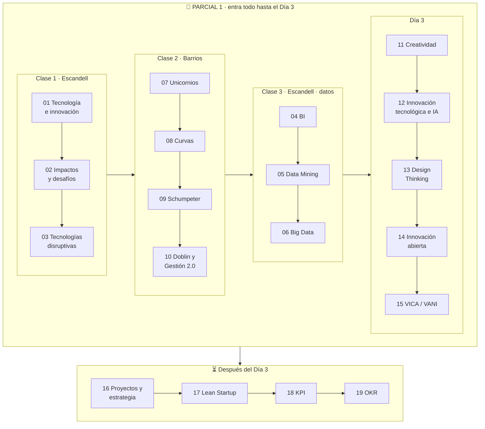

# 📚 Tecnología e Innovación — Material de estudio

Material de **estudio** (no de repaso) de la materia **Tecnología e Innovación** (UADE, 2027 · 1er cuatrimestre), armado tema por tema a partir de las presentaciones de clase de los profesores **Gustavo E. Escandell** y **Mario Barrios**, complementado con el **apunte de cursada** (Clases 1–2) y las **notas de clase**.

Cada módulo sigue el **Outlining Method**: primero el **esquema jerárquico** del tema (vista de pájaro) y después el **desarrollo completo** con la misma numeración, diagramas, ejemplos, trampas de parcial, bloques 📝 para responder **citando y explayándose** (como pide el profesor) y autoevaluación con respuestas plegables.

> 👉 **Si es tu primera vez:** empezá por [**00 · Cómo estudiar con este material**](00-como-estudiar-con-este-material.md) (10 minutos).

---

## 🗂️ Índice (en el orden en que se dieron las clases)

> 📍 **Parcial 1: entra todo hasta el Día 3** (módulos 01–15). Si el alcance se amplía, se actualiza en [22 · Guía del Parcial 1](22-foco-de-parcial.md).
>
> Los números de archivo responden a cómo se armó el material; **el orden de estudio es el de estas tablas**, que sigue la cursada (según las notas de clase: Clase 1 → Clase 2 → Clase 3 → Día 3).

### Introducción
| # | Módulo | Qué vas a aprender |
|---|---|---|
| 00 | [Cómo estudiar con este material](00-como-estudiar-con-este-material.md) | El Outlining Method, la estructura de cada módulo y el orden de estudio. |

### ✅ Parcial 1 · Clase 1 — Escandell
| Orden | # | Módulo | Qué vas a aprender |
|---|---|---|---|
| 1 | 01 | [Tecnología e innovación: conceptos fundamentales](01-tecnologia-e-innovacion-fundamentos.md) | Tecnología ("el cómo") vs. innovación ("el para qué"), tipos, importancia, relación tripartita con los negocios. |
| 2 | 02 | [Impactos y desafíos](02-impactos-y-desafios.md) | Impactos en sociedad y empresas, IA agéntica, gemelos digitales, hiperpersonalización, los 6 desafíos. |
| 3 | 03 | [Tecnologías disruptivas](03-tecnologias-disruptivas.md) | Definición, 5 características, principales tecnologías, 7 pasos de implementación, I+D+i, beneficios y ventajas. |

### ✅ Parcial 1 · Clase 2 — Barrios (remota)
| Orden | # | Módulo | Qué vas a aprender |
|---|---|---|---|
| 4 | 07 | [Empresas unicornio y opinión pública](07-empresas-unicornio.md) | Definición, características, factores que mueven la valuación (caso Facebook). |
| 5 | 08 | [Curvas de la tecnología](08-curvas-de-la-tecnologia.md) | Curva S (Christensen), Hype Cycle (Gartner), curva de adopción, desarrollo de tecnologías. |
| 6 | 09 | [Schumpeter: destrucción creativa y ciclos](09-schumpeter-destruccion-creativa-y-ciclos.md) | Destrucción creativa, 5 tipos de innovación, ciclos económicos, Kitchin–Juglar–Kondratiev. |
| 7 | 10 | [Gestión de la innovación: Doblin y Gestión 2.0](10-gestion-de-la-innovacion.md) | Los 10 tipos de Doblin, los 6 pilares de la Gestión 2.0, habilidades blandas. |

### ✅ Parcial 1 · Clase 3 — Escandell (datos)
| Orden | # | Módulo | Qué vas a aprender |
|---|---|---|---|
| 8 | 04 | [Business Intelligence](04-business-intelligence.md) | Definición, aspectos clave, funciones, características (self-service, data warehouse), programas. |
| 9 | 05 | [Data Mining](05-data-mining.md) | Proceso de 6 etapas, 8 técnicas (clasificación, clustering, asociación…), casos y ética. |
| 10 | 06 | [Big Data](06-big-data.md) | Las 5 V, Big Data vs. Data Mining (y la diapositiva que los mezcla), integración BI + DM + BD. |

### ✅ Parcial 1 · Día 3 — Creatividad, innovación tecnológica e innovación abierta
| Orden | # | Módulo | Qué vas a aprender |
|---|---|---|---|
| 11 | 11 | [Creatividad y proceso creativo](11-creatividad-y-proceso-creativo.md) | Creatividad vs. innovación, etapas, 7 reglas, 7 técnicas (SCAMPER, morfológico, brainwriting…). *(Empieza en la Clase 2.)* |
| 12 | 12 | [Innovación tecnológica e IA](12-innovacion-tecnologica-e-ia.md) | Características, tipos, 10 problemas de innovar, Inteligencia Artificial. |
| 13 | 13 | [Design Thinking](13-design-thinking.md) | Las 5 etapas, características, beneficios, casos (Apple, Netflix, Airbnb, BBVA, IKEA). |
| 14 | 14 | [Innovación abierta](14-innovacion-abierta.md) | Chesbrough, embudo cerrado vs. perforado, inbound/outbound, CVC, caso Google Ventures. |
| 15 | 15 | [De VICA a VANI](15-entornos-vica-y-vani.md) | Entornos VUCA y BANI, matriz de transición, innovación abierta como resiliencia. |

### ⏳ Después del Día 3 (todavía no entra en el Parcial 1)
| # | Módulo | Qué vas a aprender | Fuente |
|---|---|---|---|
| 16 | [Proyectos y estrategia de innovación](16-proyectos-y-estrategia-de-innovacion.md) | Proyecto de innovación, tipos, estrategia de innovación, alineación, caso retail. | Proyecto de Innovación · Barrios |
| 17 | [Lean Startup](17-lean-startup.md) | Eric Ries, las 10 fases, MVP, iterar vs. pivotar. ⚠️ El concepto de **MVP** sí conviene saberlo para el Parcial 1: lo menciona el Día 3. | Proyecto de Innovación · Barrios |
| 18 | [KPI](18-kpi.md) | Anatomía, SMART, leading/lagging, DORA, SaaS, casos Spotify y Mercado Libre, costo de no medir. | KPI & OKR · Barrios |
| 19 | [OKR](19-okr.md) | Estructura, KPI vs. OKR, cascada, 6 errores, pago contra hitos para freelancers. | KPI & OKR · Barrios |

### Cierre
| # | Módulo | Qué vas a aprender |
|---|---|---|
| 20 | [Glosario](20-glosario.md) | Todos los términos de la materia con link al módulo. |
| 21 | [Preguntas integradoras](21-preguntas-integradoras.md) | 11 preguntas tipo parcial que cruzan varios temas, con respuesta modelo. |
| 22 | [Guía del Parcial 1](22-foco-de-parcial.md) | Alcance, orden y plan de estudio, posibles preguntas resueltas, práctica tipo caso y checklist. |

---

## 🧭 Mapa de la materia



---

## 🔣 Convenciones

| Símbolo | Significado |
|---|---|
| 📌 | **Definición de la cátedra** (para citarla; siempre seguida de desarrollo propio). |
| 📝 | **Citar y explayarse**: párrafo modelo que cita a la cátedra y lo desarrolla con palabras propias y un ejemplo (lo que pide el profesor). |
| 💡 | Explicación intuitiva / para entenderlo. |
| 🧩 | Ejemplo. |
| ⚠️ | Trampa típica de parcial o concepto que se confunde. |
| ➕ | **Contexto adicional**: información que **no está en las diapositivas**. Sirve para entender; en el examen priorizá la versión de la cátedra. |
| 🔗 | Conexión con otro módulo. |

| 🔥 | **Prioridad de parcial**: marcado como importante en clase (notas) o "PONER EN PARCIAL" / resaltado en el apunte de cursada. |

## 🏷️ Versiones

Cada actualización del material se registra en [CHANGELOG.md](CHANGELOG.md) y se marca con un **tag de git con la fecha** (`vAAAA.MM.DD`; si hay más de una en el mismo día, `vAAAA.MM.DD.2`, `.3`…). Para ver una versión anterior: `git checkout v2026.10.02` · para comparar: `git diff v2026.10.02 v2026.10.05`.

## 📁 Estructura del repo

```
.
├── README.md                ← este índice
├── 00-como-estudiar-…md     ← método
├── 01 … 19-*.md             ← módulos de estudio
├── 20-glosario.md
├── 21-preguntas-integradoras.md
├── 22-foco-de-parcial.md     ← guía del Parcial 1
├── CHANGELOG.md             ← historial de versiones (tags por fecha)
└── assets/                  ← diagramas SVG (curvas, ciclos, Doblin, embudos)
```

---

*Material elaborado a partir de las presentaciones de clase de la materia. Las fuentes de cada módulo están indicadas en su cabecera.*
