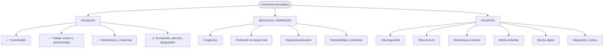
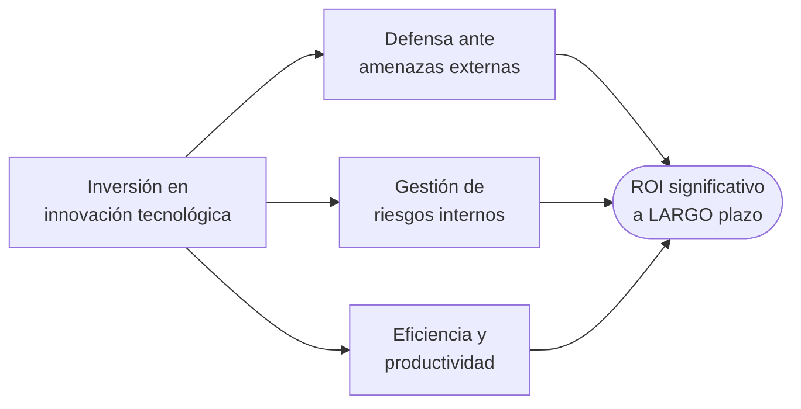
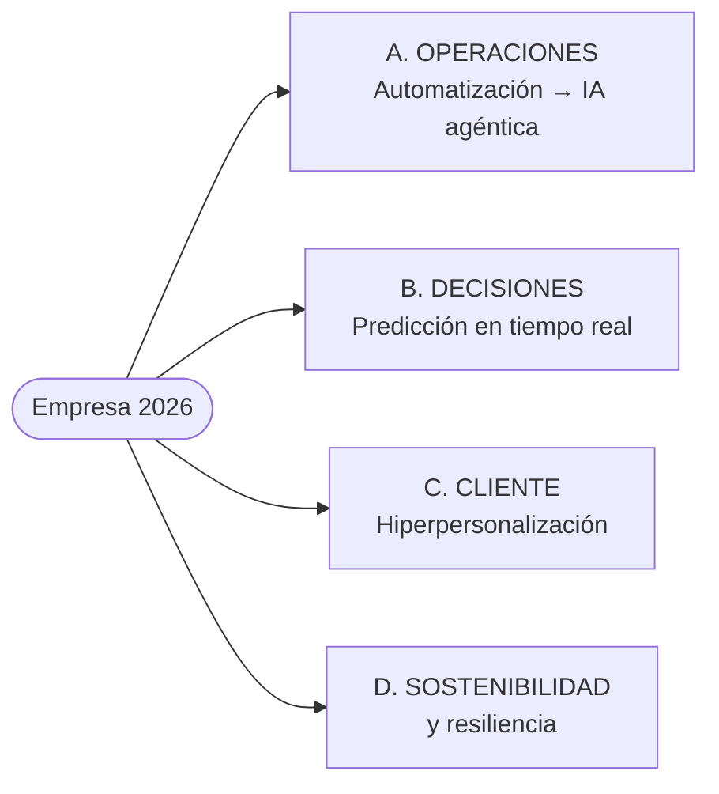

# 02 · Impactos y desafíos de la tecnología y la innovación

> **Fuente en el material:** *Tecnología e Innovación – CLASE 1* (Prof. Gustavo E. Escandell), diapositivas 15–26 y actividades 33–35.
> **Prerrequisitos:** [01 Fundamentos](01-tecnologia-e-innovacion-fundamentos.md).
> **Tiempo estimado:** 45 min.
> **Primer Parcial · Tema 02 de 13** (Clase 1).

---

## 🎯 Objetivos de aprendizaje

1. Enumerar y explicar los **impactos** de la innovación tecnológica en las **empresas** y en la **sociedad**.
2. Describir las **cuatro grandes transformaciones empresariales** que plantea la cátedra (IA agéntica, predicción en tiempo real, hiperpersonalización, sostenibilidad y resiliencia).
3. Explicar por qué invertir en innovación tecnológica genera **retorno a largo plazo**.
4. Identificar y explicar los **seis desafíos** de la tecnología y la innovación.
5. Reconocer que la tecnología tiene **efectos positivos y negativos** (visión crítica).

---

## 🗺️ Esquema del tema

- **I. Impactos generales (¿qué impacto tendrá?)**
  1. Optimización y eficiencia operativa
  2. Transformación en la relación con el cliente
  3. Seguridad y gestión de datos
  4. Cambio estructural y nuevos modelos
  5. Crecimiento y sostenibilidad
- **II. Por qué invertir: la lógica del retorno**
- **III. Impactos en la sociedad**
  1. Conectividad y comunicación
  2. Eficiencia y trabajo
  3. Educación y salud
  4. Desafíos sociales (lado negativo)
  5. Sostenibilidad (doble filo)
- **IV. Impactos en los negocios**
  1. Eficiencia operativa y competitividad
  2. Transformación de modelos de negocio
  3. Cambios en el mercado laboral
  4. Impacto social y calidad de vida
  5. Adaptación y sostenibilidad
- **V. Impacto en las empresas (la empresa de 2026)**
  - A. Operaciones: de la automatización a la IA agéntica
  - B. Toma de decisiones: predicción en tiempo real
  - C. Experiencia del cliente: hiperpersonalización
  - D. Sostenibilidad y resiliencia
- **VI. Desafíos de la tecnología y la innovación**
  1. Ciberseguridad y ciberresiliencia
  2. IA y ética
  3. Resistencia al cambio y cultura
  4. Sostenibilidad y medio ambiente
  5. Brecha digital y acceso
  6. Integración de sistemas y costos

---

## 🧠 Mapa visual

---

## 📖 Desarrollo

## I. Impactos generales

La clase plantea la pregunta *"Pero… ¿qué impacto tendrá?"* y responde con cinco impactos. Conviene aprenderlos como **cinco dimensiones** de una empresa:

| # | Impacto | Qué significa | Tecnologías / ejemplos citados |
|---|---|---|---|
| 1 | **Optimización y eficiencia operativa** | Mejoran **drásticamente la productividad**, **reducen costos operativos** y **optimizan inventarios**. | Automatización de procesos, IA, **Copilot en GitHub**. |
| 2 | **Transformación en la relación con el cliente** | Acercamiento **directo y ágil**, que satisface la demanda de **inmediatez y personalización**. | E-commerce, IA para personalizar ofertas, chatbots. |
| 3 | **Seguridad y gestión de datos** | Protege los activos digitales y **fortalece la confianza del consumidor**. | Ciberseguridad, cifrado *end-to-end*, herramientas de control remoto. |
| 4 | **Cambio estructural y nuevos modelos** | Obliga a operar con **metodologías ágiles** y **desdibuja la línea entre áreas** (ej. IT y marketing) hacia un enfoque integrado. | Nube, IA. |
| 5 | **Crecimiento y sostenibilidad** | Las empresas digitalizadas **acceden a más mercados**, tienen **mayores tasas de exportación** y pueden implementar **soluciones más ecológicas**. | Transformación digital. |

> 💡 **Para entenderlo – el punto 4:** antes, "sistemas" era un área de soporte separada. Con la nube y la IA, marketing necesita datos en tiempo real y sistemas necesita entender al cliente: las áreas se fusionan en equipos integrados que trabajan de forma ágil.

---

## II. Por qué invertir: la lógica del retorno

> 📌 *"La inversión en innovación tecnológica **fortalece la defensa contra amenazas externas**, ayuda a **abordar riesgos internos**, permite **mejoras en la eficiencia operativa y la productividad**, lo que se traduce en un **retorno de inversión significativo a largo plazo**."*

> ⚠️ Fijate en **"a largo plazo"**: la innovación rara vez paga en el corto plazo. Esto se conecta con la **Gestión de la innovación 2.0** (módulo [07](07-gestion-de-la-innovacion.md)), donde la cátedra dice que *el cortoplacismo va en detrimento de la innovación*.

> 📝 **Citar y explayarse:** La cátedra afirma que invertir en innovación tecnológica *"fortalece la defensa contra amenazas externas, ayuda a abordar riesgos internos"* y mejora la eficiencia, lo que se traduce en *"un retorno de inversión significativo a largo plazo"*. La clave está en el **largo plazo**: la inversión tiene un costo inmediato (equipos, capacitación, cambio de procesos) y sus beneficios llegan después, en forma de menos incidentes, procesos más rápidos y mejor posición competitiva. Por eso las empresas cortoplacistas tienden a invertir de menos. Por ejemplo, implementar ciberseguridad proactiva cuesta hoy, pero evita una filtración de datos que podría costar mucho más en multas y reputación.

---

## III. Impactos en la sociedad

> 📌 *"La técnica, tecnología e innovación impactan profundamente la sociedad actual al aumentar la productividad, facilitar la conectividad global, transformar el trabajo remoto y mejorar diagnósticos médicos. Impulsan el aprendizaje en línea, el comercio electrónico y el acceso a la información."*

> 📝 **Citar y explayarse:** Para la cátedra, la técnica, la tecnología y la innovación *"impactan profundamente la sociedad actual"*: aumentan la productividad, facilitan la conectividad global, transforman el trabajo remoto y mejoran los diagnósticos médicos. Lo que estos impactos tienen en común es que **cambian cómo las personas se relacionan, trabajan y acceden a servicios**, no solo las herramientas que usan. El trabajo remoto, por ejemplo, no es solo una videollamada: reorganiza horarios, ciudades y formas de contratar. Pero estos impactos no llegan a todos por igual, y por eso la materia los presenta junto con sus **desafíos** (brecha digital, ciberseguridad, ética).

### III.1 Conectividad y comunicación
- Interacción **inmediata** y **acortamiento de distancias**.
- Cambia **cómo las personas se relacionan** y acceden al entretenimiento.

### III.2 Eficiencia y trabajo
- **Automatización, robótica e IA** aumentan la productividad industrial.
- Habilitan modalidades como el **trabajo remoto**.

### III.3 Educación y salud
- Educación: **plataformas personalizadas**.
- Salud: **telemedicina** y mejores **herramientas de diagnóstico**.

### III.4 Desafíos sociales (el lado negativo)
- El uso excesivo trae riesgos de **aislamiento, tecnoestrés, ansiedad y adicción**.
- Persisten **desigualdades en el acceso**, que afectan a **grupos vulnerables**.

### III.5 Sostenibilidad (doble filo)
- La innovación **crea soluciones ecoamigables**…
- …pero el **mal uso** de la tecnología **contribuye a la contaminación y al cambio climático**.

> 💡 **Idea para el parcial:** la cátedra no presenta la tecnología como "buena" o "mala" sino como **ambivalente**. Si te piden "analice el impacto social", mencioná siempre **beneficios y riesgos**.

---

## IV. Impactos en los negocios

| # | Impacto | Explicación |
|---|---|---|
| 1 | **Eficiencia operativa y competitividad** | Adoptar tecnología permite **reducir costos, acelerar procesos y mantenerse relevante** en mercados competitivos. |
| 2 | **Transformación de modelos de negocio** | Impulsada por **Big Data e IA**, fomenta **nuevos productos, servicios y modelos de trabajo**, cambiando cómo operan las empresas y cómo interactúan con los clientes. |
| 3 | **Cambios en el mercado laboral** | La automatización **transforma sectores**, pero **también crea nuevas oportunidades** laborales y exige **nuevas habilidades tecnológicas**. |
| 4 | **Impacto social y calidad de vida** | La tecnología actúa como **ecualizador**: mejora el acceso a salud, educación y finanzas, aunque plantea **retos de privacidad y equidad**. |
| 5 | **Adaptación y sostenibilidad** | Las organizaciones innovadoras pueden **gestionar riesgos**, mejorar la sostenibilidad y **adaptarse rápido** a las demandas del consumidor. |

---

## V. Impacto en las empresas (la empresa de 2026)

La cátedra organiza el impacto en cuatro frentes. Este es uno de los bloques más "actuales" de la materia.

### V.A Operaciones: de la automatización a la "IA agéntica"

1. **Eficiencia radical**: reducción de **hasta un 30–50 % en los tiempos de ciclos operativos**, gracias a sistemas que **no solo sugieren, sino que ejecutan flujos de trabajo completos** (finanzas, logística, atención).
2. **ERP activo**: los sistemas de gestión **ya no son bases de datos pasivas**; ahora **detectan problemas** (ej. falta de stock) y **proponen soluciones antes de que el humano lo note**.

> 💡 **Para entenderlo – automatización vs. IA agéntica:**
> - **Automatización clásica**: "si pasa X, hacé Y" (reglas fijas).
> - **IA agéntica**: el sistema **interpreta la situación, decide y ejecuta** una secuencia de pasos para lograr un objetivo (ej.: detecta que falta stock, pide cotizaciones, genera la orden de compra y avisa al responsable).

### V.B Toma de decisiones: predicción en tiempo real

1. **Cultura data-driven**: la tecnología permite **pasar de la intuición a la precisión**. Las empresas líderes usan **analítica predictiva** para adelantarse a las tendencias del mercado.
2. **Gemelos digitales (*Digital Twins*)**: se usan para **simular escenarios de negocio** —probar cambios en la cadena de suministro o en la producción **en un entorno virtual antes de aplicarlos en la realidad**.

> 🧩 **Ejemplo:** una automotriz crea un gemelo digital de su planta y simula qué pasa si cambia el orden de la línea de montaje, sin frenar la producción real.

### V.C Experiencia del cliente: hiperpersonalización

1. **Omnicanalidad inteligente**: *"el cliente ya no espera 24 horas; espera respuestas en 5 minutos"*. La **IA generativa** permite que cada interacción se personalice según el **historial y el sentimiento** del usuario.
2. **Realidad inmersiva**: **AR y VR** pasan del entretenimiento a la **venta y formación**: los clientes "prueban" productos y los empleados se entrenan en entornos seguros.

### V.D Sostenibilidad y resiliencia

1. **Tecnología sostenible**: según la diapositiva, *en 2026 el 60 % de las empresas implementa marcos de IA que optimizan el consumo energético y reducen la huella de carbono digital*.
2. **Ciberseguridad proactiva**: ante amenazas más complejas, se usa **IA para detectar anomalías antes de que ocurra un ataque** (prevención en lugar de reacción).

---

## VI. Desafíos de la tecnología y la innovación

Son seis. Es una lista muy preguntable: aprendela con su "porqué".

| # | Desafío | Qué implica | Palabra clave |
|---|---|---|---|
| 1 | **Ciberseguridad y ciberresiliencia** | El aumento de ataques obliga a pasar **de la prevención a la ciberresiliencia** (capacidad de **recuperación**). | Recuperarse |
| 2 | **IA y ética** | La IA generativa trae **desinformación, sesgos éticos** y la necesidad de **regular su impacto laboral**. | Sesgos |
| 3 | **Resistencia al cambio y cultura** | La **falta de capacitación** y la **reticencia** a modificar rutinas **frenan la innovación**. | Cultura |
| 4 | **Sostenibilidad y medio ambiente** | La tecnología debe alinearse con la **reducción de carbono** y la **eficiencia energética**. | Huella |
| 5 | **Brecha digital y acceso** | Que la transformación sea **equitativa** y no aumente la **desigualdad social o de género**. | Equidad |
| 6 | **Integración de sistemas y costos** | Dificultad para implementar tecnología nueva **sobre sistemas antiguos** (*legacy*) y **altos costos de mantenimiento**. | Legacy |

> 💡 **Para entenderlo – prevención vs. ciberresiliencia:** la prevención asume que podés evitar todos los ataques. La ciberresiliencia asume que **algún ataque va a pasar** y se prepara para **seguir operando y recuperarse rápido** (backups, planes de contingencia, monitoreo). Ojo: en V.D aparece "ciberseguridad **proactiva**" (detectar antes) y acá "ciber**resiliencia**" (recuperarse después). Son complementarias.

> 🔗 El desafío 3 (resistencia al cambio) reaparece como "problema de innovar" en el módulo [12](12-innovacion-tecnologica-e-ia.md) y como tema de liderazgo en el [07](07-gestion-de-la-innovacion.md).

---

## Actividades de la clase (para practicar)

La Clase 1 propone dos consignas que conviene responder por escrito como práctica de desarrollo:

1. *¿Qué innovación tecnológica cambió sus vidas durante estos últimos 10 años? ¿Por qué ha sido importante para usted ese cambio? ¿Qué mejoras ha encontrado? Si pudiera mejorar, ¿qué haría?*
2. *Elija una empresa que ha crecido durante los últimos años y detalle por qué ha crecido exponencialmente.*

> 💡 **Cómo responder la 2 usando la materia:** elegí la empresa → identificá **qué tecnología** usa (II.A del módulo 01) → **qué tipo de innovación** hizo (incremental/radical/disruptiva, de modelo de negocio…) → **qué impacto** generó (sección I de este módulo) → si aplica, **qué uso de datos** hace (módulos 08–10).

---

## ⚠️ Conceptos que se confunden

| Se confunde… | …con | Diferencia |
|---|---|---|
| Ciberseguridad (prevención) | Ciberresiliencia | Prevenir el ataque vs. **recuperarse** del ataque. |
| Automatización | IA agéntica | Reglas fijas vs. sistemas que **ejecutan flujos completos** y **anticipan problemas**. |
| Analítica descriptiva | Analítica predictiva | Qué pasó vs. **qué va a pasar** (la predictiva es la que permite "adelantarse"). |
| Impacto social "positivo" | — | La cátedra marca riesgos: tecnoestrés, adicción, aislamiento, desigualdad, contaminación. |

---

## 🔗 Conexiones

- **← [01 Fundamentos](01-tecnologia-e-innovacion-fundamentos.md)**
- **→ [03 Tecnologías disruptivas](03-tecnologias-disruptivas.md):** las tecnologías que producen estos impactos.
- **→ [08–06 Datos](08-business-intelligence.md):** la "cultura data-driven" se apoya en BI, Data Mining y Big Data.
- **→ [15 VICA y VANI](../resto-de-la-materia/15-entornos-vica-y-vani.md):** la ciberresiliencia es la respuesta a un mundo **frágil**.

---

## ✍️ Autoevaluación

**1. Enumere los cinco impactos generales de la innovación tecnológica y dé un ejemplo de cada uno.**

Ver respuesta

1. **Optimización y eficiencia operativa** – Copilot en GitHub acelera el desarrollo de software.
2. **Relación con el cliente** – chatbots que responden al instante.
3. **Seguridad y gestión de datos** – cifrado end-to-end en mensajería.
4. **Cambio estructural y nuevos modelos** – IT y marketing trabajando integrados con metodologías ágiles.
5. **Crecimiento y sostenibilidad** – una pyme que vende por e-commerce y empieza a exportar.

**2. ¿Qué es un "ERP activo" y en qué se diferencia de uno tradicional?**

Ver respuesta

Un ERP tradicional es una base de datos pasiva que registra operaciones. Un **ERP activo** **detecta problemas** (por ejemplo, una falta de stock) y **propone soluciones antes de que el humano lo note**. Es parte del paso de la automatización a la **IA agéntica**.

**3. Explique qué es un gemelo digital y para qué lo usa una empresa.**

Ver respuesta

Es una réplica virtual de un sistema real (planta, cadena de suministro) que permite **simular escenarios de negocio** y probar cambios **en un entorno virtual antes de aplicarlos en la realidad**, reduciendo riesgo y costo. Forma parte de la toma de decisiones con predicción en tiempo real.

**4. "La tecnología siempre mejora la sociedad." Analice críticamente la afirmación.**

Ver respuesta

Es parcialmente cierta. Mejora la conectividad, la productividad, la educación (plataformas personalizadas) y la salud (telemedicina). Pero el uso excesivo genera **aislamiento, tecnoestrés, ansiedad y adicción**; persisten **desigualdades de acceso** (brecha digital) que afectan a grupos vulnerables; y el mal uso **contribuye a la contaminación y al cambio climático**. La tecnología es ambivalente: su efecto depende de cómo se aplique.

**5. Nombre los seis desafíos de la tecnología y la innovación. ¿Cuál cree que es más difícil de resolver en una pyme argentina y por qué?**

Ver respuesta

Ciberseguridad y ciberresiliencia; IA y ética; resistencia al cambio y cultura; sostenibilidad y medio ambiente; brecha digital y acceso; integración de sistemas y costos.
Respuesta abierta. Un argumento sólido: **integración de sistemas y costos** (sistemas viejos, presupuesto limitado) o **resistencia al cambio** (falta de capacitación). Lo importante es justificar con el contenido de cada desafío.

**6. ¿Por qué la cátedra habla de retorno de la inversión "a largo plazo"?**

Ver respuesta

Porque los beneficios de la innovación (defensa ante amenazas, gestión de riesgos, eficiencia y productividad) se acumulan con el tiempo; en el corto plazo suele haber costos, aprendizaje y riesgo. Evaluar la innovación solo por resultados inmediatos lleva a abandonarla antes de que rinda.

---

[← 01 Tecnología e Innovación](01-tecnologia-e-innovacion-fundamentos.md) · [🏠 Índice](../README.md) · [Siguiente → 03 Tecnologías disruptivas](03-tecnologias-disruptivas.md)
