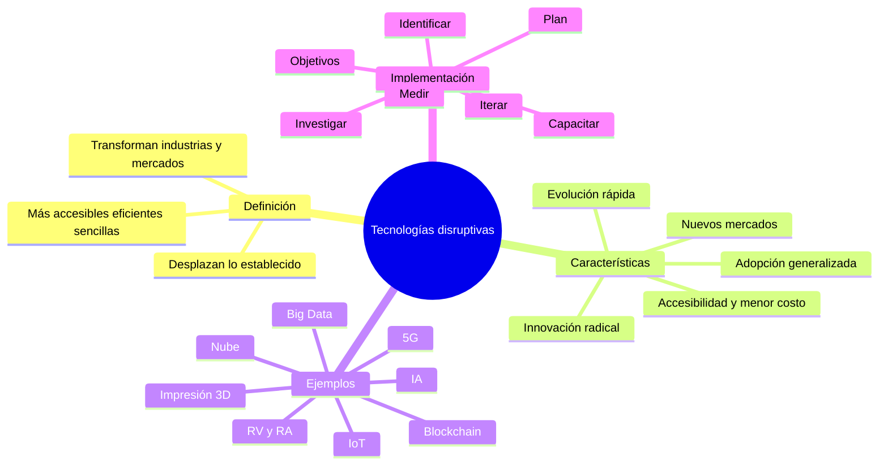
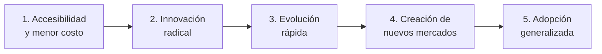
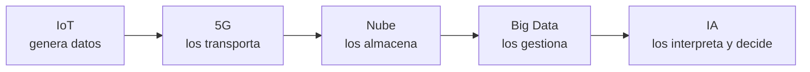
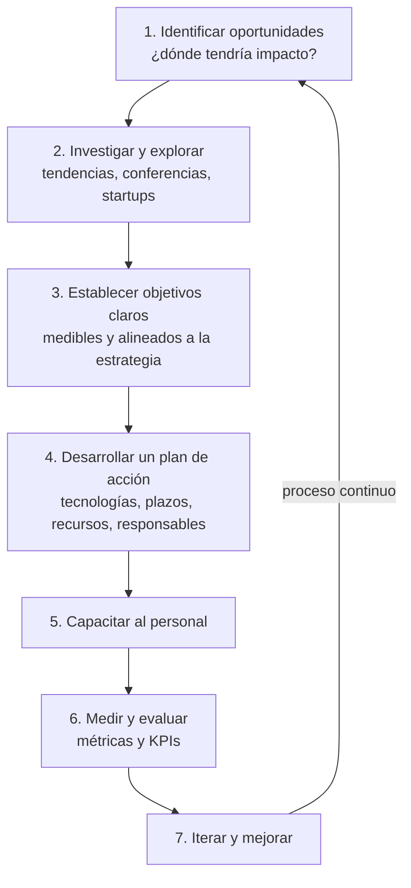

# 03 · Tecnologías disruptivas

> **Fuente en el material:** *CLASE 1* (Prof. Escandell), diapositivas 27–31, y *Clase "Pinamar" 2026* (Prof. Escandell), diapositivas 5–19.
> **Prerrequisitos:** [01](01-tecnologia-e-innovacion-fundamentos.md) y [02](02-impactos-y-desafios.md).
> **Tiempo estimado:** 65 min.
> **Primer Parcial · Tema 03 de 14** (Clase 1). 🔥 Salió en el parcial anterior (pregunta [7](../evaluacion/parcial-anterior-resuelto.md#v7-el-competidor-disruptivo-por-qué-lo-inferior-se-vuelve-destrucción-creativa)).

---

## 🎯 Objetivos de aprendizaje

1. Definir **tecnología disruptiva** con las dos formulaciones de la cátedra.
2. Explicar sus **cinco características** y reconocerlas en un caso.
3. Describir las **principales tecnologías disruptivas** y su impacto.
4. Explicar **por qué son importantes** y sus **beneficios**.
5. Describir los **siete pasos para implementar** tecnologías disruptivas en una empresa.
6. Analizar casos de empresas que **cambiaron un mercado**.

---

## 🗺️ Esquema del tema

- **I. Definición**
  - A. Versión Clase 1 (innovaciones radicales que transforman o reemplazan)
  - B. Versión Clase 2026 (más accesibles, eficientes o sencillas)
  - C. Innovación sostenida vs. disruptiva (Christensen)
- **II. Características**
  1. Accesibilidad y menor costo
  2. Innovación radical
  3. Evolución rápida
  4. Creación de nuevos mercados
  5. Adopción generalizada
  - + Características y efectos (cambio de paradigma, nichos, ventaja competitiva)
- **III. Principales tecnologías disruptivas y su impacto** (IA, IoT, nube, blockchain, robótica y drones, Big Data, RV/RA, impresión 3D, 5G)
- **IV. Importancia**
  1. Transformación de modelos de negocio
  2. Eficiencia y productividad
  3. Conectividad y nuevas experiencias
  4. Ventaja competitiva
  5. Impacto social y sostenibilidad
- **V. Cómo implementarlas en una empresa (7 pasos)**
  - + ¿Qué hace una empresa para no quedar desplazada? → I+D+i
- **VI. Beneficios**
  1. Innovación y creación de nuevos mercados
  2. Eficiencia y productividad
  3. Mejora en la calidad de vida
  4. Transformación digital y adaptabilidad
- **VII. Empresas que cambiaron un mercado**

---

## 🧠 Mapa visual

---

## 📖 Desarrollo

## I. Definición

La cátedra da dos definiciones complementarias. Conviene saber ambas.

### I.A Versión Clase 1

> 📌 *"Las tecnologías disruptivas son **innovaciones radicales** que **transforman o reemplazan industrias, modelos de negocio y la vida cotidiana**, **desplazando soluciones tradicionales** por enfoques superiores. (…) Estas tecnologías **alteran drásticamente el mercado**, creando nuevas oportunidades mientras **hacen obsoletos los métodos antiguos**."*

### I.B Versión Clase 2026

> 📌 *"Las tecnologías disruptivas son innovaciones que **transforman radicalmente industrias, mercados y comportamientos sociales**, **desplazando sistemas o productos establecidos**. Se caracterizan por ofrecer **soluciones más accesibles, eficientes o sencillas** que, con el tiempo, **redefinen los estándares del mercado** y desplazan a las tecnologías tradicionales."*

> 💡 **Para entenderlo:** "disrumpir" = **romper** la continuidad. Una tecnología disruptiva no compite "mejor" en el mismo juego: **cambia las reglas del juego**. El que antes dominaba queda desplazado, no porque haya hecho algo mal, sino porque el mercado empezó a valorar otra cosa.

> 🔥 **Síntesis de clase (Clase 2, notas de cursada):** innovación disruptiva = **cambio de paradigma** → **una nueva tecnología deja obsoleta a una tecnología anterior** → se genera un **cambio brusco**. Son las tres ideas que no pueden faltar en tu definición.

> 🧩 **Ejemplo de la cátedra:** el paso de la **fotografía de carrete a la digital**. Las primeras cámaras digitales sacaban peores fotos, pero eran más prácticas y baratas por foto. Mejoraron rápido y desplazaron al carrete.

### I.C Innovación sostenida vs. disruptiva (Clayton Christensen, repaso final)

> 📌 *"La innovación **sostenida** mejora el producto para los **clientes más exigentes** de un mercado existente. La innovación **disruptiva** **ingresa por abajo** (más simple, barata o accesible) y termina **desplazando a los líderes establecidos**."*

| Caso de la cátedra | Qué pasó |
|---|---|
| Blockbuster → Netflix | El alquiler físico fue desplazado por el streaming accesible. |
| Film → cámara digital | Kodak, líder del mercado anterior, no logró adaptarse a tiempo. |
| Taxis → Uber | Un servicio más simple y accesible redefinió el transporte. |

---

## II. Características

> 💡 Leelas **en secuencia**, como la "biografía" de una tecnología disruptiva: entra barata → cambia profundo → mejora rápido → abre mercados → se vuelve el estándar.

### II.1 Accesibilidad y menor costo
- **Suelen iniciar en segmentos de gama baja o nichos**.
- Son **más asequibles y fáciles de usar** que las soluciones dominantes.

### II.2 Innovación radical
- **Transforman o sustituyen** productos, servicios y modelos de negocio existentes.
- Provocan un **cambio profundo** en el mercado (ej. carrete → digital).

### II.3 Evolución rápida
- **Comienzan con un rendimiento inferior**, pero **mejoran velozmente** hasta **superar** a las tecnologías tradicionales.

### II.4 Creación de nuevos mercados
- No solo mejoran lo existente: **generan nuevas industrias y redes de valor**.

### II.5 Adopción generalizada
- Con el tiempo **se convierten en el nuevo estándar** y **cambian el comportamiento del consumidor**.

### II.+ Características y efectos (Clase 1)

| Efecto | Explicación |
|---|---|
| **Cambio de paradigma** | Rompen con lo establecido y **cambian las reglas del juego**. |
| **Modelos como Uber / Airbnb** | Muestran cómo modelos disruptivos **cambian industrias enteras**. |
| **Adopción** | **Suelen comenzar sirviendo a nichos desatendidos** antes de masificarse. |
| **Ventaja competitiva** | Las empresas que las adoptan logran **mayor productividad e innovación**. |

> ⚠️ **Ojo con "evolución rápida":** la tecnología disruptiva **empieza siendo peor** en el atributo tradicional. Si en un parcial te dicen "las tecnologías disruptivas son siempre superiores desde su lanzamiento", es **falso**.

---

## III. Principales tecnologías disruptivas y su impacto

| Tecnología | Impacto según la cátedra |
|---|---|
| **Inteligencia Artificial (IA) y generativa** | Automatiza tareas complejas, mejora la toma de decisiones y **crea contenido nuevo**. |
| **Internet de las Cosas (IoT)** | Conecta dispositivos para **recopilar datos en tiempo real**, optimizando procesos domésticos e industriales. |
| **Computación en la nube (Cloud)** | Almacenamiento y acceso remoto; **elimina la necesidad de infraestructura física local**. Flexibiliza y **reduce costes de infraestructura**. |
| **Blockchain** | **Seguridad y descentralización** en transacciones y gestión de datos; **transparencia** y **trazabilidad**. |
| **Robótica avanzada y drones** | Automatizan **tareas peligrosas**, logística y agricultura con **precisión superior**. |
| **Big Data** | Analiza volúmenes masivos de datos para **personalizar servicios** y **optimizar la estrategia**. |
| **Realidad Virtual (RV) y Aumentada (RA)** | Transforman educación, entretenimiento y diseño con elementos tridimensionales. |
| **Impresión 3D y bioimpresión** | Revolucionan la fabricación de piezas y la medicina (**creación de tejidos u órganos**). |
| **5G** | **Mejora drásticamente la conectividad**. |

> 💡 **Para entenderlo – por qué estas tecnologías se potencian entre sí:** IoT **genera** datos → 5G los **transporta** → la nube los **almacena** → Big Data los **gestiona** → la IA los **interpreta y decide**. Por eso se habla de "convergencia tecnológica".

---

## IV. Importancia

1. **Transformación de modelos de negocio** – Alteran la forma en que operan las empresas, permitiendo **nuevos productos y servicios**.
2. **Eficiencia y productividad** – **Automatizan tareas repetitivas**, optimizan recursos y reducen costos operativos.
3. **Conectividad y nuevas experiencias** – **5G e IoT** facilitan la interconexión y la **hiperpersonalización** de productos en tiempo real.
4. **Ventaja competitiva** – Permiten a **nuevas empresas competir con líderes de mercado** al ofrecer soluciones **más simples y accesibles**.
5. **Impacto social y sostenibilidad** – Mejoran la calidad de vida y abordan desafíos globales como **ciberseguridad, sostenibilidad y salud**.

---

## V. Cómo implementar tecnologías disruptivas en una empresa

Es un **proceso de 7 pasos**. Muy preguntable porque es "procedimental".

| Paso | Qué se hace | Detalle de la cátedra |
|---|---|---|
| **1. Identificar oportunidades** | Detectar **áreas donde la tecnología puede tener impacto significativo**. | Mejora de procesos internos, nuevos productos/servicios, experiencia del cliente. |
| **2. Investigar y explorar** | Mantenerse actualizado sobre **tendencias emergentes**. | Asistir a conferencias, grupos de discusión, **colaborar con startups** (→ innovación abierta, módulo [17](../resto-de-la-materia/17-innovacion-abierta.md)). |
| **3. Establecer objetivos claros** | Definir qué se quiere lograr. | Objetivos **medibles y alineados con la estrategia** general (→ SMART, KPI, OKR). |
| **4. Desarrollar un plan de acción** | Plan detallado. | Selección de tecnologías, **plazos, recursos y responsabilidades**. |
| **5. Capacitar al personal** | Formación y desarrollo profesional. | Para que puedan **usar y aprovechar** las nuevas tecnologías (ataca el desafío de la resistencia al cambio). |
| **6. Medir y evaluar** | Seguimiento constante. | **Métricas y KPIs** para medir el éxito; ajustar la estrategia (→ módulo [21](../resto-de-la-materia/21-kpi.md)). |
| **7. Iterar y mejorar** | Mejora continua. | *"La innovación disruptiva es un proceso continuo"*: ser flexible y estar dispuesto a **reinventarse**. Apoyarse en **metodologías ágiles**; *si el producto no se puede mejorar, hay que **pivotar*** (→ Lean Startup, módulo [20](../resto-de-la-materia/20-lean-startup-y-mvp.md)). |

> 🔗 Fijate cómo este proceso **anticipa** temas de la segunda mitad de la materia: objetivos medibles (KPI/OKR), iterar (Lean Startup, Design Thinking), colaborar con startups (innovación abierta).

### V.+ ¿Qué hace una empresa para no quedar desplazada por una disrupción?

> 🔥 **Visto en Clase 2 (notas de cursada):** la respuesta que se dio en clase es **invertir en investigación y desarrollo (I+D)**, ampliado a **I+D+i**: la "i" minúscula final es la **innovación** — no alcanza con investigar y desarrollar, hay que **llevarlo al mercado** (sigla de la cátedra, ver módulo [12](12-innovacion-tecnologica-e-ia.md), I.C).

- **I** (investigación) → generar conocimiento nuevo.
- **D** (desarrollo) → convertir ese conocimiento en productos o procesos concretos.
- **i** (innovación) → introducirlos en el mercado y que generen valor (🔗 *"una tecnología que no se utiliza no es innovación"*, módulo [01](01-tecnologia-e-innovacion-fundamentos.md)).

> 💡 **Para entenderlo:** la empresa que solo explota su tecnología actual queda atrapada en la **fase de saturación** de su curva S. Invertir en I+D+i le permite **saltar a la curva siguiente** antes de que otro lo haga por ella (módulo [05](05-curvas-de-la-tecnologia.md), I.C). Otra vía es no hacerlo todo adentro: **colaborar con startups** e **innovación abierta** (paso 2 de arriba y módulo [17](../resto-de-la-materia/17-innovacion-abierta.md)).

> ⚠️ **Ojo:** la nota de clase sobre este punto es breve. Si te lo preguntan, respondé con **I+D / I+D+i** como eje y fundamentalo con la curva S; el 💡 es elaboración para entenderlo.

---

## VI. Beneficios

1. **Innovación y creación de nuevos mercados** – Productos y servicios que antes no existían; nuevas oportunidades y crecimiento económico. Permite que **empresas nuevas compitan con gigantes**, lo que promueve más innovación.
2. **Eficiencia y productividad** – IA y robótica **automatizan tareas repetitivas**, liberando a las personas para **tareas más complejas y creativas**; optimizan procesos y reducen costos.
3. **Mejora en la calidad de vida** – En medicina, **biotecnología y telemedicina** mejoran diagnóstico, tratamiento y monitoreo; aumentan expectativa y calidad de vida.
4. **Transformación digital y adaptabilidad** – Facilitan el **smart working**, mejoran el equilibrio vida laboral/personal y la **satisfacción del empleado**.

---

## VII. Empresas que cambiaron un mercado

La Clase 1 muestra ejemplos (Uber, Netflix, entre otros) y pregunta *"¿Alguna otra empresa que haya cambiado el mercado global?"*. Para analizarlas usá siempre el mismo esquema:

| Empresa | Mercado que alteró | Tecnología habilitante | Qué desplazó | Característica disruptiva más visible |
|---|---|---|---|---|
| **Uber** | Transporte urbano | Smartphone + GPS + pagos digitales | Taxis tradicionales | Accesibilidad / nuevo modelo (desmaterialización) |

> 💡 **Reflexión de la cátedra (clase 2026):** *"Muchas de estas empresas existen gracias al uso inteligente de los datos y al uso de tecnologías disruptivas."* → Esa frase es el **puente** al bloque de datos (BI, Data Mining, Big Data).

---

## ⚠️ Conceptos que se confunden

| Se confunde… | …con | Diferencia |
|---|---|---|
| Disruptiva | Radical | Toda disruptiva implica un cambio radical, pero lo distintivo de la disruptiva es que **desplaza** a lo establecido y **cambia el comportamiento del mercado**, muchas veces **entrando por nichos o gama baja**. |
| Disruptiva | "Mejor desde el día 1" | Empieza con **rendimiento inferior** y mejora rápido. |
| Tecnología disruptiva | Empresa disruptiva | Uber no inventó el GPS: **aplicó** tecnologías existentes con un modelo nuevo. |

---

## 🔗 Conexiones

- **→ [05 Curvas de la tecnología](05-curvas-de-la-tecnologia.md):** la curva S explica *por qué* una nueva tecnología desplaza a la vieja.
- **→ [06 Schumpeter](06-schumpeter-destruccion-creativa-y-ciclos.md):** la disrupción es una forma de **destrucción creativa**.
- **→ [08–06 Datos](08-business-intelligence.md):** Big Data es, a la vez, tecnología disruptiva y base de BI y Data Mining.
- **→ [21 KPI](../resto-de-la-materia/21-kpi.md):** paso 6 de la implementación.

---

## ✍️ Autoevaluación

**1. Defina tecnología disruptiva y explique sus cinco características.**

Ver respuesta

Son innovaciones que **transforman radicalmente industrias, mercados y comportamientos sociales**, **desplazando** sistemas o productos establecidos, mediante soluciones **más accesibles, eficientes o sencillas** que con el tiempo **redefinen los estándares del mercado**.
Características: (1) **accesibilidad y menor costo** – empiezan en gama baja o nichos; (2) **innovación radical** – transforman o sustituyen productos y modelos; (3) **evolución rápida** – empiezan peor pero mejoran velozmente hasta superar a las tradicionales; (4) **creación de nuevos mercados** – generan nuevas industrias y redes de valor; (5) **adopción generalizada** – se vuelven el nuevo estándar y cambian el comportamiento del consumidor.

**2. Aplique las cinco características al caso de la fotografía digital.**

Ver respuesta

(1) Al principio las cámaras digitales apuntaban a un nicho y el costo por foto era casi nulo. (2) Sustituyeron por completo el modelo carrete + revelado. (3) Empezaron con peor resolución pero mejoraron muy rápido hasta superar al carrete. (4) Crearon nuevos mercados (fotografía en celulares, redes sociales de fotos, almacenamiento en la nube). (5) Hoy son el estándar y cambiaron el comportamiento: sacamos cientos de fotos y las compartimos al instante.

**3. Una cadena de supermercados quiere incorporar IA para predecir demanda. Describa cómo aplicaría los 7 pasos de implementación.**

Ver respuesta

1. **Identificar**: el problema es el sobrestock y faltantes en góndola.
2. **Investigar**: relevar soluciones de forecasting con IA, hablar con startups del rubro.
3. **Objetivos**: "reducir faltantes un 20 % en 6 meses" (medible y alineado).
4. **Plan**: elegir proveedor, piloto en 5 sucursales, plazos, presupuesto y responsable.
5. **Capacitar**: entrenar a encargados de compras para interpretar las predicciones.
6. **Medir**: KPI de tasa de faltantes y rotación de inventario, revisión mensual.
7. **Iterar**: ajustar el modelo y escalar a más sucursales.

**4. ¿Por qué se dice que las tecnologías disruptivas permiten que empresas nuevas compitan con gigantes?**

Ver respuesta

Porque ofrecen soluciones **más simples y accesibles** y entran por **nichos desatendidos** que los líderes ignoran; además, tecnologías como la nube **eliminan la necesidad de infraestructura física propia**, bajando la barrera de entrada. Así una startup puede crecer sin la inversión que tuvo que hacer el incumbente.

**5. Verdadero o falso: "Una tecnología disruptiva siempre supera en rendimiento a la tecnología establecida desde su lanzamiento." Justifique.**

Ver respuesta

**Falso.** Según la característica de **evolución rápida**, suelen **comenzar con un rendimiento inferior** y luego mejoran velozmente hasta superar a las tradicionales.

---

[← 02 Impactos y desafíos de la tecnología y la innovación](02-impactos-y-desafios.md) · [🏠 Índice](../README.md) · [Siguiente → 04 Empresas unicornio y el impacto de la opinión pública](04-empresas-unicornio.md)
