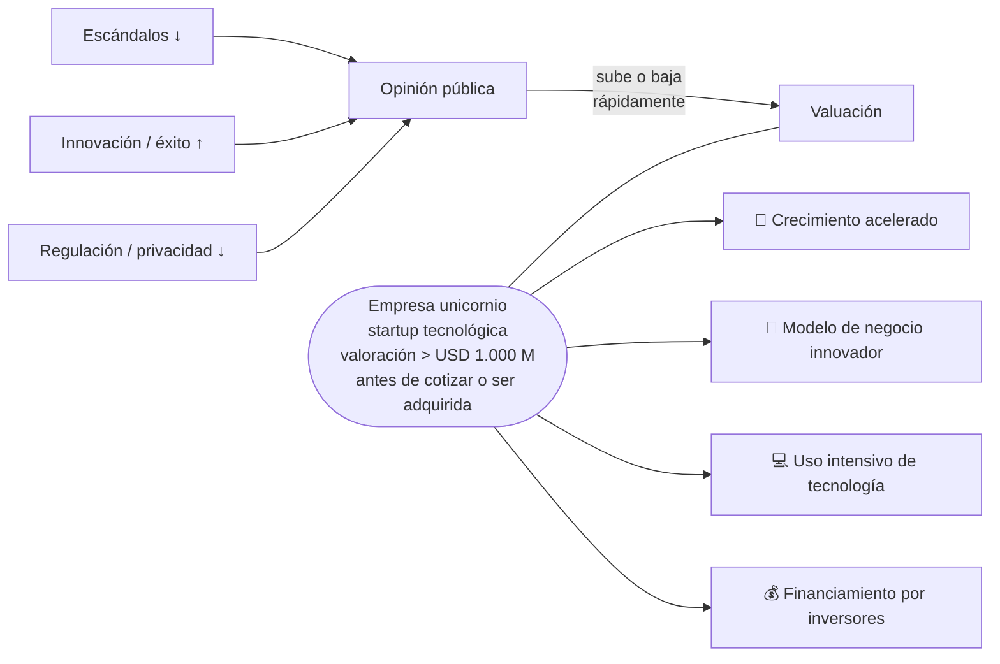
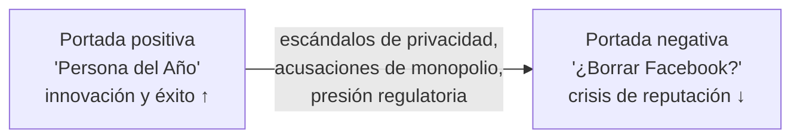

# 04 · Empresas unicornio y el impacto de la opinión pública

> **Fuente en el material:** *Clase 2 – Gestión de la innovación* (Ing. Mario Barrios), diapositivas 2–4.
> **Prerrequisitos:** [03 Tecnologías disruptivas](03-tecnologias-disruptivas.md).
> **Tiempo estimado:** 25 min.
> **Primer Parcial · Tema 04 de 16** (Clase 2). 🔥 Salió en el parcial anterior (pregunta [9](../evaluacion/parcial-anterior-resuelto.md#v9-crisis-de-datos-y-reputación-pública-el-valor-de-los-intangibles)).

---

## 🎯 Objetivos de aprendizaje

1. Definir **empresa unicornio** con sus dos condiciones (valoración y momento).
2. Explicar sus **cuatro características clave** y reconocerlas en ejemplos.
3. Explicar cómo la **opinión pública** afecta la valuación de una empresa y cuáles son los **factores de variación**.
4. Interpretar la **metáfora** con la que abre la clase.

---

## 🗺️ Esquema del tema

- **I. La metáfora de apertura ("Encuentre la metáfora")**
- **II. Empresas unicornio**
  - A. Definición
  - B. Características clave
    1. Crecimiento acelerado
    2. Modelos de negocio innovadores
    3. Uso intensivo de tecnología
    4. Financiamiento a través de inversores
  - C. Ejemplos
- **III. El impacto de la opinión pública en la valuación**
  - A. Idea central
  - B. Factores de variación
    1. Escándalos y controversias (↓)
    2. Innovaciones y éxito de producto (↑)
    3. Regulación y privacidad (↓)
  - C. Caso: de "Persona del Año" a "¿Borrar Facebook?"

---

## 🧠 Mapa visual

---

## 📖 Desarrollo

## I. La metáfora de apertura

La clase empieza con la consigna **"Encuentre la metáfora"** y una imagen: **un cardumen de peces pequeños que, nadando juntos, forman la silueta de un pez enorme** que persigue a un pez grande.

> 💡 **Interpretación (no textual de la cátedra):** muchas organizaciones o personas pequeñas, **coordinadas** y con una idea común, pueden enfrentar a un gigante. Es la historia de las startups frente a las corporaciones establecidas (y anticipa ideas que volverán en la materia: la **disrupción** que entra desde abajo, el **trabajo en equipo** de la Gestión 2.0 y la **innovación abierta**, donde "la innovación se trata de conectar nodos en una red").

---

## II. Empresas unicornio

### II.A Definición

> 📌 *"Las empresas unicornio son **startups tecnológicas** que alcanzan una **valoración de más de 1.000 millones de dólares** **antes de cotizar en bolsa o ser adquiridas**."*

Tres condiciones que tiene que tener tu definición:
1. Es una **startup tecnológica**.
2. Su **valoración supera USD 1.000 millones** (1 billón en inglés: *one billion*).
3. **Todavía no cotiza en bolsa ni fue adquirida** (es privada).

> 📝 **Citar y explayarse:** Según la cátedra, las empresas unicornio son *"startups tecnológicas que alcanzan una valoración de más de 1.000 millones de dólares antes de cotizar en bolsa o ser adquiridas"*. La definición combina tres condiciones: ser una startup con la tecnología en el centro del negocio, alcanzar esa valoración y seguir siendo privada. Lo importante es que la cifra es una **valoración**, no ventas ni ganancias: refleja lo que los inversores de capital de riesgo creen que la empresa va a valer, por su **crecimiento acelerado** y su **modelo de negocio innovador**. Uber o Airbnb antes de salir a bolsa son ejemplos: valían miles de millones por sus expectativas de crecimiento, aun sin ser rentables.

> ➕ **Contexto adicional:** el término lo acuñó la inversora **Aileen Lee** en 2013. Se eligió "unicornio" porque en ese momento era **rarísimo** que una startup llegara a esa valuación. La **valoración** es lo que los inversores estiman que vale la empresa (no sus ventas ni sus ganancias).

### II.B Características clave

| Característica | Qué significa | Cómo se conecta con la materia |
|---|---|---|
| 🚀 **Crecimiento acelerado** | Escalan muy rápido en usuarios, mercados y valuación. | Fase de crecimiento acelerado de la **curva S** (módulo [05](05-curvas-de-la-tecnologia.md)). |
| 🧠 **Modelos de negocio innovadores** | La innovación suele estar en **cómo crean y capturan valor**, más que en un invento. | Innovación de **modelo de negocio** / **modelo de ingresos** (Doblin, módulo [07](07-gestion-de-la-innovacion.md)). |
| 💻 **Uso intensivo de tecnología** | La tecnología es el núcleo del negocio, no un soporte. | Tecnologías disruptivas, datos (módulos 03–10). |
| 💰 **Financiamiento a través de inversores** | Crecen con **capital de riesgo** (*venture capital*) en sucesivas rondas, no con ganancias propias. | **Corporate Venture Capital** (módulo [14](14-innovacion-abierta.md)). |

### II.C Ejemplos de la cátedra

**Airbnb, Mercado Libre, Tienda Mía, Uber y Stripe.**

> ➕ **Contexto adicional:** varias de estas empresas ya **no son técnicamente unicornios** porque salieron a cotizar en bolsa (Mercado Libre, Airbnb, Uber). Fueron unicornios en su etapa privada. Esto es un buen detalle para mostrar que entendiste la definición ("**antes** de cotizar o ser adquiridas").

> 🧩 **Mercado Libre aplicado a las 4 características:** crecimiento acelerado en toda LATAM; modelo de negocio innovador (marketplace + Mercado Pago + logística como ecosistema); uso intensivo de tecnología (plataforma, datos, pagos digitales); financiamiento por inversores en su etapa inicial.

---

## III. El impacto de la opinión pública en la valuación

### III.A Idea central

> 📌 *"La **percepción pública** puede hacer que el **valor de una empresa unicornio suba o caiga rápidamente**."*

> 💡 **Por qué pasa esto:** como la valoración de un unicornio depende de **expectativas futuras** (lo que los inversores creen que la empresa va a valer), cualquier cosa que cambie la confianza —un escándalo, un lanzamiento exitoso, una ley nueva— mueve el valor mucho más que en una empresa madura con ganancias estables.

### III.B Factores de variación

| Factor | Efecto | Explicación de la cátedra |
|---|---|---|
| **1. Escándalos y controversias** | ⬇️ | Pueden **erosionar la confianza de los inversores** y **afectar la cotización**. |
| **2. Innovaciones y éxito de producto** | ⬆️ | **Impulsan el crecimiento** y **refuerzan la marca**. |
| **3. Regulación y privacidad** | ⬇️ | **Cambios en leyes** o **filtraciones de datos** pueden generar **crisis de reputación**. |

### III.C Caso ilustrado: Facebook (Meta)

La diapositiva muestra dos portadas de la revista *TIME* con **Mark Zuckerberg**:
- Una como **"Person of the Year"** (portada positiva).
- Otra, años después, con un cartel de **"Delete 'Facebook'?"** sobre su rostro.

> 📌 *"De ser el 'Rey de la Tecnología' en portadas positivas, a ser señalado por temas de **privacidad y monopolio**, afectando la percepción y el valor de la empresa."*

> 🔗 **Conexión clave:** este caso une el factor **regulación y privacidad** con lo visto en Data Mining y Big Data: el uso de datos personales sin límites claros **es un riesgo de negocio**, no solo ético (módulos [09](09-data-mining.md) y [10](10-big-data.md)).

> 📝 **Citar y explayarse:** La cátedra plantea que *"la percepción pública puede hacer que el valor de una empresa unicornio suba o caiga rápidamente"*. Esto ocurre porque su valor depende de la **confianza** de inversores y usuarios en lo que la empresa va a lograr, y no de resultados consolidados: un escándalo o una filtración de datos erosionan esa confianza, mientras que un lanzamiento exitoso la refuerza. El caso de Facebook lo muestra: Mark Zuckerberg pasó de las portadas como *"Rey de la Tecnología"* a ser señalado *"por temas de privacidad y monopolio"*, y ese cambio de percepción afectó el valor de la empresa. La conclusión es que, en estas empresas, la **reputación es un activo** tan importante como la tecnología.

---

## ⚠️ Conceptos que se confunden

| Se confunde… | …con | Diferencia |
|---|---|---|
| Unicornio | Empresa grande / rentable | Unicornio se define por **valoración > USD 1.000 M siendo privada**, no por ganancias. Muchos unicornios **pierden dinero** mientras crecen. |
| Valoración | Facturación | Valoración = cuánto se estima que **vale** la empresa; facturación = cuánto **vende**. |
| Unicornio | Empresa que cotiza en bolsa | Si ya cotiza o fue adquirida, **dejó de ser** unicornio en sentido estricto. |

---

## 🔗 Conexiones

- **→ [05 Curvas de la tecnología](05-curvas-de-la-tecnologia.md):** el ciclo de expectativas de Gartner también habla de cómo la percepción sube y baja.
- **→ [14 Innovación abierta](14-innovacion-abierta.md):** el *Corporate Venture Capital* (Google Ventures invirtió en Uber y Stripe) es una forma de financiar unicornios.

---

## ✍️ Autoevaluación

**1. Defina empresa unicornio y mencione sus características clave.**

Ver respuesta

Son **startups tecnológicas** que alcanzan una **valoración de más de USD 1.000 millones antes de cotizar en bolsa o ser adquiridas**. Características: **crecimiento acelerado**, **modelos de negocio innovadores**, **uso intensivo de tecnología** y **financiamiento a través de inversores**. Ejemplos: Airbnb, Mercado Libre, Tienda Mía, Uber, Stripe.

**2. Una startup argentina vale USD 1.500 M y acaba de salir a cotizar en Nasdaq. ¿Sigue siendo unicornio?**

Ver respuesta

En sentido estricto **no**: la definición exige alcanzar esa valoración **antes de cotizar en bolsa o ser adquirida**. Fue unicornio durante su etapa privada.

**3. Explique los factores que hacen variar la valuación de una empresa unicornio según la opinión pública.**

Ver respuesta

(1) **Escándalos y controversias**: erosionan la confianza de los inversores y afectan la cotización (baja). (2) **Innovaciones y éxito de producto**: impulsan el crecimiento y refuerzan la marca (sube). (3) **Regulación y privacidad**: cambios en leyes o filtraciones de datos generan crisis de reputación (baja). Ejemplo: Facebook pasó de "Persona del Año" a ser señalado por privacidad y monopolio.

**4. ¿Por qué la valuación de un unicornio es más sensible a la opinión pública que la de una empresa madura?**

Ver respuesta

Porque su valoración se basa en **expectativas de crecimiento futuro** y en la confianza de los inversores (financiamiento por rondas), no en ganancias estables. Cualquier cambio en la percepción modifica esas expectativas y, por lo tanto, el valor.

---

[← 03 Tecnologías disruptivas](03-tecnologias-disruptivas.md) · [🏠 Índice](../README.md) · [Siguiente → 05 Curvas de la tecnología](05-curvas-de-la-tecnologia.md)
