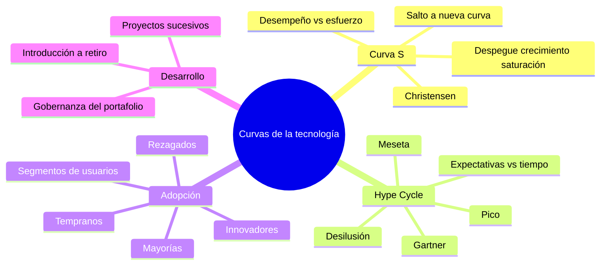
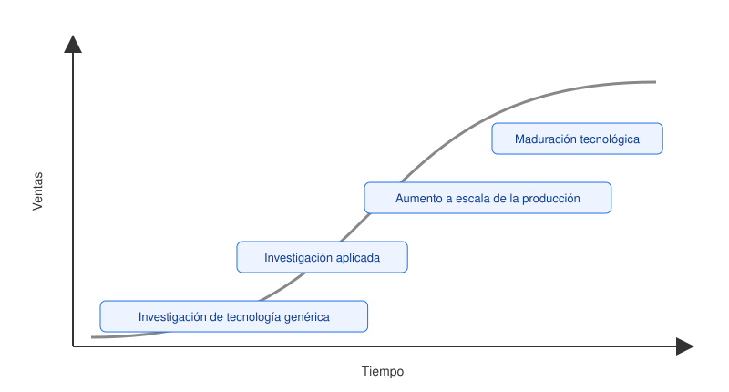
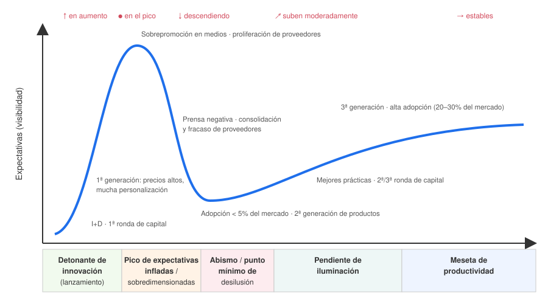
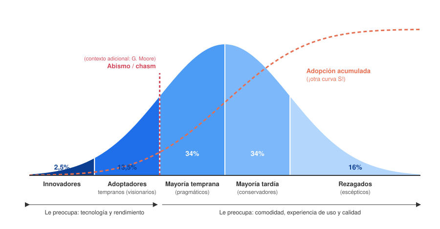
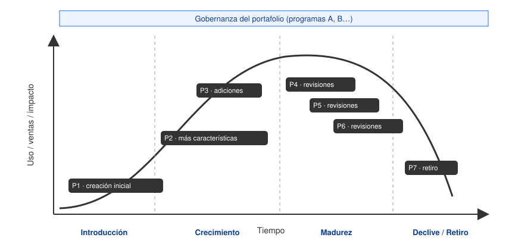

# 05 · Curvas de la tecnología

> **Fuente en el material:** *Clase 2 – Gestión de la innovación* (Ing. Mario Barrios), diapositivas 5–13.
> **Prerrequisitos:** [03 Tecnologías disruptivas](03-tecnologias-disruptivas.md).
> **Tiempo estimado:** 75 min (es uno de los temas más gráficos y preguntables).
> **Primer Parcial · Tema 05 de 13** (Clase 2). 🔥 Salió en el parcial anterior (pregunta [6](../evaluacion/parcial-anterior-resuelto.md#v6-la-curva-s-por-qué-cuidar-solo-la-tecnología-que-deja-plata-hoy-sentenció-a-nokia)).

---

## 🎯 Objetivos de aprendizaje

1. Explicar la **curva S de la tecnología** (Christensen) y sus **tres fases**.
2. Explicar por qué una **nueva curva S** empieza **antes** de que la anterior sea obsoleta, y qué tiene que ver con la disrupción.
3. Describir el **ciclo de vida** de una tecnología (de la investigación genérica a la maduración).
4. Explicar el **Ciclo de Expectativas Tecnológicas de Gartner** (*Hype Cycle*) y sus **cinco fases**.
5. Explicar la **curva de adopción tecnológica** y sus **cinco segmentos** con sus porcentajes.
6. Explicar cómo se gestiona el **desarrollo de tecnologías** como una sucesión de **proyectos** a lo largo del ciclo de vida.
7. **Diferenciar** los cuatro gráficos: qué mide cada eje y qué pregunta responde cada uno.

---

## 🗺️ Esquema del tema

- **I. Curvas "S" de la tecnología (Clayton Christensen)**
  - A. Qué explican
  - B. Las tres fases
    1. Fase inicial (despegue lento)
    2. Fase de crecimiento acelerado
    3. Fase de saturación
  - C. El salto entre curvas
  - D. Ciclo de vida de la tecnología (ventas)
- **II. Ciclo de expectativas tecnológicas (Gartner)**
  - A. Qué describe
  - B. Las cinco fases
    1. Detonante de innovación / lanzamiento tecnológico
    2. Pico de expectativas infladas (sobredimensionadas)
    3. Abismo / punto mínimo de desilusión
    4. Pendiente de iluminación
    5. Meseta de productividad
  - C. Qué pasa en el mercado en cada fase
- **III. Curva de adopción tecnológica**
  - A. Qué explica
  - B. Los cinco segmentos
    1. Innovadores (2,5 %)
    2. Adoptadores tempranos (13,5 %)
    3. Mayoría temprana (34 %)
    4. Mayoría tardía (34 %)
    5. Rezagados (16 %)
  - C. Qué le preocupa a cada grupo
- **IV. Desarrollo de tecnologías (proyectos)**
  - A. Ciclo de vida: introducción → crecimiento → madurez → declive/retiro
  - B. Proyectos sucesivos y gobernanza del portafolio
- **V. Comparación integradora de las curvas**

---

## 🧠 Mapa visual

---

## 📖 Desarrollo

## I. Curvas "S" de la tecnología (Clayton Christensen)

### I.A Qué explican

> 📌 *"Las Curvas de la Tecnología de Clayton Christensen **explican cómo las tecnologías evolucionan** y cómo **nuevas innovaciones pueden desplazar a las tecnologías existentes**."*

El gráfico de la cátedra tiene:
- **Eje vertical:** **desempeño del producto**.
- **Eje horizontal:** **tiempo o esfuerzo de ingeniería** (inversión en I+D).

> 💡 **Para entenderlo:** la curva responde a la pregunta *"si sigo invirtiendo esfuerzo en esta tecnología, ¿cuánto mejora?"*. Al principio mejora poco, después mucho, y al final casi nada. Esa forma de "S" acostada es la que le da el nombre.

### I.B Las tres fases

> 📌 *"La figura representa la curva en 'S' de la evolución tecnológica, la cual ilustra el **ciclo de vida de una tecnología a lo largo del tiempo**. Cada tecnología pasa por **tres fases principales**."*

#### I.B.1 Fase inicial (despegue lento)
- La innovación tiene un **crecimiento limitado**.
- **Por qué**: **baja eficiencia**, **falta de adopción** y **necesidad de mayor inversión en I+D**.
- Mucho esfuerzo → poca mejora visible.

#### I.B.2 Fase de crecimiento acelerado
- La tecnología **madura**, se **optimiza su rendimiento**, la **adopción se incrementa** y el mercado **reconoce su valor**.
- **La inversión genera retornos cada vez mayores** (la pendiente es máxima).

#### I.B.3 Fase de saturación
- La tecnología alcanza su **punto máximo de rendimiento**.
- Las **mejoras adicionales son marginales** y el crecimiento **se desacelera**.
- Mucho esfuerzo → casi ninguna mejora (llegó a sus **límites físicos o técnicos**).

| Fase | Esfuerzo vs. resultado | Qué conviene hacer |
|---|---|---|
| Despegue lento | Mucho esfuerzo, poco resultado | Investigar, tener paciencia, buscar nichos |
| Crecimiento acelerado | Cada peso invertido rinde mucho | Invertir fuerte y escalar |
| Saturación | Mucho esfuerzo, mejora marginal | **Buscar la próxima curva** |

### I.C El salto entre curvas

> 📌 *"En este modelo, **una nueva tecnología emerge antes de que la anterior se vuelva completamente obsoleta**, iniciando así una **nueva curva en 'S'**."*

Este es el punto **más importante** del tema:
- Cuando la tecnología 1 llega a la saturación, ya existe una tecnología 2 que está en su **despegue lento**.
- Al principio la 2 rinde **menos** que la 1 → las empresas establecidas **la subestiman**.
- Pero la 2 tiene **más techo**: cuando entra en crecimiento acelerado, **supera** a la 1 y la desplaza.
- La empresa que sigue invirtiendo solo en la curva vieja queda atrapada en **mejoras marginales**.

> 📝 **Citar y explayarse:** Las curvas S de Christensen *"explican cómo las tecnologías evolucionan y cómo nuevas innovaciones pueden desplazar a las tecnologías existentes"*. Cada tecnología pasa por tres fases: un **despegue lento**, porque al principio rinde poco y exige mucha inversión en I+D; un **crecimiento acelerado**, cuando madura y la adopción aumenta; y una **saturación**, donde las mejoras se vuelven marginales. El punto clave es que *"una nueva tecnología emerge antes de que la anterior se vuelva completamente obsoleta"*: cuando la vieja se satura, la nueva todavía rinde menos y las empresas establecidas la subestiman, pero tiene más techo y termina superándola. Por eso una empresa que solo mejora su tecnología actual queda atrapada en la saturación. La fotografía de rollo frente a la digital es el caso típico.

> 🧩 **Ejemplo:** discos rígidos mecánicos (curva 1, saturándose) → discos de estado sólido SSD (curva 2: al principio caros y de poca capacidad; hoy dominan). Otro: carrete → fotografía digital (módulo [03](03-tecnologias-disruptivas.md)).

> 🔗 **Conexión con disrupción:** las características "**empiezan con rendimiento inferior**" y "**evolución rápida**" de las tecnologías disruptivas son, literalmente, describir el inicio de una nueva curva S.

> ➕ **Contexto adicional:** el modelo de la curva S fue popularizado por **Richard Foster** (*Innovation: The Attacker's Advantage*, 1986) y Christensen lo usó como base para estudiar por qué las empresas líderes fracasan ante la disrupción (*The Innovator's Dilemma*, 1997). La cátedra lo presenta como "Curvas S de Clayton".

### I.D Ciclo de vida de la tecnología (ventas)

La cátedra muestra una segunda versión de la curva S, ahora con **ventas** en el eje vertical, y las **etapas por las que avanza la tecnología**:

1. **Investigación de tecnología genérica** – conocimiento básico, sin producto todavía.
2. **Investigación aplicada** – ese conocimiento se orienta a un uso concreto.
3. **Aumento a escala de la producción** – se fabrica en volumen; las ventas se disparan.
4. **Maduración tecnológica** – las ventas se estabilizan; la tecnología llegó a su techo.

> 💡 Notá que estas cuatro etapas se "montan" sobre las tres fases: investigación genérica y aplicada ≈ despegue lento; aumento a escala ≈ crecimiento acelerado; maduración ≈ saturación.

---

## II. Ciclo de expectativas tecnológicas (Gartner)

### II.A Qué describe

> 📌 *"El Ciclo de Expectativas Tecnológicas de **Gartner** es un modelo que describe **la evolución de una nueva tecnología desde su introducción hasta su adopción masiva**."*

- **Eje vertical:** **expectativas** (cuánto se habla y se espera de la tecnología).
- **Eje horizontal:** **tiempo**.

> 💡 **La diferencia clave con la curva S:** la curva S mide **desempeño real**. El Hype Cycle mide **expectativas (percepción)**. Por eso puede tener un pico y una caída: las expectativas se exageran y después se corrigen, aunque la tecnología siga mejorando por debajo.

### II.B Las cinco fases

| # | Fase | Expectativas | Qué pasa |
|---|---|---|---|
| 1 | **Detonante de innovación** (lanzamiento tecnológico) | **En aumento** | Aparece la tecnología (I+D), **primera ronda de capital** para emprendimientos. |
| 2 | **Pico de expectativas infladas** (sobredimensionadas) | **En el pico** | Entusiasmo desmedido, cobertura mediática, todos quieren "subirse". |
| 3 | **Abismo / punto mínimo de desilusión** | **Descendiendo** | La tecnología no cumple lo prometido tan rápido; aparece la prensa negativa. |
| 4 | **Pendiente de iluminación** | **Subiendo moderadamente** | Se entiende para qué sirve realmente; aparecen buenas prácticas. |
| 5 | **Meseta de productividad** | **Estables** | Adopción masiva; la tecnología se vuelve útil y rentable. |

### II.C Qué pasa en el mercado en cada fase (detalle de la diapositiva)

La versión detallada de la cátedra muestra los eventos de mercado a lo largo de la curva:

| Fase | Qué pasa en el mercado |
|---|---|
| **1 · Lanzamiento** | I+D · **1ª ronda de capital** para emprendimientos · **1ª generación de productos: precios altos, mucha personalización** |
| **2 · Pico** | Los primeros en adoptar investigan · **sobrepromoción en los medios** · **proliferación de proveedores** · actividad más allá de los primeros adoptantes |
| **3 · Abismo** | Empieza la **prensa negativa** · **consolidación y fracaso de proveedores** · 2ª/3ª ronda de capital · **adopción menor al 5 % del mercado total** |
| **4 · Pendiente** | **2ª generación de productos**, algunos servicios · desarrollo de **mejores prácticas y metodologías** |
| **5 · Meseta** | **3ª generación**: paquetes prearmados, familias de productos · comienza la **alta adopción: 20–30 % del mercado potencial** |

> 🧩 **Ejemplo – la IA generativa:** después del lanzamiento masivo de chatbots (detonante) hubo un enorme pico de expectativas ("va a reemplazar todos los trabajos"); luego aparecieron las críticas por errores y costos (desilusión); hoy muchas empresas están en la pendiente de iluminación, encontrando casos de uso concretos y medibles. *(Ejemplo propio para ilustrar; no está en las diapositivas.)*

> 🔗 **Conexión:** el pico de expectativas explica la sensibilidad de la valuación de los **unicornios** a la opinión pública (módulo [04](04-empresas-unicornio.md)).

> ⚠️ **Trampa de parcial:** el abismo de desilusión **no significa que la tecnología fracasó**. Muchas tecnologías pasan por el abismo y llegan a la meseta. Lo que cae son las **expectativas**, no necesariamente el desempeño.

> 📝 **Citar y explayarse:** El ciclo de Gartner *"describe la evolución de una nueva tecnología desde su introducción hasta su adopción masiva"*, pero lo que mide en el eje vertical son las **expectativas**, no el rendimiento. Tras el lanzamiento, las expectativas suben hasta un **pico sobredimensionado** impulsado por los medios y la proliferación de proveedores; luego caen al **abismo de desilusión**, cuando la tecnología no cumple tan rápido lo prometido y muchos proveedores fracasan; después suben moderadamente en la **pendiente de iluminación**, cuando aparecen buenas prácticas; y se estabilizan en la **meseta de productividad**, con una adopción del 20 al 30 % del mercado potencial. La lección es que ni el entusiasmo inicial ni la decepción posterior reflejan el valor real de la tecnología: hay que evaluarla por su uso concreto. La IA generativa, con su pico de expectativas y las críticas posteriores, es un ejemplo reciente.

---

## III. Curva de adopción tecnológica

### III.A Qué explica

> 📌 *"La Curva de Adopción Tecnológica explica **cómo diferentes grupos adoptan una nueva tecnología con el tiempo**. Se divide en **cinco segmentos**: Innovadores, Adoptadores Tempranos, Mayoría Temprana, Mayoría Tardía y Rezagados. Este modelo ayuda a entender **la velocidad de adopción** y **las estrategias necesarias** para impulsar la difusión de una innovación en el mercado."*

### III.B Los cinco segmentos

| Segmento | % | Perfil (según el gráfico de la cátedra) | Cómo piensan |
|---|---|---|---|
| **Innovadores** | **2,5 %** | Entusiastas de la tecnología | "Quiero probarlo primero, aunque falle." |
| **Adoptadores tempranos** (*early adopters*) | **13,5 %** | **Visionarios** | "Veo la ventaja estratégica antes que otros." |
| **Mayoría temprana** (precoz) | **34 %** | **Pragmáticos** | "Lo adopto cuando veo que funciona y otros lo usan." |
| **Mayoría tardía** (retrasada) | **34 %** | **Conservadores** | "Lo adopto cuando ya es el estándar." |
| **Rezagados** | **16 %** | **Escépticos** | "Lo adopto solo si no me queda otra." |

> 💡 **Truco para recordar los porcentajes:** son simétricos alrededor del centro: **2,5 + 13,5 = 16** a la izquierda; **34 | 34** en el medio; **16** a la derecha. Suman **100**.

### III.C Qué le preocupa a cada grupo

El gráfico de la cátedra marca dos zonas debajo de la curva:
- **Innovadores y adoptadores tempranos** → *"al cliente le preocupa la **tecnología y el rendimiento**"*.
- **Mayorías y rezagados** → *"al cliente le preocupa la **comodidad, la experiencia de uso y la calidad**"*.

Además, la línea gris de **"Valor"** (percibido de la novedad) es alta al principio y cae a medida que la tecnología se masifica.

> ⚠️ **El salto crítico:** en el gráfico aparece un **signo de pregunta** entre los adoptadores tempranos y la mayoría temprana. Ese es el punto donde muchas innovaciones se estancan: lo que convence a un visionario (rendimiento, novedad) **no convence** a un pragmático (que quiere comodidad, calidad y referencias).
>
> ➕ **Contexto adicional:** ese salto se conoce como **"el abismo" (*chasm*)**, concepto de **Geoffrey Moore** (*Crossing the Chasm*, 1991). Ojo: **no confundir** con el "abismo de desilusión" de Gartner, que habla de expectativas.

> ➕ **Contexto adicional:** el modelo de los cinco segmentos proviene de **Everett Rogers**, *Diffusion of Innovations* (1962). Si sumás la adopción acumulada a lo largo del tiempo, obtenés **otra curva S** (línea punteada del gráfico).

> 🧩 **Ejemplo – pagos con QR en Argentina:** innovadores y early adopters lo usaron apenas apareció; la mayoría temprana se sumó cuando muchos comercios lo aceptaban; la mayoría tardía cuando "todo el mundo" lo usaba; los rezagados siguen prefiriendo efectivo.

> 📝 **Citar y explayarse:** La curva de adopción *"explica cómo diferentes grupos adoptan una nueva tecnología con el tiempo"*: innovadores (2,5 %), adoptadores tempranos (13,5 %), mayoría temprana (34 %), mayoría tardía (34 %) y rezagados (16 %). Su utilidad, según la cátedra, es entender *"la velocidad de adopción y las estrategias necesarias"* para difundir una innovación, porque cada grupo valora cosas distintas: a los primeros les importan la **tecnología y el rendimiento**; al resto, la **comodidad, la experiencia de uso y la calidad**. Por eso el paso de los adoptadores tempranos a la mayoría temprana es crítico: lo que convence a un visionario no convence a un pragmático, que necesita ver que la tecnología ya funciona y que otros la usan. Muchas innovaciones fracasan justamente en ese salto.

---

## IV. Desarrollo de tecnologías (proyectos)

### IV.A El ciclo de vida

> 📌 *"El desarrollo de tecnologías sigue un **ciclo de vida que va desde la introducción hasta su retiro**. **Cada proyecto evoluciona mediante mejoras y revisiones**, aumentando su impacto y uso hasta alcanzar la madurez. Finalmente, cuando la tecnología **deja de ser competitiva**, se inicia su **declive y retiro** del mercado."*

### IV.B Proyectos sucesivos y gobernanza del portafolio

El gráfico de la cátedra muestra que **una tecnología no se desarrolla en un único proyecto**, sino en una **secuencia** que acompaña cada etapa:

| Etapa | Proyecto(s) | Qué se hace |
|---|---|---|
| **Introducción** | Proyecto 1 – **creación inicial** | Primera versión. |
| **Crecimiento** | Proyecto 2 – **más características**; Proyecto 3 – **adiciones** | Se amplían funcionalidades. |
| **Madurez** | Proyectos 4, 5 y 6 – **revisiones** | Mejoras incrementales, mantenimiento. |
| **Declive / retiro** | Proyecto 7 – **retiro** | Se discontinúa la tecnología. |

Por encima de los proyectos aparecen los **programas** (A, B) y la **gobernanza del portafolio**: la organización decide **en qué programas y proyectos invertir** según dónde está cada tecnología en su ciclo.

> 🧩 **Ejemplo de software:** v1.0 de una app (creación inicial) → v2 con más funciones → integraciones (adiciones) → parches y versiones menores (revisiones) → *end of life* y migración a un producto nuevo (retiro).

> 🔗 Conecta con **proyectos de innovación** y **estrategia** (módulo [16](../resto-de-la-materia/16-proyectos-y-estrategia-de-innovacion.md)): la estrategia define el portafolio.

> 📝 **Citar y explayarse:** Para la cátedra, el desarrollo de tecnologías *"sigue un ciclo de vida que va desde la introducción hasta su retiro"* y *"cada proyecto evoluciona mediante mejoras y revisiones"*. Esto implica que una tecnología no se construye en un solo proyecto: hay un proyecto de creación inicial, otros que agregan características durante el crecimiento, revisiones en la madurez y, finalmente, un proyecto de retiro cuando *"deja de ser competitiva"*. Por encima, los programas y la **gobernanza del portafolio** deciden en qué invertir según la etapa de cada tecnología. Una aplicación de software lo muestra bien: versión 1.0, versiones con nuevas funciones, parches de mantenimiento y, al final, el fin de soporte y la migración a un producto nuevo.

---

## V. Comparación integradora de las curvas

Esta tabla es **la clave para no mezclar** los modelos en el parcial:

| Modelo | Autor (según la cátedra) | Eje Y | Eje X | Forma | Pregunta que responde |
|---|---|---|---|---|---|
| **Curva S** | Clayton Christensen | **Desempeño** del producto | Tiempo / **esfuerzo de ingeniería** | S | ¿Cuánto mejora la tecnología si sigo invirtiendo? ¿Cuándo saltar a otra? |
| **Ciclo de vida (ventas)** | — | **Ventas** | Tiempo | S | ¿En qué etapa (investigación → maduración) está? |
| **Hype Cycle** | **Gartner** | **Expectativas** | Tiempo | Pico, valle y meseta | ¿Qué tan inflada está la percepción? ¿Cuándo madura? |
| **Adopción** | — (Rogers, contexto adicional) | **Cantidad de adoptantes** | Tiempo | Campana | ¿**Quién** adopta y en qué orden? ¿Qué estrategia necesito? |
| **Desarrollo de tecnologías** | — | Uso / ventas / impacto | Tiempo | Campana asimétrica | ¿Qué **proyecto** corresponde a cada etapa? |

---

## ⚠️ Conceptos que se confunden

| Se confunde… | …con | Diferencia |
|---|---|---|
| Curva S | Hype Cycle | **Desempeño real** vs. **expectativas** (percepción). |
| Abismo de desilusión (Gartner) | Abismo/chasm (Moore, adopción) | Caída de **expectativas** vs. salto difícil **entre early adopters y mayoría temprana**. |
| Saturación (curva S) | Declive (ciclo de vida) | En saturación la tecnología **sigue vendiendo** pero ya no mejora; en declive **pierde competitividad** y se retira. |
| Innovadores | Adoptadores tempranos | 2,5 % entusiastas vs. 13,5 % **visionarios** con visión estratégica. |
| "Nueva curva cuando la vieja murió" | — | **Falso:** la nueva emerge **antes** de que la anterior sea obsoleta. |

---

## 🔗 Conexiones

- **← [03 Tecnologías disruptivas](03-tecnologias-disruptivas.md):** la disrupción es el inicio de una nueva curva S.
- **← [04 Unicornios](04-empresas-unicornio.md):** expectativas y valuación.
- **→ [06 Schumpeter](06-schumpeter-destruccion-creativa-y-ciclos.md):** a escala de toda la economía, las oleadas de innovación generan ciclos.
- **→ [17 Lean Startup](../resto-de-la-materia/17-lean-startup-y-mvp.md):** validar con early adopters antes de escalar.

---

## ✍️ Autoevaluación

**1. Explique la curva S de la tecnología y sus tres fases.**

Ver respuesta

La curva S (Christensen) explica cómo evoluciona el **desempeño** de una tecnología en función del **tiempo o esfuerzo de ingeniería** y cómo nuevas innovaciones desplazan a las existentes. (1) **Fase inicial / despegue lento**: crecimiento limitado por baja eficiencia, falta de adopción y necesidad de inversión en I+D. (2) **Crecimiento acelerado**: la tecnología madura, se optimiza, aumenta la adopción y la inversión genera retornos crecientes. (3) **Saturación**: se alcanza el máximo rendimiento; las mejoras son marginales. Una nueva tecnología emerge **antes** de que la anterior sea obsoleta, iniciando una nueva curva.

**2. Una empresa líder sigue invirtiendo en mejorar su tecnología, pero cada año logra mejoras más pequeñas. Mientras, una startup lanza una tecnología nueva que hoy rinde menos. ¿Qué le aconsejaría según la curva S?**

Ver respuesta

La empresa está en la **fase de saturación**: más esfuerzo produce mejoras marginales. La startup está en el **despegue lento** de una **nueva curva S**, con más techo. Aunque hoy rinda menos, puede entrar en crecimiento acelerado y superarla. Conviene **explorar o invertir en la nueva tecnología** (internamente o vía innovación abierta/CVC) antes de ser desplazada.

**3. Nombre y describa las cinco fases del ciclo de Gartner.**

Ver respuesta

(1) **Detonante de innovación / lanzamiento**: aparece la tecnología, I+D, primera ronda de capital; expectativas en aumento. (2) **Pico de expectativas infladas**: sobrepromoción en medios, proliferación de proveedores. (3) **Abismo / punto mínimo de desilusión**: prensa negativa, consolidación y fracaso de proveedores, adopción < 5 %. (4) **Pendiente de iluminación**: segunda generación de productos, mejores prácticas; expectativas suben moderadamente. (5) **Meseta de productividad**: tercera generación, alta adopción (20–30 % del mercado potencial); expectativas estables.

**4. Indique los cinco segmentos de la curva de adopción con sus porcentajes y qué le preocupa a cada grupo.**

Ver respuesta

Innovadores 2,5 %; adoptadores tempranos (visionarios) 13,5 %; mayoría temprana (pragmáticos) 34 %; mayoría tardía (conservadores) 34 %; rezagados (escépticos) 16 %. A innovadores y early adopters les preocupa la **tecnología y el rendimiento**; a las mayorías y rezagados, la **comodidad, la experiencia de uso y la calidad**.

**5. ¿En qué se diferencia la curva S del Hype Cycle?**

Ver respuesta

La curva S mide el **desempeño real** de la tecnología según el esfuerzo de ingeniería (forma de S, sin caídas). El Hype Cycle mide las **expectativas** sobre la tecnología a lo largo del tiempo (pico, valle de desilusión y meseta). Una tecnología puede seguir mejorando (curva S) mientras sus expectativas caen (Gartner).

**6. Describa cómo se organiza el desarrollo de una tecnología en proyectos a lo largo de su ciclo de vida.**

Ver respuesta

El ciclo va de **introducción** (proyecto de creación inicial) a **crecimiento** (proyectos que agregan características y adiciones), **madurez** (proyectos de revisión) y **declive/retiro** (proyecto de retiro cuando deja de ser competitiva). Los proyectos se agrupan en **programas** bajo una **gobernanza del portafolio** que decide dónde invertir.

---

[← 04 Empresas unicornio y el impacto de la opinión pública](04-empresas-unicornio.md) · [🏠 Índice](../README.md) · [Siguiente → 06 Schumpeter](06-schumpeter-destruccion-creativa-y-ciclos.md)
