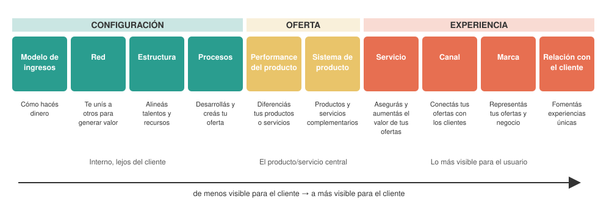
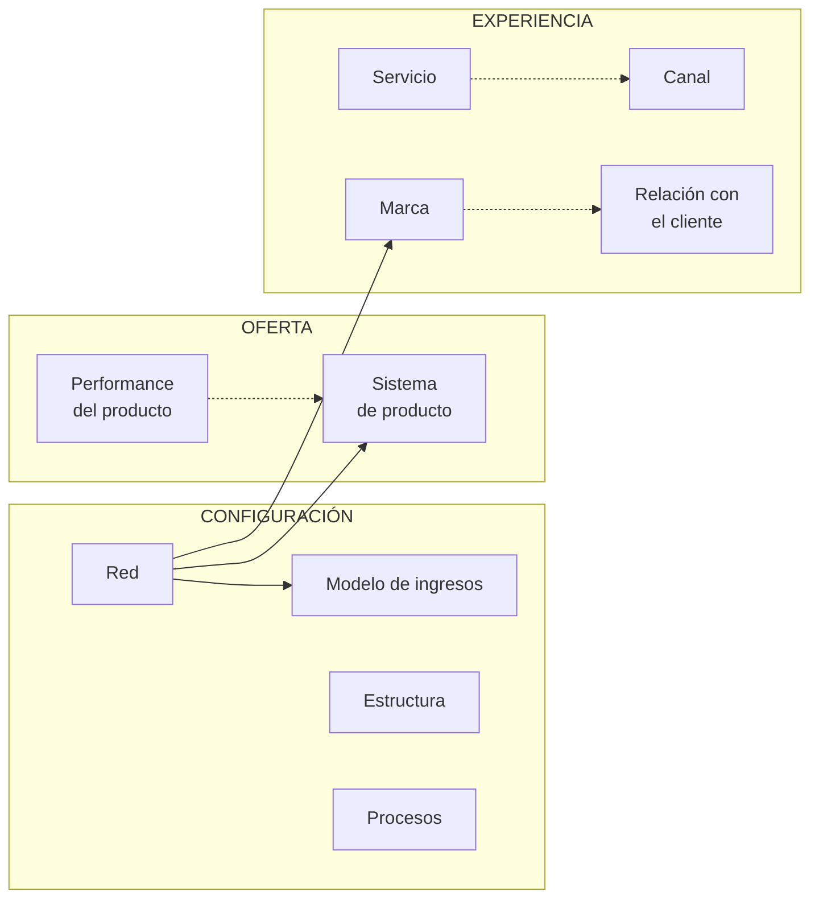
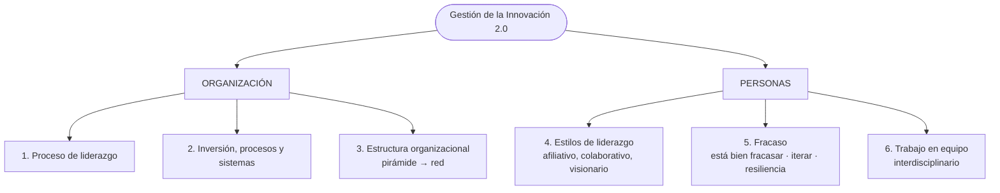

# 07 · Gestión de la innovación: los 10 tipos de Doblin y la Gestión 2.0

> **Fuente en el material:** *Clase 2 – Gestión de la innovación* (Ing. Mario Barrios), diapositivas 19–25.
> **Prerrequisitos:** [06 Schumpeter](06-schumpeter-destruccion-creativa-y-ciclos.md).
> **Tiempo estimado:** 60 min.
> **Primer Parcial · Tema 07 de 14** (Clase 2). 🔥 Salió en el parcial anterior (pregunta [5](../evaluacion/parcial-anterior-resuelto.md#iii5-los-10-tipos-de-innovación-de-doblin-las-3-categorías--explicar-una) y [8](../evaluacion/parcial-anterior-resuelto.md#v8-gestión-de-la-innovación-20-por-qué-juntar-a-los-jefes-no-es-trabajar-interdisciplinariamente)).

---

## 🎯 Objetivos de aprendizaje

1. Enumerar y explicar los **10 tipos de innovación de Doblin** y su agrupación en **Configuración, Oferta y Experiencia**.
2. Explicar el criterio de ordenamiento (**de lo interno a lo visible para el cliente**).
3. Explicar por qué **combinar varios tipos** genera innovaciones más potentes (impacto en las funciones de la empresa).
4. Describir los **seis pilares de la Gestión de la Innovación 2.0**.
5. Explicar el rol de las **habilidades blandas** en la mirada moderna de la innovación.

---

## 🗺️ Esquema del tema

- **I. Qué es gestionar la innovación**
- **II. Los 10 tipos de innovación según Doblin**
  - A. Configuración (interno)
    1. Modelo de ingresos
    2. Red
    3. Estructura
    4. Procesos
  - B. Oferta (el producto/servicio central)
    5. Performance del producto
    6. Sistema de producto
  - C. Experiencia (lo más visible para el usuario)
    7. Servicio
    8. Canal
    9. Marca
    10. Relación con el cliente (*customer engagement*)
  - D. Impacto en las funciones de la empresa: combinar tipos
- **III. La mirada moderna**
  - A. Gestión de la Innovación 2.0
    1. Proceso de liderazgo
    2. Inversión, procesos y sistemas
    3. Estructura organizacional
    4. Estilos de liderazgo
    5. Fracaso
    6. Trabajo en equipo
  - B. Habilidades blandas

---

## 🧠 Mapa visual

---

## 📖 Desarrollo

## I. Qué es gestionar la innovación

> 🔥 **Prioridad de parcial:** "Gestión de la innovación" quedó marcada como **#importante** en las notas de la Clase 2. Lo que se remarcó en clase: **antes** las organizaciones tenían **estructura piramidal (jerárquica)** y **la innovación no es compatible con la estructura clásica** → por eso la Gestión 2.0 propone el modelo en red (III.A.3).

Hasta ahora vimos **qué** es la innovación y **cómo evoluciona** (curvas, ciclos). La **gestión de la innovación** se pregunta: *¿cómo hace una organización para innovar de forma sistemática y no por casualidad?*

Para eso la cátedra presenta dos herramientas:
1. Un **mapa** de dónde se puede innovar → **los 10 tipos de Doblin**.
2. Una **forma de organizarse** para que la innovación ocurra → **la Gestión de la Innovación 2.0**.

> 💡 **Para entenderlo:** muchas empresas creen que innovar = sacar un producto nuevo. Doblin muestra que el producto es solo **2 de 10** lugares posibles para innovar.

---

## II. Los 10 tipos de innovación según Doblin

Los diez tipos se agrupan en **tres categorías**, ordenadas **de izquierda a derecha según su visibilidad para el cliente**:

> 📌 *"Los tipos ubicados a la izquierda están enfocados en **aspectos internos y más alejados del cliente**. Este tipo de innovación [el del medio] está enfocada en el **producto o servicio principal del negocio**. Finalmente, a la derecha se encuentran los tipos **más visibles y evidentes para los usuarios finales**."*

### II.A Configuración (interno, lejos del cliente)

| # | Tipo | Función (cátedra) | Explicación | Ejemplo |
|---|---|---|---|---|
| 1 | **Modelo de ingresos** (*Profit Model*) | **Cómo hacés dinero** | Nueva forma de cobrar y capturar valor. | Netflix y Spotify: **suscripción** en lugar de venta por unidad. |
| 2 | **Red** (*Network*) | **Te unís a otros para generar valor** | Alianzas y colaboraciones con terceros. | Programa Connect+Develop de P&G (innovación abierta). |
| 3 | **Estructura** (*Structure*) | **Alineás tus talentos y recursos** | Cómo se organiza la empresa internamente. | Squads autónomos de Spotify. |
| 4 | **Procesos** (*Process*) | **Desarrollás y creás tu oferta** | Métodos superiores para producir. | Producción *just in time* de Zara. |

### II.B Oferta (el producto o servicio central)

| # | Tipo | Función (cátedra) | Explicación | Ejemplo |
|---|---|---|---|---|
| 5 | **Performance del producto** (*Product Performance*) | **Diferenciás tus productos o servicios** | Características y funcionalidades distintivas. | Autos eléctricos de alto rendimiento de Tesla. |
| 6 | **Sistema de producto** (*Product System*) | **Creás productos y servicios complementarios** | Productos que funcionan juntos como sistema. | Ecosistema Apple: iPhone + Mac + iCloud + Apple Pay. |

### II.C Experiencia (lo más visible para el usuario)

| # | Tipo | Función (cátedra) | Explicación | Ejemplo |
|---|---|---|---|---|
| 7 | **Servicio** (*Service*) | **Asegurás y aumentás el valor de tus ofertas** | Soporte y mejoras que rodean al producto. | Atención al cliente superior de Singapore Airlines. |
| 8 | **Canal** (*Channel*) | **Conectás tus ofertas con los clientes y usuarios** | Cómo llega la oferta al cliente. | Venta directa online / omnicanalidad. |
| 9 | **Marca** (*Brand*) | **Representás tus ofertas y negocio** | Cómo se comunica y percibe la propuesta. | Beyond Meat: marca asociada a salud y sostenibilidad. |
| 10 | **Relación con el cliente** (*Customer Engagement*) | **Fomentás experiencias únicas** | Interacciones significativas y comunidad. | Comunidades de usuarios, personalización. |

> 💡 **Regla mnemotécnica:** **C-O-E** → **C**onfiguración (cómo me organizo) → **O**ferta (qué vendo) → **E**xperiencia (cómo lo vive el cliente). De **adentro hacia afuera**.

### II.D Impacto en las funciones de la empresa: combinar tipos

La tercera diapositiva de Doblin muestra **flechas que conectan distintos tipos entre sí** (por ejemplo, de *Network* a *Profit Model*, de *Network* a *Product System* y a *Brand*), bajo el título **"Impacto en las funciones de la empresa"**.

> 💡 **La idea:** una innovación en un tipo **impacta en otras funciones** de la empresa. Las innovaciones más fuertes y difíciles de copiar **combinan varios tipos a la vez**.

> ⚠️ **Por qué la cátedra lo enseña en "gestión":** si una empresa solo innova en **performance del producto**, la competencia la copia rápido. Innovar en **configuración** (procesos, estructura, red, modelo de ingresos) es menos visible pero **más difícil de copiar**.

---

## III. La mirada moderna

La cátedra plantea que la gestión de la innovación actual tiene dos componentes: **Gestión de la Innovación 2.0** y **Habilidades blandas**.

### III.A Gestión de la Innovación 2.0

Son **seis pilares**, presentados en dos diapositivas:

#### III.A.1 Proceso de liderazgo
> 📌 *"El rol del **director y equipo de alto cargo** que poseen y toman roles de líderes: **si no brindan el ambiente favorable para la innovación, nunca podrá emerger** dentro de la organización."*

#### III.A.2 Inversión, procesos y sistemas
> 📌 *"Se requiere **inversión, procesos y sistemas que operen coherentemente**. **El corto plazo, los resultados inmediatos y la preponderancia de lo operativo sobre lo estratégico van en detrimento de la innovación**."*

#### III.A.3 Estructura organizacional
> 📌 *"Los **modelos jerárquico-piramidales** son un **detractor/freno** de la innovación. La evolución a **modelos en 'Red'** operan y se adaptan a las dinámicas necesarias para innovar."*

| Modelo piramidal | Modelo en red |
|---|---|
| Decisiones arriba, ejecución abajo | Nodos con autonomía conectados entre sí |
| Lento para aprobar ideas nuevas | Rápido para experimentar |
| Silos por área | Colaboración transversal |

> 🔗 La idea de **red** reaparece en innovación abierta: *"la innovación se trata de conectar nodos en una red"* (módulo [17](../resto-de-la-materia/17-innovacion-abierta.md)), y en los **squads** de Spotify (módulo [21](../resto-de-la-materia/21-kpi.md)).

#### III.A.4 Estilos de liderazgo
> 📌 *"Los **estilos rígidos** son reemplazados por los líderes que poseen comportamientos **de afiliación, colaborativos y visionarios**."*

#### III.A.5 Fracaso
> 📌 *"**Está bien fracasar.** No hay posibilidad de lograr innovar si no se posee **capacidad de aceptar los fracasos y mejorar sobre ellos**. **Iterar y resiliencia**."*

#### III.A.6 Trabajo en equipo
> 📌 *"Los equipos poseen características **interdisciplinarias**. **No es realizar algo con varios sectores**, es la **capacidad de un diseño y trabajo colaborativo entre ellos**."*

> ⚠️ **Matiz importante:** juntar a gente de distintas áreas en una reunión **no** es trabajo interdisciplinario. Lo es cuando **diseñan y construyen juntos** la solución.

### III.B Habilidades blandas

La cátedra las presenta como el segundo pilar de la "mirada moderna".

---

## ⚠️ Conceptos que se confunden

| Se confunde… | …con | Diferencia |
|---|---|---|
| Modelo de ingresos | Canal | Cómo **cobrás** vs. cómo **llegás** al cliente. |
| Performance del producto | Sistema de producto | Lo que hace **un** producto vs. productos **complementarios** que funcionan juntos. |
| Servicio | Relación con el cliente | Soporte que **aumenta el valor** de la oferta vs. **experiencias únicas** e interacción. |
| Red (Doblin) | Estructura | Red = alianzas **con otros** (externo); Estructura = organización **interna** de talentos y recursos. |
| Trabajo en equipo interdisciplinario | Reunión con varias áreas | Debe haber **diseño y trabajo colaborativo** real. |

---

## 🔗 Conexiones

- **← [06 Schumpeter](06-schumpeter-destruccion-creativa-y-ciclos.md):** primeros "tipos de innovación".
- **→ [11 Creatividad](11-creatividad-y-proceso-creativo.md):** la creatividad es el punto de partida de la innovación.
- **→ [17 Innovación abierta](../resto-de-la-materia/17-innovacion-abierta.md):** el tipo "Red" llevado al extremo.

---

## ✍️ Autoevaluación

**1. Enumere los 10 tipos de innovación de Doblin agrupados por categoría.**

Ver respuesta

**Configuración**: modelo de ingresos, red, estructura, procesos. **Oferta**: performance del producto, sistema de producto. **Experiencia**: servicio, canal, marca, relación con el cliente.

**2. ¿Con qué criterio se ordenan las tres categorías de Doblin?**

Ver respuesta

Por su **visibilidad para el cliente**: a la izquierda (Configuración) los aspectos **internos y alejados del cliente**; en el centro (Oferta) el **producto o servicio principal**; a la derecha (Experiencia) los tipos **más visibles y evidentes para los usuarios finales**.

**3. Clasifique según Doblin: (a) Spotify cobra suscripción mensual; (b) Apple integra iPhone, Mac y iCloud; (c) una empresa reorganiza sus áreas en equipos autónomos; (d) una aerolínea redefine la atención a bordo.**

Ver respuesta

(a) **Modelo de ingresos**. (b) **Sistema de producto**. (c) **Estructura**. (d) **Servicio**.

**4. ¿Por qué conviene combinar varios tipos de innovación?**

Ver respuesta

Porque una innovación en un tipo **impacta en otras funciones** de la empresa, y las innovaciones que combinan varios tipos (especialmente de configuración, menos visibles) son **más potentes y difíciles de copiar** que las que se basan solo en el producto.

**5. Explique los seis pilares de la Gestión de la Innovación 2.0.**

Ver respuesta

(1) **Proceso de liderazgo**: la dirección debe crear el ambiente favorable o la innovación nunca emerge. (2) **Inversión, procesos y sistemas** coherentes; el cortoplacismo y lo operativo sobre lo estratégico la perjudican. (3) **Estructura**: la pirámide jerárquica frena; el modelo en **red** se adapta. (4) **Estilos de liderazgo**: de rígidos a **afiliativos, colaborativos y visionarios**. (5) **Fracaso**: está bien fracasar; aceptar, mejorar, **iterar y resiliencia**. (6) **Trabajo en equipo interdisciplinario**: diseño y trabajo colaborativo real entre sectores.

**6. Una empresa dice querer innovar pero exige resultados cada trimestre y despide a quien lidera un proyecto fallido. ¿Qué pilares de la Gestión 2.0 está violando?**

Ver respuesta

**Inversión, procesos y sistemas** (cortoplacismo y resultados inmediatos van en detrimento de la innovación), **Fracaso** (no acepta el error como parte del aprendizaje) y probablemente **Proceso de liderazgo** y **Estilos de liderazgo** (no genera un ambiente favorable; liderazgo rígido).

---

[← 06 Schumpeter](06-schumpeter-destruccion-creativa-y-ciclos.md) · [🏠 Índice](../README.md) · [Siguiente → 08 Business Intelligence](08-business-intelligence.md)
