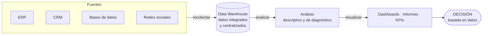
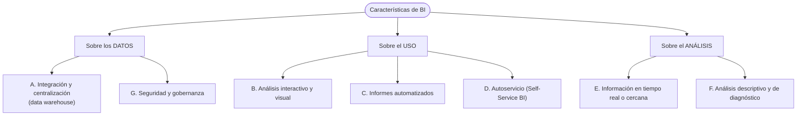

# 08 · Business Intelligence (BI)

> **Fuente en el material:** *Clase "Pinamar" 2026* (Prof. Gustavo E. Escandell), diapositivas 20–32.
> **Prerrequisitos:** [03 Tecnologías disruptivas](03-tecnologias-disruptivas.md).
> **Tiempo estimado:** 30 min.
> **Primer Parcial · Tema 08 de 14** (Clase 3). 🔥 Salió en el parcial anterior (pregunta [3](../evaluacion/parcial-anterior-resuelto.md#iii3-business-intelligence-vs-data-mining)).

---

## 🎯 Objetivos de aprendizaje

1. Definir **Business Intelligence** y explicar su **proceso** (recolectar → almacenar → analizar → visualizar).
2. Explicar **para qué sirve** y sus **características**.
3. Distinguir BI de Data Mining y Big Data (se completa en los módulos 09 y 10).

---

## 🗺️ Esquema del tema

- **I. Definición**
- **II. Aspectos clave**
  1. Proceso
  2. Objetivo
  3. Componentes
  4. Herramientas comunes
- **III. Para qué sirve** (5 usos)
- **IV. Características**
  - A. Integración y centralización de datos
  - B. Análisis interactivo y visual
  - C. Informes automatizados
  - D. Autoservicio (Self-Service BI)
  - E. Información en tiempo real o cercana
  - F. Análisis descriptivo y de diagnóstico
  - G. Seguridad y gobernanza

---

## 🧠 Mapa visual: cómo fluye la información en BI

---

## 📖 Desarrollo

## I. Definición

> 📌 *"El Business Intelligence (BI) o inteligencia empresarial es el **conjunto de tecnologías, procesos y herramientas** que **transforman datos brutos en información significativa y accionable**. Permite a las empresas **analizar datos históricos y actuales** para **tomar decisiones estratégicas fundamentadas**, optimizar el rendimiento y detectar tendencias."*

Palabras clave para la respuesta de parcial:
- **Conjunto** de tecnologías, procesos y herramientas (no es un solo software).
- **Datos brutos → información accionable** (la transformación es el corazón).
- **Históricos y actuales** (mira hacia atrás y al presente).
- **Decisiones estratégicas fundamentadas**.

> 🔥 **Síntesis de clase (Clase 3, notas de cursada):** BI es el **uso de dashboards, Big Data y Data Mining para la toma de decisiones** basada en el análisis de información y la **predicción de patrones**. Es decir: BI **integra** a los otros dos temas del bloque (🔗 módulo [10](10-big-data.md)).

> 💡 **Para entenderlo – la escalera dato → decisión:**
> - **Dato**: "Sucursal 4 vendió $2.300.000 en marzo."
> - **Información**: "La Sucursal 4 vendió 18 % menos que en febrero, y es la única que bajó."
> - **Conocimiento accionable**: "La caída coincide con la obra en la calle de enfrente → conviene reforzar delivery en esa zona."
> BI es lo que te sube por esa escalera.

---

## II. Aspectos clave

> 🔥 **Prioridad de parcial:** en el apunte de cursada esta lista está marcada literalmente como **"PONER EN PARCIAL"**. Aprendé los 4 aspectos (proceso, objetivo, componentes, herramientas) para **citarlos y explicar cada uno con un ejemplo**.

| # | Aspecto | Contenido |
|---|---|---|
| 1 | **Proceso** | Implica **recolectar, almacenar, analizar y visualizar** datos. |
| 2 | **Objetivo** | **Convertir datos en conocimiento** para mejorar la toma de decisiones. |
| 3 | **Componentes** | **Tableros de control (dashboards)**, **informes**, **minería de datos** y **analítica descriptiva**. |
| 4 | **Herramientas comunes** | Microsoft **Power BI**, **Tableau**, **Qlik**, **Looker** (Google Cloud). |

> 🔗 Fijate que la **minería de datos** aparece como **componente** de BI. Por eso BI y Data Mining están emparentados (módulo [09](09-data-mining.md)).

---

## III. Para qué sirve

1. **Tomar decisiones más rápidas y acertadas** – analiza datos históricos y actuales de **ventas, marketing, finanzas y operaciones** para **prever tendencias** y entender la posición en el mercado.
2. **Visualizar datos complejos** – transforma grandes volúmenes en **dashboards interactivos**, gráficos y reportes fáciles de entender (ej. Power BI).
3. **Identificar ineficiencias** – detecta áreas de mejora en procesos internos, **reduciendo costos**.
4. **Conocer mejor al cliente** – analiza **comportamientos de compra** para personalizar ofertas y mejorar la experiencia.
5. **Obtener ventaja competitiva** – monitorea el rendimiento propio **frente a la competencia** y el mercado.

## IV. Características

La cátedra presenta siete características en dos diapositivas. Agrupadas en esquema:

### IV.A Integración y centralización de datos
Recopila información de **diversas fuentes** (bases de datos, **ERP**, **CRM**, redes sociales) **en un único lugar**, generalmente un **data warehouse**.

> ➕ **Contexto adicional – data warehouse:** es un repositorio diseñado para **análisis** (no para operar el día a día). Los datos se extraen de los sistemas operativos, se limpian y se cargan (proceso **ETL**: *Extract, Transform, Load*). Así todos consultan "una sola versión de la verdad".

### IV.B Análisis interactivo y visual
Explorar datos mediante **gráficos y paneles interactivos** para comprender tendencias y patrones.

### IV.C Informes automatizados
Generar **reportes personalizados de forma automática** para monitorear **KPIs**.

### IV.D Autoservicio (Self-Service BI)
Capacita a **usuarios de negocio sin conocimientos técnicos profundos** para **consultar datos y crear informes por sí mismos**.

> 💡 **Por qué importa:** antes, cada informe había que pedírselo a sistemas y tardaba días. Con self-service, el gerente comercial arma su propio tablero en Power BI. Esto **democratiza** los datos.

### IV.E Información en tiempo real o cercana
Visibilidad **actualizada** para **reaccionar rápidamente** ante cambios.

### IV.F Análisis descriptivo y de diagnóstico
Se centra en explicar **qué sucedió** y **por qué sucedió**, analizando datos **históricos**.

> ⚠️ **Característica clave para diferenciar BI de Data Mining:** BI responde **qué pasó y por qué**. La **predicción** (qué va a pasar) es el terreno fuerte del **Data Mining** (modelado predictivo).

### IV.G Seguridad y gobernanza
Asegura la **privacidad** de los datos y garantiza que la información sea **confiable y controlada**.

---

## ⚠️ Conceptos que se confunden

| Se confunde… | …con | Diferencia |
|---|---|---|
| BI | Un software (Power BI) | BI es un **conjunto** de tecnologías, procesos y herramientas. Power BI es **una** herramienta. |
| BI | Data Mining | BI: **qué pasó y por qué** (descriptivo/diagnóstico, dashboards). DM: **descubre patrones ocultos y predice** (algoritmos). DM es un **componente** que BI puede usar. |
| Data warehouse | Base de datos operativa | El DW está pensado para **analizar** datos integrados de muchas fuentes, no para registrar transacciones. |
| Dashboard | KPI | El dashboard **muestra** KPIs; el KPI es el **indicador** en sí. |

---

## 🔗 Conexiones

- **→ [09 Data Mining](09-data-mining.md) y [10 Big Data](10-big-data.md):** completan la tríada de datos.
- **→ [21 KPI](../resto-de-la-materia/21-kpi.md):** BI es la infraestructura que **mide y muestra** los KPI.
- **← [02 Impactos](02-impactos-y-desafios.md):** "cultura data-driven".

---

## ✍️ Autoevaluación

**1. Defina Business Intelligence y describa su proceso.**

Ver respuesta

BI es el **conjunto de tecnologías, procesos y herramientas que transforman datos brutos en información significativa y accionable**, permitiendo analizar datos históricos y actuales para tomar **decisiones estratégicas fundamentadas**, optimizar el rendimiento y detectar tendencias. Su proceso implica **recolectar, almacenar, analizar y visualizar** datos, con el objetivo de convertirlos en conocimiento.

**2. ¿Qué es el Self-Service BI y por qué es una característica importante?**

Ver respuesta

Es la capacidad de que **usuarios de negocio sin conocimientos técnicos profundos** consulten datos y creen sus propios informes. Es importante porque **democratiza el acceso a los datos**, acelera las decisiones y libera al área técnica de pedidos repetitivos.

**3. ¿Qué tipo de análisis realiza principalmente BI? ¿Qué no hace (o no es su foco)?**

Ver respuesta

**Descriptivo y de diagnóstico**: explica **qué sucedió y por qué**, a partir de datos históricos. Su foco no es la **predicción** de comportamientos futuros mediante algoritmos, que es el terreno del **Data Mining**.

---

[← 07 Gestión de la innovación](07-gestion-de-la-innovacion.md) · [🏠 Índice](../README.md) · [Siguiente → 09 Data Mining](09-data-mining.md)
