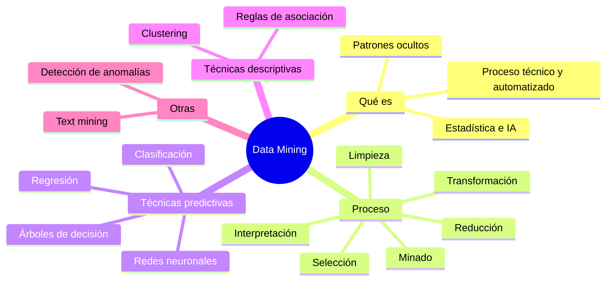
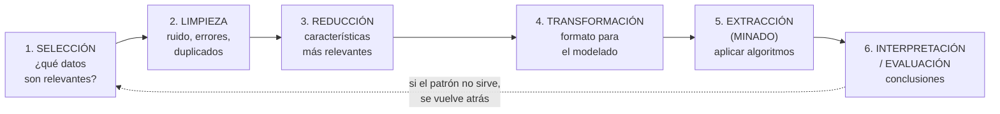
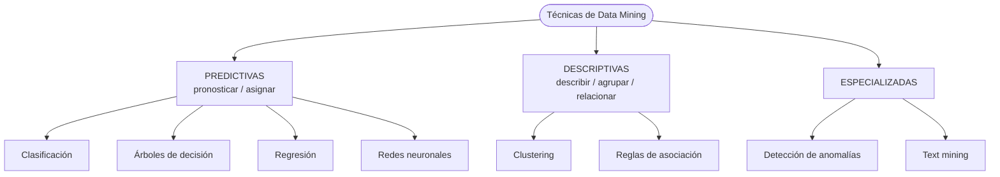

# 09 · Data Mining (Minería de datos)

> **Fuente en el material:** *Clase "Pinamar" 2026* (Prof. Gustavo E. Escandell), diapositivas 33–47.
> **Prerrequisitos:** [08 Business Intelligence](08-business-intelligence.md).
> **Tiempo estimado:** 40 min.
> **Primer Parcial · Tema 09 de 14** (Clase 3). 🔥 Salió en el parcial anterior (pregunta [3](../evaluacion/parcial-anterior-resuelto.md#iii3-business-intelligence-vs-data-mining)).

---

## 🎯 Objetivos de aprendizaje

1. Definir **Data Mining** y explicar qué lo distingue de BI.
2. Enumerar sus **objetivos**, **usos** y **características**.
3. Describir las **6 etapas del proceso** de minería de datos en orden.
4. Explicar las **8 técnicas** vistas (clasificación, clustering, reglas de asociación, árboles de decisión, redes neuronales, regresión, detección de anomalías, text mining) y saber cuál usar en cada caso.

---

## 🗺️ Esquema del tema

- **I. El caso disparador: pañales y gaseosas**
- **II. Definición**
- **III. Objetivos** (5)
- **IV. Para qué sirve** (5)
- **V. Características** (3)
- **VI. Proceso de minería de datos** (6 etapas)
  1. Selección → 2. Limpieza → 3. Reducción → 4. Transformación → 5. Extracción (minado) → 6. Interpretación/Evaluación
- **VII. Técnicas**
  - A. Predictivas (clasificación, árboles de decisión, regresión, redes neuronales)
  - B. Descriptivas (clustering, reglas de asociación)
  - C. Especiales (detección de anomalías, text mining)

---

## 🧠 Mapa visual

---

## 📖 Desarrollo

## I. El caso disparador

> *"Un supermercado descubre que quienes compran pañales también compran gaseosas."*

Este es el ejemplo clásico de minería de datos: **nadie buscaba esa relación**. Apareció al analizar millones de tickets. La pregunta de negocio que se abre es: *¿pongo las gaseosas cerca de los pañales? ¿Armo una promo combinada?*

> 💡 **Lo importante del ejemplo:** el Data Mining **descubre** patrones **que no estaban a simple vista** y que nadie formuló como hipótesis. Esa es la diferencia con un informe de BI, donde uno ya sabe qué quiere mirar.

---

## II. Definición

> 📌 *"La minería de datos o data mining es un **proceso técnico y automatizado** que **analiza grandes volúmenes de información (Big Data)** para **descubrir patrones, tendencias, anomalías y correlaciones ocultas**. Utiliza **técnicas estadísticas y de inteligencia artificial** para **convertir datos brutos en conocimiento estratégico**, permitiendo a las empresas **predecir comportamientos**, reducir costos y tomar mejores decisiones."*

Desglose en esquema:
- **Qué es**: un proceso **técnico y automatizado**.
- **Sobre qué trabaja**: grandes volúmenes de información (**Big Data**).
- **Qué busca**: patrones, tendencias, **anomalías** y **correlaciones ocultas**.
- **Con qué**: **estadística + inteligencia artificial**.
- **Para qué**: **predecir** comportamientos, reducir costos, mejores decisiones.

> 🔥 **Síntesis de clase (Clase 3, notas de cursada):** Data Mining consiste en **encontrar patrones que se repiten en grandes volúmenes de información**. Si tenés que definirlo en una línea, es esta.

---

## III. Objetivos

> 🔥 **Prioridad de parcial:** Data Mining quedó marcado como **#importante** en las notas del repaso previo al parcial, y en el apunte de cursada están **resaltados** los objetivos 2, 3 y 4, los usos 1–3 de *Para qué sirve* y las 3 *Características* (marcados con 🔥 abajo). Fijate que se repite el mismo núcleo en las tres listas: **predecir · segmentar · detectar fraude**. ⚠️ Estos mismos puntos aparecen también en la diapositiva de *Objetivos* de **Big Data**, donde en rigor están fuera de lugar: ver módulo [10](10-big-data.md), III.+.

1. **Identificación de patrones y tendencias** – descubrir comportamientos, asociaciones o secuencias **ocultas** que no son evidentes a simple vista.
2. 🔥 **Predicción de comportamientos (modelado predictivo)** – usar datos históricos para **pronosticar** tendencias futuras: demanda, riesgos financieros, **probabilidad de fuga de clientes**.
3. 🔥 **Segmentación de clientes** – agrupar datos similares (**clústeres**) para personalizar marketing, mejorar el engagement y fidelizar.
4. 🔥 **Detección de anomalías / fraude** – identificar comportamientos inusuales (transacciones sospechosas, fallas en manufactura).
5. **Apoyo a la toma de decisiones** – transformar grandes volúmenes de datos brutos en **información accionable** para la planificación estratégica.

## IV. Para qué sirve

| Uso | Ejemplo |
|---|---|
| 🔥 **Predicción de comportamientos** | Anticipar el **riesgo de abandono** de un cliente. |
| 🔥 **Segmentación de clientes** | Clasificar usuarios para personalizar campañas y productos. |
| 🔥 **Detección de fraudes** | Identificar en **tiempo real** transacciones bancarias sospechosas. |
| **Optimización de procesos** | Detectar **cuellos de botella** y reducir costos. |
| **Análisis de mercado** | Descubrir **qué productos se venden mejor juntos** (reglas de asociación) y optimizar inventario. |

## V. Características

1. 🔥 **Identificación de patrones** – encuentra reglas y estructuras en **bases de datos extensas**.
2. 🔥 **Predicción** – anticipa comportamientos futuros de clientes **o fallos en sistemas**.
3. 🔥 **Aplicaciones** – marketing (**análisis de la cesta de la compra**), finanzas (**detección de fraudes**) y producción (**mantenimiento preventivo**).

---

## VI. Proceso de minería de datos

Seis etapas **en orden**. Es de lo más preguntado del tema: aprendé el orden y **por qué** va ese orden.

| # | Etapa | Qué se hace | Por qué va en ese lugar |
|---|---|---|---|
| 1 | **Selección** | Definir los **conjuntos de datos relevantes**. | No se puede minar "todo": primero se decide qué datos responden a la pregunta. |
| 2 | **Limpieza** | **Eliminar ruido, errores y datos duplicados**. | Datos sucios → patrones falsos (*garbage in, garbage out*). |
| 3 | **Reducción** | Seleccionar las **características más relevantes** para el análisis. | Menos variables irrelevantes = modelos más rápidos y claros. |
| 4 | **Transformación** | **Adaptar los datos al formato** necesario para el modelado. | Cada algoritmo necesita los datos de cierta forma (ej. números en lugar de texto). |
| 5 | **Extracción (minado)** | **Aplicar los algoritmos** para encontrar patrones. | Es el "minado" propiamente dicho: recién acá se usan las técnicas. |
| 6 | **Interpretación / Evaluación** | **Analizar los patrones** encontrados para **obtener conclusiones**. | Un patrón sin interpretación de negocio no sirve. |

---

## VII. Técnicas

La cátedra presenta 8 técnicas. La mejor forma de estudiarlas es **clasificarlas por para qué sirven**:

### VII.A Técnicas predictivas

| Técnica | Definición de la cátedra | Pregunta que responde | Ejemplo |
|---|---|---|---|
| **Clasificación** | Técnica **predictiva** que **asigna elementos a categorías predefinidas**. | ¿A qué categoría pertenece? | ¿Este cliente **"comprará" o "no comprará"**? |
| **Árboles de decisión** | **Modelo visual** que representa **reglas de decisión** para clasificar casos o predecir resultados basados en datos históricos. | ¿Qué reglas llevan a cada resultado? | "Si ingreso > X y sin deudas → aprobar crédito". |
| **Análisis de regresión** | Se usa para **predecir valores numéricos continuos**. | ¿Cuánto? | **Estimar las ventas del próximo trimestre**. |
| **Redes neuronales artificiales** | Algoritmos complejos **inspirados en el cerebro humano**, ideales para modelar **relaciones no lineales** y predicciones avanzadas. | Patrones muy complejos | Reconocimiento de imágenes, scoring complejo. |

> 💡 **Clasificación vs. regresión (clásico de parcial):** la clasificación predice una **categoría** (sí/no, A/B/C). La regresión predice un **número** (ventas = $3,2 M).

### VII.B Técnicas descriptivas

| Técnica | Definición de la cátedra | Pregunta que responde | Ejemplo |
|---|---|---|---|
| **Agrupamiento (Clustering)** | Técnica **descriptiva** que agrupa datos **sin etiquetas previas** en conjuntos (clusters) **basados en similitudes**. | ¿Qué grupos naturales existen? | **Segmentación de clientes**. |
| **Reglas de asociación** | Encuentra **relaciones entre variables**: qué elementos **suelen aparecer juntos**. | ¿Qué va con qué? | **Análisis de la cesta de compra** (pañales y gaseosas). |

> 💡 **Clasificación vs. clustering (el otro clásico):**
> - **Clasificación**: las categorías **ya existen** ("compra"/"no compra") y el modelo aprende a asignar → **predictiva**.
> - **Clustering**: **no hay categorías previas**; el algoritmo **descubre** los grupos → **descriptiva**.

### VII.C Técnicas especializadas

| Técnica | Definición | Ejemplo |
|---|---|---|
| **Detección de anomalías** | Identifica **patrones atípicos** o desviaciones que no siguen el comportamiento normal. | **Fraude financiero**, errores. |
| **Minería de textos (Text Mining)** | Analiza **datos no estructurados** (comentarios, correos) para extraer información y **analizar sentimientos**. | ¿Los comentarios sobre el producto nuevo son positivos o negativos? |

---

## ⚠️ Conceptos que se confunden

| Se confunde… | …con | Diferencia |
|---|---|---|
| Clasificación | Clustering | Categorías **predefinidas** (predictiva) vs. grupos **descubiertos sin etiquetas** (descriptiva). |
| Clasificación | Regresión | Predice **categoría** vs. predice **valor numérico continuo**. |
| Limpieza | Reducción | Limpieza quita **errores, ruido y duplicados** (calidad). Reducción quita **variables irrelevantes** (foco). |
| Data Mining | BI | DM **descubre patrones ocultos y predice** con algoritmos; BI **describe y diagnostica** con dashboards. |
| Data Mining | Big Data | Big Data es la **base/infraestructura** de datos masivos; DM es el **análisis** que extrae valor (ver tabla en [10](10-big-data.md)). |

---

## 🔗 Conexiones

- **← [08 BI](08-business-intelligence.md):** la minería de datos es componente de BI.
- **→ [10 Big Data](10-big-data.md):** de donde vienen los datos que se minan.
- **→ [12 IA](12-innovacion-tecnologica-e-ia.md):** el machine learning es el motor de varias técnicas.

---

## ✍️ Autoevaluación

**1. Defina Data Mining. ¿Qué técnicas combina?**

Ver respuesta

Proceso **técnico y automatizado** que analiza **grandes volúmenes de información (Big Data)** para descubrir **patrones, tendencias, anomalías y correlaciones ocultas**. Combina **técnicas estadísticas y de inteligencia artificial** para convertir datos brutos en conocimiento estratégico, predecir comportamientos, reducir costos y mejorar decisiones.

**2. Ordene y explique las etapas del proceso: Transformación – Selección – Interpretación – Limpieza – Extracción – Reducción.**

Ver respuesta

1. **Selección** (datos relevantes) → 2. **Limpieza** (ruido, errores, duplicados) → 3. **Reducción** (características relevantes) → 4. **Transformación** (formato para modelar) → 5. **Extracción/minado** (aplicar algoritmos) → 6. **Interpretación/evaluación** (conclusiones).

**3. Para cada caso indique la técnica más adecuada: (a) estimar la facturación de diciembre; (b) armar segmentos de clientes sin categorías previas; (c) detectar compras con tarjeta clonada; (d) decidir si aprobar un crédito; (e) saber qué productos se compran juntos.**

Ver respuesta

(a) **Regresión** (valor numérico continuo). (b) **Clustering**. (c) **Detección de anomalías**. (d) **Clasificación** (o árbol de decisión). (e) **Reglas de asociación**.

**4. Explique la diferencia entre clasificación y clustering con un ejemplo de cada una.**

Ver respuesta

**Clasificación**: técnica **predictiva** que asigna elementos a **categorías predefinidas** (ej. "comprará / no comprará"). **Clustering**: técnica **descriptiva** que agrupa datos **sin etiquetas previas** según similitudes (ej. descubrir que existen "compradores de fin de semana con alto ticket" como segmento).

---

[← 08 Business Intelligence](08-business-intelligence.md) · [🏠 Índice](../README.md) · [Siguiente → 10 Big Data](10-big-data.md)
