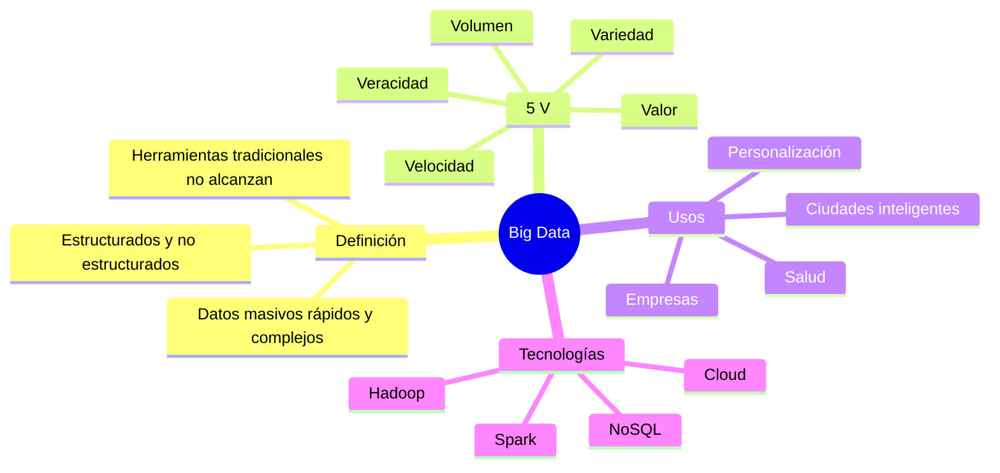
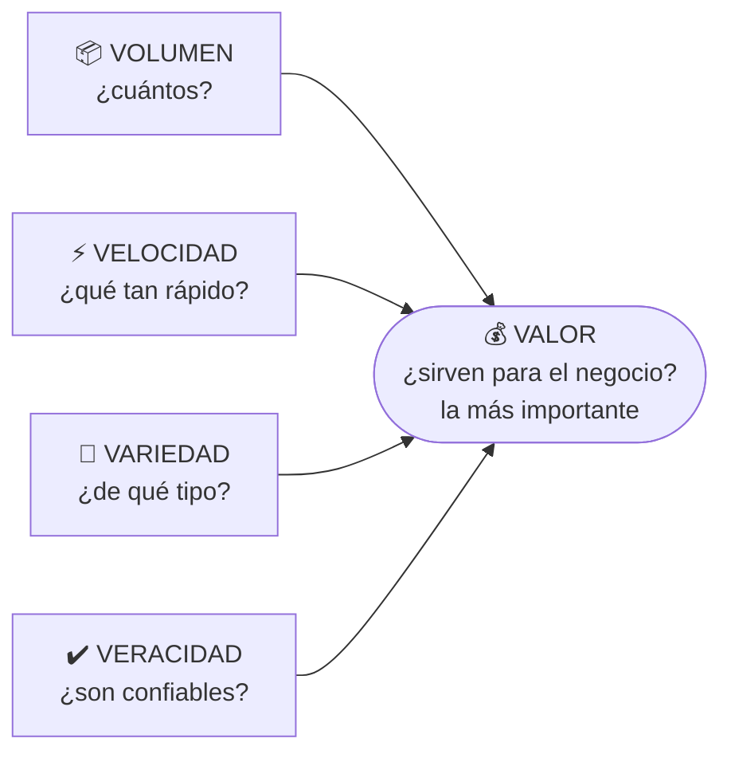

# 10 · Big Data

> **Fuente en el material:** *Clase "Pinamar" 2026* (Prof. Gustavo E. Escandell), diapositivas 48–64.
> **Prerrequisitos:** [08 BI](08-business-intelligence.md) y [09 Data Mining](09-data-mining.md).
> **Tiempo estimado:** 30 min.
> **Primer Parcial · Tema 10 de 14** (Clase 3). 🔥 Salió en el parcial anterior (pregunta [2](../evaluacion/parcial-anterior-resuelto.md#iii2-qué-es-big-data-y-las-5-v)).

---

## 🎯 Objetivos de aprendizaje

1. Definir **Big Data** y explicar por qué las herramientas tradicionales no alcanzan.
2. Explicar **para qué sirve** y sus **objetivos**.
3. Explicar en detalle **las 5 V** y por qué **Valor** es la más importante.
4. Comparar **Big Data vs. Data Mining** en 9 dimensiones.

---

## 🗺️ Esquema del tema

- **I. Definición**
- **II. Para qué sirve** (4 ejemplos)
- **III. Objetivos** (6)
  - + Lectura crítica: objetivos que en rigor son de Data Mining
- **IV. Las 5 V**
  1. Volumen
  2. Velocidad
  3. Variedad
  4. Veracidad
  5. Valor
- **V. Big Data vs. Data Mining** (tabla de 9 aspectos)

---

## 🧠 Mapa visual

---

## 📖 Desarrollo

## I. Definición

> 📌 *"El Big Data (o macrodatos) se refiere a **conjuntos de datos tan masivos, rápidos y complejos que las herramientas tradicionales no pueden procesarlos**. Estas tecnologías permiten **recopilar, gestionar y analizar grandes volúmenes de información (estructurada y no estructurada)** para identificar patrones, comportamientos y tendencias útiles."*

Fijate en los tres adjetivos: **masivos** (→ Volumen), **rápidos** (→ Velocidad) y **complejos** (→ Variedad). La definición ya "contiene" las primeras tres V.

> 💡 **Para entenderlo:** Big Data no es "muchos datos en un Excel grande". Es cuando los datos son tantos, llegan tan rápido o son tan heterogéneos (videos, textos, sensores) que **una base de datos tradicional en un servidor no da abasto** y se necesitan otras tecnologías (procesamiento distribuido, nube, bases NoSQL).

> 🔥 **Prioridad de parcial:** Big Data y Data Mining quedaron marcados como **#importante** en las notas del repaso previo al parcial. **Síntesis de clase (Clase 3):** Big Data = **grandes volúmenes de información** que **se usan para hacer predicciones**; Data Mining = **encontrar patrones que se repiten** en esos volúmenes. → La comparación de la sección V es pregunta probable.

---

## II. Para qué sirve

| Ámbito | Ejemplo |
|---|---|
| **Personalización** | Recomendaciones en **Netflix** o compras en **Amazon**. |
| **Salud** | **Predicción de enfermedades** con datos de **wearables**. |
| **Ciudades inteligentes** | **Gestión del tráfico en tiempo real**. |
| **Empresas** | **Reducción de costes** y optimización de la producción. |

## III. Objetivos

1. **Mejorar la toma de decisiones** – decisiones basadas en **hechos, no en suposiciones**, reduciendo riesgos.
2. **Optimización de procesos** – eficiencia, costos, **predecir fallos en maquinaria** o cuellos de botella.
3. **Personalización de la experiencia del cliente** – adaptar productos, servicios y recomendaciones.
4. **Predicción y anticipación** – prever tendencias y demanda (ej. **gestión de stock**).
5. **Innovación y desarrollo** – descubrir patrones y conexiones para **nuevos modelos de negocio**, productos o servicios.
6. **Detección de riesgos y fraude** – comportamientos inusuales **en tiempo real** (ciberseguridad, seguridad financiera).

### III.+ Lectura crítica: esta diapositiva mezcla Big Data con Data Mining

> ⚠️ **Ojo – lo señaló el profesor en clase:** la diapositiva de *Objetivos* de Big Data incluye funciones que, según la **propia tabla comparativa de la cátedra** (sección [V](#v-big-data-vs-data-mining)), corresponden a **Data Mining**. El objetivo de Big Data es *"almacenar, procesar y gestionar grandes cantidades de datos"* (nivel de análisis **bajo**); **analizar, predecir y descubrir patrones** es la función de Data Mining (nivel **alto**).

---

## IV. Las 5 V

Es **el** tema clásico de Big Data. Aprendé cada V con: **definición + pregunta que responde + ejemplo**.

> 💡 **Cómo leer el diagrama:** las primeras cuatro V describen **cómo son** los datos. La quinta (**Valor**) es **el resultado** que justifica todo el esfuerzo. Por eso la cátedra dice que es *"la característica final más importante"*.

### IV.1 Volumen
> 📌 *"Se refiere a la **enorme cantidad de datos** generados cada segundo, provenientes de **redes sociales, sensores, transacciones** y más, alcanzando **escalas de exabytes**."*
- 🧩 Millones de reproducciones por minuto en una plataforma de streaming.
- ➕ *Contexto adicional:* 1 exabyte = 1.000 petabytes = 1.000.000 terabytes.

### IV.2 Velocidad
> 📌 *"Es el **ritmo acelerado** al que se reciben y deben procesar los datos, a menudo **en tiempo real**, para tomar **decisiones inmediatas**, por ejemplo, mediante **sistemas en memoria**."*
- 🧩 Detectar una transacción fraudulenta **mientras** está ocurriendo.
- Ojo: no es solo que *lleguen* rápido, es que **hay que procesarlos** rápido.

### IV.3 Variedad
> 📌 *"Los datos provienen en **múltiples formatos**: **estructurados** (bases de datos tradicionales), **semiestructurados** y **no estructurados** (videos, audios, correos electrónicos, textos)."*

| Tipo | Qué es | Ejemplo |
|---|---|---|
| **Estructurado** | Filas y columnas con esquema fijo | Tabla de ventas en SQL |
| **Semiestructurado** | Tiene etiquetas/estructura flexible | JSON, XML, logs |
| **No estructurado** | Sin formato predefinido | Videos, audios, emails, posteos |

> ➕ *Contexto adicional:* se estima que la gran mayoría de los datos que se generan hoy son **no estructurados**, por eso cobran importancia técnicas como el **text mining**.

### IV.4 Veracidad
> 📌 *"Se refiere a la **calidad, fiabilidad y precisión** de los datos. Gestionar la veracidad implica **limpiar y validar** datos provenientes de fuentes diversas para asegurar su **integridad**."*
- 🔗 Se conecta con la etapa de **Limpieza** del Data Mining y con la característica de **gobernanza** de BI.
- 🧩 Reseñas falsas, sensores descalibrados, datos duplicados → bajan la veracidad.

### IV.5 Valor
> 📌 *"Es la capacidad de **transformar datos brutos en conocimientos útiles y rentables para el negocio**, siendo esta **la característica final más importante**."*
- Sin valor, las otras cuatro V son solo **costo** (almacenar y procesar datos que no se usan).

---

## V. Big Data vs. Data Mining

Tabla de la cátedra. Es muy probable que te pidan **comparar** ambos conceptos.

| Aspecto | **Big Data** | **Data Mining** |
|---|---|---|
| **Definición** | Conjunto de **tecnologías y procesos para manejar** grandes volúmenes de datos | **Proceso de analizar** datos para descubrir patrones ocultos |
| **Objetivo** | **Almacenar, procesar y gestionar** grandes cantidades de datos | **Extraer conocimiento útil** a partir de los datos |
| **Enfoque** | **Infraestructura** y volumen de datos | **Análisis e interpretación** |
| **Tipo de datos** | Datos masivos, estructurados y no estructurados | Datos **previamente almacenados** (muchas veces provenientes de Big Data) |
| **Función principal** | **Recolección, almacenamiento y procesamiento** | **Análisis, predicción y descubrimiento** de patrones |
| **Nivel de análisis** | **Bajo** (gestión de datos) | **Alto** (inteligencia y conocimiento) |
| **Tecnologías** | **Hadoop, Spark, bases NoSQL, cloud computing** | **Algoritmos de IA, machine learning, estadística** |
| **Ejemplo** | **Netflix almacena** millones de datos de usuarios | **Netflix analiza** esos datos para **recomendar** películas |
| **Relación** | Es **la base que provee** los datos | **Utiliza** los datos para **generar valor** |

> 💡 **La frase para recordar:** *Big Data es la mina; Data Mining es el minero.* Big Data provee y gestiona el material; Data Mining extrae el "oro" (conocimiento).

---

## ⚠️ Conceptos que se confunden

| Se confunde… | …con | Diferencia |
|---|---|---|
| Big Data | Data Mining | Infraestructura para **manejar** datos vs. proceso para **analizarlos**. |
| Volumen | Velocidad | Cantidad total vs. **ritmo** al que llegan y deben procesarse. |
| Veracidad | Valor | Calidad y confiabilidad del dato vs. **utilidad y rentabilidad** para el negocio. |
| Variedad | "Muchos datos" | Variedad es **diversidad de formatos**, no cantidad. |
| Objetivos de Big Data (diapositiva) | Objetivos de Data Mining | La diapositiva de Big Data incluye predecir, descubrir patrones y detectar fraude, que en rigor son **Data Mining**; Big Data los **habilita** (ver III.+). |
| Big Data | Datos "grandes" en Excel | Big Data implica que las **herramientas tradicionales no pueden procesarlos**. |

---

## 🔗 Conexiones

- **← [09 Data Mining](09-data-mining.md)**: Big Data es su base.
- **← [03 Tecnologías disruptivas](03-tecnologias-disruptivas.md)**: Big Data aparece como tecnología disruptiva.
- **→ [12 IA](12-innovacion-tecnologica-e-ia.md)**: la IA se basa en el procesamiento de grandes volúmenes de datos.
- **→ [18 VANI](../resto-de-la-materia/18-entornos-vica-y-vani.md)**: el límite de "acumular más datos" en un mundo incomprensible.

---

## ✍️ Autoevaluación

**1. Defina Big Data y explique sus 5 V con un ejemplo de cada una.**

Ver respuesta

Big Data son **conjuntos de datos tan masivos, rápidos y complejos que las herramientas tradicionales no pueden procesarlos**; sus tecnologías permiten recopilar, gestionar y analizar información estructurada y no estructurada para identificar patrones y tendencias.
- **Volumen**: enorme cantidad (exabytes) – millones de transacciones diarias de un banco.
- **Velocidad**: ritmo de llegada y procesamiento en tiempo real – detección de fraude al instante.
- **Variedad**: estructurados, semiestructurados, no estructurados – tablas, JSON, videos.
- **Veracidad**: calidad y fiabilidad, requiere limpiar y validar – eliminar reseñas falsas.
- **Valor**: transformar datos en conocimiento útil y rentable – recomendaciones que aumentan ventas. Es la más importante.

**2. ¿Por qué la cátedra considera al Valor la V más importante?**

Ver respuesta

Porque es **la característica final**: la capacidad de transformar datos brutos en conocimiento **útil y rentable para el negocio**. Sin valor, el volumen, la velocidad, la variedad y la veracidad son solo costos de almacenamiento y procesamiento.

**3. Compare Big Data y Data Mining en al menos cinco aspectos.**

Ver respuesta

Definición (tecnologías para manejar datos vs. proceso de análisis), objetivo (almacenar/procesar vs. extraer conocimiento), enfoque (infraestructura vs. análisis e interpretación), nivel de análisis (bajo vs. alto), tecnologías (Hadoop, Spark, NoSQL, nube vs. IA, ML, estadística), relación (la base que provee datos vs. quien los usa para generar valor). Ejemplo: Netflix **almacena** (Big Data) vs. Netflix **analiza para recomendar** (Data Mining).

**4. Clasifique según su estructura: (a) un archivo JSON de una API; (b) un audio de WhatsApp; (c) la tabla de clientes de un CRM; (d) un correo electrónico.**

Ver respuesta

(a) **Semiestructurado**. (b) **No estructurado**. (c) **Estructurado**. (d) **No estructurado** (el cuerpo es texto libre; los encabezados tienen algo de estructura).

**5. Una empresa acumula petabytes de datos pero no logra mejorar ninguna decisión. ¿Qué V falla y qué le recomendaría?**

Ver respuesta

Falla el **Valor** (y posiblemente la **Veracidad**). Recomendaría definir preguntas de negocio claras, limpiar y validar los datos, aplicar **Data Mining** para extraer patrones y **BI** para comunicarlos en dashboards con KPIs vinculados a objetivos.

---

[← 09 Data Mining](09-data-mining.md) · [🏠 Índice](../README.md) · [Siguiente → 11 Creatividad y proceso creativo](11-creatividad-y-proceso-creativo.md)
