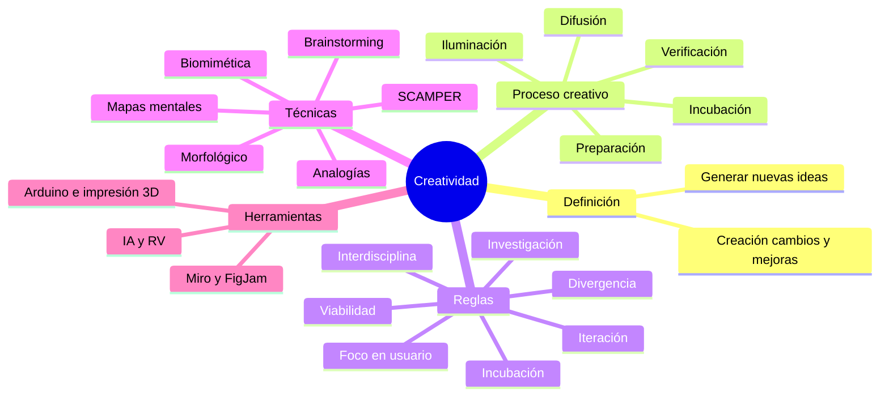
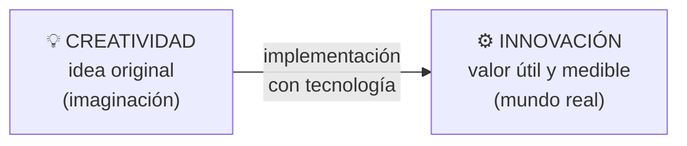
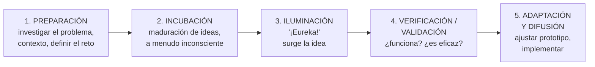
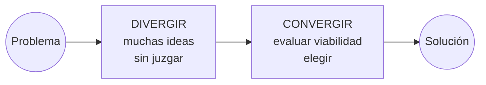

# 11 · Creatividad y proceso creativo

> **Fuente en el material:** *Clase 2 – Gestión de la innovación* (Ing. Barrios), diapositivas 26–27; *Día 3 – Innovación tecnológica, creatividad vs. innovación*, diapositivas 2–9 y 29.
> **Prerrequisitos:** [07 Gestión de la innovación](07-gestion-de-la-innovacion.md).
> **Tiempo estimado:** 60 min.
> **Primer Parcial · Tema 11 de 16** (Clase 2 y Día 3). 🔥 Salió en el parcial anterior (pregunta [1](../evaluacion/parcial-anterior-resuelto.md#iii1-diferencia-entre-innovación-tecnológica-y-creatividad)).

---

## 🎯 Objetivos de aprendizaje

1. Definir **creatividad** y **proceso creativo**.
2. Explicar la **importancia** de la creatividad en tecnología e innovación.
3. Describir las **cinco etapas del proceso creativo** en orden.
4. Enumerar y explicar las **siete reglas** del proceso creativo.
5. Explicar y **aplicar** las **siete técnicas creativas** (SCAMPER, análisis morfológico, brainstorming/brainwriting, biomimética, mapas mentales, visualización, analogías).
6. Diferenciar **creatividad** de **innovación tecnológica**.

---

## 🗺️ Esquema del tema

- **I. Creatividad**
  - A. Definición
  - B. Creatividad vs. innovación tecnológica
- **II. Proceso creativo**
  - A. Definición
  - B. Importancia (6)
  - C. Etapas
    1. Preparación
    2. Incubación
    3. Iluminación
    4. Verificación / validación
    5. Adaptación y difusión
- **III. Reglas del proceso creativo** (7)
- **IV. Técnicas creativas** (7)
  1. SCAMPER
  2. Análisis morfológico
  3. Brainstorming / brainwriting
  4. Biomimética / biónica
  5. Mapas mentales
  6. Visualización de ideas
  7. Análisis de analogías
- **V. Herramientas** (plataformas colaborativas, prototipado rápido, tecnologías emergentes)

---

## 🧠 Mapa visual

---

## 📖 Desarrollo

## I. Creatividad

### I.A Definición

> 📌 *"Capacidad de **generar nuevas ideas, conceptos** por medio de la **creación, cambios y mejoras**."* (Clase 2)

> 📌 *"La creatividad es el **acto de generar ideas originales**."* (Día 3)

### I.B Creatividad vs. innovación tecnológica

> 📌 *"La **creatividad** es el acto de **generar ideas originales**, mientras que la **innovación tecnológica** es **poner esas ideas en práctica** usando la ciencia y las herramientas digitales para **resolver problemas reales**."*

| **Creatividad** | **Innovación tecnológica** |
|---|---|
| Es **pensar** de forma original. | Es **llevar la idea al mundo real**. |
| **Vive en la imaginación** de la mente. | **Usa máquinas, sistemas o programas**. |
| **No necesita venderse ni medirse**. | **Crea un valor útil** para las personas. |
| Es **el punto de partida** de todo. | **Mide sus resultados con datos**. |

> 📝 **Citar y explayarse:** La cátedra define la creatividad como la *"capacidad de generar nuevas ideas, conceptos por medio de la creación, cambios y mejoras"* y, en otra versión, como *"el acto de generar ideas originales"*. La diferencia con la innovación tecnológica es que esta consiste en *"poner esas ideas en práctica"* usando la ciencia y las herramientas digitales *"para resolver problemas reales"*. Es decir, la creatividad es el **punto de partida** —vive en el plano de las ideas y no necesita medirse ni venderse—, mientras que la innovación es el **paso a la realidad**, donde la idea tiene que funcionar y generar valor. Por eso puede haber creatividad sin innovación (una gran idea que nunca se implementa), pero no innovación sin una idea creativa detrás. Imaginar un sistema de turnos que avise por WhatsApp es creatividad; desarrollarlo, implementarlo en una clínica y que los pacientes lo usen es innovación.

> 💡 **La pregunta disparadora de la clase:** *"¿Innovar es tener una buena idea… o hacer que funcione?"* → **Las dos cosas**: la nota del docente en esa diapositiva dice *"Son ambas y debe aportar valor a una persona del mercado"*. La creatividad aporta la idea; la innovación la hace funcionar y genera valor.

---

## II. Proceso creativo

### II.A Definición

> 📌 *"El proceso creativo en tecnología e innovación es un **conjunto estructurado de fases** (**preparación, incubación, iluminación, verificación y difusión**) destinado a **generar soluciones originales a problemas**, utilizando la tecnología para **transformar ideas en productos o servicios de alto valor**. Fomenta el **pensamiento divergente**, la **experimentación** y la **mejora continua**."*

> 💡 **Lo importante:** la creatividad **no es un rayo de inspiración aleatorio**; se puede **estructurar** en un proceso. Por eso es gestionable.

> 📝 **Citar y explayarse:** Para la cátedra, el proceso creativo es *"un conjunto estructurado de fases"* —preparación, incubación, iluminación, verificación y difusión— destinado a *"generar soluciones originales a problemas"*. La palabra clave es **estructurado**: la creatividad no depende de un golpe de inspiración, sino que se puede organizar y, por lo tanto, **gestionar**. Primero se estudia el problema (preparación), se lo deja madurar (incubación), aparece la idea (iluminación), se comprueba si sirve (verificación) y se comunica o implementa (difusión). Además, el proceso fomenta *"el pensamiento divergente, la experimentación y la mejora continua"*, las mismas actitudes que después piden Design Thinking y Lean Startup. Un equipo que necesita reducir el abandono de una app, por ejemplo, no espera una idea brillante: analiza datos, prueba alternativas y valida la que funciona.

### II.B Importancia

| # | Razón | Explicación |
|---|---|---|
| 1 | **Motor de la innovación** | La creatividad es **la chispa** que inicia el proceso; la innovación es la **implementación práctica**. |
| 2 | **Solución de problemas complejos** | Permite abordar desafíos técnicos **desde perspectivas inusuales**, donde los métodos tradicionales fallan. |
| 3 | **Adaptación y competitividad** | En un mercado de cambio rápido, es clave para **mantener la relevancia** y **anticiparse**. |
| 4 | **Experimentación y mejora** | Fomenta la **prueba y error (MVP)**: la innovación ocurre a través de **prototipos y mejora continua**. |
| 5 | **Fusión de mente y tecnología** | Aunque la IA avanza, **la mente humana sigue siendo necesaria para la creatividad original**; la tecnología es la herramienta para materializar visiones. |
| 6 | **Optimización** | Un proceso estructurado **ahorra tiempo y recursos** y dirige la energía a soluciones de alto impacto. |

### II.C Etapas del proceso creativo

| # | Etapa | Qué pasa | 🧩 Ejemplo: app para reservar turnos en un club |
|---|---|---|---|
| 1 | **Preparación** | **Investigación** del problema, estudio del **contexto** y **definición del reto**. | Entrevistás socios y al encargado: los turnos se piden por WhatsApp y se superponen. |
| 2 | **Incubación** | **Procesamiento mental** y **maduración** de ideas, muchas veces **de forma inconsciente**. | Dejás el problema "reposar" unos días mientras hacés otras cosas. |
| 3 | **Iluminación** | **"Momento Eureka"**: surge la idea o solución innovadora. | Se te ocurre: "¿y si los turnos se liberan automáticamente si no se confirma 2 h antes?". |
| 4 | **Verificación / validación** | **Comprobación técnica** de si la idea es **funcional y eficaz**. | Hacés un prototipo en Figma y lo probás con 5 socios. |
| 5 | **Adaptación y difusión** | **Ajuste del prototipo** y **comercialización o implementación**. | Corregís lo que no entendieron y lanzás la app en el club. |

> ➕ **Contexto adicional:** este modelo deriva del de **Graham Wallas** (*The Art of Thought*, 1926), que proponía cuatro etapas (preparación, incubación, iluminación, verificación). La cátedra agrega una quinta, **adaptación y difusión**, que es la que conecta la creatividad con la **innovación** (llevarla al mercado).

---

## III. Reglas del proceso creativo

Siete reglas. Aprendelas con el **"por qué"** de cada una:

| # | Regla | Qué dice | Por qué |
|---|---|---|---|
| 1 | **Fomentar la divergencia (lluvia de ideas)** | Al principio **no se juzgan ni descartan ideas**; **la cantidad es más importante que la calidad**. Se buscan perspectivas diversas. | Juzgar temprano mata ideas que, combinadas, podrían ser buenas. |
| 2 | **Investigación y preparación profunda** | Comprender el problema a fondo (datos, tendencias, contexto) **antes de proponer soluciones**. | Una solución brillante a un problema mal entendido no sirve. |
| 3 | **Permitir la incubación** | **Distanciarse** del proyecto para que el **subconsciente** procese y genere nuevas conexiones. | La "iluminación" suele llegar cuando dejás de forzarla. |
| 4 | **Iteración y validación (prototipado)** | Las ideas no son perfectas al principio: **prototipar, probar rápido, recibir feedback y reajustar**. | Aprender del usuario es más barato que adivinar. |
| 5 | **Enfoque al usuario y al problema** | La innovación debe **resolver una necesidad real**, no solo ser novedosa. Se **prioriza la utilidad práctica**. | Novedad sin utilidad no genera valor. |
| 6 | **Colaboración interdisciplinaria** | Equipos **diversos** que aportan distintas visiones técnicas y creativas. | Más perspectivas = más combinaciones posibles. |
| 7 | **Verificación de viabilidad** | Evaluar **críticamente** la implementación **técnica y económica** antes del lanzamiento. | Al final hay que **converger**: no todas las ideas son realizables. |

> 💡 **Divergencia y convergencia:** fijate que la regla 1 pide **abrir** (muchas ideas, sin juzgar) y la regla 7 pide **cerrar** (evaluar críticamente). Un buen proceso creativo **alterna** ambos modos: primero divergir, después converger. (Este patrón se repite en **Design Thinking**: idear → prototipar → testear.)

> 🔗 Las reglas 4, 5 y 6 son prácticamente las bases de **Design Thinking** (módulo [13](13-design-thinking.md)).

---

## IV. Técnicas creativas

### IV.1 SCAMPER
> 📌 Técnica de **pensamiento lateral** que **modifica productos o procesos existentes** mediante: **S**ustituir, **C**ombinar, **A**daptar, **M**odificar, **P**oner en otro uso, **E**liminar o **R**evertir (reordenar).

| Letra | Pregunta guía | 🧩 Aplicado a una bicicleta |
|---|---|---|
| **S** – Sustituir | ¿Qué material, componente o persona puedo reemplazar? | Cuadro de aluminio por fibra de carbono. |
| **C** – Combinar | ¿Qué puedo unir con otra cosa? | Bicicleta + motor eléctrico = e-bike. |
| **A** – Adaptar | ¿Qué idea de otro contexto puedo adaptar? | Suspensión de motos adaptada a bicis de montaña. |
| **M** – Modificar | ¿Qué puedo agrandar, achicar o cambiar? | Bicicleta plegable. |
| **P** – Poner en otro uso | ¿Para qué más sirve? | Bici fija para generar electricidad. |
| **E** – Eliminar | ¿Qué puedo quitar? | Sin pedales → bici de equilibrio para niños. |
| **R** – Revertir | ¿Qué pasa si invierto el orden o el rol? | Bicis compartidas: en vez de comprarla, la alquilás por minuto. |

### IV.2 Análisis morfológico
> 📌 **Descompone un problema en sus componentes fundamentales** para **explorar todas las combinaciones posibles** de soluciones.

🧩 Diseñar una botella de agua:

| Componente | Opción A | Opción B | Opción C |
|---|---|---|---|
| Material | Plástico | Vidrio | Acero |
| Tapa | Rosca | Pico deportivo | Con pajita |
| Extra | Ninguno | Filtro | Sensor de hidratación |

Una combinación posible: **acero + pico deportivo + sensor** → "botella inteligente para deportistas". La técnica fuerza a mirar combinaciones que no se te ocurrirían espontáneamente.

### IV.3 Brainstorming / Brainwriting
> 📌 **Generación libre de ideas en grupo (brainstorming)** o **escrita e individual antes de compartir (brainwriting)**, útil para **evitar la censura en equipos jerárquicos**.

> 💡 **Por qué existe el brainwriting:** en un brainstorming oral, si está el jefe en la sala, muchos no hablan o se alinean con su idea. Escribir primero en forma individual **protege la diversidad de ideas**.

### IV.4 Biomimética / Biónica
> 📌 Solución de problemas tecnológicos **mediante la imitación de estructuras y procesos naturales**.

🧩 El velcro (inspirado en los abrojos); el tren bala japonés con nariz inspirada en el pico del martín pescador; paneles con estructura de panal de abeja.

### IV.5 Mapas mentales
> 📌 **Diagramas visuales** que organizan información **de manera no lineal**, ayudando a **encontrar conexiones** entre conceptos.

(Los "🧠 Mapa visual" de cada módulo de este repo son mapas mentales.)

### IV.6 Visualización de ideas
> 📌 Uso de **contenido audiovisual** de diversas plataformas para **inspirar** y relacionar conceptos visuales con el problema.

### IV.7 Análisis de analogías
> 📌 **Comparar el problema actual con situaciones o productos de otros sectores** para **romper patrones de pensamiento convencional**.

🧩 Un hospital que analiza cómo un equipo de Fórmula 1 hace un *pit stop* para rediseñar el traslado de pacientes desde el quirófano.

> 📝 **Citar y explayarse:** Las técnicas creativas de la cátedra tienen un objetivo común: **sacar al pensamiento de sus caminos habituales** para generar más y mejores ideas. Algunas trabajan sobre lo existente, como SCAMPER, que *"modifica productos o procesos existentes"* sustituyendo, combinando, adaptando o eliminando partes; otras ordenan el problema, como el análisis morfológico, que lo *"descompone en sus componentes fundamentales"* para explorar combinaciones; y otras buscan inspiración afuera, como la biomimética (imitar *"estructuras y procesos naturales"*) o las analogías (comparar con *"situaciones o productos de otros sectores"*). La elección depende del problema: para mejorar un producto conviene SCAMPER; en un equipo jerárquico donde la gente no se anima a hablar, el brainwriting. El velcro, inspirado en los abrojos, es el ejemplo clásico de biomimética.

### Tabla de decisión: ¿qué técnica uso?

| Situación | Técnica sugerida |
|---|---|
| Quiero mejorar un producto que ya existe | **SCAMPER** |
| El problema tiene varias partes y quiero explorar todas las combinaciones | **Análisis morfológico** |
| Necesito muchas ideas rápido en grupo | **Brainstorming** |
| El grupo es jerárquico y la gente se autocensura | **Brainwriting** |
| Busco inspiración radicalmente distinta | **Biomimética** o **analogías** |
| Necesito ordenar y conectar mucha información | **Mapas mentales** |

---

## V. Herramientas

| Herramienta | Para qué |
|---|---|
| **Plataformas colaborativas** (Miro, FigJam) | Facilitar el **trabajo en equipo**, incluso a distancia. |
| **Prototipado rápido** (Arduino, impresoras 3D, sensores) | Crear **versiones iniciales** del producto tecnológico. |
| **Tecnologías emergentes** (IA, realidad virtual, robótica) | **Estimular nuevas formas de crear**. |

---

## ⚠️ Conceptos que se confunden

| Se confunde… | …con | Diferencia |
|---|---|---|
| Creatividad | Innovación | Idea original (imaginación, no se mide) vs. **implementación** que genera valor y **se mide con datos**. |
| Incubación | Iluminación | Incubación = maduración (a menudo inconsciente); iluminación = el **momento Eureka**. |
| Verificación | Difusión | Verificar si **funciona** vs. **ajustar e implementar/comercializar**. |
| Brainstorming | Brainwriting | Oral y grupal vs. **escrito e individual primero** (evita la censura). |
| SCAMPER | Análisis morfológico | Modificar algo **existente** con 7 preguntas vs. **descomponer** en partes y **combinar** opciones. |

---

## 🔗 Conexiones

- **← [07 Gestión de la innovación](07-gestion-de-la-innovacion.md):** creatividad como cierre de la Clase 2.
- **→ [12 Innovación tecnológica](12-innovacion-tecnologica-e-ia.md):** de la idea a la innovación.
- **→ [13 Design Thinking](13-design-thinking.md):** metodología que estructura el proceso creativo centrado en el usuario.
- **→ [16 Lean Startup](16-lean-startup-y-mvp.md):** prototipar y validar (MVP).

---

## ✍️ Autoevaluación

**1. Defina creatividad y diferénciela de la innovación tecnológica.**

Ver respuesta

Creatividad es la **capacidad de generar nuevas ideas y conceptos** por medio de la creación, cambios y mejoras; es el acto de generar ideas originales. La **innovación tecnológica** es **poner esas ideas en práctica** usando ciencia y herramientas digitales para resolver problemas reales. La creatividad vive en la imaginación, no necesita venderse ni medirse y es el punto de partida; la innovación lleva la idea al mundo real, usa máquinas/sistemas/programas, crea valor útil y mide sus resultados con datos.

**2. Ordene y explique las etapas del proceso creativo.**

Ver respuesta

(1) **Preparación**: investigar el problema, el contexto y definir el reto. (2) **Incubación**: maduración de ideas, muchas veces inconsciente. (3) **Iluminación**: el momento Eureka. (4) **Verificación/validación**: comprobar técnicamente si es funcional y eficaz. (5) **Adaptación y difusión**: ajustar el prototipo y comercializar/implementar.

**3. ¿Por qué la primera regla dice que "la cantidad es más importante que la calidad"? ¿No contradice a la regla de verificación de viabilidad?**

Ver respuesta

No la contradice: corresponden a **momentos distintos**. Al inicio se busca **divergir** (generar muchas ideas sin juzgar, porque juzgar temprano elimina ideas que podrían combinarse en algo valioso). Al final se **converge**: se evalúa críticamente la viabilidad técnica y económica antes del lanzamiento.

**4. Aplique SCAMPER a una mochila escolar (al menos 4 letras).**

Ver respuesta

Ejemplo: **S**ustituir la tela por material impermeable reciclado; **C**ombinar con un cargador solar; **A**daptar las ruedas de las valijas; **M**odificar con compartimentos modulares; **P**oner en otro uso como almohadón inflable; **E**liminar cierres y usar imanes; **R**evertir: mochila de alquiler por cuatrimestre. (Cualquier aplicación coherente es válida.)

**5. Un equipo con un gerente muy dominante no logra generar ideas en las reuniones. ¿Qué técnica recomendaría y por qué?**

Ver respuesta

**Brainwriting**: cada persona escribe sus ideas **individualmente antes de compartirlas**, lo que **evita la censura en equipos jerárquicos** y protege la diversidad de ideas.

---

[← 10 Big Data](10-big-data.md) · [🏠 Índice](../README.md) · [Siguiente → 12 Innovación tecnológica e Inteligencia Artificial](12-innovacion-tecnologica-e-ia.md)
