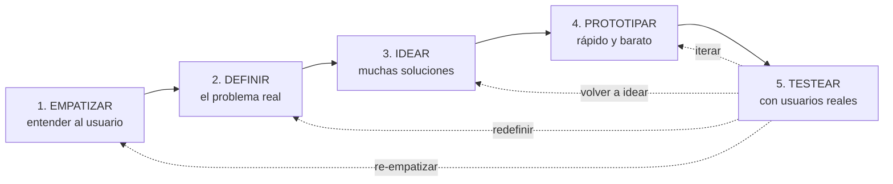
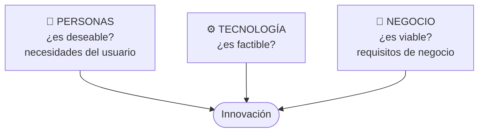
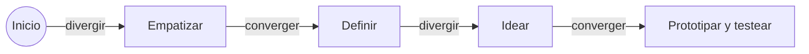
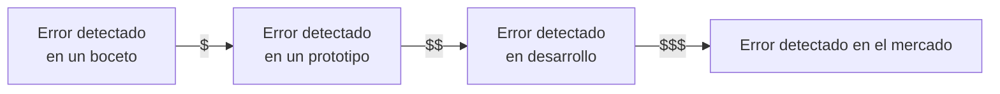

# 13 · Design Thinking

> **Fuente en el material:** *Día 3 – Innovación tecnológica, creatividad vs. innovación*, diapositivas 30–37.
> **Prerrequisitos:** [11 Creatividad](11-creatividad-y-proceso-creativo.md) y [12 Innovación tecnológica](12-innovacion-tecnologica-e-ia.md).
> **Tiempo estimado:** 40 min.
> **Primer Parcial · Tema 13 de 14** (Día 3). 🔥 Salió en el parcial anterior (pregunta [4](../evaluacion/parcial-anterior-resuelto.md#iii4-design-thinking-qué-es--al-menos-3-etapas)).

---

## 🎯 Objetivos de aprendizaje

1. Definir **Design Thinking** e identificar sus **tres dimensiones** (personas, tecnología, negocio).
2. Describir sus **cinco etapas** en orden, con técnicas de cada una.
3. Explicar sus **siete características** y sus **beneficios**.
4. Analizar **casos de empresas** que lo usaron.

---

## 🗺️ Esquema del tema

- **I. Definición**
- **II. Etapas**
  1. Empatizar
  2. Definir
  3. Idear
  4. Prototipar
  5. Evaluar / testear
- **III. Características** (7)
- **IV. Beneficios** (6)
- **V. Empresas que lo utilizan**
- **VI. Lo que agregó la clase pre-parcial** (principios, mentalidades, entender–explorar–materializar, restricciones)

---

## 🧠 Mapa visual

---

## 📖 Desarrollo

## I. Definición

> 📌 *"El Design Thinking es una **metodología centrada en el ser humano** para **resolver problemas complejos** y **fomentar la innovación**, integrando **necesidades de los usuarios, tecnología y requisitos de negocio**."*

Las tres dimensiones que integra:

> 💡 **Para entenderlo:** la mayoría de los fracasos tecnológicos empiezan por la tecnología ("tenemos esta tecnología, ¿qué hacemos?"). Design Thinking **empieza por la persona** ("¿qué le pasa a esta persona?") y recién después busca la tecnología. Por eso es la respuesta directa al problema n.º 1 de innovar: **falta de comprensión del usuario** (módulo [12](12-innovacion-tecnologica-e-ia.md)).

---

## II. Etapas

| # | Etapa | Qué se hace (cátedra) | Técnicas / productos |
|---|---|---|---|
| 1 | **Empatizar** (*Empathize*) | **Investigar y comprender** las necesidades, pensamientos, **emociones y motivaciones** del público objetivo. **Observar, escuchar y ponerse en la piel del usuario.** | **Entrevistas**, **inmersión**, **mapas de empatía**. |
| 2 | **Definir** (*Define*) | **Procesar y analizar** la información para **enfocar el problema real** y establecer un **punto de vista** claro. Se seleccionan los hallazgos más relevantes para un **enunciado del problema o "reto"**. | Enunciado del reto (*point of view*). |
| 3 | **Idear** (*Ideate*) | Generar **la mayor cantidad de soluciones posibles**, **sin restricciones ni juicios**. Pensamiento creativo y **lluvia de ideas**. | Brainstorming, SCAMPER, etc. (módulo [11](11-creatividad-y-proceso-creativo.md)). |
| 4 | **Prototipar** (*Prototype*) | Construir **versiones rápidas, económicas y tangibles** de las ideas para **evaluar su viabilidad**. | **Maquetas, dibujos, storyboards**, simulaciones. |
| 5 | **Evaluar / testear** (*Test*) | **Probar los prototipos con usuarios reales** para recibir **feedback** y validar si la solución funciona. **Es iterativa**: suele llevar a perfeccionar el prototipo **o volver a fases anteriores**. | Pruebas de usuario. |

> ⚠️ **No es lineal:** la cátedra subraya que el testeo **puede llevar a volver a cualquier etapa anterior**. Por eso en el diagrama hay flechas de retorno.

> 💡 **Divergir y converger otra vez:** Empatizar (divergir: juntar información) → Definir (converger: un reto) → Idear (divergir: muchas ideas) → Prototipar/Testear (converger: la que funciona). Es el mismo patrón de las reglas del proceso creativo.

---

## III. Características

| # | Característica | Explicación |
|---|---|---|
| 1 | **Centrado en el usuario (empatía)** | Comprender profundamente necesidades, emociones y motivaciones del usuario final. |
| 2 | **Colaborativo y multidisciplinario** | Trabajo en equipo con **perfiles diversos**. |
| 3 | **Iterativo** | **No lineal**: se avanza, se retrocede, se prueba y se mejora continuamente. |
| 4 | **Orientado a la acción (prototipado)** | Pasa **rápido de la idea a la acción** con prototipos tangibles. |
| 5 | **Pensamiento abierto y creativo** | Gran **volumen de ideas** sin restricciones iniciales. |
| 6 | **Visual y tangible** | Bocetos, modelos y herramientas visuales para hacer las ideas **comprensibles**. |
| 7 | **Validación constante** | Prototipos testeados con **usuarios reales** → feedback temprano. |

## IV. Beneficios

| Beneficio | Explicación |
|---|---|
| **Enfoque en el usuario (*customer centric*)** | Soluciones a **problemas verdaderos**. |
| **Innovación disruptiva y creativa** | Lluvia de ideas y **pensamiento divergente** → soluciones más allá de lo convencional. |
| **Reducción de riesgos y costos** | Prototipos rápidos y económicos (**"fail fast"**): errores detectados **temprano**, evitando grandes inversiones en productos fallidos. |
| **Colaboración multidisciplinaria** | **Rompe silos**: diseño + ingeniería + negocio; mejora cultura y eficiencia. |
| **Proceso flexible e iterativo** | Permite **volver atrás** y aprender del feedback constante. |
| **ROI mejorado** | Mayor eficiencia y resultados económicos. |

> 💡 **"Fail fast" (fallar rápido):** si una idea va a fallar, es mucho mejor descubrirlo con un dibujo en papel que con un producto terminado. El costo del error **crece** cuanto más tarde se detecta.

---

## V. Empresas que utilizan esta metodología

| Empresa | Qué hizo con Design Thinking |
|---|---|
| **BBVA** | Rediseñó sus **cajeros automáticos** para hacerlos **más intuitivos, humanos y seguros**. |

---

## VI. Lo que agregó la clase pre-parcial

La *Clase 4 pre-parcial – Estrategias, procesos y cultura* (Barrios, diapositivas 38–55) repasó Design Thinking y sumó cuatro ideas.

**1. Principios:** centrado en las personas · trabajo en equipo colaborativo · aprender haciendo · abrazar la experimentación · entender patrones, relaciones y sistemas · visualizar y mostrar.

**2. El cambio de foco:** de una innovación **centrada en el producto** a una **centrada en las personas**.

**3. Mentalidades, habilidades y pensamiento:**

| Dimensión | Qué incluye |
|---|---|
| **Mentalidades y actitudes** | Empatía, adaptabilidad, coraje, mentalidad de principiante, resiliencia emocional, mente abierta. |
| **Habilidades: métodos y herramientas** | Reformulación, ideación, prototipado iterativo, creación de sentido, facilitación, co-creación, colaboración. |
| **Nuevas formas de pensar** | Pensamiento divergente, síntesis, pensamiento sistémico, inteligencia emocional, pensamiento visual, imaginación. |

**4. Las fases agrupadas en tres momentos:**

| Momento | Fases | Qué se busca (cátedra) |
|---|---|---|
| **Entender** · inspiración | Empatizar · Definir | Entender cómo piensan, sus necesidades y lo que es realmente importante para los usuarios · sintetizar la información construyendo un punto de partida desde un dolor significativo para el usuario. |
| **Explorar** · ideación | Idear · Prototipar | Generar muchas ideas, siendo disruptivo e innovador y construyendo en equipo · desarrollar prototipos rápidos y sencillos que permitan recibir retroalimentación sobre la propuesta. |
| **Materializar** · implementación | Testear | Simulando un contexto real, comprender mejor al usuario y con su retroalimentación mejorar la propuesta. |

**Restricciones:** **factibilidad** (lo que es posible funcionalmente en el futuro próximo), **viabilidad** (lo que es probable que pase a formar parte de un modelo de negocio sostenible) y **deseabilidad** (lo que tiene sentido para las personas).

> 🔗 La misma clase presentó el **Design Sprint** (Design Thinking en cinco días) y el **Service Design** (Design Thinking aplicado a servicios completos): ver tema [16](../resto-de-la-materia/16-service-design-y-cultura-fail.md).

---

## ⚠️ Conceptos que se confunden

| Se confunde… | …con | Diferencia |
|---|---|---|
| Empatizar | Definir | Empatizar = **recolectar** comprensión del usuario. Definir = **sintetizar** en un enunciado del problema. |
| Prototipar | Producto final | El prototipo es **rápido, barato y tangible**, hecho para **aprender**, no para vender. |
| Design Thinking | Proceso lineal | Es **iterativo**: desde testear se vuelve a cualquier etapa. |
| Design Thinking | "Diseño gráfico" | Es una **metodología de resolución de problemas**, no de estética. |
| Design Thinking | Lean Startup | DT pone el foco en **entender el problema y al usuario**; Lean Startup en **validar un modelo de negocio con métricas** (ver tema 20). Se complementan. |

---

## 🔗 Conexiones

- **← [11 Creatividad](11-creatividad-y-proceso-creativo.md):** reglas (foco en usuario, iteración, interdisciplina).
- **← [12 Innovación tecnológica](12-innovacion-tecnologica-e-ia.md):** problema n.º 1 de innovar.
- **← [07 Gestión 2.0](07-gestion-de-la-innovacion.md):** fracaso aceptado, trabajo interdisciplinario.
- **→ [14 Propuesta de valor](14-propuesta-de-valor-segmentacion-y-canvas.md):** empatizar = construir el perfil del cliente.
- **→ [20 Lean Startup](../resto-de-la-materia/20-lean-startup-y-mvp.md)**.

---

## ✍️ Autoevaluación

**1. Defina Design Thinking.**

Ver respuesta

Es una **metodología centrada en el ser humano** para **resolver problemas complejos y fomentar la innovación**, integrando **necesidades de los usuarios, tecnología y requisitos de negocio**.

**2. Describa las cinco etapas en orden.**

Ver respuesta

(1) **Empatizar**: comprender necesidades, pensamientos, emociones y motivaciones del usuario (entrevistas, inmersión, mapas de empatía). (2) **Definir**: analizar la información y enfocar el problema real en un enunciado o reto. (3) **Idear**: generar la mayor cantidad de soluciones sin restricciones ni juicios. (4) **Prototipar**: versiones rápidas, económicas y tangibles (maquetas, dibujos, storyboards). (5) **Testear**: probar con usuarios reales, recibir feedback y validar; es iterativa y puede llevar a volver a fases anteriores.

**3. ¿Por qué se dice que Design Thinking reduce riesgos y costos?**

Ver respuesta

Porque con **prototipos rápidos y económicos** ("fail fast") los errores se **detectan y corrigen tempranamente**, cuando cuesta poco cambiar, evitando grandes inversiones en productos que el mercado no quiere.

**4. Explique qué hizo BBVA con Design Thinking y qué etapa considera clave en ese caso.**

Ver respuesta

Rediseñó sus **cajeros automáticos** para hacerlos **más intuitivos, humanos y seguros**, mejorando la relación con sus clientes. La etapa clave es **empatizar** (entender las dificultades y miedos de los usuarios al usar un cajero), complementada por **testear** los nuevos diseños con usuarios reales.

**5. Mencione cuatro características de Design Thinking.**

Ver respuesta

Centrado en el usuario (empatía); colaborativo y multidisciplinario; iterativo (no lineal); orientado a la acción (prototipado); pensamiento abierto y creativo; visual y tangible; validación constante.

---

[← 12 Innovación tecnológica e Inteligencia Artificial](12-innovacion-tecnologica-e-ia.md) · [🏠 Índice](../README.md) · [Siguiente → 14 Propuesta de valor, segmentación y Business Model Canvas](14-propuesta-de-valor-segmentacion-y-canvas.md)
