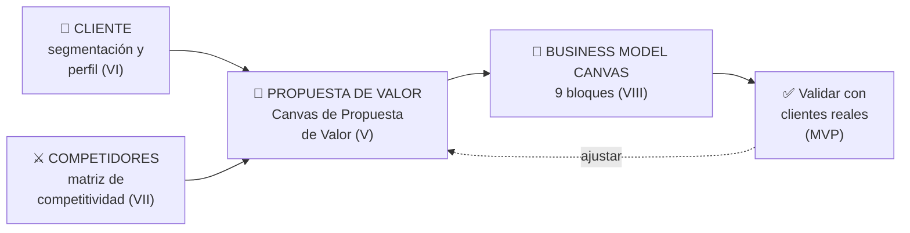
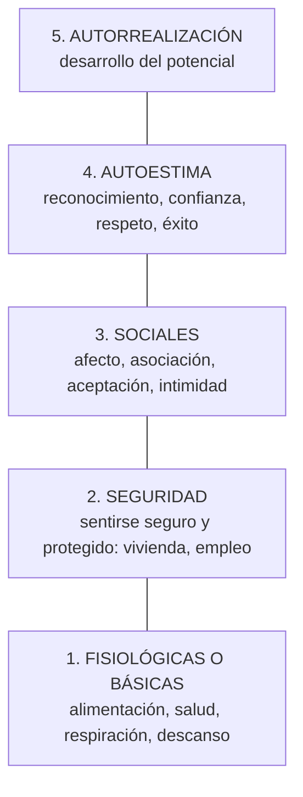
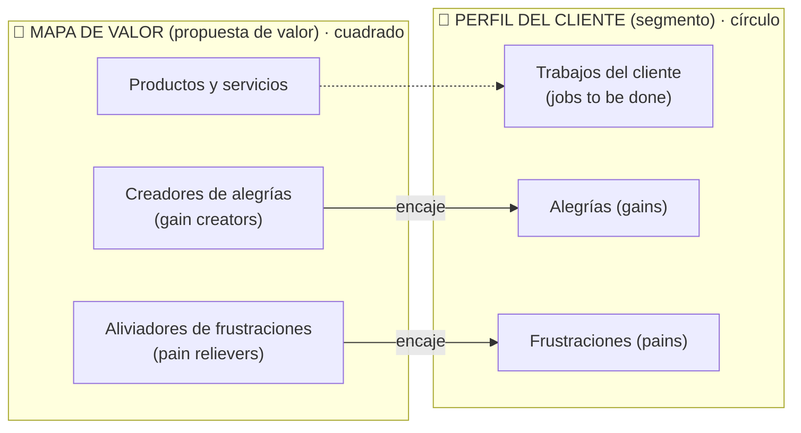
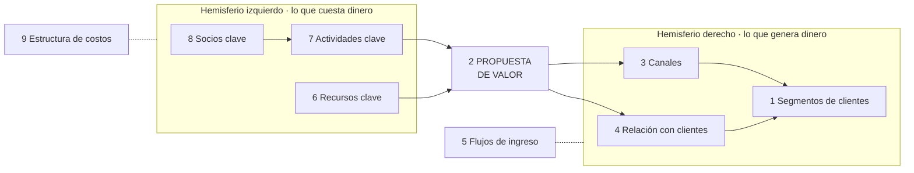

# 14 · Propuesta de valor, segmentación y Business Model Canvas

> **Fuente en el material:** *Clase 4 – Propuesta de Valor, Segmentación y CANVAS* (Ing. Mario Barrios), diapositivas 1–38. Las preguntas guía de cada bloque del Canvas salen de *Clase 4 pre-parcial – Estrategias* (Barrios), diapositivas 30–33.
> **Prerrequisitos:** [13 Design Thinking](13-design-thinking.md) (empatizar con el usuario).
> **Tiempo estimado:** 75 min.
> **Primer Parcial · Tema 14 de 14** (Clase 4 · Barrios).

---

## 🎯 Objetivos de aprendizaje

1. Explicar la frase de Guy Kawasaki *"o eres diferente o eres barato"* y por qué competir solo por precio destruye el negocio.
2. Definir la **propuesta de valor** y explicar cómo hacerla **relevante** y cómo **comprobar** que funciona.
3. Distinguir **quiénes reciben el valor** (usuario/cliente, empresa, inversor) y las diferencias entre **B2C** y **B2B**.
4. Relacionar la propuesta de valor con la **pirámide de Maslow**, la **pirámide de los 30 elementos de valor** (Bain) y los **11 elementos para crear valor** (Osterwalder).
5. Completar el **Canvas de Propuesta de Valor** (mapa de valor vs. perfil del cliente) y redactar la propuesta con la **plantilla** *"Nuestro… ayuda a… que quieren…"*.
6. **Segmentar** y perfilar al **cliente ideal** (buyer persona) en tres dimensiones, y **validarlo** en el mundo real.
7. Clasificar a los **competidores** (directo, indirecto, sustituto, latente) y armar una **matriz de competitividad**.
8. Describir los **9 bloques del Business Model Canvas** y para qué sirve.

---

## 🗺️ Esquema del tema

- **I. "O eres diferente o eres barato"**
- **II. Hacer y probar rápido** (y las 3 preguntas antes de avanzar)
- **III. La propuesta de valor**
  - A. Qué es
  - B. Cómo hacerla relevante
  - C. Cómo comprobar que funciona
  - D. ¿Quiénes deben recibir el valor? (B2C y B2B)
- **IV. Qué necesidad satisface: pirámides de preferencias**
  - A. Pirámide de Maslow
  - B. Pirámide de los 30 elementos de valor (Bain & Company)
  - C. Los 11 elementos para crear valor (Osterwalder)
  - D. Atributos de la propuesta de valor
- **V. Canvas de Propuesta de Valor**
  - A. Los dos lados: mapa de valor y perfil del cliente
  - B. Encaje (*fit*) y desajuste (*misfit*): el caso NEXA
  - C. La plantilla para redactarla
- **VI. Análisis del cliente (segmentación)**
  - A. Por qué es clave
  - B. Cómo perfilar al cliente ideal
  - C. Validación del cliente
- **VII. Competidores**
  - A. Qué es un competidor
  - B. Tipos: directa, indirecta, sustituta, latente
  - C. Matriz de competitividad
- **VIII. Business Model Canvas**
  - A. Concepto
  - B. Los 9 bloques y sus preguntas
- **IX. Caso aplicado paso a paso**

---

## 🧠 Mapa visual

> 💡 **Para entenderlo:** el orden de la clase es *a quién le sirvo* → *qué valor le doy y por qué me elegiría a mí y no a la competencia* → *cómo armo un negocio alrededor de ese valor*. La propuesta de valor es el bloque central del Business Model Canvas.

---

## 📖 Desarrollo

## I. "O eres diferente o eres barato"

> 📌 *"Al final, **o eres diferente o eres barato**."* — **Guy Kawasaki** (especialista en marketing y tecnología).

La cátedra la desarrolla en tres ideas:

| Idea | Qué dice |
|---|---|
| **Competencia de precios** | Si tu producto o servicio es **igual al de los demás**, no tenés un valor único. La única forma de atraer clientes es **cobrar menos** que la competencia. |
| **Guerra de precios** | Competir **solo por precio destruye los márgenes** de ganancia y desgasta el negocio. |
| **El valor de la diferencia** | Si ofrecés algo **único o innovador**, los clientes te valoran más. Eso permite **cobrar precios justos** sin depender de ser el más económico. |

> 🔗 La misma frase aparece en la clase de estrategias, atribuida a **Kim y Mauborgne** (*"en el mundo actual, sos distinto o sos barato"*): es el punto de partida de la **Estrategia del Océano Azul** (tema [15](../resto-de-la-materia/15-estrategias-comerciales-y-oceano-azul.md)).

---

## II. Hacer y probar rápido

> 📌 *"**Hacer y probar rápido. Aprender y ajustar aún más rápido.**"*

1. **No asumas, validá:** las ideas no valen nada sin **feedback real**.
2. **MVP ≠ producto final:** es una **versión mínima para testear y aprender**.
3. **El mercado es el juez:** una buena propuesta de valor es la que **resuelve un problema real para un cliente real**.
4. **Iterar es obligatorio:** cada test es una mejora. Sin cambios, no hay evolución.
5. **Velocidad sobre perfección:** mejor validar en **1 mes** que gastar **1 año** en algo que nadie quiere.

**Preguntas clave antes de avanzar:**

1. ¿El **problema** es relevante para el usuario?
2. ¿La **solución** realmente mejora su situación?
3. ¿Qué **evidencia** tenemos de que **pagarían** por esto?

> 🔗 Es la lógica de **Lean Startup** y el **MVP** (tema [20](../resto-de-la-materia/20-lean-startup-y-mvp.md)) y del "fail fast" de [Design Thinking](13-design-thinking.md).

---

## III. La propuesta de valor

### A. Qué es

> 📌 *"Es la **razón por la que los clientes eligen tu solución en lugar de la competencia**. Debe responder: **¿Qué problema resuelvo? ¿Por qué mi solución es mejor?**"*

> 📝 **Citar y explayarse:** La cátedra define la propuesta de valor como *"la razón por la que los clientes eligen tu solución en lugar de la competencia"*, y pide que responda dos preguntas: *qué problema resuelvo* y *por qué mi solución es mejor*. Es decir, no alcanza con describir el producto: hay que explicar **qué cambia en la vida del cliente** y **por qué eso no lo consigue en otro lado**. Si no hay diferencia, según Kawasaki solo queda competir por precio, lo que destruye los márgenes. Por ejemplo, una app de delivery no ofrece "comida a domicilio" (eso lo hacen todas), sino "tu pedido en 15 minutos o no lo pagás": un beneficio concreto y distinto de la competencia.

### B. Cómo hacerla relevante

| Criterio | Qué significa |
|---|---|
| **Clara y específica** | Evitar frases genéricas como *"somos los mejores"*. |
| **Centrada en el cliente** | Explicar el **beneficio directo** que obtiene. |
| **Diferenciadora** | Debe **destacar frente a la competencia**. |

### C. Cómo comprobar que funciona

| Prueba | Qué se hace |
|---|---|
| **Validación real** | Presentar la propuesta a **clientes potenciales** y **medir su interés**. |
| **Test rápido** | ¿La audiencia **entiende el valor en segundos**? |
| **Conversión** | Si **no genera ventas o interés**, hay que **ajustarla**. |

### D. ¿Quiénes deben recibir el valor?

| Destinatario | Rol (cátedra) |
|---|---|
| **Usuario / cliente** | Son quienes **validan, aceptan, rechazan o usan** el producto. Son los **formadores del mercado en B2C**. |
| **Empresa** | Son **usuarios** del producto; pueden ser potenciales **socios estratégicos**, como también **clientes en B2B**. |
| **Inversor** | Quienes poseen **capital de riesgo** y están dispuestos a **invertir en la potencialidad** de una startup. |

> 💡 Una startup necesita **tres propuestas de valor** a la vez: una para quien **usa** el producto, otra para la empresa que lo **compra o se asocia**, y otra para quien **pone la plata** (el inversor compra potencial de crecimiento, no el producto).

**B2C vs. B2B:**

| B2C (*Business-to-Consumer*): formadores del mercado | B2B (*Business-to-Business*) |
|---|---|
| **Venta directa:** fabrican o adquieren productos para venderlos **sin intermediarios** al consumidor final. | **Volumen grande:** las compras se hacen **al por mayor**. |
| **Influencia en precios:** su gran volumen les permite **fijar tendencias** de consumo y precios competitivos. | **Proceso lento:** decidir una compra **toma tiempo** y requiere **contratos**. |
| **Omnicanalidad:** combinan **tiendas físicas y plataformas digitales** para dominar el alcance masivo. | **Relaciones largas:** las empresas buscan **socios comerciales para muchos años**. |

---

## IV. Qué necesidad satisface: pirámides de preferencias

> 📌 *"Debemos comprender **qué satisface nuestra propuesta de valor**."*

### A. Pirámide de Maslow

Teoría de las necesidades de **Abraham Maslow** (psicología humanista), presentada en **1943** en el artículo *"Una teoría sobre la motivación humana"* (*A Theory of Human Motivation*). Maslow quería entender **qué hace felices a las personas y qué las motiva** a actuar en su día a día.

### B. Pirámide de los 30 elementos de valor (Bain & Company)

La "pirámide de preferencias" que usa la cátedra se basa en la investigación de **Eric Almquist, John Senior y Nicholas Bloch** (Bain & Company, *Harvard Business Review*, 2016). Ordena los **atributos fundamentales** que un producto o servicio puede ofrecer: **más atributos = más oportunidades de que lo adopten**.

| Nivel (de abajo hacia arriba) | Necesidad para el usuario | Ejemplos de elementos |
|---|---|---|
| **Funcional** | Impacto funcional | Ahorrar tiempo, simplificar, hacer dinero, reducir riesgos, integrar, conectar, reducir esfuerzo, reducir costos, calidad, variedad, informar, organizar, evitar molestias. |
| **Emocional** | Impacto emocional | Bienestar, reducir la ansiedad, diseño y estética, nostalgia, diversión, recompensarse, brindar acceso, valor terapéutico. |
| **Cambiar la vida** | Cambio de vida | Autoactualización, proveer esperanza, herencia/legado, motivación, afiliación y pertenencia. |
| **Impacto social** | Impacto social | Auto-trascendencia. |

> 💡 Es la pirámide de Maslow **llevada a productos**: abajo lo que resuelve una tarea; arriba lo que cambia cómo se siente o quién es la persona. Las marcas más valoradas suelen cubrir **varios niveles a la vez**.

### C. Los 11 elementos para crear valor (Osterwalder)

Adaptación de **Alexander Osterwalder** (creador del Business Model Canvas):

| Elemento | Cómo crea valor |
|---|---|
| **Novedad** | Cubrir una necesidad que antes no existía por falta de oferta. |
| **Rendimiento** | Aumentar el desempeño de un producto. |
| **Personalización** | Crear valor para segmentos específicos de clientes. |
| **Hacer el trabajo** | Ayudar al cliente a realizar una tarea específica (ej.: contabilidad). |
| **Diseño** | Superioridad estética del producto. |
| **Marca y estatus** | Reconocimiento y posición social de la marca. |
| **Precio** | Ofrecer un valor similar por un precio menor. |
| **Reducción de costos** | Reducir costos para el cliente final. |
| **Reducción de riesgos** | Hacer más segura la adquisición de valor. |
| **Accesibilidad** | Dar acceso a un producto a clientes que no podían comprarlo. |
| **Comodidad y usabilidad** | Facilitar el uso de un producto. |

### D. Atributos de la propuesta de valor

> 📌 La propuesta de valor: **(1)** es **solución a los problemas** de los clientes; **(2)** **satisface sus necesidades**; **(3)** **materializa la estrategia para el segmento objetivo**, **combinando precio, producto, servicio e imagen de marca**; **(4)** **comunica de manera diferenciada** el "valor" frente a la oferta de la competencia.

---

## V. Canvas de Propuesta de Valor

### A. Los dos lados

> 📌 *"Vinculamos la **estructura central y lateral derecha** con **los dolores y formas de resolverlos**. Debemos analizar el **proceso del trabajo/tarea** que realizan los usuarios y **cómo mejorar su experiencia**: 'Hacerlos felices'."*

| Lado | Bloque | Pregunta |
|---|---|---|
| **Perfil del cliente** (derecha, círculo) | **Trabajos del cliente** | ¿Qué tarea o meta intenta lograr? |
| | **Alegrías** (*gains*) | ¿Qué beneficios espera o le gustaría tener? |
| | **Frustraciones** (*pains*) | ¿Qué le molesta, qué riesgos u obstáculos tiene? |
| **Mapa de valor** (izquierda, cuadrado) | **Productos y servicios** | ¿Qué ofrecemos? |
| | **Creadores de alegrías** | ¿Cómo generamos los beneficios que el cliente espera? |
| | **Aliviadores de frustraciones** | ¿Cómo eliminamos o reducimos sus dolores? |

> ⚠️ **Se empieza por el círculo (el cliente)**, no por el producto. Primero se entiende qué trabajos, dolores y alegrías tiene el segmento; recién después se diseña qué ofrecer.

### B. Encaje (*fit*) y desajuste (*misfit*): el caso NEXA

Hay **encaje** cuando cada aliviador responde a una frustración real y cada creador de alegría a una alegría real. La cátedra lo muestra con el caso **NEXA** (el mismo del [TP](../evaluacion/casos/nexa-enunciado.md)): el lanzamiento del módulo de IA **NEXA Vision** para pymes.

| | Mapa de valor (NEXA) | Perfil del cliente (pymes) | Resultado |
|---|---|---|---|
| **Productos** | Plataforma "todo-en-uno" (ventas, stock, envíos) + **NEXA Vision** (algoritmo predictivo de IA). | Tareas: administrar tiendas físicas y digitales en paralelo; controlar inventario, cobros y logística. | — |
| **Alegrías** | Predicción de demanda con IA, ajuste automático de precios, soporte para escalar. | Automatizar decisiones de inventario, predecir la demanda, reducir costos. | ✅ **Fit técnico**. |
| **Frustraciones** | Unifica canales y quita incertidumbre de stock. **Pero no alivia el miedo** a la filtración o uso masivo de datos. | Capital atrapado en stock que no rota; sistemas complejos o caros. **Nuevo dolor:** temor al rechazo social por falta de privacidad. | ⚠️ **Misfit reputacional**. |

> 📌 **Misfit**: *"desajuste", "incompatibilidad" o "falta de encaje"*.

> 💡 La lectura de la cátedra: **la tecnología encaja** (la IA predice bien), pero **el mercado no la adopta** porque apareció un dolor nuevo (privacidad) que la propuesta no resuelve. Un producto puede ser técnicamente excelente y aun así fracasar por un **misfit** en el perfil del cliente. 🔗 Es el mismo problema de **opinión pública** del tema [04](04-empresas-unicornio.md).

### C. La plantilla para redactarla

| Plantilla (Osterwalder) | Qué va | Ejemplo de la cátedra |
|---|---|---|
| **Nuestro** *[productos y servicios]* | Nombre del producto o servicio. | Nuestro champú natural en barra |
| **ayuda a** *[segmento de clientes]* | El cliente ideal o grupo al que te dirigís. | ayuda a personas con cuero cabelludo sensible |
| **que quieren** *[trabajo a realizar]* | La tarea o meta que el cliente intenta lograr. | que quieren lavar su cabello sin químicos fuertes |
| **al** *[verbo de reducción: reducir, evitar]* *[+ un dolor]* | El dolor que le quitás. | al evitar la picazón y la resequedad |
| **y** *[verbo de aumento: mejorar, permitir]* *[+ una alegría]* | El beneficio que le das. | y mejorar el brillo natural de su cabello |
| **(a diferencia de** *[propuesta de la competencia]***)** | Qué hace la competencia y por qué sos distinto. | a diferencia de los champús comerciales que usan sulfatos agresivos |

> 🧩 **Frase completa:** *"Nuestro champú natural en barra ayuda a personas con cuero cabelludo sensible que quieren lavar su cabello sin químicos fuertes, al evitar la picazón y la resequedad y mejorar el brillo natural de su cabello, a diferencia de los champús comerciales que usan sulfatos agresivos."*

---

## VI. Análisis del cliente (segmentación)

### A. Por qué es clave

> 📌 *"Un emprendimiento **no sobrevive por su idea, sino por su capacidad de resolver un problema real**. Para lograrlo, es esencial conocer qué **motiva**, qué **preocupa** y qué **necesita** el cliente objetivo."* 🚀 **Entender al cliente = mayor éxito en el mercado.**

Preguntas clave:

1. ¿Quién es mi **cliente ideal**? (**segmentación**)
2. ¿Qué **problemas** enfrenta en su día a día?
3. ¿Cómo **toma decisiones** de compra?
4. ¿Qué lo **frustra** de las soluciones actuales?
5. ¿Cuánto estaría **dispuesto a pagar** por resolver su problema?

### B. Cómo perfilar al cliente ideal (*buyer persona*)

Para definir el **perfil del cliente ideal** (*buyer persona* o perfil de comprador) se analizan **tres dimensiones**:

| Dimensión | Qué se analiza |
|---|---|
| **1. Datos demográficos** | 📍 Edad, género, ubicación, nivel socioeconómico. 🏢 Tipo de negocio (si es B2B). |
| **2. Comportamiento y hábitos** | 📊 ¿Cómo busca información? 💰 ¿Qué criterios usa para comprar? 📢 ¿Dónde consume contenido (redes, eventos, boca a boca)? |
| **3. Dolores y necesidades** | ❌ ¿Cuáles son sus mayores frustraciones? 🎯 ¿Qué espera de una solución ideal? 🤝 ¿Qué tan abierto está a cambiar su forma de hacer las cosas? |

> 💡 *Tip de la cátedra:* entender al cliente permite diseñar una **propuesta de valor irresistible**.

> 🔗 Con datos, la segmentación se hace con **clustering** de Data Mining (tema [09](09-data-mining.md)).

### C. Validación del cliente: prueba en el mundo real

> 📌 *"Tu idea es **solo una hipótesis**. Hay que validarla."*

| Cómo validar | Qué se hace |
|---|---|
| **Entrevistas y encuestas** | Preguntar directamente a clientes potenciales. |
| **Experimentos rápidos** | **MVP**, demos o versiones gratuitas para obtener feedback. |
| **Métricas clave** | Tasa de respuesta, intención de compra, % de usuarios interesados. |

🚨 **Errores comunes en el análisis del cliente:**

1. ❌ Suponer que **"todos" son clientes** (falta de segmentación).
2. ❌ **No hablar con clientes reales** antes de desarrollar el producto.
3. ❌ Enfocarse en **características del producto** en lugar de **beneficios reales**.

> 🎯 **Regla clave:** *"La validación temprana ahorra tiempo, dinero y fracasos."*

---

## VII. Competidores

### A. Qué es un competidor

> 📌 *"Un competidor es **cualquier empresa o solución que satisface la misma necesidad** que tu negocio."* En el mundo de los negocios nadie opera solo: siempre hay otras opciones que los clientes pueden elegir. Identificar a los competidores es clave para **diseñar una propuesta de valor diferenciada** y definir estrategias comerciales.

### B. Tipos de competidores

| Tipo | Definición (cátedra) | Ejemplo de la cátedra (agro) |
|---|---|---|
| **Directa** | Ofrecen un producto o servicio **muy similar** al tuyo, dirigido **al mismo público**. | Dos plataformas SaaS para gestión de cultivos agrícolas. |
| **Indirecta** | Resuelven **el mismo problema, pero de otra manera**. | Un productor que usa una **planilla de Excel** en lugar de un software avanzado. |
| **Sustituta** | **Opciones alternativas** que pueden reemplazar tu solución, aunque **no sean idénticas**. | Un **asesor agrícola** que da recomendaciones personalizadas en lugar de un software de análisis de datos. |
| **Latente** | Negocios que **aún no están en tu mercado**, pero **pueden ingresar** y volverse una amenaza. | Un **gigante tecnológico global** que lanza una herramienta de gestión agrícola con **IA y Data Mining**. |

> ➕ **Nota del docente sobre el competidor latente:** esas herramientas hacen **análisis predictivo** (clima, suelo y rendimiento para anticipar plagas o el momento de siembra y cosecha), **agricultura de precisión** (insumos variables según cada metro cuadrado del lote) y usan **asistentes inteligentes** (modelos de lenguaje para tareas administrativas y decisiones financieras).

> ⚠️ **Indirecta vs. sustituta:** la **indirecta** resuelve el mismo problema con **otra herramienta** (Excel en vez de software); la **sustituta** lo reemplaza con **otra cosa distinta** (una persona, un asesor, en vez de un software).

**¿Por qué es clave conocer a la competencia?** Ayuda a encontrar **ventajas competitivas**, permite **innovar donde otros fallan** y evita lanzar un producto **sin diferenciarlo**.

> 📌 **Regla clave:** *"Si no sabés con quién competís, tu cliente tampoco sabrá por qué elegirte a vos."*

### C. Matriz de competitividad

> 📌 *"La Matriz de Competitividad permite **comparar tu negocio con la competencia directa e indirecta** en diferentes **variables clave**."* Responde: ¿cómo se mide la ventaja competitiva frente a otros jugadores del mercado?

**Cómo se construye:**

1. Seleccioná **de 3 a 5 competidores** (directos e indirectos).
2. Definí los **criterios clave** (precio, facilidad de uso, innovación, servicio postventa, etc.).
3. Asigná una **escala de puntuación** (ej.: 1–5) en cada criterio.
4. Identificá tus **fortalezas y debilidades** frente a la competencia.

**Variables de ejemplo:** 🚀 diferenciación (¿qué tan único es?) · 💰 precio (¿más caro o accesible?) · 🛠 facilidad de uso (¿intuitivo o requiere capacitación?) · 📢 alcance de marca (¿es conocida en el mercado objetivo?).

**Ejemplo de la cátedra:**

| | Precio | Facilidad de uso | Innovación | Atención al cliente | Diferenciación | Alcance de mercado |
|---|---|---|---|---|---|---|
| **Nuestro SaaS** | 4 | 5 | 5 | 4 | 5 | 3 |
| Competidor A | 3 | 4 | 4 | 3 | 3 | **5** |
| Competidor B | **5** | 3 | 3 | 4 | 2 | 4 |
| Competidor C | 2 | 5 | 4 | **5** | 4 | 2 |

> 💡 **Cómo se lee:** "Nuestro SaaS" gana en **innovación y diferenciación** (su propuesta de valor) pero pierde en **alcance de mercado** frente al Competidor A. La conclusión práctica: el desafío no es el producto sino **darlo a conocer** (canales y marketing).

---

## VIII. Business Model Canvas

### A. Concepto

> 📌 *"Muestra **cómo genera valor el negocio, en una sola imagen**. El CBM permite **elaborar hipótesis** acerca de cómo va a funcionar el negocio, haciendo **interactuar cada uno de sus componentes**. A medida que la startup **valida con datos y hechos** esas hipótesis, estos componentes van conformando el **diseño final del negocio** a implementar."*

Creado por **Alexander Osterwalder**. Se divide en un **hemisferio derecho** (el cliente y los ingresos: *things that make money*), un **hemisferio izquierdo** (la operación y los costos: *things that cost money*) y en el centro la **propuesta de valor** (*the mission*).

### B. Los 9 bloques y sus preguntas

El orden numérico es **el orden en que se completa**: se empieza por el cliente (1) y se termina por los costos (9).

| # | Bloque | Qué es (cátedra) | Preguntas guía |
|---|---|---|---|
| 1 | **Segmentos de clientes** | Uno o varios segmentos de clientes. | ¿Para quién estamos creando valor? ¿Quiénes son nuestros clientes más importantes? ¿Cuáles son los arquetipos de los clientes? |
| 2 | **Propuesta de valor** | Orientada a resolver preocupaciones de los clientes y satisfacer sus necesidades. | ¿Qué valor entregamos? ¿Cuál de los problemas de nuestros clientes ayudamos a resolver? ¿Qué paquetes de productos ofrecemos a cada segmento? ¿Qué necesidades satisfacemos? ¿Cuál es el producto mínimo viable? |
| 3 | **Canales** (distribución y comunicación) | Las propuestas de valor llegan a los clientes a través de la comunicación, la distribución y los canales de venta. | ¿A través de qué canales quieren ser alcanzados nuestros segmentos? ¿Cómo llegan otras empresas a ellos? ¿Cuáles funcionan mejor y son más rentables? ¿Cómo los integramos con las rutinas de los clientes? |
| 4 | **Relación con clientes** | Se establecen y mantienen con cada segmento. | ¿Cómo conseguimos, mantenemos y aumentamos los clientes? ¿Qué relaciones hemos establecido? ¿Cómo se integran con el resto del modelo? ¿Qué tan costosas son? |
| 5 | **Flujos de ingreso** | El resultado de las propuestas de valor ofrecidas a los clientes. | ¿Por qué valor están dispuestos a pagar? ¿Qué pagan actualmente? ¿Cuál es el modelo de ingresos? ¿Cuáles son las tácticas de fijación de precios? |
| 6 | **Recursos clave** | Los medios necesarios para ofrecer y entregar los elementos anteriores. | ¿Qué recursos clave requieren nuestras propuestas de valor, canales, relaciones y flujos de ingreso? |
| 7 | **Actividades clave** | La realización de una serie de actividades. | ¿Qué actividades clave requieren nuestras propuestas de valor, canales, relaciones y flujos de ingreso? |
| 8 | **Socios clave** (red de socios / alianzas) | Algunas actividades se externalizan y algunos recursos se adquieren fuera de la empresa. | ¿Quiénes son nuestros socios y proveedores clave? ¿Qué recursos adquirimos de ellos? ¿Qué actividades realizan? |
| 9 | **Estructura de costos** | Los elementos del modelo de negocio dan como resultado la estructura de costos. | ¿Cuáles son los costos más importantes del modelo? ¿Qué recursos y actividades clave son más caros? |

> 📝 **Citar y explayarse:** Según la cátedra, el Business Model Canvas *"muestra cómo genera valor el negocio, en una sola imagen"* y sirve para *"elaborar hipótesis acerca de cómo va a funcionar el negocio"*. La clave está en la palabra **hipótesis**: cada bloque es una suposición (quién es el cliente, por qué canal llega, cuánto paga) que la startup tiene que **validar con datos y hechos**; a medida que se validan, el lienzo se convierte en el diseño final del negocio. Sus nueve bloques se completan en orden: del lado derecho el **cliente** (segmentos, canales, relación) y los **ingresos**; en el centro la **propuesta de valor**; del lado izquierdo la **operación** (recursos, actividades, socios) y los **costos**. Por ejemplo, Spotify tendría como segmentos a oyentes y artistas, como propuesta "toda la música al instante", como ingresos la suscripción premium y la publicidad, y como costo principal las licencias a discográficas (sus socios clave).

> 🔗 **Canvas de Propuesta de Valor vs. Business Model Canvas:** el primero es un **zoom** de dos bloques del segundo (el **2 Propuesta de valor** y el **1 Segmentos de clientes**).

---

## IX. Caso aplicado paso a paso

> 🧩 **Idea:** una app que conecta a estudiantes universitarios con tutores de otros años para clases de apoyo antes de un parcial.

| Paso | Aplicación |
|---|---|
| **1. Segmentar** | Estudiantes de 1.º y 2.º año (18–22, CABA), que estudian a último momento, buscan ayuda por grupos de WhatsApp y tienen poco presupuesto. |
| **2. Perfil del cliente** | **Trabajo:** aprobar el parcial. **Frustraciones:** profesores particulares caros, horarios que no coinciden, no saber si el tutor sabe la materia de *esa* cátedra. **Alegrías:** entender rápido, estudiar con alguien que ya aprobó con el mismo profesor. |
| **3. Mapa de valor** | **Producto:** app de reservas de tutorías por materia y cátedra. **Aliviador:** tutores calificados por otros alumnos, clases desde $X por hora. **Creador de alegría:** "tutor que aprobó con tu mismo profesor". |
| **4. Redactar** | *"Nuestra app de tutorías ayuda a estudiantes de primeros años que quieren aprobar su parcial, al evitar profesores caros y genéricos y permitir estudiar con alguien que aprobó con su misma cátedra, a diferencia de los profesores particulares tradicionales."* |
| **5. Competidores** | **Directa:** otras apps de tutorías. **Indirecta:** grupos de WhatsApp y resúmenes compartidos. **Sustituta:** profesor particular, clases de consulta de la facultad. **Latente:** un asistente de IA que explique la materia. |
| **6. BMC** | Segmentos: estudiantes y tutores. Canales: Instagram y centros de estudiantes. Ingresos: comisión por clase. Recursos: la app y la base de tutores. Socios: centros de estudiantes. Costos: desarrollo y marketing. |
| **7. Validar** | MVP: un formulario de Google + un grupo de WhatsApp con 5 tutores durante una semana de parciales. Métrica: cuántos reservan y cuántos repiten. |

---

## ⚠️ Conceptos que se confunden

| Se confunde… | …con | Diferencia |
|---|---|---|
| Propuesta de valor | Descripción del producto | La propuesta dice **qué problema resuelve y por qué es mejor que la competencia**; la descripción dice qué es. |
| Canvas de Propuesta de Valor | Business Model Canvas | El de propuesta de valor desarrolla **cliente + propuesta** (2 bloques); el BMC muestra **todo el negocio** en 9 bloques. |
| Competencia indirecta | Competencia sustituta | Indirecta: mismo problema con **otro método** (Excel). Sustituta: **otra solución distinta** que reemplaza (un asesor). |
| Competencia latente | Competencia directa | La latente **todavía no está** en el mercado pero puede entrar. |
| Cliente | Usuario | En B2B quien **paga** (la empresa) no siempre es quien **usa**. Por eso la cátedra separa usuario, empresa e inversor. |
| Fit técnico | Encaje con el mercado | Que la tecnología funcione no significa que el cliente la adopte (caso NEXA: **misfit reputacional**). |

---

## 🔗 Conexiones

- **← [13 Design Thinking](13-design-thinking.md):** empatizar = construir el perfil del cliente.
- **← [09 Data Mining](09-data-mining.md):** segmentación de clientes con clustering.
- **← [04 Unicornios y opinión pública](04-empresas-unicornio.md):** el misfit reputacional de NEXA.
- **→ [15 Estrategias comerciales y Océano Azul](../resto-de-la-materia/15-estrategias-comerciales-y-oceano-azul.md):** "sos distinto o sos barato" y la matriz de las cuatro acciones.
- **→ [20 Lean Startup y MVP](../resto-de-la-materia/20-lean-startup-y-mvp.md):** validar cada bloque del Canvas con un MVP.

---

## ✍️ Autoevaluación

**1. Defina propuesta de valor y explique cómo se comprueba que funciona.**

Ver respuesta

Es **la razón por la que los clientes eligen tu solución en lugar de la competencia**; debe responder qué problema resuelvo y por qué mi solución es mejor. Se comprueba con **validación real** (presentarla a clientes potenciales y medir su interés), un **test rápido** (¿la audiencia entiende el valor en segundos?) y la **conversión** (si no genera ventas o interés, hay que ajustarla).

**2. Explique la frase de Guy Kawasaki "o eres diferente o eres barato".**

Ver respuesta

Si el producto es igual al de los demás, no hay valor único y la única forma de atraer clientes es **bajar el precio**; eso lleva a una **guerra de precios** que destruye los márgenes. Si en cambio se ofrece algo **único o innovador**, el cliente lo valora más y se puede cobrar un precio justo sin depender de ser el más barato.

**3. ¿Qué bloques tiene el Canvas de Propuesta de Valor y cuándo hay encaje?**

Ver respuesta

**Perfil del cliente:** trabajos del cliente, alegrías y frustraciones. **Mapa de valor:** productos y servicios, creadores de alegrías y aliviadores de frustraciones. Hay **encaje** cuando los aliviadores responden a frustraciones reales y los creadores de alegría a alegrías reales del segmento. Si queda un dolor sin resolver hay **misfit** (como el temor a la privacidad en el caso NEXA).

**4. Nombre las tres dimensiones para perfilar al cliente ideal y dé un ejemplo de cada una.**

Ver respuesta

**Datos demográficos** (edad, género, ubicación, nivel socioeconómico; tipo de negocio si es B2B); **comportamiento y hábitos** (cómo busca información, qué criterios usa para comprar, dónde consume contenido); **dolores y necesidades** (mayores frustraciones, qué espera de una solución ideal, qué tan abierto está a cambiar).

**5. Distinga los cuatro tipos de competidores con un ejemplo.**

Ver respuesta

**Directa:** producto muy similar al mismo público (dos SaaS de gestión agrícola). **Indirecta:** mismo problema de otra manera (una planilla de Excel). **Sustituta:** alternativa no idéntica que reemplaza la solución (un asesor agrícola). **Latente:** todavía no está en el mercado pero puede entrar (un gigante tecnológico con IA para el agro).

**6. ¿Qué es el Business Model Canvas y cuáles son sus 9 bloques?**

Ver respuesta

Muestra **cómo genera valor el negocio en una sola imagen** y permite **elaborar hipótesis** sobre cómo funcionará, que la startup valida con datos y hechos. Bloques: (1) segmentos de clientes, (2) propuesta de valor, (3) canales, (4) relación con clientes, (5) flujos de ingreso, (6) recursos clave, (7) actividades clave, (8) socios clave y (9) estructura de costos.

---

[← 13 Design Thinking](13-design-thinking.md) · [🏠 Índice](../README.md) · [Terminaste los temas del Primer Parcial → Evaluación](../evaluacion/README.md) · [Resto de la materia → 15 Estrategias comerciales y Océano Azul](../resto-de-la-materia/15-estrategias-comerciales-y-oceano-azul.md)
