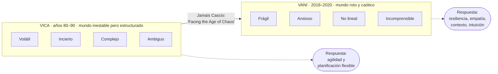
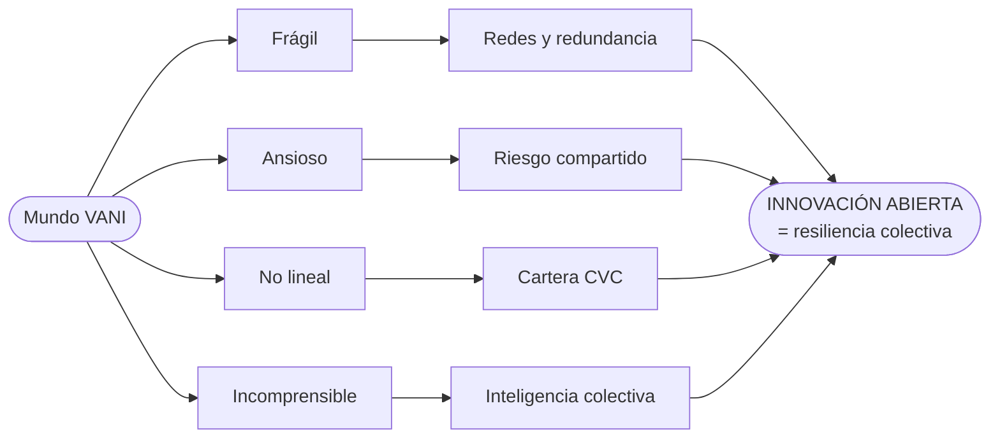

# 15 · De VICA a VANI: liderazgo e innovación en entornos de caos

> **Fuente en el material:** *Día 3 – Innovación Abierta*, diapositivas 15–25.
> **Prerrequisitos:** [14 Innovación abierta](14-innovacion-abierta.md).
> **Tiempo estimado:** 45 min.
> **Resto de la materia · Tema 15** (Día 3). No entra en el Primer Parcial.

---

## 🎯 Objetivos de aprendizaje

1. Explicar el marco **VICA (VUCA)**: origen y significado de cada letra.
2. Explicar el marco **VANI (BANI)** de **Jamais Cascio**: origen y significado de cada letra.
3. Explicar **por qué VICA quedó obsoleto** según Cascio.
4. Para cada letra, explicar su **impacto en la innovación abierta** y la **respuesta** recomendada.
5. Usar la **matriz de transición estratégica** VICA → VANI.

> ⚠️ **Antes de empezar – trampa de lectura:** en las diapositivas de este tema aparece **"Impacto en IA"**. Acá **IA = Innovación Abierta**, **no** Inteligencia Artificial. Es un error muy común al estudiar de las diapositivas.

---

## 🗺️ Esquema del tema

- **I. Por qué importan los marcos del entorno**
- **II. VICA (VUCA): gestión del cambio**
  - A. Origen
  - B. Las cuatro letras
    1. Volátil
    2. Incierto
    3. Complejo
    4. Ambiguo
  - C. Respuesta estándar: agilidad y planificación flexible
- **III. VANI (BANI): gestión del caos**
  - A. Origen: Jamais Cascio
  - B. Por qué VICA quedó obsoleto
  - C. Las cuatro letras
    1. Frágil (*Brittle*)
    2. Ansioso (*Anxious*)
    3. No lineal (*Nonlinear*)
    4. Incomprensible (*Incomprehensible*)
  - D. Respuesta: resiliencia, empatía, contexto, intuición
- **IV. Matriz de transición estratégica VICA → VANI**
- **V. Conclusión: innovación abierta como resiliencia colectiva**

---

## 🧠 Mapa visual

---

## 📖 Desarrollo

## I. Por qué importan los marcos del entorno

> 📌 *"Los modelos de gestión **no nacen en el vacío**. La Innovación Abierta surgió como **respuesta directa a la aceleración del entorno**. Para diseñar una estrategia efectiva, las organizaciones utilizan **marcos analíticos que describen la naturaleza del mundo que enfrentan**. Hoy vivimos **la transición de un marco a otro**."*

> 💡 **Para entenderlo:** antes de elegir *cómo* innovar, una empresa tiene que entender *en qué mundo* está jugando. VICA y VANI son dos "diagnósticos" de ese mundo.

> 📝 **Citar y explayarse:** La cátedra plantea que *"los modelos de gestión no nacen en el vacío"*: la innovación abierta surgió como *"respuesta directa a la aceleración del entorno"*, y para diseñar una estrategia las organizaciones usan *"marcos analíticos que describen la naturaleza del mundo que enfrentan"*. VICA y VANI son esos marcos: diagnósticos del contexto que condicionan cómo conviene innovar. VICA describe un mundo **volátil, incierto, complejo y ambiguo**, difícil de predecir pero todavía estructurado, que se enfrenta con **agilidad y planificación flexible**. VANI, en cambio, describe un mundo **frágil, ansioso, no lineal e incomprensible**, que *"ya no solo es inestable, sino que está roto"*. Elegir una estrategia sin este diagnóstico es como planificar un viaje sin mirar el clima.

---

## II. VICA (VUCA): gestión del cambio

### II.A Origen
- Desarrollado por el **ejército estadounidense en los años 80**; la cátedra lo ubica **nacido en la Guerra Fría y adoptado en los 90** por el mundo de los negocios.
- Describe un mundo **difícil de predecir pero estructurado**, enfocado en la **volatilidad** y la **incertidumbre**.

### II.B Las cuatro letras

| Letra | Definición (cátedra) | Impacto en la Innovación Abierta |
|---|---|---|
| **V – Volatilidad** | **Cambios veloces e imprevistos**. | **Innovar a velocidad de mercado**. |
| **I – Incertidumbre** | **Falta de claridad sobre el futuro**. | **Buscar señales externas en startups**. |
| **C – Complejidad** | **Múltiples factores interconectados**. | **Co-crear con expertos globales**. |
| **A – Ambigüedad** | **Falta de claridad en el significado**. | **Experimentar con prototipos rápidos**. |

### II.C Respuesta estándar
**Agilidad y planificación flexible.**

---

## III. VANI (BANI): gestión del caos

### III.A Origen: Jamais Cascio
- Creado por el **antropólogo, autor y futurista estadounidense Jamais Cascio**.
- Lo propuso **a fines de 2018**, pero cobró relevancia mundial con su artículo ***"Facing the Age of Chaos"*** ("Enfrentando la era del caos") a **principios de 2020**.
- **VANI** es la traducción de **BANI**: ***Brittle, Anxious, Nonlinear, Incomprehensible***.

### III.B Por qué VICA quedó obsoleto
> 📌 *"Según Cascio, el mundo actual **ya no es simplemente complejo o inestable**; se ha vuelto **caótico, confuso** y funciona bajo **dinámicas que desafían la lógica tradicional**."*

VANI describe un mundo que **"ya no solo es inestable, sino que está roto"**, enfocado en la **fragilidad** y la **no-linealidad**.

### III.C Las cuatro letras

#### III.C.1 F – Frágil (*Brittle*)
- **Concepto:** sistemas que **parecen sólidos, estables y robustos en la superficie** pueden **romperse de forma repentina y catastrófica** ante un impacto inesperado. **No se doblan; se quiebran por completo.**
- **En Innovación Abierta:** depender de **un único proveedor**, **un solo laboratorio de I+D cerrado** o un **modelo de negocio rígido** expone a la empresa al colapso.
- **Respuesta:** **resiliencia y redundancia**, logradas **diversificando capacidades** mediante **alianzas con startups y redes globales**.
- **Impacto en IA (Innovación Abierta):** **resiliencia compartida en red**.

> 🧩 **Ejemplo:** una cadena de suministro global "eficiente" que dependía de una sola fábrica se cortó por completo durante la pandemia.

#### III.C.2 A – Ansioso (*Anxious*)
- **Concepto:** la volatilidad extrema y la velocidad de los cambios generan **ansiedad, desconfianza y miedo a tomar la decisión equivocada**. Cada elección **parece de vida o muerte**.
- **En Innovación Abierta:** **parálisis por análisis** o posturas **ultra-defensivas**.
- **Respuesta:** **empatía, transparencia y agilidad**. Al **descentralizar** el desarrollo de productos, **los riesgos se mitigan y se comparten** con el ecosistema.
- **Impacto en IA:** **confianza y empatía en el ecosistema**.

#### III.C.3 N – No lineal (*Nonlinear*)
- **Concepto:** **se rompe la relación causa-efecto** tradicional. **Pequeños eventos generan consecuencias desproporcionadas** y **grandes esfuerzos pueden terminar en impacto nulo**. Las **predicciones a largo plazo pierden validez**.
- **En Innovación Abierta:** **planificar productos a 5 años es inviable**.
- **Respuesta:** **contexto y flexibilidad**. Se necesitan **múltiples apuestas simultáneas** (**carteras de Corporate Venture Capital**) para reaccionar rápido cuando una tendencia pequeña **se convierte de golpe en estándar** de la industria.
- **Impacto en IA:** **apuestas diversificadas (CVC)**.

#### III.C.4 I – Incomprensible (*Incomprehensible*)
- **Concepto:** **acumular más datos ya no funciona**. La **sobreinformación genera "ruido"**; los eventos y decisiones parecen **absurdos o sin sentido**. *"El exceso de respuestas oscurece las soluciones reales."*
- **En Innovación Abierta:** **ningún departamento interno puede descifrar la complejidad por sí solo**.
- **Respuesta:** **intuición, colaboración y transparencia**. Abrirse al ecosistema permite usar la **"inteligencia colectiva"** de expertos, científicos y emprendedores para decodificar los cambios **en tiempo real**.
- **Impacto en IA:** **inteligencia colectiva y abierta**.

> 🔗 **Conexión crítica con los módulos de datos:** "Incomprensible" pone un **límite** a la cultura data-driven (BI, Big Data). No alcanza con tener más datos; hace falta **interpretarlos colectivamente**. Es la respuesta a la pregunta del módulo [08](../parcial-1/08-business-intelligence.md): *¿puede una empresa depender demasiado de los datos?*

### III.D Resumen VANI

| Letra | Definición corta | Respuesta | Impacto en Innovación Abierta |
|---|---|---|---|
| **Frágil** | Parece sólido pero **colapsa** rápido | **Resiliencia y redundancia** | Resiliencia compartida en red |
| **Ansioso** | Incertidumbre que genera **parálisis o miedo** | **Empatía, transparencia, agilidad** | Confianza y empatía en el ecosistema |
| **No lineal** | Causas pequeñas → **efectos desproporcionados** | **Contexto y flexibilidad** | Apuestas diversificadas (CVC) |
| **Incomprensible** | Los datos lógicos **ya no explican** la realidad | **Intuición, colaboración, transparencia** | Inteligencia colectiva y abierta |

> 💡 **Correspondencia aproximada VICA ↔ VANI** (para recordar mejor, no es textual de la cátedra):
>
> | VICA | → | VANI |
> |---|---|---|
> | Volátil | → | **Frágil** (ya no oscila: se rompe) |
> | Incierto | → | **Ansioso** (la incertidumbre se vuelve emocional) |
> | Complejo | → | **No lineal** (ya no hay causa-efecto) |
> | Ambiguo | → | **Incomprensible** (ya ni con datos se entiende) |
>
> ⚠️ Es solo una **ayuda de memoria**, no una equivalencia oficial: en el parcial definí cada letra con la definición de la cátedra.

---

## IV. Matriz de transición estratégica VICA → VANI

| Dimensión | **Era VICA** (gestión del **cambio**) | **Era VANI** (gestión del **caos**) |
|---|---|---|
| **Enfoque del entorno** | Inestabilidad **predecible y conectada**. | Disrupción **abrupta, desconectada y frágil**. |
| **Objetivo organizacional** | **Agilidad operativa** y velocidad de respuesta. | **Resiliencia sistémica** y adaptabilidad evolutiva. |
| **Rol de la propiedad intelectual** | **Protección estratégica** con licenciamiento ágil. | **Co-creación libre** y plataformas de ecosistema total. |
| **Alianzas externas** | **Comprar o absorber startups** para acelerar. | **Tejer redes de apoyo mutuo** para sobrevivir al caos. |

> 💡 **La evolución en una frase:** en VICA la innovación abierta servía para **ir más rápido**; en VANI sirve para **no romperse**.

---

## V. Conclusión: innovación abierta como resiliencia colectiva

> 📌 *"**La Innovación Abierta ya no es para competir.** En un entorno VANI, la innovación abierta es **la única herramienta para construir resiliencia colectiva** y habitar el futuro."*

> 📝 **Citar y explayarse:** La conclusión de la cátedra es que *"la innovación abierta ya no es para competir"*: en un entorno VANI es *"la única herramienta para construir resiliencia colectiva"*. Cada rasgo del mundo VANI tiene su respuesta en la apertura: ante la **fragilidad**, redes y redundancia para no depender de un único proveedor o laboratorio; ante la **ansiedad**, compartir los riesgos con el ecosistema; ante la **no linealidad**, múltiples apuestas simultáneas como las carteras de CVC; y ante lo **incomprensible**, inteligencia colectiva. Es decir, la innovación abierta cambia de función: deja de ser una forma de ganar ventaja y pasa a ser una forma de **sobrevivir**. La pandemia lo mostró: las cadenas de suministro que dependían de una sola fábrica se cortaron por completo, mientras que las diversificadas pudieron adaptarse.

---

## ⚠️ Conceptos que se confunden

| Se confunde… | …con | Diferencia |
|---|---|---|
| "Impacto en IA" | Inteligencia Artificial | En este tema **IA = Innovación Abierta**. |
| VICA | VANI | Mundo **inestable pero estructurado** (respuesta: agilidad) vs. mundo **roto y caótico** (respuesta: resiliencia). |
| Volátil | Frágil | Volátil = cambia rápido; **Frágil** = parece sólido y **se quiebra** de golpe. |
| Complejo | No lineal | Complejo = muchos factores interconectados; **No lineal** = **se rompe la relación causa-efecto**. |
| VANI / BANI | — | Son **lo mismo** (español / inglés). Ídem VICA / VUCA. |

---

## 🔗 Conexiones

- **← [14 Innovación abierta](14-innovacion-abierta.md):** CVC, redes, co-creación.
- **← [02 Desafíos](../parcial-1/02-impactos-y-desafios.md):** ciberresiliencia (respuesta a la fragilidad).
- **← [08](../parcial-1/08-business-intelligence.md)–[10](../parcial-1/10-big-data.md) Datos:** límite de "acumular más datos".
- **→ [17 Lean Startup](17-lean-startup-y-mvp.md):** experimentar en lugar de planificar a 5 años.

---

## ✍️ Autoevaluación

**1. ¿Qué significan las siglas VICA y VANI? ¿Quién propuso VANI y cuándo?**

Ver respuesta

**VICA** (VUCA): Volátil, Incierto, Complejo, Ambiguo; surgido del ejército estadounidense en los años 80 y adoptado en los 90. **VANI** (BANI): Frágil (*Brittle*), Ansioso (*Anxious*), No lineal (*Nonlinear*), Incomprensible (*Incomprehensible*); propuesto por el antropólogo y futurista **Jamais Cascio** a fines de 2018 y popularizado con su artículo **"Facing the Age of Chaos"** (2020).

**2. ¿Por qué Cascio considera que VICA quedó obsoleto?**

Ver respuesta

Porque el mundo actual **ya no es simplemente complejo o inestable**: se volvió **caótico, confuso** y funciona bajo **dinámicas que desafían la lógica tradicional**. VICA describía un mundo difícil de predecir pero estructurado; VANI describe un mundo que **está roto**.

**3. Explique la dimensión "Frágil" y cómo responde la innovación abierta.**

Ver respuesta

Sistemas que parecen sólidos y robustos **se rompen de forma repentina y catastrófica** ante un impacto inesperado (no se doblan, se quiebran). Depender de un único proveedor, un laboratorio cerrado o un modelo rígido expone al colapso. La respuesta es **resiliencia y redundancia**, diversificando capacidades con **alianzas con startups y redes globales** (resiliencia compartida en red).

**4. ¿Por qué en un entorno No Lineal conviene tener una cartera de CVC?**

Ver respuesta

Porque se rompe la relación causa-efecto y **las predicciones a largo plazo pierden validez** (planificar a 5 años es inviable). Con **múltiples apuestas simultáneas** en startups, la empresa puede **reaccionar rápido** cuando una pequeña tendencia se convierte de golpe en estándar de la industria.

**5. Complete la matriz VICA vs. VANI para "Objetivo organizacional" y "Alianzas externas".**

Ver respuesta

Objetivo: VICA → **agilidad operativa y velocidad de respuesta**; VANI → **resiliencia sistémica y adaptabilidad evolutiva**. Alianzas: VICA → **comprar o absorber startups para acelerar**; VANI → **tejer redes de apoyo mutuo para sobrevivir al caos**.

**6. En la diapositiva "El entorno VANI", ¿qué significa "Impacto en IA: inteligencia colectiva y abierta"?**

Ver respuesta

Que, ante un mundo **incomprensible**, la **Innovación Abierta** (no la Inteligencia Artificial) responde abriéndose al ecosistema para aprovechar la **inteligencia colectiva** de expertos externos, científicos y emprendedores y decodificar los cambios en tiempo real.

---

[← 14 Innovación abierta](14-innovacion-abierta.md) · [🏠 Índice](../README.md) · [Siguiente → 16 Proyectos de innovación y estrategia de innovación](16-proyectos-y-estrategia-de-innovacion.md)
