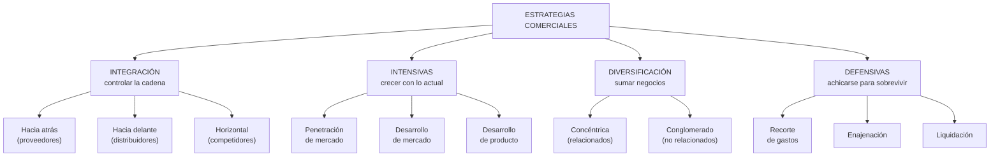
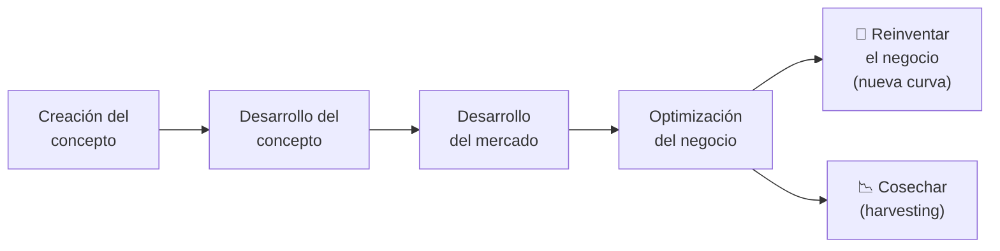

# 15 · Estrategias comerciales, Matriz de Ansoff y Océano Azul

> **Fuente en el material:** *Clase 4 pre-parcial – Estrategias, procesos y cultura* (Ing. Mario Barrios; las diapositivas de diversificación citan al Mg. Ezequiel Pietracupa), diapositivas 1–24 y 26–29.
> **Prerrequisitos:** [05 Curvas de la tecnología](../parcial-1/05-curvas-de-la-tecnologia.md) (curva S) y [14 Propuesta de valor](../parcial-1/14-propuesta-de-valor-segmentacion-y-canvas.md).
> **Tiempo estimado:** 60 min.
> **Resto de la materia · Tema 15** (Clase 4 pre-parcial · Barrios). No entra en el Primer Parcial.

---

## 🎯 Objetivos de aprendizaje

1. Nombrar las **cuatro familias de estrategias comerciales** (integración, intensivas, diversificación y defensivas) y sus **11 variantes**.
2. Explicar **qué es** cada estrategia y **cuándo conviene** usarla.
3. Relacionar la estrategia con la **etapa del ciclo de vida** del producto o negocio.
4. Usar la **Matriz de Ansoff** para ubicar las estrategias intensivas y la diversificación.
5. Explicar la **Estrategia del Océano Azul** (Kim y Mauborgne), la **innovación en valor** y la **matriz de las cuatro acciones**.

---

## 🗺️ Esquema del tema

- **I. Las estrategias comerciales** (mapa de las 4 familias)
- **II. Estrategias de integración**
  1. Hacia atrás
  2. Hacia delante
  3. Horizontal
- **III. Estrategias intensivas**
  1. Penetración de mercado
  2. Desarrollo de mercado
  3. Desarrollo de producto
- **IV. Estrategias de diversificación**
  1. Concéntrica
  2. Por conglomerado
- **V. Estrategias defensivas**
  1. Recorte de gastos
  2. Enajenación
  3. Liquidación
- **VI. Uso de la estrategia según el ciclo del negocio**
- **VII. Matriz de Ansoff**
- **VIII. Estrategia del Océano Azul**
  - A. Océano rojo vs. océano azul
  - B. Innovación en valor
  - C. Matriz de las cuatro acciones

---

## 🧠 Mapa visual

> 💡 **Truco para recordarlas:** la **integración** mira la **cadena** (hacia atrás = proveedores, hacia delante = distribuidores, horizontal = competidores). Las **intensivas** crecen **sin salir del negocio actual**. La **diversificación** **sale** del negocio actual. Las **defensivas** se usan cuando **las cosas van mal**, y van de menos a más drásticas: recortar → vender una parte → vender todo.

---

## 📖 Desarrollo

## I. Las estrategias comerciales

La cátedra las agrupa en **cuatro familias**: **integración**, **intensivas**, **diversificación** y **defensivas**. Para cada una da una **definición** y una lista de **situaciones en las que conviene** usarla. En el examen, lo que suma es poder decir **qué es** y **cuándo se usa**, con un ejemplo.

---

## II. Estrategias de integración

### 1. Integración hacia atrás

> 📌 *"**Búsqueda de la propiedad o del aumento del control sobre los proveedores** de una empresa."*

**Cuándo conviene:**

- Cuando los **proveedores actuales son muy costosos, poco confiables o incapaces** de satisfacer las necesidades de la empresa (refacciones, componentes, partes de ensamblaje o materias primas).
- Cuando el **número de proveedores es escaso** y el de **competidores es grande**.
- Cuando la empresa compite en una **industria que crece con rapidez** (las estrategias de integración disminuyen la capacidad de diversificarse en una industria en declinación).
- Cuando la empresa cuenta con **capital y recursos humanos** para dirigir la nueva empresa proveedora de sus propias materias primas.

### 2. Integración hacia delante

> 📌 *"**Obtención de la propiedad o aumento del control sobre distribuidores** o vendedores minoristas."*

**Cuándo conviene:**

- Cuando los **distribuidores actuales son muy costosos, poco confiables o incapaces** de satisfacer las necesidades de distribución.
- Cuando la **disponibilidad de distribuidores de calidad está muy limitada**, lo que da ventaja competitiva a quien se integra hacia delante.
- Cuando la empresa compite en una **industria en crecimiento** que se espera que siga creciendo con rapidez.
- Cuando la empresa cuenta con el **capital y los recursos humanos** para dirigir la nueva empresa de distribución.

### 3. Integración horizontal

> 📌 *"**Búsqueda de la propiedad o del aumento del control sobre los competidores**."*

**Cuándo conviene:**

- Cuando la empresa puede adquirir **características de monopolio** en un área o región sin que el gobierno cuestione su tendencia a reducir la competencia.
- Cuando compite en una **industria en crecimiento**.
- Cuando el incremento de las **economías de escala** da mayores ventajas competitivas.
- Cuando los **competidores titubean** por falta de habilidad gerencial o por necesitar recursos que la empresa posee. *(Ojo: no sería adecuada si el rendimiento de los competidores fuera deficiente por razones de la industria.)*

---

## III. Estrategias intensivas

### 1. Penetración de mercado

> 📌 *"Búsqueda del **aumento de la participación en el mercado de los productos o servicios actuales** a través de importantes **esfuerzos de mercadotecnia**."*

**Cuándo conviene:**

- Cuando los mercados presentes **no están muy saturados** con ese producto o servicio.
- Cuando la **tasa de uso de los clientes actuales** se podría incrementar de manera significativa.
- Cuando la **participación de los competidores principales ha disminuido** mientras las ventas totales de la industria aumentaron.
- Cuando la **correlación entre ventas y gastos en marketing** ha sido alta por tradición.
- Cuando el incremento de las **economías de escala** ofrece mayores ventajas competitivas.

### 2. Desarrollo de mercado

> 📌 *"**Introducción de los productos o servicios actuales en nuevas áreas geográficas**."*

**Cuándo conviene:**

- Cuando existen **nuevos canales de distribución** confiables, baratos y de buena calidad.
- Cuando la empresa tiene **mucho éxito** con lo que realiza.
- Cuando existen **nuevos mercados inexplorados o poco saturados**.
- Cuando la empresa cuenta con **capital y recursos humanos** para una mayor expansión.
- Cuando la empresa posee **exceso de capacidad de producción**.
- Cuando la industria básica adquiere con rapidez un **alcance global**.

### 3. Desarrollo de producto

> 📌 *"Búsqueda del **incremento de las ventas por medio del mejoramiento de los productos o servicios actuales, o del desarrollo de nuevos productos**."*

**Cuándo conviene:**

- Cuando la empresa tiene **productos exitosos en la etapa de madurez** del ciclo de vida: la idea es atraer a los clientes satisfechos para que prueben productos nuevos (mejorados) gracias a su experiencia positiva con los actuales.
- Cuando compite en una industria con **avances tecnológicos rápidos**.
- Cuando **competidores importantes ofrecen mejor calidad a precios similares**.
- Cuando compite en una industria de **crecimiento rápido**.
- Cuando posee **capacidades de I+D muy importantes**.

> 🔗 El desarrollo de producto en la **madurez** es exactamente el **salto a una nueva curva S** del tema [05](../parcial-1/05-curvas-de-la-tecnologia.md).

---

## IV. Estrategias de diversificación

### 1. Diversificación concéntrica

> 📌 *"**Adición de productos o servicios nuevos, pero relacionados**."*

**Cuándo conviene:**

- Cuando la empresa compite en una industria **sin crecimiento o de crecimiento lento**.
- Cuando los productos nuevos relacionados **mejorarían las ventas de los actuales** en forma significativa.
- Cuando los productos nuevos relacionados se pudieran ofrecer a **precios muy competitivos**.
- Cuando los productos nuevos tienen **ventas de temporada que compensan los picos y valles** de la empresa.

### 2. Diversificación por conglomerado

> 📌 *"**Adición de productos o servicios nuevos pero no relacionados**."*

**Cuándo conviene:**

- Cuando la industria básica experimenta una **declinación de ventas y utilidades** anuales.
- Cuando existe la oportunidad de adquirir una **empresa no relacionada que sea una inversión atractiva**.
- Cuando existe **sinergia financiera** entre la empresa adquirida y la compradora.
- Cuando los **mercados existentes están saturados**.
- Cuando la **acción antimonopolio** amenaza a una empresa concentrada por tradición en una sola industria.

> ⚠️ **Concéntrica vs. conglomerado (diferencia clave de la cátedra):** la concéntrica se basa en la **semejanza de mercados, productos o tecnología**; la de conglomerado se basa más en **consideraciones sobre las utilidades** (financieras).

---

## V. Estrategias defensivas

### 1. Recorte de gastos

> 📌 *"**Reagrupación por medio de la reducción de costos y activos** para revertir la disminución de ventas y utilidades."*

**Cuándo conviene:**

- Cuando la empresa tiene una **capacidad distintiva definida** pero **no logró sus objetivos** en forma constante.
- Cuando es uno de los **competidores débiles** de la industria.
- Cuando está plagada de **ineficiencias, escasa rentabilidad, baja moral** de los empleados y **presión de los accionistas**.
- Cuando **fracasó en aprovechar oportunidades, reducir amenazas, explotar fortalezas y superar debilidades** (cuando los gerentes estratégicos fracasaron).
- Cuando **creció tanto y tan rápido** que requiere una reorganización interna importante.

### 2. Enajenación

> 📌 *"**Venta de una división o parte de una empresa**."*

**Cuándo conviene:**

- Cuando ya siguió una estrategia de **recorte de gastos y no logró** las mejoras necesarias.
- Cuando una división **requiere más recursos** de los que la empresa le puede dar.
- Cuando una división es **responsable del escaso rendimiento general**.
- Cuando una división **no se adapta al resto** de la empresa (mercados, clientes, gerentes, valores distintos).
- Cuando se necesita **efectivo con rapidez** y no se puede obtener de otras fuentes.
- Cuando la **acción antimonopolio** gubernamental amenaza a la empresa.

### 3. Liquidación

> 📌 *"**Venta de los activos de una empresa, en partes, por su valor tangible**."*

**Cuándo conviene:**

- Cuando ya siguió **recorte de gastos y enajenación** y ninguna fue exitosa.
- Cuando la **única alternativa es la bancarrota**: la liquidación es un medio **ordenado y planeado** de obtener la mayor cantidad posible de efectivo. Puede declararse la bancarrota primero y después liquidar divisiones.
- Cuando los accionistas pueden **reducir al mínimo sus pérdidas** vendiendo los activos.

> 💡 Las tres defensivas son **escalones**: si recortar no alcanza, se vende una parte (enajenación); si eso tampoco alcanza, se vende todo (liquidación).

---

## VI. Uso de la estrategia según el ciclo del negocio

La cátedra muestra el **ciclo del producto/negocio** como una curva S de **crecimiento vs. tiempo**:

> 🔗 Es la **curva S** de Christensen (tema [05](../parcial-1/05-curvas-de-la-tecnologia.md)) aplicada al negocio: "reinventar" es saltar a la curva siguiente; "cosechar" es quedarse en la curva vieja.

---

## VII. Matriz de Ansoff

Cruza **mercado** (presente o nuevo) con **producto** (presente o nuevo). Ordena las tres estrategias **intensivas** y la **diversificación**:

| Mercado ↓ / Producto → | **Producto presente** | **Producto nuevo** |
|---|---|---|
| **Mercado presente** | **Penetración de mercado** | **Desarrollo de producto** |
| **Mercado nuevo** | **Desarrollo de mercado** | **Diversificación** |

> ➕ El **riesgo crece** hacia la diversificación: en penetración se conoce todo (producto y cliente); en diversificación no se conoce ninguno de los dos.

> ⚠️ En la diapositiva la tabla está rotulada **"Mercado / Producto"** con las filas como mercado y las columnas como producto. Si en el examen la dibujás al revés, aclaralo: lo importante es que **desarrollo de mercado** = producto actual en mercado nuevo, y **desarrollo de producto** = producto nuevo en mercado actual.

---

## VIII. Estrategia del Océano Azul

**W. Chan Kim y Renée Mauborgne.**

> 📌 *"En el mundo actual, **sos distinto o sos barato**."*

### A. Océano rojo vs. océano azul

- **Océano rojo:** el mercado existente, lleno de competidores que se pelean por los mismos clientes (el agua "roja" de la competencia sangrienta).
- **Océano azul:** un espacio de mercado **nuevo, sin competencia**.

| Estrategia del océano rojo | Estrategia del océano azul |
|---|---|
| **Competir** en el espacio existente del mercado. | **Crear un espacio sin competencia** en el mercado. |
| **Vencer** a la competencia. | Hacer que la competencia **pierda toda importancia**. |
| **Explotar la demanda existente**. | **Crear y capturar nueva demanda**. |
| **Elegir** entre la disyuntiva de **valor o costo**. | **Romper** la disyuntiva de valor o costo. |
| Alinear todo el sistema de actividades con la decisión de **diferenciación o bajo costo**. | Alinear todo el sistema de actividades para lograr **diferenciación y bajo costo**. |

### B. Innovación en valor

> 📌 **Innovación en valor**: se logra **bajando los costos y subiendo el valor para el cliente al mismo tiempo**. *"El **ahorro en costos** se da al **eliminar o reducir** los factores en los que la industria compite. El **valor al cliente** se aumenta al **elevar y crear** elementos que la industria nunca ha ofrecido."*

> 📝 **Citar y explayarse:** La Estrategia del Océano Azul de Kim y Mauborgne propone dejar de competir en el mercado existente (océano rojo) y **crear un espacio nuevo donde la competencia pierda importancia**. Su herramienta central es la **innovación en valor**: en lugar de elegir entre diferenciarse o ser barato, se **rompe esa disyuntiva**, bajando costos al **eliminar o reducir** lo que la industria da por obvio y aumentando el valor al **incrementar o crear** lo que nadie ofrece. Por ejemplo, el Cirque du Soleil eliminó los animales y las estrellas de circo (caros), y creó una experiencia de teatro y música para adultos: no compitió con los circos, inventó otro mercado.

### C. Matriz de las cuatro acciones

| Acción | Pregunta de la cátedra |
|---|---|
| **Eliminar** | ¿Qué esfuerzos de la compañía **no están siendo debidamente rentables**? |
| **Reducir** | ¿Qué productos o servicios **ya no tienen los mismos márgenes** de ventas que tenían en el pasado? |
| **Incrementar** | ¿Qué línea de productos o servicios **debería aumentar los recursos**? |
| **Crear** | ¿Qué **nuevas iniciativas** tienen posibilidades de desarrollarse en el futuro? |

> 💡 **Eliminar y reducir** bajan los **costos**; **incrementar y crear** suben el **valor**. Juntas producen la innovación en valor.

> 🔗 **"Crear"** se conecta con el tipo de innovación de **nuevos mercados** de Schumpeter (tema [06](../parcial-1/06-schumpeter-destruccion-creativa-y-ciclos.md)) y con la **propuesta de valor diferenciada** (tema [14](../parcial-1/14-propuesta-de-valor-segmentacion-y-canvas.md)).

---

## ⚠️ Conceptos que se confunden

| Se confunde… | …con | Diferencia |
|---|---|---|
| Integración hacia atrás | Integración hacia delante | Atrás = **proveedores**. Delante = **distribuidores / minoristas**. |
| Integración horizontal | Diversificación | Horizontal = **comprar competidores** del mismo negocio. Diversificación = **sumar productos nuevos**. |
| Desarrollo de mercado | Desarrollo de producto | Mercado = **mismo producto, nuevas zonas**. Producto = **producto mejorado o nuevo**, mismo mercado. |
| Diversificación concéntrica | Por conglomerado | Concéntrica = productos **relacionados** (semejanza). Conglomerado = **no relacionados** (utilidades). |
| Enajenación | Liquidación | Enajenación = vender **una división**. Liquidación = vender **los activos de la empresa** en partes. |
| Océano azul | Bajo costo | El océano azul busca **diferenciación y bajo costo a la vez**, no elegir uno. |

---

## 🔗 Conexiones

- **← [05 Curvas de la tecnología](../parcial-1/05-curvas-de-la-tecnologia.md):** el ciclo del negocio es una curva S.
- **← [14 Propuesta de valor](../parcial-1/14-propuesta-de-valor-segmentacion-y-canvas.md):** "o eres diferente o eres barato".
- **→ [16 Service Design y cultura fail](16-service-design-y-cultura-fail.md):** de la estrategia a los procesos y la cultura.
- **→ [19 Proyectos y estrategia de innovación](19-proyectos-y-estrategia-de-innovacion.md):** la estrategia de innovación como hoja de ruta.

---

## ✍️ Autoevaluación

**1. Nombre las cuatro familias de estrategias comerciales y sus variantes.**

Ver respuesta

**Integración:** hacia atrás, hacia delante, horizontal. **Intensivas:** penetración de mercado, desarrollo de mercado, desarrollo de producto. **Diversificación:** concéntrica, por conglomerado. **Defensivas:** recorte de gastos, enajenación, liquidación.

**2. ¿Qué es la integración hacia atrás y cuándo conviene?**

Ver respuesta

Es la **búsqueda de la propiedad o del aumento del control sobre los proveedores**. Conviene cuando los proveedores son caros, poco confiables o incapaces; cuando hay pocos proveedores y muchos competidores; cuando la industria crece rápido; y cuando la empresa tiene capital y personal para dirigir la nueva empresa proveedora.

**3. Diferencie diversificación concéntrica y por conglomerado.**

Ver respuesta

La **concéntrica** suma productos **nuevos pero relacionados**, y se basa en la semejanza de mercados, productos o tecnología. La de **conglomerado** suma productos **no relacionados**, y se basa en consideraciones sobre las **utilidades** (sinergia financiera, mercados saturados, declinación de la industria).

**4. Dibuje la Matriz de Ansoff.**

Ver respuesta

Mercado presente + producto presente = **penetración de mercado**. Mercado presente + producto nuevo = **desarrollo de producto**. Mercado nuevo + producto presente = **desarrollo de mercado**. Mercado nuevo + producto nuevo = **diversificación**.

**5. Explique la Estrategia del Océano Azul y la matriz de las cuatro acciones.**

Ver respuesta

Kim y Mauborgne proponen **crear un espacio de mercado sin competencia** (océano azul) en lugar de pelear en el existente (océano rojo), **rompiendo la disyuntiva valor/costo** mediante la **innovación en valor**. La matriz de las cuatro acciones lo operacionaliza: **eliminar** y **reducir** factores en los que la industria compite (bajan costos) e **incrementar** y **crear** elementos que la industria nunca ofreció (suben el valor para el cliente).

**6. Una empresa vendió una división que daba pérdidas después de recortar gastos sin éxito. ¿Qué estrategia aplicó y cuál sería el paso siguiente si tampoco funciona?**

Ver respuesta

Aplicó **enajenación** (venta de una división). Si tampoco funciona, el paso siguiente es la **liquidación**: vender los activos de la empresa en partes por su valor tangible, de forma ordenada, para reducir al mínimo las pérdidas.

---

[← 14 Propuesta de valor, segmentación y Business Model Canvas](../parcial-1/14-propuesta-de-valor-segmentacion-y-canvas.md) · [🏠 Índice](../README.md) · [Siguiente → 16 Service Design, Design Sprint y cultura fail](16-service-design-y-cultura-fail.md)
