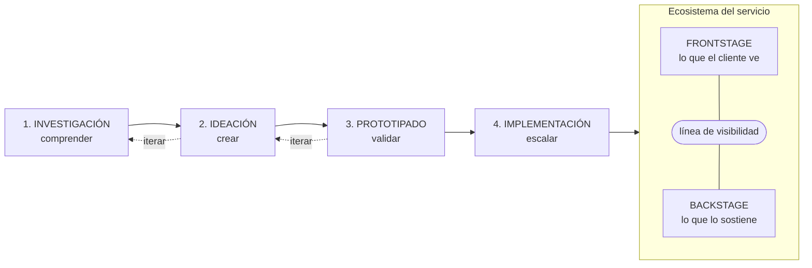

# 16 · Service Design, Design Sprint y cultura fail

> **Fuente en el material:** *Clase 4 pre-parcial – Estrategias, procesos y cultura* (Ing. Mario Barrios), diapositiva 25 (Design Sprint) y diapositivas 56–83 (Services Design y Cultura Fail).
> **Prerrequisitos:** [13 Design Thinking](../parcial-1/13-design-thinking.md) y [15 Estrategias comerciales](15-estrategias-comerciales-y-oceano-azul.md).
> **Tiempo estimado:** 70 min.
> **Resto de la materia · Tema 16** (Clase 4 pre-parcial · Barrios). No entra en el Primer Parcial.

---

## 🎯 Objetivos de aprendizaje

1. Describir el **Design Sprint** y lo que se hace cada día de la semana.
2. Definir **Service Design** (diseño de servicios) con las citas de **Stefan Moritz** y **Birgit Mager**.
3. Explicar por qué **falla la experiencia del cliente** (el síndrome de la operación fragmentada).
4. Describir los **3 pilares** (personas, procesos, artefactos) y el ecosistema **frontstage / backstage**.
5. Comparar los **principios** del diseño de servicios de **2010 y 2017**.
6. Explicar las **4 actividades** del proceso (investigación, ideación, prototipado, implementación).
7. Usar el **Customer Journey Map** y el **Service Blueprint**.
8. Explicar qué es la **cultura fail** y sus **6 claves** organizacionales.

---

## 🗺️ Esquema del tema

- **I. Design Sprint**
- **II. Service Design: qué es**
  - A. Definiciones (Moritz, Mager)
  - B. ¿Por qué falla la experiencia del cliente?
  - C. Los 3 pilares
  - D. Frontstage y backstage
- **III. Principios** (2010 → 2017)
- **IV. Las 4 actividades del proceso**
  1. Investigación
  2. Ideación
  3. Prototipado
  4. Implementación
- **V. Herramientas**
  1. Customer Journey Map
  2. Service Blueprint
  3. Co-creación y prototipado de servicios
- **VI. Beneficios**
- **VII. Cultura fail**
- **VIII. Caso aplicado paso a paso**

---

## 🧠 Mapa visual

---

## 📖 Desarrollo

## I. Design Sprint

Metodología para pasar **de un desafío a aprendizajes en una semana** (cinco días), dentro del bloque de innovación de la clase.

| Día | Fase | Qué se hace (cátedra) |
|---|---|---|
| Lunes | **Map** (mapear) | Presentación del **desafío**; crear un **mapa del proceso** a recorrer; establecer una **meta**. |
| Martes | **Sketch** (bocetar) | Seleccionar y utilizar las herramientas necesarias de **facilitación** para esbozar en equipo **posibles soluciones**. |
| Miércoles | **Decide** (decidir) | Valorizar entre las distintas opciones y **seleccionar una** entre ellas. |
| Jueves | **Prototype** (prototipar) | Crear un **prototipo realista** de la solución. |
| Viernes | **Test** (testear) | Probar con **usuarios reales** la solución creada y **medir las respuestas**. |

> ➕ **Contexto adicional:** el Design Sprint fue creado por **Jake Knapp** en **Google Ventures** (el fondo de CVC del tema [17](17-innovacion-abierta.md)). Es una versión **comprimida en una semana** del Design Thinking.

> 🔗 Las fases se parecen a las del Design Thinking (tema [13](../parcial-1/13-design-thinking.md)): Map ≈ empatizar y definir, Sketch ≈ idear, Decide ≈ converger, Prototype ≈ prototipar, Test ≈ testear.

---

## II. Service Design: qué es

### A. Definiciones

> 📌 *"El diseño de servicios ayuda a **innovar (crear nuevos) o mejorar los servicios (existentes)** para hacerlos **más útiles, usables, deseables** para los clientes y **eficientes y efectivos** para las organizaciones. Es un nuevo campo **holístico, multidisciplinario e integrador**."* — **Stefan Moritz**, *Service Design: Practical Access to an Evolving Field* (Köln).

> 📌 *"El diseño de servicios **coreografía procesos, tecnologías e interacciones** dentro de sistemas complejos para **cocrear valor** para las partes interesadas relevantes."* — **Birgit Mager**, presidenta de la Service Design Network.

Según la cátedra, el diseño de servicios:

1. Ayuda a las organizaciones a **ver sus servicios desde la perspectiva del cliente**.
2. **Equilibra las necesidades del cliente con las necesidades del negocio**.
3. Aporta un **proceso creativo y centrado en el ser humano** (tiene sus raíces en el pensamiento de diseño).
4. Ayuda a las organizaciones a obtener una **comprensión real e integral de sus servicios**, lo que permite mejoras holísticas y significativas.

> 📝 **Citar y explayarse:** Stefan Moritz define el diseño de servicios como la disciplina que ayuda a *"innovar o mejorar los servicios para hacerlos más útiles, usables, deseables para los clientes y eficientes y efectivos para las organizaciones"*. La definición tiene dos lados: el del **cliente** (útil, usable, deseable) y el de la **organización** (eficiente, efectivo), y el diseño de servicios busca **equilibrar los dos**. Por eso no se queda en la pantalla o el mostrador que ve el cliente, sino que diseña también los procesos internos que lo sostienen. Por ejemplo, de nada sirve una app de un banco muy linda si, al pedir un préstamo, el pedido queda trabado tres semanas entre áreas que no se comunican: el cliente lo vive como un mal servicio aunque la app sea excelente.

### B. ¿Por qué falla la experiencia del cliente?

**El síndrome de la operación fragmentada:**

- Las empresas suelen **diseñar pensando en sus silos internos**, no en el usuario.
- Existe una **desconexión crítica entre canales físicos y digitales**.
- **Procesos invisibles rotos (backstage)** arruinan la experiencia final (**frontstage**).
- El cliente **no experimenta departamentos aislados**; experimenta **una sola marca**.

> 📌 *"Si el empleado se frustra en el **backstage**, el cliente lo sufrirá inevitablemente en el **frontstage**."*

### C. Los 3 pilares

| Pilar | Qué incluye |
|---|---|
| **1. Personas** | Diseño centrado tanto en el **cliente final** como en los **empleados** que operan y dan vida al servicio diariamente. |
| **2. Procesos** | Flujos de trabajo estructurados, flujos de información integrados y metodologías que aseguran la **eficiencia operativa sin fricciones**. |
| **3. Artefactos** | Toda la **infraestructura física y digital**: plataformas tecnológicas, herramientas, entornos, espacios y materiales tangibles. |

### D. El ecosistema del servicio: frontstage y backstage

| Capa | Qué es | Ejemplos |
|---|---|---|
| **Frontstage** | Lo que el cliente **ve y experimenta**. | Canales de atención, interfaces web/mobile, tiendas físicas, interacciones con personal de primera línea. |
| ——— **Línea de visibilidad** ——— | Separa lo que el cliente ve de lo que no. | |
| **Backstage** | Lo que está **oculto pero sostiene** el servicio. | Sistemas tecnológicos de soporte, infraestructura de datos, logística interna, procesos administrativos, políticas de la organización. |

> 📌 *"**Optimizar el backstage para deleitar en el frontstage.**"* El Service Design **no es un proyecto aislado con un final establecido**, sino una **cultura y mentalidad organizativa** de mejora e innovación continua orientada al valor.

---

## III. Principios

La cátedra compara los principios de **2010** con su versión de **2017**:

| 2010 | 2017 | Qué cambió |
|---|---|---|
| **1. Centrado en el usuario:** los servicios deben experimentarse a través de los ojos del cliente. | **1. Centrado en el ser humano:** considerar la experiencia de **todas las personas afectadas** por el servicio. | De "el cliente" a **todas las personas** (incluye empleados). |
| **2. Co-creativo:** todas las partes interesadas deben estar incluidas en el proceso de diseño. | **2. Colaborativo:** las partes interesadas de diversos orígenes y funciones deben participar **activamente**. | De estar incluidos a **participar activamente**. |
| — | **3. Iterativo:** enfoque **exploratorio, adaptativo y experimental**, iterando hacia la implementación. | **Nuevo** principio. |
| **3. Secuencial:** el servicio debe visualizarse como una secuencia de acciones interrelacionadas. | **4. Secuencial:** visualizarse y **organizarse** como una secuencia de acciones interrelacionadas. | Se suma *organizarse*. |
| **4. Evidencial:** los servicios intangibles deben visualizarse en términos de artefactos físicos. | **5. Real:** las necesidades deben **investigarse en la realidad**, las ideas **prototiparse en la realidad** y los valores intangibles evidenciarse como realidad física o digital. | De "mostrar evidencia" a **investigar y prototipar en la realidad**. |
| **5. Holístico:** todo el entorno de un servicio debe ser considerado. | **6. Holístico:** abordar **de manera sostenible** las necesidades de todas las partes interesadas a través de todo el servicio y todo el negocio. | Se suma la **sostenibilidad**. |

> 📌 *"…cuando las personas intentan describir un objeto, lo hacen a través de los **servicios percibidos que proporciona**. Es casi imposible definir objetivamente cualquier objeto sin aprovechar los posibles potenciales de acción que percibimos que nos ofrece."*

---

## IV. Las 4 actividades del proceso

| Actividad | Objetivo | Qué se hace (cátedra) |
|---|---|---|
| **1. Investigación** (*research*) | **Comprender** | Investigación **cualitativa** profunda; entrevistas en profundidad y **observación directa**; mapeo de necesidades, dolores y expectativas; hallazgo de **insights ocultos** del usuario. Ayuda al equipo a **ir más allá de las suposiciones**; los conocimientos **cualitativos** suelen ser más prácticos que los cuantitativos porque responden **"por qué"**. |
| **2. Ideación** (*ideation*) | **Crear** | Talleres de **co-creación** multidisciplinarios; lluvia de ideas sin restricciones iniciales; alineación entre viabilidad de negocio y diseño; mapeo conceptual de soluciones. Los equipos deben aprender que **no se busca la idea perfecta ("la bala de plata")** para invertir enseguida recursos masivos: **aprender a dejar ir las ideas** para dar paso a otras nuevas es una habilidad crucial. |
| **3. Prototipado** (*prototyping*) | **Validar** | Construcción **rápida y de bajo costo**; simulaciones de servicio y maquetas digitales; pruebas con usuarios reales y personal; iteración basada en feedback. Probar las ideas clave **en el mundo real**, midiendo la mayor cantidad de variables para construir soluciones más robustas. |
| **4. Implementación** (*implementation*) | **Escalar** | Planificación e hitos de lanzamiento; **pilotos controlados** en entornos reales; **capacitación** de equipos (back y front); establecimiento de **métricas de éxito (KPI)**. Es **el punto final**: convertir un prototipo en un sistema en funcionamiento, lo que involucra gestión del cambio, capacitación, contratación, desarrollo de software o producción de objetos físicos. |

**Para qué sirve prototipar un servicio (cátedra):**

- **Identificar rápidamente** aspectos importantes de un nuevo concepto y explorar soluciones alternativas.
- **Evaluar sistemáticamente** qué soluciones podrían funcionar en la realidad cotidiana.
- Crear una **comprensión compartida** de las ideas, mejorando la comunicación y colaboración interdisciplinaria.
- Producir un **trabajo basado en la realidad**, no en suposiciones y opiniones.
- Es una **investigación centrada en situaciones de servicio futuras**.

El prototipo busca integrar tres preguntas: **valor** (¿cómo creamos valor?), **factibilidad** (¿cómo hacemos que funcione?: técnica, financiera y legalmente) y **look & feel** (¿cómo se ve y se siente?).

> 🔗 Las restricciones del prototipo son las mismas tres de Design Thinking: **deseabilidad** (valor), **factibilidad** y **viabilidad** (tema [13](../parcial-1/13-design-thinking.md)).

---

## V. Herramientas

### 1. Customer Journey Map: la radiografía de la experiencia del cliente

- Mapea **secuencialmente todas las etapas** por las que pasa el usuario: **antes** (descubrimiento), **durante** (uso del servicio) y **después** (fidelización).
- Registra las **acciones, pensamientos y emociones** del cliente en cada **punto de contacto**.
- Identifica los **puntos de dolor** (*pain points*): fricciones críticas que destruyen el valor.
- Revela **oportunidades de mejora** inmediatas basadas en **evidencia real** y no en suposiciones.

### 2. Service Blueprint: la partitura operativa

Conecta de forma **síncrona** el viaje del cliente con **todo el motor interno**. Tiene cuatro carriles:

| Carril | Qué muestra |
|---|---|
| **Acciones del cliente** | Puntos de contacto e interacciones directas del viaje del usuario. |
| **Frontstage** (personal de contacto) | Empleados, interfaces o dispositivos con los que interactúa el cliente. |
| **Backstage** (procesos internos) | Acciones operativas requeridas "tras bambalinas" para ejecutar el servicio. |
| **Procesos de soporte** (sistemas / tecnología) | Infraestructura, bases de datos y software de soporte. |

> ⚠️ **Journey Map vs. Blueprint:** el **Journey Map** mira **solo al cliente** (qué hace, piensa y siente); el **Blueprint** agrega **todo lo que la organización hace** para que eso pase (front, back y soporte).

### 3. Co-creación y prototipado de servicios

**Co-creación: diseñar CON la gente.** Involucra activamente a **clientes finales, personal de línea de frente y directivos** en la mesa de diseño, y garantiza soluciones **viables y realizables**.

**Métodos rápidos de prototipado:**

- **Roleplaying:** simular de forma física los flujos de atención y diálogos.
- **Storyboards:** guiones gráficos secuenciales para evaluar el ritmo del servicio.
- **Prototipos digitales:** *mockups* rápidos de apps o tótems para probar flujos de clics.
- **Pilotos de baja fidelidad:** probar el servicio en un entorno controlado con usuarios reales.

---

## VI. Beneficios: el retorno de la inversión

| Para el cliente | Para el empleado | Para la organización |
|---|---|---|
| Experiencias **fluidas omnicanal**. | **Claridad total** en roles y flujos. | **Reducción de costos** duplicados. |
| Eliminación de **re-procesos**. | Herramientas internas diseñadas para sus necesidades. | Eliminación de **silos** organizacionales. |
| Mayor **confianza y lealtad** con la marca. | Disminución de la **frustración** diaria. | Mayor **agilidad e innovación** comercial. |

---

## VII. Cultura fail

> 📌 *"**Debemos aprender al fallar.**"* (La clase usa el video *FAILCulture: fallar y aprender para innovar y liderar*, de **Demian Sterman**.)

**Cultura organizacional fail: 6 claves**

1. **Quitar** la idea del fracaso como algo **negativo**.
2. **No premiar solamente** el éxito.
3. **Promover** la **toma de riesgos**.
4. Asegurar un **contexto seguro** para experimentar.
5. **Desarrollar** la **intuición y la habilidad**.
6. **Compartir** las experiencias fallidas con el resto de la organización.

> 📌 *"Si algo puede fallar, **fallará**."*
> 📌 *"Probar y fallar es el **primer eslabón** de una cadena que termina en probar y **NO** fallar."*

> 📝 **Citar y explayarse:** La cátedra resume la cultura fail en la idea de que *"debemos aprender al fallar"* y en que *"probar y fallar es el primer eslabón de una cadena que termina en probar y no fallar"*. Significa que el error no es el opuesto del éxito sino un **paso necesario** para llegar a él: una organización que castiga el fracaso logra que nadie se arriesgue, y sin riesgo no hay innovación. Por eso propone no premiar solo el éxito, dar un **contexto seguro para experimentar** y **compartir** lo que falló para que otros no repitan el error. Por ejemplo, un equipo que prueba un piloto de atención por chatbot y fracasa aporta igual valor si documenta por qué falló: el siguiente intento parte de ese aprendizaje.

> 🔗 Es el pilar de **aceptar el fracaso** de la **Gestión 2.0** (tema [07](../parcial-1/07-gestion-de-la-innovacion.md)), el *fail fast* de [Design Thinking](../parcial-1/13-design-thinking.md) y el "iterar vs. pivotar" de [Lean Startup](20-lean-startup-y-mvp.md).

---

## VIII. Caso aplicado paso a paso

> 🧩 **Servicio:** la inscripción a materias de una universidad. Los alumnos se quejan de que es lenta y confusa.

| Paso | Aplicación |
|---|---|
| **1. Investigación** | Observar el día de inscripción, entrevistar a alumnos y al personal de bedelía. Insight: el sistema web funciona, pero las **correlatividades** se cargan a mano en bedelía y llegan tarde (backstage roto). |
| **2. Journey Map** | Antes: el alumno no sabe a qué puede anotarse (dolor). Durante: el sistema rechaza materias sin explicar por qué (dolor). Después: tiene que ir a bedelía a reclamar (dolor). |
| **3. Blueprint** | Frontstage: web de inscripción y mostrador de bedelía. Backstage: carga manual de notas y correlatividades. Soporte: base de datos académica sin conexión automática con las actas. |
| **4. Ideación (co-creación)** | Taller con alumnos, bedeles y sistemas: conectar actas con la base de datos, mostrar por qué no se puede cursar una materia, simulador de inscripción previo. |
| **5. Prototipado** | Roleplaying del día de inscripción con el simulador en papel; mockup de la pantalla con el motivo del rechazo. |
| **6. Implementación** | Piloto en una carrera, capacitación a bedelía, KPI: reclamos por inscripción y tiempo promedio de inscripción. |

---

## ⚠️ Conceptos que se confunden

| Se confunde… | …con | Diferencia |
|---|---|---|
| Service Design | Design Thinking | Design Thinking es el **método general** centrado en las personas; Service Design lo aplica a **servicios completos**, incluyendo el **backstage** y a los **empleados**. |
| Design Sprint | Design Thinking | El Sprint es un **formato acotado a 5 días** (lunes a viernes) para pasar de un desafío a aprendizajes. |
| Frontstage | Backstage | Front = lo que el **cliente ve**. Back = lo **oculto** que sostiene el servicio. Los separa la **línea de visibilidad**. |
| Customer Journey Map | Service Blueprint | El Journey mira **al cliente**; el Blueprint conecta al cliente con **toda la operación interna**. |
| Cultura fail | Tolerar la mediocridad | No es aceptar cualquier error: es **experimentar en un contexto seguro y aprender** de lo que falla, compartiéndolo. |

---

## 🔗 Conexiones

- **← [13 Design Thinking](../parcial-1/13-design-thinking.md):** raíz del diseño de servicios y del Design Sprint.
- **← [07 Gestión 2.0](../parcial-1/07-gestion-de-la-innovacion.md):** aceptar el fracaso, trabajo interdisciplinario.
- **← [15 Estrategias comerciales](15-estrategias-comerciales-y-oceano-azul.md):** de la estrategia a los procesos y la cultura.
- **→ [17 Innovación abierta](17-innovacion-abierta.md):** la co-creación con actores externos.
- **→ [21 KPI](21-kpi.md):** las métricas de éxito de la implementación.

---

## ✍️ Autoevaluación

**1. ¿Qué es el Design Sprint y qué se hace cada día?**

Ver respuesta

Es una metodología de **cinco días** para pasar de un desafío a aprendizajes. **Lunes (Map):** presentar el desafío, mapear el proceso y fijar una meta. **Martes (Sketch):** esbozar en equipo posibles soluciones. **Miércoles (Decide):** valorar y elegir una opción. **Jueves (Prototype):** crear un prototipo realista. **Viernes (Test):** probarlo con usuarios reales y medir las respuestas.

**2. Defina Service Design y mencione sus tres pilares.**

Ver respuesta

Según Stefan Moritz, ayuda a **innovar o mejorar servicios** para hacerlos **útiles, usables y deseables** para los clientes y **eficientes y efectivos** para las organizaciones; es un campo holístico, multidisciplinario e integrador. Sus pilares son **personas** (clientes y empleados), **procesos** (flujos de trabajo e información) y **artefactos** (infraestructura física y digital).

**3. Explique frontstage, backstage y la frase "optimizar el backstage para deleitar en el frontstage".**

Ver respuesta

El **frontstage** es lo que el cliente ve y experimenta (canales, interfaces, tiendas, personal de primera línea); el **backstage** es lo oculto que sostiene el servicio (sistemas, datos, logística, procesos administrativos), separados por la **línea de visibilidad**. La frase significa que la buena experiencia del cliente depende de que los procesos internos funcionen: *"si el empleado se frustra en el backstage, el cliente lo sufrirá en el frontstage"*.

**4. Nombre las 4 actividades del diseño de servicios y el objetivo de cada una.**

Ver respuesta

**Investigación** (comprender: entrevistas, observación, insights), **ideación** (crear: co-creación, muchas ideas, aprender a dejarlas ir), **prototipado** (validar: rápido, barato y en la realidad) e **implementación** (escalar: pilotos, capacitación y KPI de éxito).

**5. Diferencie Customer Journey Map y Service Blueprint.**

Ver respuesta

El **Journey Map** recorre las etapas del cliente (antes, durante y después) registrando acciones, pensamientos y emociones, y detecta puntos de dolor. El **Service Blueprint** conecta ese viaje con toda la operación: acciones del cliente, frontstage, backstage y procesos de soporte.

**6. ¿Qué es la cultura fail y cuáles son sus claves?**

Ver respuesta

Es la cultura organizacional que entiende que **debemos aprender al fallar**: probar y fallar es el primer eslabón de una cadena que termina en probar y no fallar. Claves: quitar la idea del fracaso como algo negativo, no premiar solamente el éxito, promover la toma de riesgos, asegurar un contexto seguro para experimentar, desarrollar la intuición y la habilidad, y compartir las experiencias fallidas con el resto de la organización.

---

[← 15 Estrategias comerciales, Matriz de Ansoff y Océano Azul](15-estrategias-comerciales-y-oceano-azul.md) · [🏠 Índice](../README.md) · [Siguiente → 17 Innovación abierta](17-innovacion-abierta.md)
