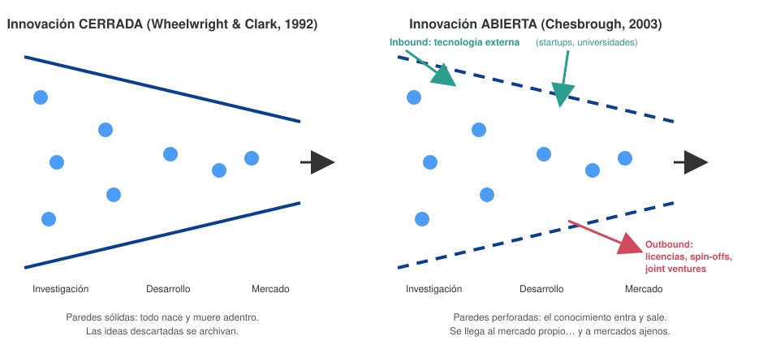

# 17 · Innovación abierta (Open Innovation)

> **Fuente en el material:** *Día 3 – Innovación Abierta* (basado en Henry Chesbrough), diapositivas 1–14 y 26–32.
> **Prerrequisitos:** [07 Gestión de la innovación](../parcial-1/07-gestion-de-la-innovacion.md) (tipo "Red" de Doblin).
> **Tiempo estimado:** 55 min.
> **Resto de la materia · Tema 17** (Día 3). No entra en el Primer Parcial.

---

## 🎯 Objetivos de aprendizaje

1. Diferenciar el **embudo cerrado** de **Wheelwright & Clark** del **modelo poroso** de Chesbrough.
2. Explicar los dos flujos: **inbound** (de afuera hacia adentro) y **outbound** (de adentro hacia afuera), con sus mecanismos e impactos.
3. Explicar las **tres verdades** del "nuevo imperativo".
4. Comparar el **paradigma cerrado** y el **abierto** en cuatro dimensiones.
5. Describir los **vehículos de implementación** (CVC, aceleradoras corporativas, ecosistemas de co-creación).
6. Diferenciar el **pensamiento divergente** y el **convergente** y ubicarlos en el **Doble Diamante**.

---

## 🗺️ Esquema del tema

- **I. Embudo cerrado (Wheelwright & Clark) vs. modelo poroso (Chesbrough)**
- **II. Dinámica de flujos: el embudo perforado**
  - A. Inbound (de afuera hacia adentro)
  - B. Outbound (de adentro hacia afuera)
- **III. Las tres verdades del "nuevo imperativo"**
  1. La innovación ya no es un lujo, es una obligación
  2. No tenés que inventarlo todo para usarlo
  3. Si no te sirve, sacale dinero afuera
- **IV. Cambio de mentalidad estratégica**
  - A. El cambio: propiedad intelectual flexible
  - B. Paradigma cerrado vs. abierto (4 dimensiones)
- **V. Vehículos prácticos de implementación**
  1. Corporate Venture Capital
  2. Aceleradoras corporativas
  3. Ecosistemas de co-creación
- **VI. Pensamiento divergente y convergente** (Doble Diamante)

---

## 🧠 Mapa visual

---

## 📖 Desarrollo

## I. Embudo cerrado (Wheelwright & Clark) vs. modelo poroso (Chesbrough)

> 📌 *"A diferencia del modelo poroso de Chesbrough, el esquema de Wheelwright & Clark describe un proceso **lineal, secuencial y cerrado**. La idea central: **una empresa siempre genera muchas más ideas de las que financieramente puede o debe ejecutar**. Por lo tanto, el proceso de desarrollo debe actuar como **un filtro que va descartando opciones** a medida que se avanza, asegurando que **solo los proyectos con mayor valor estratégico y viabilidad comercial lleguen al mercado**."*

---

## II. Dinámica de flujos: el embudo perforado

En la innovación abierta, las paredes del embudo **tienen agujeros**: el conocimiento **entra** y **sale**.

| | **A. Inbound** (de fuera hacia dentro) | **B. Outbound** (de dentro hacia fuera) |
|---|---|---|
| **Qué es** | **Integración externa**: absorber conocimiento, patentes o tecnologías **desarrolladas fuera**. | **Monetización externa**: transferir al mercado tecnologías o ideas **internas infrautilizadas**. |
| **Mecanismos comunes** | **Hackathons**, **retos tecnológicos abiertos**, **fusiones y adquisiciones de startups**. | **Concesión de licencias** de patentes no estratégicas, **spin-offs** y **joint ventures**. |
| **Impacto operativo** | **Reduce drásticamente los costes fijos de I+D básica** y **mitiga el riesgo de fases tempranas**. | **Transforma costes hundidos y laboratorios inactivos en flujos de ingresos directos**. |

---

## III. Las tres verdades del "nuevo imperativo"

> 📌 *"Las empresas ya no pueden sobrevivir siendo **islas tecnológicas**; hoy el éxito depende de **cooperar con el mundo exterior** para generar ingresos."*

### III.1 La innovación ya no es un lujo, es una obligación ("el nuevo imperativo")
- Antes, una empresa lanzaba un producto y **vivía de esa renta una década**.
- Hoy la tecnología y la demanda cambian a una velocidad tal que **si desarrollás todo adentro, llegás tarde** al mercado.
- Abrirse al exterior **no es una moda: es una regla de supervivencia**.

### III.2 No tenés que inventarlo todo para usarlo ("crear… tecnología")
- Las corporaciones sufrían el síndrome **"No fue inventado aquí"** (*Not Invented Here*): si sus ingenieros no lo habían creado, lo rechazaban.
- Chesbrough demostró que se pueden crear productos revolucionarios **integrando piezas del rompecabezas que otros ya armaron**.
- 🧩 **Ejemplo de la cátedra:** una empresa de alimentos que necesita un envase sustentable **no** debería gastar 5 años investigando polímeros; debería **asociarse con una startup de bioplásticos o una universidad** y lanzar en **6 meses**.

### III.3 Si no te sirve a vos, sacale dinero afuera ("beneficiarse de la tecnología")
- *"El giro económico más brillante del concepto."*
- En el modelo viejo, si un laboratorio farmacéutico descubría por accidente un componente útil para limpiar pantallas, **se archivaba** ("vendemos medicinas, no tecnología de pantallas").
- Chesbrough: **licencialo, vendelo o creá una spin-off**. *"No dejes que el conocimiento muera en un cajón."*

---

## IV. Cambio de mentalidad estratégica

### IV.A El cambio: propiedad intelectual flexible

> 📌 *"Chesbrough explicó que esta protección extrema se volvió **un freno**. En lugar de gastar recursos en esconder todo, la innovación abierta propone que la **propiedad intelectual sea flexible**: si tenés una patente que no usás, **la licenciás o la vendés**; y si necesitás una tecnología externa, **pagás por ella o te asociás**."*

### IV.B Paradigma cerrado vs. abierto

| Dimensión | **Paradigma cerrado** | **Paradigma abierto** |
|---|---|---|
| **Gestión del talento** | Búsqueda rigurosa para **contratar a los mejores en exclusividad**. | **El talento valioso es externo por naturaleza**; el objetivo es **colaborar activamente**. |
| **Propiedad intelectual** | **Protección extrema** para bloquear mercados. | Se **adquiere IP externa** estratégica; se **licencia la IP interna no utilizada**. |
| **Ventaja competitiva** | **Ser el primero en descubrir** la tecnología asegura el dominio. | **Construir modelos de negocio superiores** es más rentable que descubrir la tecnología. |
| **Filosofía de control** | **Control absoluto** del ciclo de vida del producto, de inicio a fin, interno. | **Orquestación de ecosistemas** abiertos, **distribuyendo riesgos y beneficios**. |

---

## V. Vehículos prácticos de implementación

| Vehículo | Qué es | Para qué |
|---|---|---|
| **1. Corporate Venture Capital (CVC)** | **Inversiones financieras directas en startups externas** de base tecnológica. | Ganar **acceso preferente y visibilidad estratégica** sobre innovaciones disruptivas. |
| **2. Aceleradoras corporativas** | **Estructuras internas de acompañamiento** que dan **mentoría, recursos e infraestructura** a emprendedores. | A cambio de **pilotar soluciones de forma ágil** con la corporación. |
| **3. Ecosistemas de co-creación** | **Alianzas tecnológicas formales a largo plazo** con **redes universitarias y consorcios** industriales públicos y privados. | **Diluir los costes de infraestructura masiva**. |

> 🧩 **Ejemplo de la cátedra (Proyectos de innovación):** **Procter & Gamble** con su programa **Connect + Develop** aceleró la creación de productos colaborando con socios externos en lugar de depender solo de su I+D interno.

---

## VI. Pensamiento divergente y convergente

> 📌 *"El proceso creativo **no se gestiona de manera caótica**. Consiste en un **ritmo estructurado** que combina y alterna de forma controlada **dos modos fundamentales de pensamiento**"* (ciclo de oscilación cognitiva). Los líderes deben saber **cuándo abrir** la organización a la captura de ideas y **cuándo enfocar** los recursos en la viabilidad comercial.

- **Pensamiento divergente (apertura):** capacidad de **generar múltiples opciones** a partir de un único estímulo, **sin juzgar su viabilidad**. Rasgos: **fluidez** (muchas ideas), **flexibilidad** (cambiar de perspectiva) y **originalidad** (ideas disruptivas). Se conecta con el flujo **inbound**: hackathons, convocatorias abiertas, scouting de startups, co-creación con universidades.
- **Pensamiento convergente (enfoque):** **analizar, evaluar, filtrar y seleccionar** la mejor opción con lógica, datos y criterios de negocio. Criterios: **viabilidad técnica**, **rentabilidad económica** (ROI) y **encaje estratégico**. Se conecta con los **comités de filtrado**, las carteras de **CVC** y el flujo **outbound** (licencias, spin-offs).

**El Doble Diamante** alterna los dos modos:

| Diamante | Fase | Modo | En innovación abierta |
|---|---|---|---|
| **1. El problema** (*diseñar la cosa correcta*) | **Descubrir** | Divergencia | Captura masiva de ideas del ecosistema (inbound). |
| | **Definir** | Convergencia | Identificar el dolor real y el problema central. |
| **2. La solución** (*diseñar correctamente la cosa*) | **Desarrollar** | Divergencia | Explorar múltiples soluciones sin juzgar viabilidad (co-creación). |
| | **Entregar** | Convergencia | Ejecutar y monetizar: filtros, ROI, viabilidad, spin-offs (outbound). |

> 📌 *"La innovación **no es un evento fortuito**, es un **proceso disciplinado**"* (Peter Drucker). La innovación abierta exitosa no depende solo de capturar ideas (divergencia), sino de **canalizarlas hacia soluciones de valor comercial** (convergencia).

---

## ⚠️ Conceptos que se confunden

| Se confunde… | …con | Diferencia |
|---|---|---|
| Inbound | Outbound | **Absorber** conocimiento externo vs. **monetizar** conocimiento interno afuera. |
| Innovación abierta | Código abierto / regalar todo | No es regalar: la IP es **flexible** (se compra, se vende, se licencia). |
| Embudo de Wheelwright & Clark | Embudo de Chesbrough | **Cerrado, lineal, secuencial** (filtra y archiva) vs. **perforado/poroso** (entra y sale conocimiento). |
| CVC | Aceleradora corporativa | **Invertir capital** en startups vs. **acompañar** con mentoría e infraestructura a cambio de pilotos. |
| Pensamiento divergente | Pensamiento convergente | **Abrir** y generar opciones sin juzgar (inbound) vs. **filtrar** y elegir con criterios de viabilidad (outbound). |
| Spin-off | Joint venture | Empresa **nueva que se desprende** vs. emprendimiento **conjunto** entre organizaciones. |

---

## 🔗 Conexiones

- **← [07 Doblin](../parcial-1/07-gestion-de-la-innovacion.md):** tipo "Red" y estructura en red.
- **← [04 Unicornios](../parcial-1/04-empresas-unicornio.md):** financiamiento por inversores.
- **← [05 Curvas S](../parcial-1/05-curvas-de-la-tecnologia.md):** el CVC permite detectar nuevas curvas a tiempo.
- **→ [18 VICA y VANI](18-entornos-vica-y-vani.md):** por qué la innovación abierta es la respuesta a un mundo caótico.

---

## ✍️ Autoevaluación

**1. ¿Qué es la innovación abierta?**

Ver respuesta

Es el paradigma, popularizado por **Henry Chesbrough**, según el cual las empresas deben **cooperar con el exterior**: absorber conocimiento externo (inbound) y monetizar afuera el conocimiento interno no utilizado (outbound).

**2. Compare el embudo de Wheelwright & Clark con el embudo perforado de Chesbrough.**

Ver respuesta

Wheelwright & Clark: proceso **lineal, secuencial y cerrado**; la empresa genera más ideas de las que puede ejecutar y el embudo **filtra**, descartando opciones hasta que solo los proyectos de mayor valor llegan al mercado (las descartadas se archivan). Chesbrough: embudo **poroso/perforado**; entran ideas y tecnologías externas (inbound) y salen tecnologías internas infrautilizadas hacia otros mercados (outbound).

**3. Explique inbound y outbound con sus mecanismos e impacto.**

Ver respuesta

**Inbound**: integración externa (absorber conocimiento, patentes, tecnologías de afuera) mediante hackathons, retos abiertos, fusiones y adquisiciones de startups; reduce costes fijos de I+D básica y mitiga el riesgo de fases tempranas. **Outbound**: monetización externa de tecnologías internas infrautilizadas mediante licencias de patentes no estratégicas, spin-offs y joint ventures; transforma costes hundidos y laboratorios inactivos en ingresos.

**4. Un laboratorio tiene una patente que no encaja con su negocio. ¿Qué le recomienda la innovación abierta y por qué?**

Ver respuesta

**Licenciarla, venderla o crear una spin-off** (flujo outbound). Según la tercera verdad, "si no te sirve, sacale dinero afuera": así transforma un costo hundido en ingresos en lugar de dejar que el conocimiento "muera en un cajón".

**5. Compare el paradigma cerrado y el abierto en cuanto a la ventaja competitiva.**

Ver respuesta

Cerrado: **ser el primero en descubrir** la tecnología asegura el dominio de la industria. Abierto: **construir modelos de negocio superiores** es más rentable que descubrir la tecnología.

**6. ¿Qué es el pensamiento divergente y el convergente, y cómo se combinan en el Doble Diamante?**

Ver respuesta

**Divergente:** generar muchas opciones sin juzgar su viabilidad (fluidez, flexibilidad, originalidad); se asocia al flujo inbound. **Convergente:** analizar, filtrar y elegir con criterios de viabilidad técnica, rentabilidad y encaje estratégico; se asocia al outbound. El Doble Diamante los alterna: problema (descubrir → definir) y solución (desarrollar → entregar). Como dice Drucker, la innovación es un proceso disciplinado.

---

[← 16 Service Design, Design Sprint y cultura fail](16-service-design-y-cultura-fail.md) · [🏠 Índice](../README.md) · [Siguiente → 18 De VICA a VANI](18-entornos-vica-y-vani.md)
