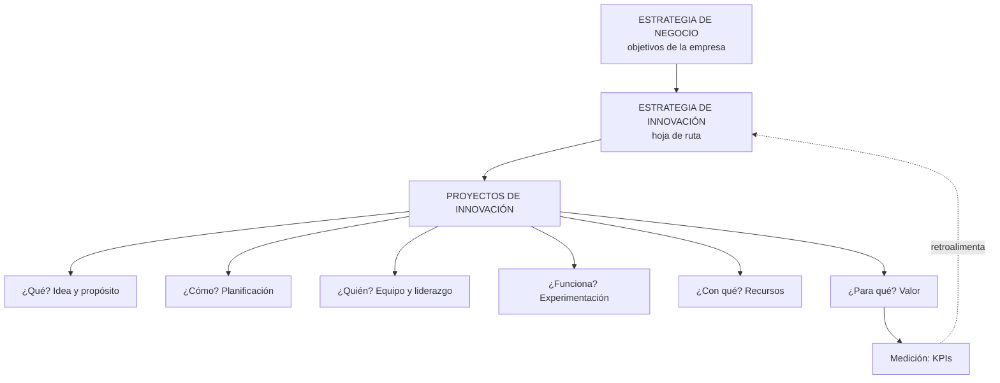
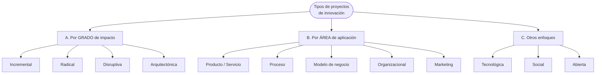

# 19 · Proyectos de innovación y estrategia de innovación

> **Fuente en el material:** *Proyecto de Innovación Tecnológica – Lean Startup y KPI* (Ing. Mario Barrios), diapositivas 1–16, 24–26.
> **Prerrequisitos:** [07 Gestión de la innovación](../parcial-1/07-gestion-de-la-innovacion.md), [12 Innovación tecnológica](../parcial-1/12-innovacion-tecnologica-e-ia.md).
> **Tiempo estimado:** 60 min.
> **Resto de la materia · Tema 19** (Proyecto de Innovación · Barrios). No entra en el Primer Parcial.

---

## 🎯 Objetivos de aprendizaje

1. Definir **proyecto de innovación** y explicar sus **características**.
2. Explicar **por qué es importante**, sus **puntos clave** y sus **beneficios**.
3. Describir los **seis elementos clave** de un proyecto de innovación (qué, cómo, quién, cómo validar, con qué, para qué).
4. Clasificar los **tipos de proyectos** por **grado de impacto**, por **área de aplicación** y por **otros enfoques**.
5. Explicar los **tres componentes clave** (estrategia, praxis, cultura).
6. Definir **estrategia de innovación**, sus **componentes**, **tipos** e **importancia**.
7. Explicar por qué la innovación debe estar **alineada** con la estrategia y qué pasa si no lo está.
8. Resolver el **caso práctico** de la cátedra.

---

## 🗺️ Esquema del tema

- **I. Pregunta disparadora: ¿de qué sirve innovar si no genera valor?**
- **II. Proyecto de innovación**
  - A. Definición
  - B. Características (5)
  - C. Importancia
  - D. Elementos clave (6)
  - E. Puntos clave (5)
  - F. Beneficios (6)
- **III. Tipos de proyectos de innovación**
  - A. Según el grado de cambio o impacto (4)
  - B. Según el área de aplicación (5)
  - C. Otros enfoques (3)
- **IV. Componentes clave: estrategia, praxis, cultura**
- **V. Estrategia de innovación**
  - A. Definición
  - B. Componentes para elaborarla (4)
  - C. Tipos de estrategia (4)
  - D. Importancia (3)
  - E. Innovación alineada
- **VI. Ejemplos de estrategias de innovación (6 casos)**
- **VII. Caso práctico: retail que pierde clientes**

---

## 🧠 Mapa visual

---

## 📖 Desarrollo

## I. Pregunta disparadora

> *"¿De qué sirve innovar si **no genera valor** para la empresa?"*

Toda esta unidad responde a esa pregunta: la innovación tiene que **planificarse como proyecto**, **alinearse con la estrategia** y **medirse** (KPI). Si no, es creatividad sin impacto.

---

## II. Proyecto de innovación

### II.A Definición

> 📌 *"Un proyecto de innovación es un **esfuerzo planificado y estratégico** para **introducir cambios significativos, nuevos productos, servicios o procesos** que **resuelven problemas de manera creativa y mejorada**. Su objetivo es **generar valor, aumentar la eficiencia y transformar ideas en soluciones tangibles**, ya sea a nivel tecnológico, educativo o empresarial."*

### II.B Características

| Característica | Explicación |
|---|---|
| **Innovación tecnológica** | Busca **generar, adaptar o dominar una tecnología nueva** para una región o sector. |
| **Innovación de procesos** | Implanta **cambios significativos en la producción o gestión**. |
| **Enfoque estratégico** | Pasa por **investigación, diseño, planificación y evaluación**. |
| **Impacto y valor** | Genera **cambios estructurales**, alta utilidad y valor para usuarios o consumidores. |
| **Multidisciplinario** | Colaboración de **distintos perfiles profesionales**. |

### II.C Importancia

> 📌 *"Un proyecto de innovación es fundamental porque **transforma ideas en soluciones tangibles** que mejoran procesos, crean productos novedosos y generan un cambio positivo en la sociedad. Permite a empresas **mantenerse competitivas**, aumenta la eficiencia (**hacer más con menos**) y resuelve problemas complejos, impulsando el **desarrollo económico y social**."*

> 📝 **Citar y explayarse:** La cátedra define el proyecto de innovación como *"un esfuerzo planificado y estratégico para introducir cambios significativos, nuevos productos, servicios o procesos"* que resuelven problemas *"de manera creativa y mejorada"*. Lo que lo diferencia de una idea suelta es que está **planificado**: tiene objetivo, recursos, plazos y responsables, y está conectado con la estrategia. Su importancia está en que *"transforma ideas en soluciones tangibles"*, permite a las empresas *"mantenerse competitivas"* y aumentar la eficiencia —*"hacer más con menos"*—. Es el puente entre la creatividad y la innovación: sin proyecto, la idea no llega a la práctica. Implementar turnos online en una clínica es un proyecto de innovación si se define qué problema resuelve, quién lo lleva adelante, con qué presupuesto y cómo se va a medir el resultado.

### II.D Elementos clave

Seis elementos. La forma más fácil de recordarlos es como **seis preguntas**:

| # | Elemento | Pregunta | Contenido |
|---|---|---|---|
| 1 | **Idea y propósito** | **¿Qué?** | Objetivos **claros, desafiantes** y orientados a mejorar lo existente o crear algo nuevo (producto, proceso o modelo de negocio). |
| 2 | **Planificación y estrategia** | **¿Cómo?** | Investigación, diseño y un **mapa de ruta (funnel de innovación)** para llevar la idea a la realidad. |
| 3 | **Equipo y liderazgo** | **¿Quién?** | Personas **creativas y motivadas**, con un liderazgo que fomente **cultura de innovación, pasión y asunción de riesgos**. |
| 4 | **Experimentación y validación** | **¿Funciona?** | Metodologías como **Design Thinking** o **prototipado rápido** para probar ideas, **aprender del error** y adaptar al contexto real. |
| 5 | **Recursos y gestión** | **¿Con qué?** | Recursos **humanos y materiales**; **gestión de riesgos** eficiente. |
| 6 | **Generación de valor** | **¿Para qué?** | Cambios **significativos, medibles y sostenibles** en el sector o mercado. |

> 🔗 La nota del docente en esa diapositiva dice **"Embudo"**: el elemento 2 (*funnel de innovación*) es el embudo de desarrollo del módulo [17](17-innovacion-abierta.md). El elemento 3 conecta con la **Gestión 2.0** ([07](../parcial-1/07-gestion-de-la-innovacion.md)); el 4 con **Design Thinking** ([13](../parcial-1/13-design-thinking.md)) y **Lean Startup** ([20](20-lean-startup-y-mvp.md)); el 6 con **KPI** ([21](21-kpi.md)).

### II.E Puntos clave

1. **Competitividad y diferenciación** – destacarse de los competidores con productos, servicios o modelos novedosos.
2. **Optimización y eficiencia** – **"hacer más con menos"** recursos.
3. **Solución de problemas** – necesidades latentes, calidad de vida, retos sociales.
4. **Adaptación al futuro** – anticipar tendencias y evaluar riesgos, **evitando la obsolescencia**.
5. **Desarrollo económico** – empleo, mejores salarios, nuevas oportunidades de mercado, incluso para **sectores vulnerables**.

### II.F Beneficios

| Beneficio | Explicación |
|---|---|
| **Competitividad y crecimiento** | Liderar el sector, **acceder a nuevos mercados**, adaptarse al entorno. |
| **Eficiencia operativa** | Optimiza procesos y recursos; reduce costos. |
| **Innovación en producto/servicio** | Soluciones superiores, más atractivas, con más valor. |
| **Ventajas económicas y fiscales** | **Deducciones fiscales** y acceso a **financiamiento**. *(La diapositiva menciona que las deducciones "pueden llegar a un [porcentaje] de los gastos", pero el valor no figura en el material.)* |
| **Cultura y talento** | Ambiente creativo, ágil y colaborativo; **retención de talento**. |
| **Impacto social y sostenibilidad** | Calidad de vida, **reducción de brechas sociales**, uso responsable de recursos. |

---

## III. Tipos de proyectos de innovación

> 📌 *"Los tipos principales se clasifican por su **impacto** (incremental, radical, disruptivo) o por su **área de aplicación**, destacando los de producto, proceso, organizacionales, tecnológicos y sociales."*

> 📝 **Citar y explayarse:** Según la cátedra, los proyectos de innovación se clasifican por su **impacto** —incremental, radical o disruptivo— o por su **área de aplicación** —producto, proceso, organizacional, tecnológica o social—. Son dos criterios distintos que se combinan: el primero mide **cuánto** cambia; el segundo, **dónde** cambia. Un mismo proyecto puede ser incremental y de proceso (automatizar la facturación de una empresa) o disruptivo y de producto (lanzar un servicio que reemplaza a otro). Clasificar bien un proyecto sirve para estimar su riesgo y los recursos que va a necesitar: uno disruptivo implica bastante más incertidumbre que uno incremental.

### III.A Según el grado de cambio o impacto

| Tipo | Definición | Ejemplo |
|---|---|---|
| **Incremental** | **Pequeñas mejoras continuas** a productos, servicios o procesos existentes. | Nueva versión de una app con mejoras de rendimiento. |
| **Radical** | **Producto o proceso totalmente nuevo** que **rompe con los métodos anteriores**. | Primer auto eléctrico masivo. |
| **Disruptiva** | **Cambios drásticos** que **modifican el mercado y el comportamiento del consumidor**, a menudo **creando nuevos mercados**. | **Streaming vs. alquiler de videos**. |
| **Arquitectónica** | **Reorganiza componentes existentes de formas innovadoras** para aportar valor de manera diferente. | El walkman: componentes conocidos (casete, auriculares, motor) combinados en un formato portátil. *(ejemplo propio)* |

> 💡 **La arquitectónica es la "nueva" de esta lista** (no apareció en módulos anteriores). Clave: **no inventa componentes**, **cambia cómo se conectan**.

### III.B Según el área de aplicación

| Tipo | Definición | Ejemplo de la cátedra |
|---|---|---|
| **Producto / Servicio** | Bienes o servicios **nuevos** o **mejora significativa** de los actuales. | — |
| **Proceso** | **Nuevos métodos de producción o distribución (logística)** para reducir costes o mejorar la calidad. | — |
| **Modelo de negocio** | Cambios en **cómo la empresa crea, entrega y captura valor**. | **Plataformas tipo Amazon**. |
| **Organizacional** | Nuevas **estructuras, prácticas o métodos de trabajo interno**. | — |
| **Marketing** | Cambios en el **diseño, envasado, posicionamiento o promoción**. | — |

### III.C Otros enfoques

| Tipo | Definición |
|---|---|
| **Tecnológica** | Aplicación de **nuevas tecnologías (IA, IoT)** para mejorar la competitividad. |
| **Social** | Proyectos que buscan **resolver necesidades sociales** (educación, salud, pobreza) con nuevas soluciones. |
| **Abierta (*Open Innovation*)** | **Colaboración con agentes externos** (universidades, startups) para desarrollar el proyecto. |

---

## IV. Componentes clave: estrategia, praxis, cultura

| Componente | Pregunta | Qué abarca |
|---|---|---|
| **Estrategia** | **¿Cuál es el propósito?** | Hacia dónde va la innovación y por qué. |
| **Praxis** | **¿Qué métodos y herramientas usamos?** | Design Thinking, Lean Startup, KPI, OKR… |
| **Cultura** | **¿Qué ambiente necesitamos?** | Tolerancia al error, colaboración, liderazgo (Gestión 2.0). |

> 💡 **Las tres son necesarias:** estrategia sin praxis = buenas intenciones; praxis sin estrategia = actividad sin rumbo; ambas sin cultura = nadie se anima a proponer.

---

## V. Estrategia de innovación

### V.A Definición

> 📌 *"Una estrategia de innovación es el **plan estructurado que vincula las mejoras novedosas con la estrategia comercial** de la organización, definiendo **objetivos, prioridades y recursos** necesarios para **crear valor**. Actúa como una **hoja de ruta** para competir mejor, fomentando la **experimentación, el aprendizaje y el crecimiento sostenido a largo plazo**."*

> 📝 **Citar y explayarse:** La cátedra define la estrategia de innovación como *"el plan estructurado que vincula las mejoras novedosas con la estrategia comercial"*, definiendo *"objetivos, prioridades y recursos"* para crear valor, y la compara con una *"hoja de ruta"*. Esto significa que la estrategia decide **qué** innovaciones conviene encarar, **en qué orden** y **con qué recursos**, según cómo quiere competir la empresa. Sin ella, la innovación se dispersa en ideas sueltas que no suman. Además, fomenta *"la experimentación, el aprendizaje y el crecimiento sostenido a largo plazo"*, porque asume que no todos los proyectos van a funcionar. Una cadena de retail que decide priorizar la experiencia digital del cliente, y en función de eso elige qué proyectos financiar, está aplicando una estrategia de innovación.

### V.B Componentes para elaborarla

| # | Componente | Explicación |
|---|---|---|
| 1 | **Alineación comercial** | **Conecta las ideas de mejora con los objetivos generales** de la empresa. |
| 2 | **Enfoque de valor** | Centrada en las **necesidades del cliente** y en la creación de **nuevas oportunidades**. |
| 3 | **Tipos de estrategia** | Puede ser **ofensiva**, **defensiva**, **imitativa** o **disruptiva** (ver V.C). |
| 4 | **Dirección clara** | Define **qué áreas se explorarán** (productos, procesos, servicios) y **cómo se medirá el éxito** (**métricas e indicadores de rendimiento** → KPI). |

### V.C Tipos de estrategia

| Tipo | Postura (cátedra) |
|---|---|
| **Ofensiva** | **Liderar** |
| **Defensiva** | **Adaptarse** |
| **Imitativa** | — |
| **Disruptiva** | — |

### V.D Importancia

1. **Ventaja competitiva** – sobresalir y **diferenciarse** en el mercado.
2. **Gestión del riesgo** – facilita **tomar riesgos calculados** y **experimentar**.
3. **Adaptabilidad** – un **marco para evolucionar** ante cambios del entorno.

> ➕ **Ventaja competitiva** (concepto que la cátedra pide desarrollar): es la característica que permite a una empresa **obtener mejores resultados que sus competidores de forma sostenida**, porque ofrece algo que los clientes valoran y que es difícil de imitar (menor costo, diferenciación, mejor experiencia, mejor modelo de negocio). La innovación **crea** ventaja competitiva; la estrategia la vuelve **sostenible**.

### V.E Innovación alineada

> 📌 *Nota del docente:* *"La innovación alineada (o alineación estratégica de la innovación) **no es un producto ni una herramienta** creada por una sola persona. Es un **concepto de gestión empresarial**. Consiste en **conectar las metas de innovación** de una organización **con sus objetivos de negocio generales**."*

**Consecuencias de innovar sin estrategia** (pregunta de la cátedra):
- Proyectos que **no generan valor** para la empresa (vuelve la pregunta disparadora).
- **Dispersión de recursos** en muchas ideas sin prioridad.
- Innovaciones que el cliente **no necesita** (falta de enfoque de valor).
- Imposibilidad de **medir** el éxito (sin dirección clara no hay KPI).
- Frustración del equipo y pérdida de cultura innovadora.

> 📝 **Citar y explayarse:** Según la nota del docente, la innovación alineada *"no es un producto ni una herramienta"* sino *"un concepto de gestión empresarial"* que consiste en *"conectar las metas de innovación de una organización con sus objetivos de negocio generales"*. La idea es que innovar no es valioso en sí mismo: lo es cuando contribuye a lo que la empresa necesita lograr. Innovar sin alineación produce proyectos que no generan valor, dispersión de recursos, soluciones que el cliente no necesita e imposibilidad de medir el éxito. Con alineación, cada proyecto se justifica por el objetivo de negocio al que aporta y se mide con indicadores comunes. Si el objetivo de una cadena de retail es recuperar clientes, una app de fidelización está alineada; un proyecto de realidad virtual sin relación con ese objetivo, probablemente no.

---

## VI. Ejemplos de estrategias de innovación (casos de la cátedra)

| Empresa | Tipo de innovación | Qué hizo |
|---|---|---|
| **Tesla** | **Disruptiva** | Vehículos eléctricos de alto rendimiento; desafió a los fabricantes tradicionales y se diversificó al **almacenamiento de energía**. |
| **Netflix / Spotify** | **Modelo de negocio** | Del formato físico de compra/alquiler a la **suscripción digital**. |
| **Apple** | **Ecosistema** | **Interconexión** de dispositivos (iPhone, iPad, Mac) y servicios (Apple Pay, iCloud) → **alta fidelización**. |
| **Procter & Gamble** | **Abierta** | Programa **Connect + Develop**: colaboración con socios externos en lugar de solo I+D interno. |
| **Beyond Meat** | **Valor / marketing** | Productos vegetales con sabor idéntico a la carne, enfocados en **salud y sostenibilidad**. |
| **Singapore Airlines** | **Procesos** | Diferenciación por una **estrategia de servicio al cliente superior**, redefiniendo la experiencia de vuelo. |

---

## VII. Caso práctico: retail que pierde clientes

> *"Una empresa de retail pierde clientes porque la competencia vende online."* Consignas: **definir estrategia**, **proponer 1 innovación**, **explicar por qué está alineada**.

---

## ⚠️ Conceptos que se confunden

| Se confunde… | …con | Diferencia |
|---|---|---|
| Proyecto de innovación | Proyecto común | El de innovación introduce **cambios significativos** con **incertidumbre** y busca **generar valor nuevo**. |
| Estrategia de innovación | Estrategia de negocio | La de innovación **vincula** las mejoras novedosas **con** la estrategia comercial (es una hoja de ruta subordinada). |
| Radical | Arquitectónica | Radical = **totalmente nuevo**; arquitectónica = **componentes existentes reorganizados**. |
| Ofensiva | Disruptiva | Ofensiva = **liderar** en el mercado actual; disruptiva = **cambiar las reglas** del mercado. |
| Praxis | Estrategia | Praxis = **métodos y herramientas**; estrategia = **propósito**. |

---

## 🔗 Conexiones

- **→ [20 Lean Startup](20-lean-startup-y-mvp.md):** metodología de experimentación y validación.
- **→ [21 KPI](21-kpi.md):** "cómo se medirá el éxito".
- **← [17 Innovación abierta](17-innovacion-abierta.md):** proyectos abiertos, P&G.
- **← [07 Doblin](../parcial-1/07-gestion-de-la-innovacion.md):** clasificar la innovación del caso práctico.

---

## ✍️ Autoevaluación

*(Estas son las 10 preguntas que la cátedra deja "antes del recreo".)*

**1. Defina proyecto de innovación.**

Ver respuesta

Es un **esfuerzo planificado y estratégico** para introducir **cambios significativos, nuevos productos, servicios o procesos** que resuelven problemas de manera creativa y mejorada, con el objetivo de **generar valor, aumentar la eficiencia y transformar ideas en soluciones tangibles**.

**2. Explique los tipos de innovación.**

Ver respuesta

Por **grado de impacto**: incremental, radical, disruptiva, arquitectónica. Por **área de aplicación**: producto/servicio, proceso, modelo de negocio, organizacional, marketing. **Otros enfoques**: tecnológica, social, abierta. (Desarrollar cada uno con su definición.)

**3. ¿Qué es la estrategia del negocio?**

Ver respuesta

Es el plan que define **los objetivos generales de la organización** y cómo va a competir para alcanzarlos. *(La cátedra define en detalle la **estrategia de innovación**: el plan estructurado que **vincula las mejoras novedosas con esa estrategia comercial**, definiendo objetivos, prioridades y recursos para crear valor; una hoja de ruta para competir mejor.)*

**4. ¿Por qué es importante la alineación entre innovación y estrategia?**

Ver respuesta

Porque garantiza que la innovación **genere valor para la empresa**: conecta las ideas con los objetivos de negocio, permite **priorizar recursos**, **medir el éxito** con indicadores, gestionar el riesgo y obtener **ventaja competitiva** sostenible.

**5. Analice las consecuencias de innovar sin estrategia.**

Ver respuesta

Proyectos que no generan valor, dispersión de recursos, soluciones que el cliente no necesita, imposibilidad de medir resultados, riesgos no gestionados y desgaste de la cultura innovadora.

**6. Describa un ejemplo de innovación alineada.**

Ver respuesta

Apple: su objetivo de negocio es la **fidelización** y su estrategia de innovación es de **ecosistema** (iPhone, iPad, Mac + Apple Pay, iCloud). Cada innovación refuerza la permanencia del cliente en el ecosistema → alineada.

**7. ¿Qué indicadores se pueden usar para medir innovación?**

Ver respuesta

KPIs como: % de ingresos por productos nuevos, tasa de conversión, crecimiento de ingresos, CAC, ROI, retención de clientes, NPS, time to market. Deben ser **SMART** (ver módulo [21](21-kpi.md)).

**8. Relacione Lean Startup con proyectos de innovación.**

Ver respuesta

Lean Startup es una **praxis** para el elemento "**experimentación y validación**": reduce el **riesgo** (característica de la innovación) mediante MVP, medición y aprendizaje antes de invertir de lleno, y permite **pivotar** si el mercado no valida la idea (ver módulo [20](20-lean-startup-y-mvp.md)).

**9. Desarrolle el concepto de ventaja competitiva.**

Ver respuesta

Es lo que permite a una empresa **sobresalir y diferenciarse** de sus competidores de forma sostenida, ofreciendo algo que los clientes valoran y que es difícil de imitar. La estrategia de innovación es una fuente de ventaja competitiva.

**10. Analice un caso donde la innovación no generó valor.**

Ver respuesta

Respuesta abierta. Ejemplo: Google Glass (primera versión de consumo): tecnología novedosa pero sin una necesidad clara del usuario, precio alto y problemas de privacidad → problemas de innovar n.º 1 (falta de comprensión del usuario), n.º 2 (costo y riesgo) y n.º 8 (éticos). *(Ejemplo de contexto adicional.)*

---

[← 18 De VICA a VANI](18-entornos-vica-y-vani.md) · [🏠 Índice](../README.md) · [Siguiente → 20 Lean Startup y MVP](20-lean-startup-y-mvp.md)
