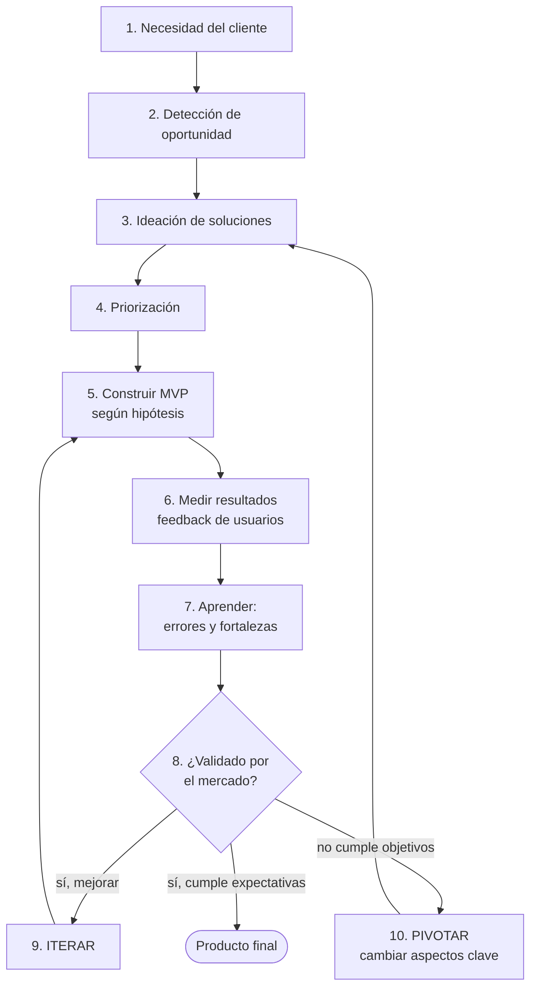
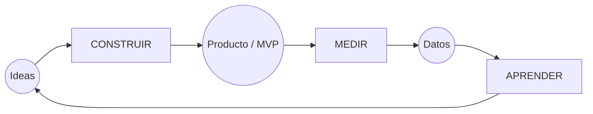

# 20 · Lean Startup y MVP

> **Fuente en el material:** *Proyecto de Innovación Tecnológica – Lean Startup y KPI* (Ing. Mario Barrios), diapositivas 21–23.
> **Prerrequisitos:** [19 Proyectos y estrategia](19-proyectos-y-estrategia-de-innovacion.md), [13 Design Thinking](../parcial-1/13-design-thinking.md).
> **Tiempo estimado:** 45 min.
> **Resto de la materia · Tema 20** (Proyecto de Innovación · Barrios). No entra en el Primer Parcial. Ojo: el **MVP** fue la pregunta 10 del [parcial anterior](../evaluacion/parcial-anterior-resuelto.md#v10-el-mvp-contra-la-competencia).

---

## 🎯 Objetivos de aprendizaje

1. Definir **Lean Startup** y su **objetivo**.
2. Conocer a su creador, **Eric Ries**.
3. Describir las **diez fases** del método en orden.
4. Explicar los conceptos de **Producto Mínimo Viable (MVP)**, **validación**, **iteración** y **pivotar**.
5. Relacionar Lean Startup con los **proyectos de innovación**.

---

## 🗺️ Esquema del tema

- **I. Definición y objetivo**
- **II. Eric Ries**
- **III. Las fases del método**
  - A. Entender el problema
    1. Necesidad del cliente
    2. Detección de oportunidad
  - B. Diseñar la solución
    3. Ideación de soluciones
    4. Priorización de la solución
    5. Construcción del MVP según hipótesis
  - C. Aprender del mercado
    6. Medición de resultados
    7. Aprendizaje de errores y detección de fortalezas
    8. Validación
  - D. Decidir
    9. Iteración
    10. Decisión de pivotar
- **IV. Conceptos clave**: MVP, hipótesis, pivotar, iterar
- **V. Lean Startup en proyectos de innovación**

---

## 🧠 Mapa visual

---

## 📖 Desarrollo

## I. Definición y objetivo

> 📌 *"Lean Startup es una **metodología de gestión** creada por **Eric Ries** para **desarrollar negocios y productos de forma más eficiente**. Su objetivo es **reducir el riesgo y evitar el desperdicio de tiempo y dinero** mediante el **lanzamiento rápido de prototipos**, la **experimentación con usuarios reales** y el **aprendizaje continuo**."*

Tres mecanismos de la definición:
1. **Lanzamiento rápido de prototipos** (MVP).
2. **Experimentación con usuarios reales**.
3. **Aprendizaje continuo**.

> 💡 **Para entenderlo – "lean" = "esbelto, sin desperdicio":** el mayor desperdicio en innovación es **construir durante meses algo que nadie quiere**. Lean Startup invierte el orden: primero **probás** con lo mínimo, después **construís**.

> 🔗 **Por qué existe:** responde directamente a la característica **"incertidumbre y riesgo"** de la innovación tecnológica y al problema **"alto costo y riesgo"** de innovar (módulo [12](../parcial-1/12-innovacion-tecnologica-e-ia.md)).

> 📝 **Citar y explayarse:** La cátedra define Lean Startup como *"una metodología de gestión creada por Eric Ries para desarrollar negocios y productos de forma más eficiente"*, cuyo objetivo es *"reducir el riesgo y evitar el desperdicio de tiempo y dinero"*. Lo logra invirtiendo el orden tradicional: en lugar de construir durante meses un producto completo y recién después ver si alguien lo quiere, se lanza rápido una versión mínima (el **MVP**), se experimenta con **usuarios reales** y se aprende de los datos. Así, el error se descubre temprano y sale barato. Por eso responde directamente a la **incertidumbre y el riesgo** propios de la innovación tecnológica. Antes de programar un sistema de turnos para gimnasios, por ejemplo, se puede publicar una página con un formulario de demo y medir cuántos dueños se interesan.

---

## II. Eric Ries

- **Emprendedor de Silicon Valley**, nacido en **1979**.
- **Autor reconocido del movimiento Lean Startup**, una estrategia empresarial para **reducir el riesgo al lanzar proyectos innovadores**.
- En **2001** se trasladó a Silicon Valley, donde trabajó como **ingeniero de software**.

> ➕ **Contexto adicional:** su libro ***The Lean Startup*** se publicó en **2011**. Ries se inspiró en el *lean manufacturing* de Toyota (eliminar desperdicio) y en el *customer development* de Steve Blank.

---

## III. Las fases del método

> 📌 *Nota del docente:* *"En la aplicación del método Lean Startup se distinguen varias etapas, **desde la detección de la necesidad del cliente** a la **creación del producto** e incluso **el cambio de estrategia cuando sea necesario**."*

### III.A Entender el problema

#### III.A.1 Necesidad del cliente
**Estudio y análisis del público** para detectar los **problemas** con el producto o servicio. Se **definen las necesidades del usuario** en función de la información obtenida.

#### III.A.2 Detección de oportunidad
Con las necesidades definidas, se detecta **la oportunidad de negocio** que solventará los problemas del usuario.

### III.B Diseñar la solución

#### III.B.3 Ideación de soluciones
Estudio de **ideas y posibilidades** sobre cómo abordar el problema existente en el mercado.

#### III.B.4 Priorización de la solución
Tras el análisis, se **elige una solución** y se **prioriza su desarrollo** con el objetivo de conseguir un **producto mínimo viable**.

#### III.B.5 Construcción del MVP según hipótesis
Desarrollo del producto y sus características **atendiendo al aprendizaje** extraído del análisis previo. El MVP se construye para **poner a prueba hipótesis**.

### III.C Aprender del mercado

#### III.C.6 Medición de resultados
Tras lanzar el producto mínimo **para testearlo**, se **recopila y analiza el feedback** de los usuarios. Luego **se adapta el producto**, mejorando sus características.

#### III.C.7 Aprendizaje de errores y detección de fortalezas
El análisis continuo de todas las fases aporta información sobre **fallos a evitar** y **aspectos positivos** a incluir en otros desarrollos.

#### III.C.8 Validación
Al llegar al producto final, se **decide si cumple con las expectativas del mercado**, en función de los análisis obtenidos.

### III.D Decidir

#### III.D.9 Iteración
**Repetir el proceso de mejora tantas veces como sea necesario** para afinar el producto final.

#### III.D.10 Decisión de pivotar
Si, cumplidas estas etapas, el producto **no cumple los objetivos que demanda el mercado**, lo más conveniente es **pivotar**: **cambiar aspectos clave del negocio** para que encaje en el mercado.

> ➕ **Contexto adicional – el ciclo Construir → Medir → Aprender:** en el libro de Ries, las fases 5–8 se resumen en un bucle continuo: **Construir** (MVP) → **Medir** (datos de uso) → **Aprender** (validar o refutar la hipótesis) → volver a construir. El objetivo es **recorrer el bucle lo más rápido posible**.

---

## IV. Conceptos clave

| Concepto | Significado |
|---|---|
| **Hipótesis** | Suposición sobre el cliente o el negocio que **todavía no está probada**. |
| **MVP (Producto Mínimo Viable)** | La versión **más simple** del producto que permite **probar la hipótesis con usuarios reales**. |
| **Medir** | Recolectar datos del uso real (no opiniones). |
| **Validación** | El mercado confirma (o no) la hipótesis. |
| **Iterar** | Mejorar **sin cambiar el rumbo**. |
| **Pivotar** | **Cambiar aspectos clave** del negocio. |

> ⚠️ **Iterar vs. pivotar (clásico):** iterar = **ajustar** el producto manteniendo la estrategia. Pivotar = **cambiar algo fundamental** (segmento de cliente, problema, modelo de ingresos, canal). Pivotar **no es fracasar**: es usar lo aprendido para reorientarse.

> 📝 **Citar y explayarse:** Según la nota del docente, en Lean Startup se distinguen etapas que van *"desde la detección de la necesidad del cliente"* hasta *"la creación del producto e incluso el cambio de estrategia cuando sea necesario"*. Primero se entiende el problema, después se diseña la solución y se construye un MVP según hipótesis, luego se mide y se valida con el mercado y, por último, se decide: **iterar** —mejorar sin cambiar el rumbo— o **pivotar** —*"cambiar aspectos clave del negocio"* cuando el producto no cumple lo que demanda el mercado—. Pivotar no es fracasar, sino usar lo aprendido para reorientarse. Instagram es el ejemplo clásico: empezó como una app de check-in y pivotó hacia las fotos al ver que era lo que los usuarios realmente usaban.

---

## V. Lean Startup en proyectos de innovación

Relación con los **elementos clave** de un proyecto de innovación (módulo [19](19-proyectos-y-estrategia-de-innovacion.md)):

| Elemento del proyecto | Aporte de Lean Startup |
|---|---|
| Idea y propósito | Fases 1–2: necesidad del cliente y oportunidad. |
| Planificación | Fases 3–4: ideación y priorización. |
| **Experimentación y validación** | Fases 5–8: **MVP, medición, aprendizaje, validación** (el aporte central). |
| Recursos y gestión | Reduce el **desperdicio** de tiempo y dinero; gestiona el riesgo. |
| Generación de valor | Validación con el mercado; **pivotar** si no hay valor. |

Y con la **Gestión 2.0** (módulo [07](../parcial-1/07-gestion-de-la-innovacion.md)): Lean Startup **institucionaliza** el pilar "**está bien fracasar, iterar y resiliencia**".

---

## ⚠️ Conceptos que se confunden

| Se confunde… | …con | Diferencia |
|---|---|---|
| MVP | Producto "malo" o incompleto | El MVP es lo **mínimo para aprender** sobre una hipótesis, no un producto mal hecho. |
| Iterar | Pivotar | Ajustar manteniendo el rumbo vs. **cambiar aspectos clave** del negocio. |
| Validación | Opinión favorable | Validar = el **mercado se comporta** como la hipótesis predijo (datos), no que a alguien "le guste". |
| Lean Startup | Design Thinking | Validar el **negocio con métricas** vs. entender el **problema del usuario**. |

---

## 🔗 Conexiones

- **← [19 Proyectos](19-proyectos-y-estrategia-de-innovacion.md):** pregunta "relacione Lean Startup con proyectos de innovación".
- **← [13 Design Thinking](../parcial-1/13-design-thinking.md).**
- **→ [21 KPI](21-kpi.md):** la fase "medición de resultados" necesita indicadores.
- **← [18 VANI](18-entornos-vica-y-vani.md):** en un mundo no lineal, experimentar es mejor que planificar a 5 años.

---

## ✍️ Autoevaluación

**1. Defina Lean Startup y su objetivo. ¿Quién lo creó?**

Ver respuesta

Es una **metodología de gestión** creada por **Eric Ries** (emprendedor de Silicon Valley, n. 1979, ingeniero de software) para **desarrollar negocios y productos de forma más eficiente**. Su objetivo es **reducir el riesgo y evitar el desperdicio de tiempo y dinero** mediante el lanzamiento rápido de prototipos, la experimentación con usuarios reales y el aprendizaje continuo.

**2. Enumere las fases del método en orden.**

Ver respuesta

(1) Necesidad del cliente; (2) Detección de oportunidad; (3) Ideación de soluciones; (4) Priorización de la solución; (5) Construcción del MVP según hipótesis; (6) Medición de resultados; (7) Aprendizaje de errores y detección de fortalezas; (8) Validación; (9) Iteración; (10) Decisión de pivotar.

**3. ¿Qué es un MVP y para qué sirve?**

Ver respuesta

Es el **Producto Mínimo Viable**: la versión más simple del producto que permite **poner a prueba una hipótesis con usuarios reales**, recopilar feedback y medir resultados antes de invertir en el desarrollo completo, reduciendo riesgo y desperdicio.

**4. Diferencie iterar de pivotar con un ejemplo.**

Ver respuesta

**Iterar**: repetir el proceso de mejora para afinar el producto **sin cambiar el rumbo** (ej. mejorar la interfaz de una app de turnos según el feedback). **Pivotar**: si el producto **no cumple los objetivos del mercado**, **cambiar aspectos clave del negocio** para que encaje (ej. pasar de vender a gimnasios a vender a consultorios médicos).

**5. Aplique Lean Startup a una idea: una app que conecta estudiantes con tutores de la misma facultad.**

Ver respuesta

(1) Necesidad: estudiantes no encuentran apoyo para finales. (2) Oportunidad: estudiantes avanzados que quieren ingresos. (3–4) Ideas: app, grupo de WhatsApp, planilla; se prioriza lo más simple. (5) MVP: formulario de Google + grupo de WhatsApp. Hipótesis: "los estudiantes pagarían $X por una clase". (6) Medir: inscriptos, clases concretadas, pagos. (7) Aprender: qué materias se piden, qué falla. (8) Validar: ¿se concretan y pagan clases? (9) Iterar: agregar calendario. (10) Pivotar si no pagan: modelo gratuito financiado por la facultad o venta de apuntes.

---

[← 19 Proyectos de innovación y estrategia de innovación](19-proyectos-y-estrategia-de-innovacion.md) · [🏠 Índice](../README.md) · [Siguiente → 21 KPI](21-kpi.md)
