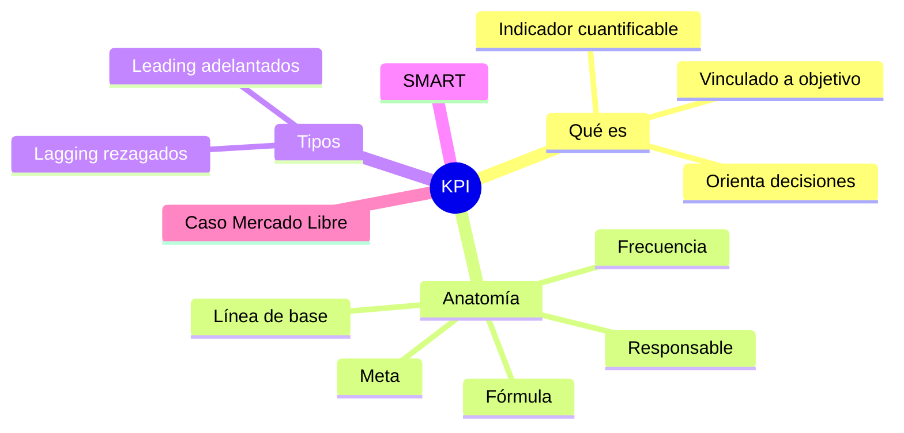
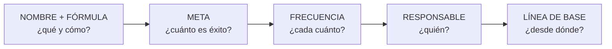
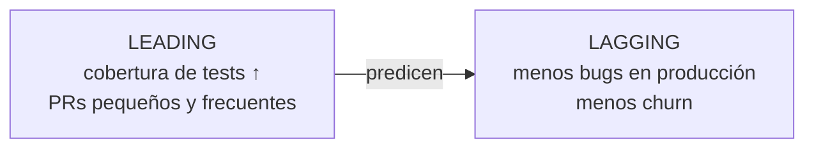
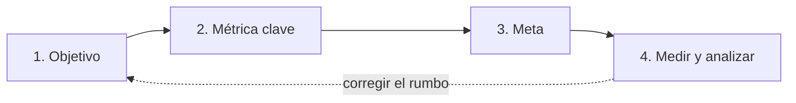

# 21 · KPI: indicadores clave de desempeño

> **Fuente en el material:** *Proyecto de Innovación Tecnológica – Lean Startup y KPI* (Ing. Barrios), diapositivas 17–20; *KPI & OKR* (Ing. Mario Barrios), módulos 01–03 y Ejercicio 01.
> **Tiempo estimado:** 35 min.
> **Resto de la materia · Tema 21** (KPI & OKR · Barrios). No entra en el Primer Parcial.

---

## 🎯 Objetivos de aprendizaje

1. Definir **KPI** y diferenciarlo de una **métrica**.
2. Construir un KPI completo con su **anatomía** (nombre + fórmula, meta, frecuencia + responsable, línea de base).
3. Aplicar el **framework SMART**.
4. Distinguir KPI **leading** (adelantados) y **lagging** (rezagados).
5. Analizar el **caso Mercado Libre**.
6. Definir **KPI y OKR** con un ejemplo de cada uno y explicar su **diferencia**.

---

## 🗺️ Esquema del tema

- **I. Qué es un KPI**
  - A. Definición (dos versiones de la cátedra)
  - B. Métrica vs. KPI
  - C. Las 5 condiciones de un KPI
- **II. Anatomía de un KPI bien construido**
  1. Nombre + fórmula
  2. Meta (target)
  3. Frecuencia + responsable
  - + Línea de base
- **III. Framework SMART**
- **IV. Tipos de KPI: leading vs. lagging**
- **V. Pasos para implementar KPIs**
- **VI. Caso real: Mercado Libre y las métricas DORA**
- **VII. KPI y OKR: definición, ejemplo y diferencia**

---

## 🧠 Mapa visual

---

## 📖 Desarrollo

## I. Qué es un KPI

### I.A Definición

> 📌 **Versión "Proyectos de innovación":** *"Los KPIs (**Key Performance Indicators** o Indicadores Clave de Desempeño) son **métricas cuantificables** utilizadas para **evaluar el éxito, la eficiencia y el progreso** de una organización, equipo o campaña **hacia sus objetivos estratégicos**. Actúan como un **'GPS' empresarial**, facilitando la **toma de decisiones basada en datos** para **corregir el rumbo** si es necesario."*

> 📌 **Versión "KPI & OKR":** *"Un Key Performance Indicator es un **indicador cuantificable** que permite evaluar **qué tan bien** una organización, equipo o proceso **está alcanzando sus objetivos estratégicos** en un **período de tiempo definido**."*

### I.B Métrica vs. KPI

> *"La palabra clave es **'Key'**. **No toda métrica es un KPI.**"*

| | Ejemplo | Qué hace |
|---|---|---|
| **Métrica** | *"Tuvimos 10.000 visitas al sitio."* | **Informa.** |
| **KPI** | *"La tasa de conversión es 3,2 % vs. meta del 5 %."* | **Orienta decisiones.** |

> 📌 *"La métrica **informa**. El KPI **orienta decisiones**."*

### I.C Las 5 condiciones de un KPI

Un KPI tiene que:
1. Estar **vinculado a un objetivo de negocio**.
2. Ser **medible con un valor numérico**.
3. Tener un **responsable claro**.
4. Tener un **período de evaluación definido**.
5. **Orientar decisiones y acciones concretas**.

---

## II. Anatomía de un KPI bien construido

| Componente | Qué define | Ejemplo |
|---|---|---|
| **01 · Nombre + fórmula** | **Exactamente qué se mide y cómo se calcula**. | *Defect Rate = Bugs en producción / Features entregadas* |
| **02 · Meta (target)** | **Valor numérico que define el éxito**; **retador pero alcanzable**. | *< 0,1 bugs por feature* |
| **03 · Frecuencia + responsable** | **Cada cuánto** se mide y **quién es dueño del número**. | *Semanal; Tech Lead* |
| **+ Línea de base** | Valor **actual** desde el que se parte. | *Hoy: 0,4 bugs por feature* |

> 📌 *"**Sin meta, no hay KPI**: es solo una métrica."* · *"Sin frecuencia y responsable, el KPI **no genera acción**."*

> 📌 **La frase para memorizar:** *"Un KPI sin meta es una **observación**. Un KPI sin responsable es un **deseo**. Un KPI sin frecuencia es **historia**."*

---

## III. Framework SMART

| Letra | Significado | Pregunta de control | Aplicado a KPI (cátedra) |
|---|---|---|---|
| **S** | **Specific** – Específico | ¿Está **claramente definido**? | El indicador debe referir a **un proceso concreto**. |
| **M** | **Measurable** – Medible | ¿Se puede **cuantificar**? | **Cuantificable con datos reales**. |
| **A** | **Achievable** – Alcanzable | ¿Es **realista** con los recursos? | **Alcanzable con los recursos disponibles**. |
| **R** | **Relevant** – Relevante | ¿Importa para la **estrategia**? | **Vinculado a un objetivo estratégico**. |
| **T** | **Time-bound** – Temporal | ¿Tiene **plazo**? | **Acotado a una ventana temporal**. |

> 🧩 **De NO-SMART a SMART:**
> - ❌ "Mejorar la satisfacción del cliente." (no es específico, ni medible, ni temporal)
> - ✅ "Aumentar el **NPS** de **+20 a +40** en el **Q2**, medido por encuesta post-compra, responsable: líder de Customer Success."

---

## IV. Tipos de KPI: leading vs. lagging

| | **Leading (adelantados)** | **Lagging (rezagados)** |
|---|---|---|
| **Qué miden** | **Actividades que predicen resultados futuros**. | **Resultados ya ocurridos**. |
| **Ventaja** | **Son accionables** (podés intervenir antes). | **Fáciles de medir**. |
| **Desventaja** | **Difíciles de medir**. | **No se puede intervenir retroactivamente**. |
| **Ejemplos de la cátedra** | Cantidad de **pull requests por semana**, **cobertura de tests**. | **Churn rate del trimestre**, **ingresos mensuales**. |

---

## V. Pasos para implementar KPIs

1. **Definir el objetivo** – ¿qué queremos lograr?
2. **Identificar la métrica clave** – ¿qué dato demuestra el éxito?
3. **Establecer metas** – ¿cuál es la cifra objetivo (*target*)?
4. **Medir y analizar** – revisar la evolución **periódicamente** (semanal, mensual).

---

## VI. Caso real: Mercado Libre y las métricas DORA

> Fuente citada: **MeLi Engineering Blog / DORA Report LATAM 2023.**

- Adoptó las **métricas DORA** como estándar para sus **más de 18.000 empleados de tecnología**.
- Cada equipo tiene un **scorecard de KPI de ingeniería revisado cada sprint**.
- Al medir el **Change Failure Rate por equipo**, descubrieron que **3 squads generaban el 68 % de los incidentes** de producción.
- La intervención **redujo el tiempo de indisponibilidad un 41 % en 2 trimestres**.

> 📌 **Conclusión de la cátedra:** *"La medición sistemática de KPI de ingeniería genera impacto directo tanto en la calidad del producto como en la satisfacción del equipo. **Los equipos con mejores DORA metrics tienen también la mayor retención de ingenieros**."*

---

## VII. KPI y OKR: definición, ejemplo y diferencia

**KPI:** es un indicador clave cuantificable que permite medir el desempeño o la eficiencia de un equipo o la organización hacia un objetivo, o de un proceso en marcha. Funciona como un **GPS**, porque te dice cómo estás y te permite corregir el rumbo si estás lejos de la meta. Se compone del **nombre y la fórmula**, que dicen exactamente qué se mide y cómo se calcula; la **meta**, que es el valor numérico al que queremos llegar; y el **responsable y la frecuencia** de medición. Además tiene una **línea base**, que es el valor con el que arranca el KPI.

- **Ejemplo (cátedra):** Defect Rate = bugs en producción / features entregadas, con una meta de menos de 0,1 bugs por feature, medido semanalmente por el Tech Lead y con una línea base de 0,4 bugs por feature.

**OKR:** es un sistema de gestión de objetivos que permite alinear a todos los equipos de la organización hacia objetivos estratégicos más aspiracionales. Se compone de 3 partes: el **objetivo**, que tiene que ser aspiracional y no contener números; los **KR**, que son en esencia KPI con contexto estratégico y representan la parte medible (van de 2 a 5 por objetivo); y las **iniciativas**, que son las acciones concretas para mover los KR y que se abandonan si no mueven el número.

- **Ejemplo (cátedra):** el objetivo "ser la plataforma de pagos más confiable del país", con los KR "uptime mayor a 99,95 % en Q3" y "MTTR menor a 2 horas", y la iniciativa "implementar circuit breakers en servicios críticos".

**Diferencia:** los KPI miden constantemente el estado de un proceso en marcha (se revisan diaria o semanalmente) y la métrica se mantiene fija para poder compararla con el histórico. En cambio, los OKR se revisan con check-ins semanales y se resetean cada trimestre. A los KPI se les exige un **100 %** de cumplimiento porque representan el estándar mínimo operativo, mientras que a los OKR se les pide entre un **60 y un 70 %** porque son metas más aspiracionales. Los KPI te dicen cómo estás y los OKR adónde querés ir, así que **se complementan**.

> 🔗 La tabla completa KPI vs. OKR está en el tema [22](22-okr.md) (sección III).

---

## ⚠️ Conceptos que se confunden

| Se confunde… | …con | Diferencia |
|---|---|---|
| Métrica | KPI | La métrica **informa**; el KPI tiene **meta, responsable, frecuencia** y **orienta decisiones**. |
| Leading | Lagging | Predicen y son accionables (difíciles de medir) vs. resultados pasados (fáciles de medir, no se puede intervenir). |
| Lead Time | MTTR | Commit → producción (velocidad) vs. tiempo de **recuperación** ante una falla (resiliencia). |

---

## 🔗 Conexiones

- **→ [22 OKR](22-okr.md):** los Key Results son "KPI con contexto estratégico".
- **← [03 Disruptivas](../parcial-1/03-tecnologias-disruptivas.md):** paso 6 "medir y evaluar con KPIs".
- **← [20 Lean Startup](20-lean-startup-y-mvp.md):** fase "medición de resultados".

---

## ✍️ Autoevaluación

**1. ¿Qué diferencia una métrica de un KPI? Dé un ejemplo de cada una.**

Ver respuesta

La métrica **informa** ("10.000 visitas"); el KPI **orienta decisiones** porque está vinculado a un objetivo, es numérico, tiene responsable, período definido y meta ("conversión 3,2 % vs. meta del 5 %"). No toda métrica es un KPI: la clave es la "K" (*Key*).

**2. Explique la anatomía de un KPI y complete: "Un KPI sin meta es ___; sin responsable es ___; sin frecuencia es ___".**

Ver respuesta

Nombre + fórmula (qué y cómo se mide), meta/target (valor que define el éxito, retador pero alcanzable), frecuencia + responsable (cada cuánto y quién es dueño), y línea de base. Un KPI sin meta es una **observación**; sin responsable, un **deseo**; sin frecuencia, **historia**.

**3. Clasifique como leading o lagging: (a) ingresos del mes; (b) cobertura de tests; (c) churn trimestral; (d) cantidad de demos agendadas por semana.**

Ver respuesta

(a) **Lagging**. (b) **Leading**. (c) **Lagging**. (d) **Leading** (predice ventas futuras).

**4. ¿Qué aprendió Mercado Libre al medir el Change Failure Rate por equipo?**

Ver respuesta

Que **3 squads generaban el 68 % de los incidentes** de producción. Intervenir sobre ellos **redujo la indisponibilidad un 41 % en 2 trimestres**. Además, los equipos con mejores métricas DORA tenían la mayor retención de ingenieros.

---

[← 20 Lean Startup y MVP](20-lean-startup-y-mvp.md) · [🏠 Índice](../README.md) · [Siguiente → 22 OKR](22-okr.md)
