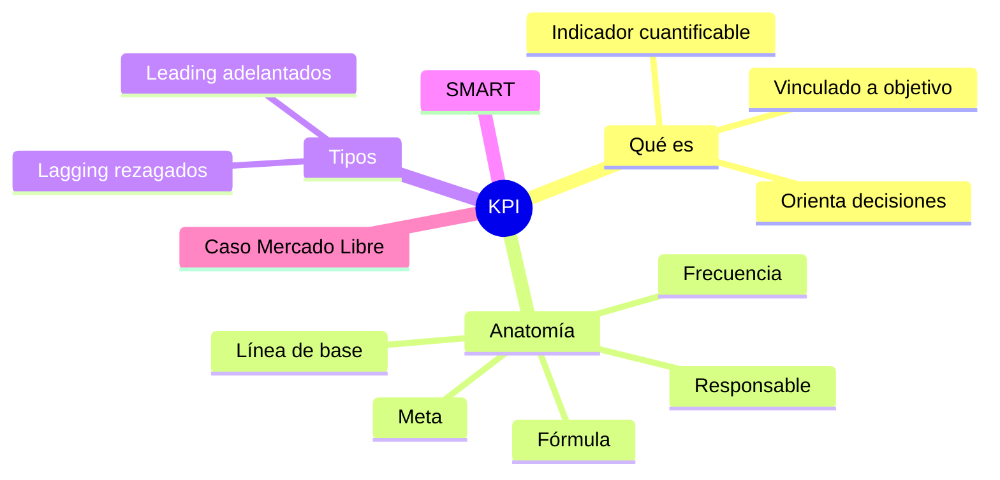
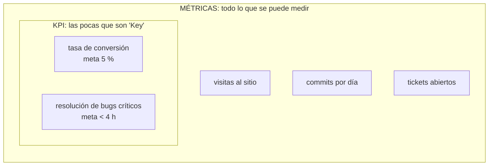
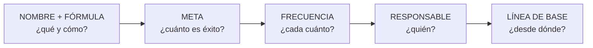
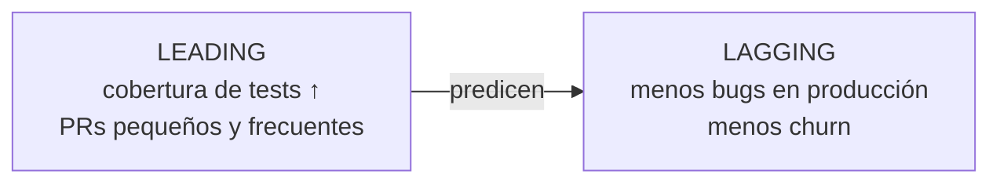
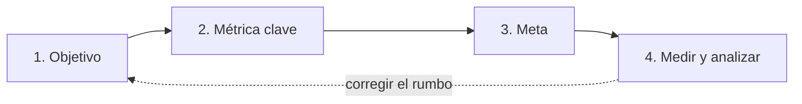

# 21 · KPI: indicadores clave de desempeño

> **Fuente en el material:** *Proyecto de Innovación Tecnológica – Lean Startup y KPI* (Ing. Barrios), diapositivas 17–20; *KPI & OKR* (Ing. Mario Barrios), módulos 01–03 y Ejercicio 01.
> **Prerrequisitos:** [19 Proyectos y estrategia](19-proyectos-y-estrategia-de-innovacion.md).
> **Tiempo estimado:** 45 min.
> **Resto de la materia · Tema 21** (KPI & OKR · Barrios). No entra en el Primer Parcial.

---

## 🎯 Objetivos de aprendizaje

1. Definir **KPI** y diferenciarlo de una **métrica**.
2. Construir un KPI completo con su **anatomía** (nombre + fórmula, meta, frecuencia + responsable, línea de base).
3. Aplicar el **framework SMART**.
4. Distinguir KPI **leading** (adelantados) y **lagging** (rezagados).
5. Conocer las **herramientas** para medir KPI.
6. Analizar el **caso Mercado Libre**.

---

## 🗺️ Esquema del tema

- **I. Qué es un KPI**
  - A. Definición (dos versiones de la cátedra)
  - B. Métrica vs. KPI
  - C. Las 5 condiciones de un KPI
- **II. Anatomía de un KPI bien construido**
  1. Nombre + fórmula
  2. Meta (target)
  3. Frecuencia + responsable
  - + Línea de base
- **III. Framework SMART**
- **IV. Tipos de KPI: leading vs. lagging**
- **V. Pasos para implementar KPIs**
- **VI. Herramientas para medir KPI**
- **VII. Caso real: Mercado Libre y las métricas DORA**

---

## 🧠 Mapa visual

---

## 📖 Desarrollo

## I. Qué es un KPI

### I.A Definición

> 📌 **Versión "Proyectos de innovación":** *"Los KPIs (**Key Performance Indicators** o Indicadores Clave de Desempeño) son **métricas cuantificables** utilizadas para **evaluar el éxito, la eficiencia y el progreso** de una organización, equipo o campaña **hacia sus objetivos estratégicos**. Actúan como un **'GPS' empresarial**, facilitando la **toma de decisiones basada en datos** para **corregir el rumbo** si es necesario."*

> 📌 **Versión "KPI & OKR":** *"Un Key Performance Indicator es un **indicador cuantificable** que permite evaluar **qué tan bien** una organización, equipo o proceso **está alcanzando sus objetivos estratégicos** en un **período de tiempo definido**."*

> 💡 **La metáfora del GPS:** el GPS no maneja por vos; te dice **dónde estás respecto de adónde querés ir** y te avisa si te desviaste. Eso hace un KPI.

> 📝 **Citar y explayarse:** La cátedra define un KPI como *"un indicador cuantificable que permite evaluar qué tan bien una organización, equipo o proceso está alcanzando sus objetivos estratégicos en un período de tiempo definido"*, y lo compara con un *"GPS empresarial"*. La comparación es precisa: el KPI no hace el trabajo, pero muestra **dónde estás respecto de adónde querés llegar** y permite *"corregir el rumbo"* con decisiones basadas en datos. Por eso un KPI no es cualquier número: tiene que estar ligado a un **objetivo estratégico** y a un **período**. "Tiempo promedio de resolución de bugs críticos", por ejemplo, es un KPI si la empresa se propuso mejorar la calidad del servicio y lo revisa cada semana.

### I.B Métrica vs. KPI

> *"La palabra clave es **'Key'**. **No toda métrica es un KPI.**"*

| | Ejemplo | Qué hace |
|---|---|---|
| **Métrica** | *"Tuvimos 10.000 visitas al sitio."* | **Informa.** |
| **KPI** | *"La tasa de conversión es 3,2 % vs. meta del 5 %."* | **Orienta decisiones.** |

> 📌 *"La métrica **informa**. El KPI **orienta decisiones**."*

#### Qué es cada uno

- **Métrica:** cualquier **dato cuantificable** sobre una actividad o proceso (visitas, commits, tickets abiertos, horas trabajadas). Describe **qué pasó**, pero por sí sola no dice si eso es bueno o malo.
- **KPI:** una métrica **elegida** porque mide el avance hacia un **objetivo estratégico**, y que además tiene **meta, responsable y período** (las [5 condiciones](#ic-las-5-condiciones-de-un-kpi) y la [anatomía](#ii-anatomía-de-un-kpi-bien-construido)). Dice **dónde estás respecto de adónde querés llegar**.

> 💡 **Para entenderlo – todo KPI es una métrica, pero no al revés:** las métricas son el conjunto grande de todo lo que se puede medir; los KPI son el **subconjunto chico** que la organización eligió seguir de cerca porque **están atados a un objetivo**.

#### Ejemplos de la cátedra: de métrica a KPI

| Métrica (informa) | KPI (orienta decisiones) |
|---|---|
| *"Tuvimos 10.000 visitas al sitio."* | **Tasa de conversión** 3,2 % vs. meta del 5 %. |
| "Tiempo de resolución de bugs" como dato en un tablero. | **Tiempo de resolución de bugs críticos** < 4 h (línea de base 11,5 h), semanal, Tech Lead. |
| Bugs en producción. | **Defect Rate** < 0,1 bugs por feature (hoy 0,4), semanal, Tech Lead. |

> 📝 **Citar y explayarse:** Para la cátedra *"la palabra clave es 'Key': no toda métrica es un KPI"*. Una **métrica** es cualquier dato cuantificable, como *"tuvimos 10.000 visitas al sitio"*: **informa** qué pasó, pero no dice si eso es bueno o malo. Un **KPI** es una métrica elegida porque mide el avance hacia un **objetivo estratégico**, y por eso tiene **meta, responsable y frecuencia**: *"la tasa de conversión es 3,2 % vs. meta del 5 %"* **orienta decisiones**, porque muestra una brecha y obliga a actuar. Todo KPI es una métrica, pero no toda métrica es un KPI: *"sin meta, no hay KPI: es solo una métrica"*.

### I.C Las 5 condiciones de un KPI

Un KPI tiene que:
1. Estar **vinculado a un objetivo de negocio**.
2. Ser **medible con un valor numérico**.
3. Tener un **responsable claro**.
4. Tener un **período de evaluación definido**.
5. **Orientar decisiones y acciones concretas**.

---

## II. Anatomía de un KPI bien construido

| Componente | Qué define | Ejemplo |
|---|---|---|
| **01 · Nombre + fórmula** | **Exactamente qué se mide y cómo se calcula**. | *Defect Rate = Bugs en producción / Features entregadas* |
| **02 · Meta (target)** | **Valor numérico que define el éxito**; **retador pero alcanzable**. | *< 0,1 bugs por feature* |
| **03 · Frecuencia + responsable** | **Cada cuánto** se mide y **quién es dueño del número**. | *Semanal; Tech Lead* |
| **+ Línea de base** | Valor **actual** desde el que se parte. | *Hoy: 0,4 bugs por feature* |

> 📌 *"**Sin meta, no hay KPI**: es solo una métrica."* · *"Sin frecuencia y responsable, el KPI **no genera acción**."*

> 📌 **La frase para memorizar:** *"Un KPI sin meta es una **observación**. Un KPI sin responsable es un **deseo**. Un KPI sin frecuencia es **historia**."*

> 🧩 **Ejemplo completo de la cátedra:** *"Reducir el tiempo de resolución de bugs críticos **a menos de 4 horas** (meta), **medido semanalmente** (frecuencia), **responsable: Tech Lead**. **Línea de base actual: 11,5 horas**."*

> 📝 **Citar y explayarse:** La cátedra marca la diferencia con una frase: *"la métrica informa; el KPI orienta decisiones"*. Una métrica pasa a ser KPI cuando tiene **meta, frecuencia y responsable**, porque *"sin meta, no hay KPI: es solo una métrica"* y *"sin frecuencia y responsable, el KPI no genera acción"*. De ahí la frase: *"un KPI sin meta es una observación; sin responsable, un deseo; sin frecuencia, historia"*. El ejemplo de la cátedra lo reúne todo: reducir el tiempo de resolución de bugs críticos a menos de 4 horas (meta), medido semanalmente (frecuencia), con el Tech Lead como responsable y una línea de base de 11,5 horas. Sin esos elementos, "tiempo de resolución de bugs" sería solo un dato en un tablero.

---

## III. Framework SMART

> Origen citado por la cátedra: **Doran, G. T. (1981)**, *Management Review*.

| Letra | Significado | Pregunta de control | Aplicado a KPI (cátedra) |
|---|---|---|---|
| **S** | **Specific** – Específico | ¿Está **claramente definido**? | El indicador debe referir a **un proceso concreto**. |
| **M** | **Measurable** – Medible | ¿Se puede **cuantificar**? | **Cuantificable con datos reales**. |
| **A** | **Achievable** – Alcanzable | ¿Es **realista** con los recursos? | **Alcanzable con los recursos disponibles**. |
| **R** | **Relevant** – Relevante | ¿Importa para la **estrategia**? | **Vinculado a un objetivo estratégico**. |
| **T** | **Time-bound** – Temporal | ¿Tiene **plazo**? | **Acotado a una ventana temporal**. |

> 🧩 **De NO-SMART a SMART:**
> - ❌ "Mejorar la satisfacción del cliente." (no es específico, ni medible, ni temporal)
> - ✅ "Aumentar el **NPS** de **+20 a +40** en el **Q2**, medido por encuesta post-compra, responsable: líder de Customer Success."

---

## IV. Tipos de KPI: leading vs. lagging

| | **Leading (adelantados)** | **Lagging (rezagados)** |
|---|---|---|
| **Qué miden** | **Actividades que predicen resultados futuros**. | **Resultados ya ocurridos**. |
| **Ventaja** | **Son accionables** (podés intervenir antes). | **Fáciles de medir**. |
| **Desventaja** | **Difíciles de medir**. | **No se puede intervenir retroactivamente**. |
| **Ejemplos de la cátedra** | Cantidad de **pull requests por semana**, **cobertura de tests**. | **Churn rate del trimestre**, **ingresos mensuales**. |

> 💡 **Para entenderlo – la balanza:** el peso que marca la balanza es un indicador **lagging** (resultado). Las calorías que comés y los entrenamientos de la semana son **leading** (predicen el peso futuro y podés actuar sobre ellos hoy). Un buen tablero combina ambos.

---

## V. Pasos para implementar KPIs

1. **Definir el objetivo** – ¿qué queremos lograr?
2. **Identificar la métrica clave** – ¿qué dato demuestra el éxito?
3. **Establecer metas** – ¿cuál es la cifra objetivo (*target*)?
4. **Medir y analizar** – revisar la evolución **periódicamente** (semanal, mensual).

---

## VI. Herramientas para medir KPI

| Ámbito | Herramienta | Qué mide |
|---|---|---|
| **DEV** | **Jira + Confluence** | Velocidad de sprint, defect rate, lead time; dashboards por equipo. |
| **BI** | **Tableau / Power BI** | **Dashboards ejecutivos** cruzando múltiples fuentes. |

> 🔗 Las herramientas de BI son las mismas del módulo [08](../parcial-1/08-business-intelligence.md): BI es la **infraestructura de visualización** de los KPI.

---

## VII. Caso real: Mercado Libre y las métricas DORA

> Fuente citada: **MeLi Engineering Blog / DORA Report LATAM 2023.**

- Adoptó las **métricas DORA** como estándar para sus **más de 18.000 empleados de tecnología**.
- Cada equipo tiene un **scorecard de KPI de ingeniería revisado cada sprint**.

| Métrica DORA | Valor / target en MeLi |
|---|---|
| Deployment Frequency | **Múltiples por día (elite)** |
| Lead Time for Changes | **< 1 hora (top)** |
| Change Failure Rate | **< 5 % target** |
| MTTR | **< 1 hora** |

- Al medir el **Change Failure Rate por equipo**, descubrieron que **3 squads generaban el 68 % de los incidentes** de producción.
- La intervención **redujo el tiempo de indisponibilidad un 41 % en 2 trimestres**.

> 📌 **Conclusión de la cátedra:** *"La medición sistemática de KPI de ingeniería genera impacto directo tanto en la calidad del producto como en la satisfacción del equipo. **Los equipos con mejores DORA metrics tienen también la mayor retención de ingenieros**."*

> 💡 **La lección del caso:** sin medir **por equipo**, el problema estaba "diluido" en el promedio de la empresa. El KPI permitió **focalizar** la intervención (regla de Pareto: pocos generan la mayoría de los problemas).

> 📝 **Citar y explayarse:** La conclusión de la cátedra sobre el caso es que *"la medición sistemática de KPI de ingeniería genera impacto directo tanto en la calidad del producto como en la satisfacción del equipo"*, y que *"los equipos con mejores DORA metrics tienen también la mayor retención de ingenieros"*. Lo importante es que medir no fue solo controlar: al medir **por equipo**, el problema dejó de estar diluido en el promedio de la empresa y se pudo concentrar la intervención donde más rendía. Y el efecto fue doble: mejoró el producto y mejoró el clima, porque los equipos con procesos más sanos trabajan con menos urgencias y frustración. Un buen KPI no solo describe la realidad: ayuda a cambiarla.

---

## ⚠️ Conceptos que se confunden

| Se confunde… | …con | Diferencia |
|---|---|---|
| Métrica | KPI | La métrica **informa**; el KPI tiene **meta, responsable, frecuencia** y **orienta decisiones**. |
| Leading | Lagging | Predicen y son accionables (difíciles de medir) vs. resultados pasados (fáciles de medir, no se puede intervenir). |
| Lead Time | MTTR | Commit → producción (velocidad) vs. tiempo de **recuperación** ante una falla (resiliencia). |

---

## 🔗 Conexiones

- **→ [22 OKR](22-okr.md):** los Key Results son "KPI con contexto estratégico".
- **← [08 BI](../parcial-1/08-business-intelligence.md):** herramientas de visualización.
- **← [03 Disruptivas](../parcial-1/03-tecnologias-disruptivas.md):** paso 6 "medir y evaluar con KPIs".
- **← [20 Lean Startup](20-lean-startup-y-mvp.md):** fase "medición de resultados".

---

## ✍️ Autoevaluación

**1. ¿Qué diferencia una métrica de un KPI? Dé un ejemplo de cada una.**

Ver respuesta

La métrica **informa** ("10.000 visitas"); el KPI **orienta decisiones** porque está vinculado a un objetivo, es numérico, tiene responsable, período definido y meta ("conversión 3,2 % vs. meta del 5 %"). No toda métrica es un KPI: la clave es la "K" (*Key*).

**2. Explique la anatomía de un KPI y complete: "Un KPI sin meta es ___; sin responsable es ___; sin frecuencia es ___".**

Ver respuesta

Nombre + fórmula (qué y cómo se mide), meta/target (valor que define el éxito, retador pero alcanzable), frecuencia + responsable (cada cuánto y quién es dueño), y línea de base. Un KPI sin meta es una **observación**; sin responsable, un **deseo**; sin frecuencia, **historia**.

**3. Clasifique como leading o lagging: (a) ingresos del mes; (b) cobertura de tests; (c) churn trimestral; (d) cantidad de demos agendadas por semana.**

Ver respuesta

(a) **Lagging**. (b) **Leading**. (c) **Lagging**. (d) **Leading** (predice ventas futuras).

**4. ¿Qué aprendió Mercado Libre al medir el Change Failure Rate por equipo?**

Ver respuesta

Que **3 squads generaban el 68 % de los incidentes** de producción. Intervenir sobre ellos **redujo la indisponibilidad un 41 % en 2 trimestres**. Además, los equipos con mejores métricas DORA tenían la mayor retención de ingenieros.

---

[← 20 Lean Startup y MVP](20-lean-startup-y-mvp.md) · [🏠 Índice](../README.md) · [Siguiente → 22 OKR](22-okr.md)
