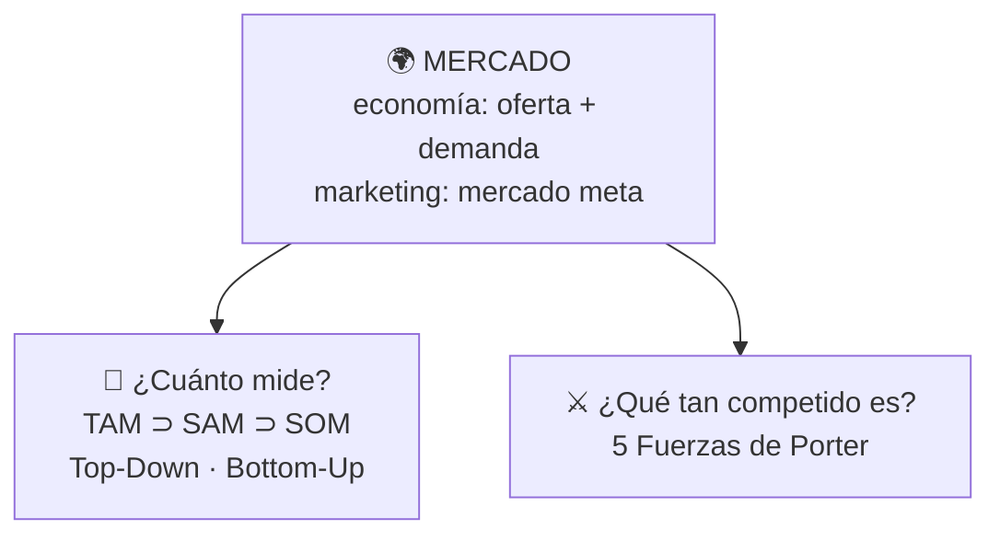
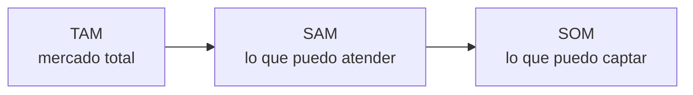
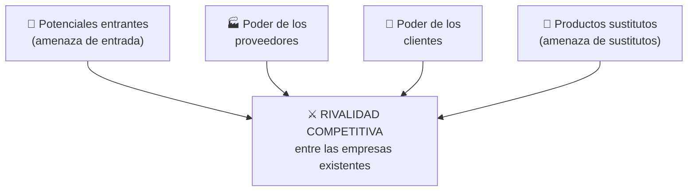

# 23 · Análisis de mercado y competencia: TAM, SAM, SOM y Porter

> **Fuente en el material:** *Tecnología e Innovación – Tamaño de mercado TAM SAM SOM* / *Análisis de Mercado y Competencia* (Ing. Mario Barrios, 2026), diapositivas 1–41.
> **Prerrequisitos:** [14 Propuesta de valor y segmentación](../parcial-1/14-propuesta-de-valor-segmentacion-y-canvas.md), [15 Estrategias comerciales](15-estrategias-comerciales-y-oceano-azul.md).
> **Tiempo estimado:** 45 min.
> **Resto de la materia · Tema 23** (Análisis de Mercado y Competencia · Barrios). No entra en el Primer Parcial.

---

## 🎯 Objetivos de aprendizaje

1. Definir **mercado** desde la **economía** (oferta y demanda) y desde el **marketing** (mercado meta).
2. Distinguir **competencia perfecta, oligopolio y monopolio**.
3. Definir **TAM, SAM y SOM** y explicar para qué sirven.
4. Diferenciar los enfoques **Top-Down** y **Bottom-Up** para estimar el tamaño de un mercado.
5. Explicar los **aspectos a tener en cuenta** de cada enfoque: volumen, valores, per cápita, precio y **market share**.
6. Analizar una industria con las **5 Fuerzas de Porter**.

---

## 🗺️ Esquema del tema

- **I. Qué es un mercado**
  - A. Visto desde la economía: oferta, demanda y equilibrio
  - B. Estructuras de mercado
  - C. Visto desde el marketing: mercado meta
- **II. TAM, SAM y SOM**
  - A. Definiciones
  - B. Importancia y aplicación
  - C. Ejemplos de la cátedra (biotecnología)
- **III. Cómo se dimensiona un mercado**
  - A. Top-Down vs. Bottom-Up
  - B. Aspectos a tener en cuenta · Top-Down
  - C. Aspectos a tener en cuenta · Bottom-Up
- **IV. Las 5 Fuerzas de Porter**

---

## 🧠 Mapa visual

---

## 📖 Desarrollo

## I. Qué es un mercado

### I.A Visto desde la economía

> 📌 *"El mercado es el **espacio en el cual confluyen las fuerzas de la demanda y la oferta** para intercambiar, vender y comprar bienes y servicios **a un precio determinado**."*

| Curva | Fórmula | Pendiente | Qué muestra |
|---|---|---|---|
| **Demanda** | **Qd = a − bP** | **Negativa** | A **mayor precio**, **menor** cantidad demandada. |
| **Oferta** | **Qo = c + dP** | **Positiva** | A **mayor precio**, **mayor** producción u oferta. |
| **Equilibrio** | **Qd = Qo** | — | El cruce fija el **precio de equilibrio (Pe)** y la **cantidad de equilibrio (Qe)**. |

Términos de la demanda (diapositiva 7):
- **Qd:** cantidad total que los consumidores están dispuestos a comprar a un precio dado.
- **a (intersección autónoma):** **demanda potencial máxima cuando P = 0**. Reúne los factores ajenos al precio que estimulan el consumo: modas, gustos, ingresos, población.
- **b (pendiente):** **sensibilidad de la demanda al precio**: cuántas unidades cae Qd por cada peso que sube el precio. Signo **negativo** por la **Ley de la Demanda**.
- **P:** precio de mercado del bien o servicio.

### I.B Estructuras de mercado

Es el **ambiente competitivo** en el que se va a desenvolver el futuro negocio:

| Característica | Competencia perfecta | Oligopolio | Monopolio |
|---|---|---|---|
| **Productores** | Muchísimos (mercado atomizado) | Pocos y grandes | Uno solo |
| **Producto** | Homogéneo | Homogéneo o diferenciado | Único (sin sustitutos cercanos) |
| **Control del precio** | Nulo (precio-aceptantes) | Alto, pero depende de la competencia | Total |
| **Barreras de entrada** | Ninguna | Fuertes (legales, económicas, tecnológicas) | Infranqueables |
| **Información** | Perfecta | Imperfecta y estratégica | Imperfecta (controlada por la empresa) |
| **Ejemplo** | Agro (trigo, leche), materias primas | Telefonía móvil, aerolíneas, automotriz | Servicios públicos (agua, electricidad local) |

### I.C Visto desde el marketing

> 📌 **Kotler/Armstrong:** *"Conjunto de compradores que tienen **necesidades y/o características comunes** a los que la empresa u organización **decide servir**."*

Otras definiciones de **mercado meta**: el segmento al que la empresa **dirige su programa de marketing**; el segmento para el que se diseña una **mezcla de mercadotecnia** (Stanton/Walker); *"la parte del **mercado disponible calificado** que la empresa **decide captar**"* (Kotler).

> 📌 **En síntesis:** *"aquel **segmento de mercado** que la empresa **decide captar, satisfacer y/o servir**, dirigiendo hacia él su programa de marketing, con la finalidad de **obtener una determinada utilidad o beneficio**."*

> 💡 *"No conozco la clave del éxito, pero sé que la clave del fracaso es **tratar de complacer a todo el mundo**."* — Woody Allen. Es la idea de elegir un segmento en vez de venderle a "todos".

> 📌 **"La clave es predecir la evolución del ciclo de vida para la toma de decisiones":** desarrollo → introducción → crecimiento → madurez → declinación (diapositiva 15).

---

## II. TAM, SAM y SOM

### II.A Definiciones 🔥

| Sigla | Nombre | Definición de la cátedra |
|---|---|---|
| **TAM** | *Total Addressable Market* | **Tamaño total del mercado disponible.** |
| **SAM** | *Serviceable Available Market* | **Parte del TAM accesible y relevante para el negocio.** |
| **SOM** | *Serviceable Obtainable Market* | **Parte del SAM que el negocio puede captar razonablemente.** |

> ⚠️ Son **círculos concéntricos**: **SOM ⊂ SAM ⊂ TAM**. Cada uno es un **filtro** del anterior, nunca más grande.

### II.B Importancia y aplicación

**Importancia** (diapositiva 20):
1. **Entendimiento del mercado:** herramienta para **evaluar el potencial** del mercado; **metas realistas** y decisiones estratégicas.
2. **Planificación y crecimiento:** identificar **oportunidades de crecimiento**, **optimizar recursos** y **atraer inversores**.

**Aplicación en el crecimiento empresarial** (diapositiva 23):
- **Estrategias de crecimiento:** expansión geográfica, nuevos mercados, nuevas industrias o segmentos.
- **Validación de ideas de negocio:** confirmar la oportunidad **antes de invertir**.
- **Go-to-Market:** planificar la entrada al mercado con objetivos basados en TAM, SAM, SOM.
- **Atraer inversores:** demostrar el potencial del negocio.

> 📌 **Conclusión de la cátedra:** TAM, SAM y SOM son **esenciales para entender el mercado** y **herramientas cruciales** para la estrategia de crecimiento, la asignación de recursos y la atracción de inversión.

### II.C Ejemplos de la cátedra

| Caso | TAM | SAM | SOM |
|---|---|---|---|
| **Terapia génica** para una enfermedad rara | Todos los pacientes diagnosticados en el mundo (≈ USD 500.000 por tratamiento) | Ajuste por **accesibilidad** del tratamiento en cada país, **competencia** y **regulaciones** locales | (mismo ajuste) |
| **Terapia CAR-T** para linfoma | Todos los pacientes con linfoma del mundo | Pacientes en **mercados desarrollados** donde está **aprobada y accesible** | Pacientes que trata la empresa según **competencia y capacidad de producción** |
| **Dispositivo portátil de diagnóstico de ADN** | Todos los hospitales y clínicas del mundo interesados en diagnóstico genético | Instituciones en mercados desarrollados **con capacidad de pagar y adoptar** | Centros que **eligen este dispositivo** frente a las alternativas |

> 💡 **Patrón para el examen:** TAM = **todos** los que tienen el problema; SAM = los que **puedo atender** (geografía, regulación, capacidad de pago); SOM = los que **realmente me eligen** (competencia, capacidad propia).

> 📝 **Citar y explayarse:** La cátedra define el **TAM** como el *"tamaño total del mercado disponible"*, el **SAM** como la *"parte del TAM accesible y relevante para el negocio"* y el **SOM** como la *"parte del SAM que el negocio puede captar razonablemente"*. Es decir, cada nivel filtra al anterior. En el caso de la terapia CAR-T, el TAM son todos los pacientes con linfoma del mundo; el SAM, los de mercados desarrollados donde el tratamiento está aprobado; y el SOM, los que la empresa puede tratar según su capacidad de producción y la competencia. Estas métricas sirven para fijar metas realistas, validar la idea antes de invertir y mostrar el potencial a inversores.

---

## III. Cómo se dimensiona un mercado

### III.A Top-Down vs. Bottom-Up 🔥

| Enfoque | Dirección | Pasos |
|---|---|---|
| **Top-Down** | De lo **macro a lo micro** | 1. Mercado total → 2. División por segmentos (%) → 3. Divisiones regionales → 4. Divisiones por país |
| **Bottom-Up** | De lo **micro a lo macro** | 1. Ingresos de la empresa en el mercado → 2. Ingresos de los principales competidores → 3. Cuota de mercado del vendedor → 4. Tamaño total del mercado |

### III.B Aspectos a tener en cuenta · Top-Down

**Pasos para el cálculo** (diapositiva 21):
1. Identificar el **mercado** y los **segmentos** de audiencia.
2. Estimar el **TAM**: **clientes potenciales × ingreso promedio**.
3. **Filtrar** para calcular el **SAM**.
4. **Filtrar** adicionalmente para calcular el **SOM**.

**Características** (diapositiva 34):
- Es el **método más fácil y rápido**.
- Los **datos salen de fuentes de terceros**.
- El **cálculo se basa en datos demográficos**.

> ⚠️ La diapositiva 34 está dañada: compara el Top-Down con otros dos métodos (uno *"el mejor para pymes/empresas, con mejor precisión"* y otro *"el mejor para startups/scaleups, con precisión limitada"*), pero sus títulos no se leen. Del Top-Down solo se lee lo de arriba.

### III.C Aspectos a tener en cuenta · Bottom-Up 🔥

**Cómo se dimensiona** (diapositiva 27): se arma desde el consumo. Ejemplo de la cátedra: **250.000 consumidores × 4 comprimidos per cápita = 1 millón de comprimidos** (volumen); la **facturación** es ese volumen × el precio.

> ⚠️ La diapositiva dice "ventas: 500 millones de pesos" y "precio: $0,50/comprimido", que no cierran entre sí (1.000.000 × $0,50 = $500.000). Lo que importa es la lógica: **volumen = consumidores × per cápita** y **facturación = volumen × precio**.

| Aspecto | Definición de la cátedra |
|---|---|
| **Mercado en volumen** | Total de litros, kg, unidades, etc. |
| **Mercado en valores** | Facturación total = **volumen × precio promedio** de cada player. |
| **Per cápita** | **Volumen total ÷ población.** |
| **Precio por unidad** | **Facturación total ÷ volumen total.** |
| **Share en volumen** | Volumen de una marca/empresa **vs. el total del mercado**. |
| **Share en valores** | Facturación de una marca/empresa **vs. la facturación de la industria**. |
| **Ganancia de share** | Se gana share cuando **el % de crecimiento de las ventas propias es mayor que el % de crecimiento de la industria**. |
| **Market share** | *"Es un **mejor indicador de performance que el volumen interno** porque **me compara vs. el mercado**."* |

---

## IV. Las 5 Fuerzas de Porter 🔥

> 📌 *"El Modelo de Fuerzas de Porter nos permite **analizar la intensidad competitiva de una industria**."* Es fundamental analizar la estructura de la industria en la que se desea entrar, entendiendo el **balance de fuerzas**. Sirve para comprender la **dinámica del mercado** y su **rentabilidad**, y desarrollar estrategias acordes.

Alrededor de las fuerzas actúan los **factores ambientales** (tecnológicos, económicos, ecológicos, socio-demográficos, político/legales) y las **regulaciones e intervenciones**.

| # | Fuerza | Pregunta clave | Factores que **aumentan** la intensidad competitiva |
|---|---|---|---|
| 1 | **Rivalidad competitiva** | ¿Cómo reaccionaría un competidor si otro intenta aumentar sus ventas? | Muchos competidores de igual tamaño; bajo crecimiento de la industria; productos no diferenciados (commodities); altos costos fijos; productos perecederos; sobrecapacidad. |
| 2 | **Potenciales entrantes** | ¿Qué tan fácil es para un nuevo jugador entrar y tomar participación? | Pocas economías de escala; poco capital necesario; fácil acceso a canales de distribución. |
| 3 | **Clientes** | ¿Qué tan fácil es para los clientes cambiar de proveedor? | Productos no diferenciados; producto poco importante para el cliente; clientes que pueden **integrarse hacia atrás**. |
| 4 | **Proveedores** | ¿Qué tan dependiente es la organización de sus proveedores? | Pocos proveedores dominan; productos únicos, muy diferenciados o con alto **costo de cambio**. |
| 5 | **Sustitutos** | ¿Se pueden reemplazar los productos por otros similares? | Sustitutos similares, más baratos o más convenientes. |

**Herramienta de trabajo: intensidad competitiva** (diapositivas 39–41). Para cada fuerza se completa: **importancia relativa**, si la fuerza es **baja, moderada o alta**, su **tendencia futura** y **comentarios**, y al final un **resumen**. Cada fuerza se puntúa en una escala **Low / Mid / High** según indicadores (por ejemplo, para el poder de los compradores: concentración de compradores, costo de cambiar de proveedor, amenaza de integración hacia atrás; para la rivalidad: número y tamaño de competidores, barreras de salida, diferenciación del producto, madurez de la industria).

> 💡 **Fuerza alta = menos rentabilidad** para la industria; **fuerza baja = más rentabilidad**.

---

## 🔗 Conexiones

- **← [14 Propuesta de valor y segmentación](../parcial-1/14-propuesta-de-valor-segmentacion-y-canvas.md):** el mercado meta es el segmento elegido; tipos de competidores y matriz de competitividad.
- **← [15 Estrategias comerciales](15-estrategias-comerciales-y-oceano-azul.md):** ciclo del negocio, Ansoff (nuevos mercados), océano rojo (rivalidad alta).
- **← [20 Lean Startup](20-lean-startup-y-mvp.md):** validar la oportunidad de mercado antes de invertir.

---

## ✍️ Autoevaluación

**1. Defina TAM, SAM y SOM y explique su relación.**

Ver respuesta

**TAM** (Total Addressable Market): tamaño total del mercado disponible. **SAM** (Serviceable Available Market): parte del TAM accesible y relevante para el negocio. **SOM** (Serviceable Obtainable Market): parte del SAM que el negocio puede captar razonablemente. Son concéntricos: SOM ⊂ SAM ⊂ TAM.

**2. Aplique TAM, SAM y SOM al caso del dispositivo portátil de diagnóstico de ADN.**

Ver respuesta

TAM: todos los hospitales y clínicas del mundo interesados en diagnóstico genético. SAM: instituciones en mercados desarrollados con capacidad de pagar y adoptar nuevas tecnologías. SOM: centros médicos que eligen específicamente este dispositivo frente a las alternativas disponibles.

**3. Diferencie Top-Down y Bottom-Up.**

Ver respuesta

**Top-Down** va de lo macro a lo micro: mercado total → división por segmentos → regiones → países (TAM = clientes potenciales × ingreso promedio, y luego se filtra). **Bottom-Up** va de lo micro a lo macro: ingresos de la empresa → ingresos de los principales competidores → cuota del vendedor → tamaño total del mercado.

**4. ¿Cuándo una marca gana share? ¿Por qué el market share es mejor indicador que el volumen propio?**

Ver respuesta

Gana share cuando el **% de crecimiento de sus ventas es mayor que el % de crecimiento de la industria**. El market share es mejor indicador de performance porque **compara contra el mercado**: vender más no sirve de mucho si el mercado creció más rápido.

**5. Compare competencia perfecta, oligopolio y monopolio.**

Ver respuesta

Competencia perfecta: muchísimos productores, producto homogéneo, sin control del precio, sin barreras (ej. trigo). Oligopolio: pocos productores grandes, control alto pero dependiente de la competencia, barreras fuertes (ej. telefonía móvil, aerolíneas). Monopolio: un solo productor, producto sin sustitutos, control total del precio, barreras infranqueables (ej. agua, electricidad local).

**6. Enumere las 5 Fuerzas de Porter y un factor que aumente la intensidad de cada una.**

Ver respuesta

(1) **Rivalidad competitiva**: muchos competidores de igual tamaño. (2) **Potenciales entrantes**: poco capital necesario para competir. (3) **Poder de los clientes**: productos no diferenciados. (4) **Poder de los proveedores**: pocos proveedores dominan la industria. (5) **Sustitutos**: sustitutos más baratos o convenientes.

**7. En la demanda Qd = a − bP, ¿qué representan "a" y "b"?**

Ver respuesta

**a**: demanda potencial máxima cuando el precio es cero; reúne los factores ajenos al precio (modas, gustos, ingresos, población). **b**: sensibilidad de la demanda al precio, cuántas unidades cae la cantidad demandada por cada peso que sube el precio (signo negativo por la Ley de la Demanda).

---

[← 22 OKR](22-okr.md) · [🏠 Índice](../README.md)
