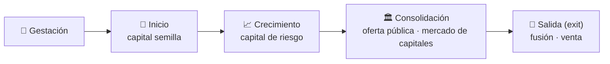
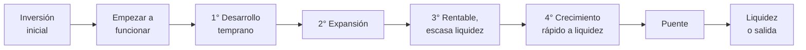

# 24 · Análisis financiero y estrategias de salida: etapas de la inversión

> **Fuente en el material:** *Tecnología e Innovación – MRI Análisis Financiero y Estrategias de Salida* (Ing. Mario Barrios; contenidos armados con el Mg. Ignacio Sartori), diapositivas 1–24.
> **Prerrequisitos:** [20 Lean Startup y MVP](20-lean-startup-y-mvp.md), [23 Análisis de mercado](23-analisis-de-mercado-tam-sam-som.md).
> **Tiempo estimado:** 35 min.
> **Resto de la materia · Tema 24** (Análisis Financiero y Estrategias de Salida · Barrios). No entra en el Primer Parcial.

---

## 🎯 Objetivos de aprendizaje

1. Recorrer las **etapas de evolución de una empresa** y la **cadena de financiamiento** que corresponde a cada una.
2. Enumerar y explicar las **etapas de la inversión**, desde la inversión inicial hasta la **etapa de liquidez o salida**.
3. Definir **VAN** y **TIR**.
4. Definir **estrategia de salida (exit)**, sus motivos y sus formas: **fusión** y **venta**.
5. Explicar cómo se valora la empresa para la salida: **múltiplo EBITDA** y comparación en **Crunchbase**.

---

## 🗺️ Esquema del tema

- **I. Etapas de la inversión** 🔥
  - A. Evolución de una empresa y cadena de financiamiento
  - B. Las etapas de la inversión
- **II. Herramientas financieras: VAN y TIR**
- **III. Estrategias de salida**
  - A. Por qué salir del negocio
  - B. Fusión y venta
  - C. Cómo valorar la empresa

---

## 🧠 Mapa visual

---

## 📖 Desarrollo

## I. Etapas de la inversión 🔥

### I.A Evolución de una empresa y cadena de financiamiento

La diapositiva 11 (basada en Cortés y Echecopar, 2009, y Cardullo, 1999) grafica los **resultados/rentabilidad** de la empresa a lo largo del **tiempo**: la curva cae primero por debajo de cero, toca fondo en el **valle de la muerte**, sube hasta el **punto de equilibrio** y después crece hasta estabilizarse. Cada tramo tiene sus propias fuentes de financiamiento:

| Etapa de la empresa | Tipo de capital | Quién financia |
|---|---|---|
| **Gestación / Inicio** | **Capital semilla** (financiamiento semiformal y más flexible) | **Las 4 F** y **crowdfunding** → **fondos de capital semilla** → **inversionistas ángeles** |
| **Crecimiento** | **Capital de riesgo** (temprano → expansión-consolidación) | **Fondos privados** |
| **Consolidación** | **Oferta pública** (salida a bolsa) | **Fondos públicos** |
| **Consolidación** | **Mercado de capitales** (empresa consolidada) | **Banca tradicional** |

> ⚠️ **Valle de la muerte:** el tramo inicial donde la empresa **pierde plata** antes de llegar al **punto de equilibrio**. Ahí solo financian las 4 F, el crowdfunding, los fondos semilla y los ángeles.

### I.B Las etapas de la inversión 🔥

| # | Etapa | Qué pasa (diapositivas 12–13) |
|---|---|---|
| 1 | **Inversión inicial** | **Pequeño monto** para estudiar si una idea **merece una inversión más alta**. |
| 2 | **Empezar a funcionar** | Empresas de **menos de 1 año**: dinero para el **desarrollo de productos** y el **testeo de marketing**. |
| 3 | **1° etapa · Desarrollo temprano** | Los **prototipos** indican **riesgo técnico mínimo**. La empresa es capaz de establecer un **proceso manufacturero**. |
| 4 | **2° etapa · Expansión** | **Despacha productos** a consumidores y obtiene **feedback del mercado**. |
| 5 | **3° etapa · Rentable pero con escasa liquidez** | La **rápida expansión** genera **problemas de liquidez**. |
| 6 | **4° etapa · Crecimiento rápido hacia el punto de liquidez** | La empresa está en **posición productiva y estable**, tal que el **riesgo de los inversionistas externos es reducido**. |
| 7 | **Etapa puente** | Hay **alguna idea de la forma de salida**, pero **aún puede necesitar capital**. |
| 8 | **Etapa de liquidez o salida** | **Comercialización o venta de acciones** de capital de riesgo. |

> 💡 **Hilo conductor:** a medida que se avanza, **baja el riesgo** para el inversor (de una idea a estudiar, a un prototipo, a ventas, a una empresa estable) y la última etapa es justamente la **salida**, donde el inversor de riesgo **vende sus acciones**. Por eso la estrategia de salida (sección III) cierra el recorrido.

> 📝 **Citar y explayarse:** Según la cátedra, la inversión arranca con un **pequeño monto para estudiar si una idea merece una inversión más alta**; sigue con el dinero para **empezar a funcionar** (empresas de menos de un año que desarrollan productos y testean marketing) y continúa en cuatro etapas: **desarrollo temprano**, cuando los prototipos indican riesgo técnico mínimo y se puede montar un proceso manufacturero; **expansión**, cuando se despachan productos y se obtiene feedback del mercado; **rentable pero con escasa liquidez**, porque la rápida expansión genera problemas de caja; y **crecimiento rápido hacia el punto de liquidez**, cuando la empresa es productiva y estable y el riesgo para los inversionistas externos es reducido. Después viene la **etapa puente**, con alguna idea de la forma de salida pero todavía con necesidad de capital, y finalmente la **etapa de liquidez o salida**, en la que se venden las acciones de capital de riesgo.

---

## II. Herramientas financieras: VAN y TIR

| Herramienta | Definición de la cátedra |
|---|---|
| **VAN** (Valor Actual Neto) | Dado el **rendimiento esperado (R)** de inversiones alternativas de **riesgo comparable**, el VAN computa **cuánto más dinero, traído a hoy**, me da el proyecto que si invirtiese en esa actividad alternativa. |
| **TIR** (Tasa Interna de Retorno) | Es la **tasa de descuento que hace el VAN igual a cero**. |

> ⚠️ **TIR:** la interpretación habitual es que es *"la tasa de rendimiento 'promedio' de los fondos invertidos"*, pero la cátedra la marca como **problemática**.

---

## III. Estrategias de salida

> **Estadísticas de la cátedra** (diapositiva 14): cierran como un **"éxito" el 15,5 %**; **fracasaron a los 5 años el 30 %** y **a los 6 años el 54,5 %**.

### III.A Por qué salir del negocio

| Motivos **empresariales** | Motivos **personales** |
|---|---|
| El negocio exige **mucho capital para crecer**. | Queremos **hacer caja**. |
| **Nuevos competidores**. | Los **inversores presionan** para vender. |
| Mercado con **oportunidades limitadas**. | **Desacuerdos** con el equipo o los inversores. |
| El negocio **no funciona lo suficiente**. | Estamos **agotados**. |
| La **perspectiva de futuro no es buena**. | **Problemas personales o de salud**. |
| Recibimos una **oferta atractiva**. | Recibimos una **oferta atractiva**. |

### III.B Qué es y qué formas tiene

> 📌 **Estrategia de salida (exit):** *"Es simplemente un **plan de acción** para lo que sucederá cuando llegue el día que desea salir de su negocio."* Permite a los **inversores potenciales** entender **cómo se quiere salir** y **cómo se comercializará la empresa**. Es importante determinar **cuándo es el momento idóneo**, porque eso **maximiza el valor** que se obtiene del negocio.

- **Fusión** (vertical u horizontal): *"acuerdo de dos o más sociedades, jurídicamente independientes, por el que se comprometen a **juntar sus patrimonios para formar una nueva sociedad**."*
- **Venta**, en pasos:
  1. Determinar el **valor de la empresa**.
  2. Actuar como un **"pretendiente"**.
  3. **Identificar candidatos**.
  4. **Conseguir datos**.
  5. Determinar los **mejores candidatos**.
  6. **Auditoría previa**.
  7. **Cierre de la operación**.

### III.C Cómo valorar la empresa

- **Valor por múltiplo EBITDA:**
  1. Identificar una **empresa similar que cotice en bolsa** (comparable: **mismo sector y tamaño**, mismas características).
  2. Calcular los **multiplicadores**: ratios entre el **valor de la compañía** y algún parámetro financiero u operativo.
  3. Comparar con el resto de las compañías para obtener un **rango de valoración** (si está **sobrevalorada o infravalorada**).
- **Crunchbase:** cuando **no se puede comparar el EBITDA** o **no hay ventas** (modelo o **estadío temprano**), se compara contra otras empresas/startups y **las inversiones que recibieron**.

> La diapositiva 20 muestra además una tabla de **métodos generales de valuación** (basados en ganancias, ingresos, flujo de caja —donde entran EBITDA, EV/EBITDA y flujo de caja descontado—, patrimonio, suma de partes, rendimiento y suscriptores).

---

## 🔗 Conexiones

- **← [17 Innovación abierta](17-innovacion-abierta.md):** el CVC invierte en startups en etapas iniciales o de crecimiento.
- **← [20 Lean Startup y MVP](20-lean-startup-y-mvp.md):** validar la idea antes de invertir de lleno.
- **← [23 Análisis de mercado](23-analisis-de-mercado-tam-sam-som.md):** TAM/SAM/SOM sirve para atraer inversores.

---

## ✍️ Autoevaluación

**1. Enumere las etapas de la inversión y qué caracteriza a cada una.**

Ver respuesta

(1) **Inversión inicial**: pequeño monto para estudiar si la idea merece más inversión. (2) **Empezar a funcionar**: empresas de menos de 1 año, desarrollo de productos y testeo de marketing. (3) **Desarrollo temprano**: prototipos con riesgo técnico mínimo, proceso manufacturero. (4) **Expansión**: despacha productos y obtiene feedback del mercado. (5) **Rentable pero con escasa liquidez**: la rápida expansión genera problemas de liquidez. (6) **Crecimiento rápido hacia el punto de liquidez**: empresa productiva y estable, riesgo reducido para inversores externos. (7) **Puente**: alguna idea de la forma de salida, pero aún puede necesitar capital. (8) **Liquidez o salida**: venta de las acciones de capital de riesgo.

**2. ¿Qué es el valle de la muerte y quién financia en esa etapa?**

Ver respuesta

Es el tramo inicial en que los resultados de la empresa son negativos, antes de llegar al punto de equilibrio. Se financia con capital semilla: las 4 F, crowdfunding, fondos de capital semilla e inversionistas ángeles. Después vienen los fondos privados (capital de riesgo), los fondos públicos (salida a bolsa) y la banca tradicional (empresa consolidada).

**3. Defina VAN y TIR.**

Ver respuesta

**VAN**: dado el rendimiento esperado de inversiones alternativas de riesgo comparable, cuánto más dinero, traído a hoy, da el proyecto que si se invirtiera en la alternativa. **TIR**: la tasa de descuento que hace el VAN igual a cero (leerla como rendimiento "promedio" es problemático).

**4. ¿Qué es una estrategia de salida y qué formas tiene?**

Ver respuesta

Un plan de acción para cuando llegue el día de salir del negocio; permite a los inversores entender cómo se saldrá y cómo se comercializará la empresa, y elegir el momento idóneo maximiza el valor. Formas: **fusión** (vertical u horizontal: juntar patrimonios para formar una nueva sociedad) y **venta** (valuar, actuar como pretendiente, identificar candidatos, conseguir datos, elegir los mejores, auditoría previa, cierre).

**5. ¿Cómo se valora una empresa por múltiplo EBITDA y qué se hace si no hay EBITDA comparable?**

Ver respuesta

Se busca una empresa comparable que cotice en bolsa (mismo sector y tamaño), se calculan multiplicadores entre el valor de la compañía y un parámetro financiero u operativo, y se obtiene un rango de valoración. Si no hay EBITDA o ventas (estadío temprano), se compara en Crunchbase contra otras startups y las inversiones que recibieron.

---

[← 23 Análisis de mercado](23-analisis-de-mercado-tam-sam-som.md) · [🏠 Índice](../README.md) · [Siguiente → 25 Metodologías ágiles y Scrum](25-metodologias-agiles-y-scrum.md)
