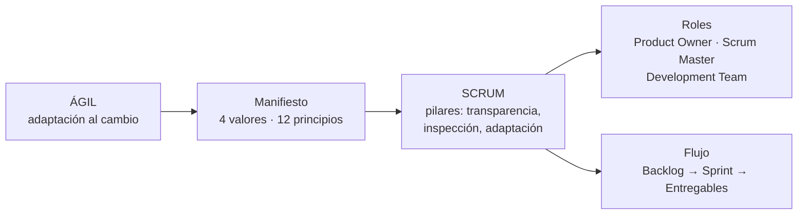
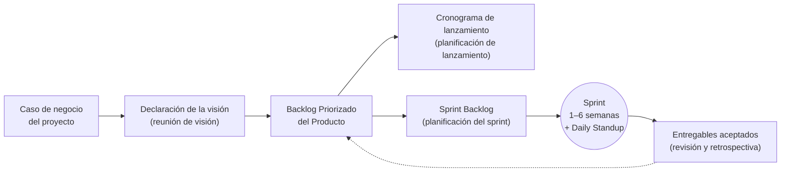

# 25 · Metodologías ágiles y Scrum

> **Fuente en el material:** *Tecnología e Innovación – jueves MRI – Metodologías Ágiles* (Ing. Mario Barrios), diapositivas 1–38.
> **Prerrequisitos:** [20 Lean Startup y MVP](20-lean-startup-y-mvp.md).
> **Tiempo estimado:** 45 min.
> **Resto de la materia · Tema 25** (Metodologías Ágiles · Barrios). No entra en el Primer Parcial.

> ⚠️ **Qué entra según la cátedra:** saber **qué es ágil** y la **metodología Scrum con sus características**.

---

## 🎯 Objetivos de aprendizaje

1. Explicar **qué es la agilidad** y por qué surge (el problema de los proyectos tradicionales).
2. Enunciar los **4 valores del Manifiesto Ágil** y sus **12 principios**.
3. Explicar los **3 pilares** y los **6 principios** de Scrum.
4. Describir la **organización**, el **flujo de trabajo** y las **fases** de Scrum.
5. Describir los **roles** de Scrum: Product Owner, Scrum Master y Development Team.

---

## 🗺️ Esquema del tema

- **I. Qué es ágil**
  - A. El problema: lo que el cliente pidió vs. lo que necesitaba
  - B. Cascada vs. ágil
  - C. El mantra y el cambio cultural
  - D. Modelos ágiles
- **II. El Manifiesto Ágil**
  - A. Los 4 valores
  - B. Los 12 principios
- **III. Scrum**
  - A. Pilares
  - B. Principios
  - C. Organización
  - D. Flujo de trabajo
  - E. Fases y proceso
  - F. Conclusión del trabajo: cómo construir un MVP
- **IV. Roles en Scrum**
  - A. Roles y vínculo con stakeholders
  - B. Product Owner
  - C. Scrum Master
  - D. Development Team

---

## 🧠 Mapa visual

---

## 📖 Desarrollo

## I. Qué es ágil

### I.A El problema

La cátedra abre con la tira del **columpio en el árbol**: *lo que el cliente pidió*, *cómo lo entendió el jefe de proyectos*, *cómo lo diseñó el analista*, *cómo se programó*, *cómo se documentó*, *cómo se le cobró al cliente*… y, al final, **lo que realmente el cliente necesitaba** (un neumático colgado de una soga). Muestra que en un proyecto tradicional cada etapa interpreta el pedido a su manera y el resultado final no es lo que el cliente necesitaba.

### I.B Cascada vs. ágil

- **Cascada (*waterfall*):** se diseña y se entrega **todo al final**, de una sola vez. Si se entendió mal, se descubre recién en la entrega.
- **Ágil:** se avanza por **iteraciones** (*Agile Iteration 1, 2, … n, n+1*) hasta la entrega; en cada iteración el cliente ve algo y se corrige el rumbo.

### I.C El mantra y el cambio cultural

> 📌 **Mantra:** *"Agilidad **no es velocidad**. Agilidad es **adaptación al cambio**."*

> 📌 **Jack Welch:** *"Cuando la tasa de cambio dentro de una institución se vuelve más lenta que la tasa de cambio afuera, el final está a la vista. La única pregunta es cuándo."*

> 📌 *"Las transformaciones ágiles son un **cambio cultural** importante."* La cátedra lo ilustra con la tira *"¿Quién quiere un cambio?"* (todos levantan la mano) vs. *"¿Quién quiere cambiar?"* (nadie).

> 📝 **Citar y explayarse:** Para la cátedra, *"agilidad no es velocidad, agilidad es adaptación al cambio"*. Las metodologías ágiles surgen frente al problema de los proyectos tradicionales en cascada, donde se diseña y se entrega todo al final y cada etapa interpreta el pedido a su manera, de modo que el resultado no es lo que el cliente necesitaba. Ágil propone avanzar por iteraciones cortas, entregando valor temprano y corrigiendo con el cliente en cada ciclo. Como dice Jack Welch, si una organización cambia más lento que su entorno, *"el final está a la vista"*. Por eso adoptar ágil no es solo cambiar herramientas: es un **cambio cultural**.

### I.D Modelos ágiles

| Modelo | Autores |
|---|---|
| Programación Extrema (XP) | Kent Beck, Eric Gamma y otros |
| Desarrollo adaptativo de software (DAS) | Jim Highsmith |
| Método de desarrollo de sistemas dinámicos (MDSD) | Dane Faulkner y otros |
| Crystal Clear (familia de métodos) | Alistair Cockburn |
| Desarrollo esbelto de software (Lean Software Development) | Mary y Tom Poppendieck |
| Feature-Driven Development | Peter Coad y Jeff DeLuca |
| Agile Unified Process (AUP) | Scott Ambler |
| **Scrum** | **Ken Schwaber, Jeff Sutherland, Mike Beedle** |
| The Incremental Commitment Spiral Model (ICSM) | Barry Boehm y Jo Ann Lane |
| SEMAT | Ivar Jacobson, Pan-Wei Ng |

---

## II. El Manifiesto Ágil

> 📌 *"Estamos descubriendo formas mejores de desarrollar software con nuestra propia experiencia y ayudando a terceros. A través de este trabajo hemos aprendido a valorar:"*

### II.A Los 4 valores

| Valoramos más… | …**sobre** |
|---|---|
| **Individuos e interacciones** | procesos y herramientas |
| **Software funcionando** | documentación extensiva |
| **Colaboración con el cliente** | negociación contractual |
| **Respuesta ante el cambio** | seguir un plan |

> 📌 *"Esto es, aunque valoramos los elementos de la derecha, **valoramos más los de la izquierda**."*

### II.B Los 12 principios

| # | Principio (cátedra) | En una palabra |
|---|---|---|
| 1 | Nuestra mayor prioridad es **satisfacer al cliente** mediante la **entrega temprana y continua de software con valor**. | Cliente satisfecho |
| 2 | Aceptamos que los **requisitos cambien**, incluso en etapas tardías del desarrollo. Los procesos ágiles aprovechan el cambio para proporcionar ventaja competitiva al cliente. | El cambio es bienvenido |
| 3 | Entregamos **software funcional frecuentemente**, entre dos semanas y dos meses, con preferencia al período más corto posible. | Entrega continua |
| 4 | Los responsables de **negocio y los desarrolladores trabajamos juntos** de forma cotidiana durante todo el proyecto. | Trabajo conjunto |
| 5 | Los proyectos se desarrollan en torno a **individuos motivados**. Hay que darles el entorno y el apoyo que necesitan, y confiarles la ejecución del trabajo. | Equipo motivado |
| 6 | El método más eficiente y efectivo de **comunicar** información al equipo de desarrollo y entre sus miembros es la conversación **cara a cara**. | Cara a cara |
| 7 | El **software funcionando** es la medida principal de **progreso**. | Software funcionando |
| 8 | Los procesos ágiles promueven el **desarrollo sostenible**. Promotores, desarrolladores y usuarios debemos poder mantener un ritmo constante de forma indefinida. | Ritmo constante |
| 9 | La **atención continua a la excelencia técnica y al buen diseño mejora la agilidad**. | Innovación |
| 10 | La **simplicidad**, o el arte de maximizar la cantidad de trabajo no realizado, es esencial. | Simplicidad |
| 11 | Las mejores arquitecturas, requisitos y diseños emergen de **equipos auto-organizados**. | Auto-organización |
| 12 | A intervalos regulares **el equipo reflexiona sobre cómo ser más efectivo** para luego ajustar y perfeccionar su comportamiento. | Reflexión y ajuste |

---

## III. Scrum

### III.A Pilares

Los **3 pilares de Scrum** son **Transparencia**, **Inspección** y **Adaptación**.

### III.B Principios

| Principio | Qué dice la cátedra |
|---|---|
| **1. Control del proceso empírico** | Tres ideas principales: **transparencia, inspección y adaptación**. El conocimiento empírico es el que se adquiere con los sentidos, a partir de la **observación o la experimentación** (como el científico que toma datos de un experimento). |
| **2. Auto-organización** | Equipos con un gran sentimiento de **compromiso y responsabilidad**. |
| **3. Colaboración** | Dimensiones básicas del trabajo colaborativo: **conciencia, articulación y apropiación**. Aboga por la gestión de proyectos como un **proceso de creación de valor compartido** con los equipos. |
| **4. Priorización basada en valor** | Ofrecer el **máximo valor de negocio** desde el principio del proyecto hasta su conclusión. |
| **5. Tiempo asignado (*time-boxing*)** | Es sumamente limitante e importante: su uso adecuado contribuye a una planificación y ejecución eficaz. Bloques de tiempo: **sprints** (ciclos cortos), **reunión diaria** (*Daily Standup*), **planificación del sprint** (*Sprint Planning*) y **revisión del sprint** (*Sprint Review*). |
| **6. Desarrollo iterativo** | Enfatiza cómo **manejar mejor los cambios** y crear productos que **satisfagan las necesidades del cliente**. |

### III.C Organización

El **Scrum team** está formado por el **Product Owner**, el **Scrum Master** y el **Development Team**. En el esquema de la cátedra:

- **El Cliente** le da sus requisitos al **Propietario del Producto** (Product Owner), que es **"la voz del cliente"**.
- El **Product Owner** le comunica al Equipo Scrum los requisitos de negocio priorizados, crea la **Lista Priorizada de Pendientes del Producto** (*Product Backlog*) y define los **Criterios de Aceptación**.
- El **Equipo Scrum** le muestra el incremento de producto al Product Owner en la **Reunión de Revisión del Sprint**, y el Product Owner le entrega valor de negocio al cliente.
- El **Scrum Master** asegura un **ambiente de trabajo adecuado** para el equipo.

### III.D Flujo de trabajo

- **Sprint:** de **1 a 6 semanas** según un esquema (otro lo muestra de **30 días**). Dentro del sprint, **todos los días** se crean entregables.
- **Daily Standup:** *reunión diaria de 15 minutos*. Cada miembro responde: **1)** ¿Qué hiciste desde la última reunión? **2)** ¿Tenés algún obstáculo? **3)** ¿Qué harás antes de la próxima reunión?
- **Retraso del producto** (Product Backlog): características que desea el cliente, con prioridad. **Retraso del sprint**: las asignadas para ese sprint.
- **Al final del sprint se demuestra la nueva funcionalidad.**
- **Ciclo sprint:** planeación del bosquejo y diseño arquitectónico → ciclos de **valoración, selección, desarrollo y revisión** → cierre del proyecto. Cada sprint suma **trabajo acumulado** a lo largo del tiempo.

### III.E Fases y proceso

| **Inicio** | **Planificación y estimación** | **Implementación** | **Revisión y retrospectiva** | **Lanzamiento** |
|---|---|---|---|---|
| Crear la visión del proyecto | Crear historias de usuario | Crear entregables | Demostrar y validar el sprint | Enviar entregables |
| Identificar al Scrum Master y stakeholder(s) | Estimar historias de usuario | Realizar el Daily Standup | Retrospectiva del sprint | Retrospectiva del proyecto |
| Formar el Equipo Scrum | Comprometer historias de usuario | Refinar el Backlog Priorizado del Producto | | |
| Desarrollar épicas | Identificar tareas | | | |
| Crear el Backlog Priorizado del Producto | Estimar tareas | | | |
| Realizar la planificación del lanzamiento | Crear el Sprint Backlog | | | |

### III.F Conclusión del trabajo: cómo construir un MVP

La cátedra cierra Scrum con la imagen *"How (not) to build a Minimum Viable Product"*:

- **Cómo NO:** rueda → chasis → carrocería → auto. Ninguna entrega intermedia sirve sola.
- **Tampoco así:** monopatín → bicicleta → moto → auto.
- **Cómo SÍ:** cada entrega ya es un auto usable que se va mejorando (camioneta básica → camioneta con caja → auto → auto final).

> 🔗 Conecta con el MVP de [20 Lean Startup](20-lean-startup-y-mvp.md).

---

## IV. Roles en Scrum

### IV.A Roles y vínculo con stakeholders

El **Scrum team** (Product Owner, Scrum Master, Development Team) se vincula con los **stakeholders**: **internos** y **clientes/usuarios**. El **Product Owner** es el punto de unión entre ambos.

### IV.B Product Owner

| Responsabilidades | Características |
|---|---|
| Gestionar la economía (*manage economics*) | **Conocimiento del dominio:** es visionario; sabe que no todo se puede anticipar; tiene experiencia en el negocio y el dominio. |
| Participar en la planificación | **Habilidades con las personas:** buena relación con stakeholders; negociador y generador de consenso; buen comunicador; gran motivador. |
| Refinar el backlog del producto (*groom*) | **Toma de decisiones:** tiene poder para decidir; está dispuesto a tomar decisiones difíciles; es decidido; tiene una visión económica para equilibrar temas de negocio y técnicos. |
| Definir criterios de aceptación y verificar que se cumplan | **Responsabilidad:** se hace cargo del producto; está comprometido y disponible; actúa como un miembro más del equipo Scrum. |
| Colaborar con el equipo de desarrollo | |
| Colaborar con los stakeholders | |

### IV.C Scrum Master

Responsabilidades: **Coach**, **líder servidor** (*servant leader*), **autoridad del proceso**, **escudo contra interferencias**, **removedor de impedimentos** y **agente de cambio**.

### IV.D Development Team

Características: **auto-organizado**; **multifuncional**, diverso y suficiente (*cross-functional*); habilidades en **"T"** (*T-shaped skills*); **actitud de mosquetero** (todos para uno); comunicación de **alto ancho de banda** y **transparente**; de **tamaño adecuado**; **enfocado y comprometido**; trabaja a un **ritmo sostenible**; **estable en el tiempo** (*long-lived*).

> 📝 **Citar y explayarse:** Scrum es uno de los modelos ágiles (Schwaber, Sutherland y Beedle). Se apoya en tres **pilares**, **transparencia, inspección y adaptación**, y en seis **principios**: control del proceso empírico, auto-organización, colaboración, priorización basada en valor, tiempo asignado y desarrollo iterativo. El trabajo parte de un **Backlog Priorizado del Producto** que arma el **Product Owner**, "la voz del cliente". El equipo elige qué hacer en cada **sprint** (de 1 a 6 semanas), se coordina en un **Daily Standup** de 15 minutos y, al final, demuestra la nueva funcionalidad en la **revisión del sprint** y reflexiona en la **retrospectiva**. El **Scrum Master** no manda: es un líder servidor que protege al equipo de interferencias y remueve impedimentos. El **Development Team** es auto-organizado y multifuncional.

---

## ⚠️ Conceptos que se confunden

| Se confunde… | …con | Diferencia |
|---|---|---|
| Agilidad | Velocidad | Para la cátedra, agilidad es **adaptación al cambio**, no velocidad. |
| Pilares de Scrum | Valores del Manifiesto | Pilares: **transparencia, inspección, adaptación**. Valores: individuos, software funcionando, colaboración, respuesta al cambio. |
| Product Owner | Scrum Master | PO: **qué** se hace (backlog, prioridades, criterios de aceptación; voz del cliente). SM: **cómo** trabaja el equipo (coach, remueve impedimentos, protege de interferencias). |
| Product Backlog | Sprint Backlog | Todo lo que desea el cliente, priorizado / lo asignado a un sprint. |
| Sprint Review | Retrospectiva | Revisión: se **muestra el producto**. Retrospectiva: el equipo **reflexiona sobre cómo trabajó**. |

---

## 🔗 Conexiones

- **← [20 Lean Startup y MVP](20-lean-startup-y-mvp.md):** MVP e iteración.
- **← [16 Design Sprint](16-service-design-y-cultura-fail.md):** otro trabajo en ciclos cortos.
- **← [18 VICA y VANI](18-entornos-vica-y-vani.md):** la respuesta a VICA es agilidad y planificación flexible.

---

## ✍️ Autoevaluación

**1. ¿Qué es la agilidad según la cátedra?**

Ver respuesta

*"Agilidad no es velocidad. Agilidad es adaptación al cambio."* En lugar de diseñar y entregar todo al final (cascada), se avanza por iteraciones que permiten corregir con el cliente. Adoptarla es un cambio cultural.

**2. Enuncie los 4 valores del Manifiesto Ágil.**

Ver respuesta

Individuos e interacciones **sobre** procesos y herramientas; software funcionando **sobre** documentación extensiva; colaboración con el cliente **sobre** negociación contractual; respuesta ante el cambio **sobre** seguir un plan. Se valoran los de la derecha, pero más los de la izquierda.

**3. ¿Cuáles son los pilares y los principios de Scrum?**

Ver respuesta

Pilares: **transparencia, inspección y adaptación**. Principios: **control del proceso empírico, auto-organización, colaboración, priorización basada en valor, tiempo asignado y desarrollo iterativo**.

**4. Describa el flujo de trabajo de Scrum.**

Ver respuesta

Caso de negocio → declaración de la visión → **Backlog Priorizado del Producto** (y cronograma de lanzamiento) → **Sprint Backlog** (planificación del sprint) → **Sprint** de 1 a 6 semanas con **Daily Standup** → **entregables aceptados** (revisión y retrospectiva) → vuelta al backlog.

**5. ¿Qué preguntas se responden en el Daily Standup?**

Ver respuesta

En una reunión diaria de 15 minutos: ¿qué hiciste desde la última reunión?, ¿tenés algún obstáculo?, ¿qué harás antes de la próxima reunión?

**6. Diferencie los roles de Product Owner, Scrum Master y Development Team.**

Ver respuesta

**Product Owner:** la voz del cliente; gestiona la economía, refina el backlog, define criterios de aceptación y colabora con equipo y stakeholders. **Scrum Master:** coach, líder servidor, autoridad del proceso, escudo contra interferencias, removedor de impedimentos y agente de cambio. **Development Team:** auto-organizado, multifuncional, comprometido, de tamaño adecuado y a ritmo sostenible.

---

[← 24 Análisis financiero y estrategias de salida](24-analisis-financiero-y-estrategias-de-salida.md) · [🏠 Índice](../README.md) · [Siguiente → 26 Planificación estratégica](26-planificacion-estrategica.md)
